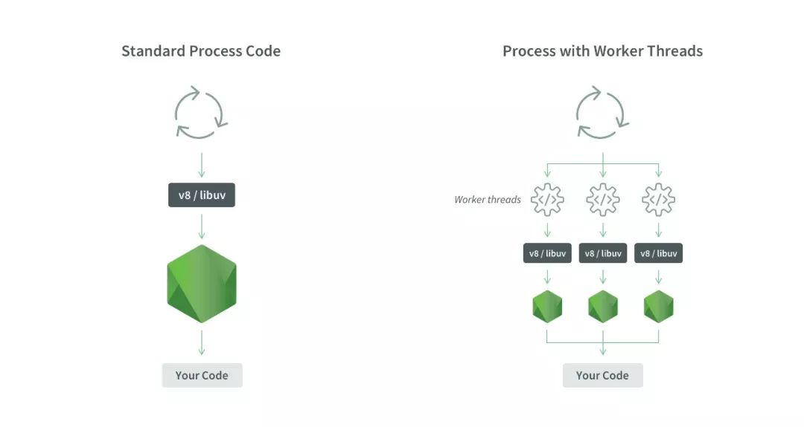

# 并行计算

为了更快运行代码或者更更快响应用户事件,你可能会让代码并行运行,为了做到这点你需要分割工作.

一个典型的应用中,所有的工作都由一个单独的主线程处理,这个主线程就像一个全栈工程师,掌管着JavaScript,DOM,视图,计算等.

任何能够从主线程负载减少工作的方法都对代码运行效率有帮助.但是也有些时候减少主线程负载是远远不够的,有时你需要增援,你需要分割你的任务.

大多数语言里这种分割工作的方法可以使用多线程或多进程实现,这就像很多人同时在一个项目里工作.如果你可以完美地把任务分割为多个独立的部分,你可以分给不同的线程,然后这些线程就同时各种独立执行这些任务.

## 并发与并行

在我们开始之前,让我们澄清两个相似但截然不同的术语:并行(Parallelism)和并发(Concurrency).他们存在许多定义,我使用的定义如下:

+ `并行`相对的含义为串行(serial)意为**同时执行**多个任务
+ `并发`相对的(Concurrency) 其相对的概念是顺序(sequential),意为在重叠的时间段内(而不是一个接一个)执行几个任务.

我们举个例子,你可以一边看电视一边写作业,一边看手机.这个一边一边实际上是并发.因为处理作业和看电视,看手机都需要眼睛,你的眼睛同一时间只能看向一处,所以实际上你只是将这几个任务在重叠的时间段内一并处理;相对的,你可以一边听音乐一边写作业,这就是并行处理,因为他们是真正同时执行的.

可以看出实际上并发概念包含并行.我们的cpu都可以做并发,因为cpu可以利用时间分片在不同的事件片中执行不同的任务,达到在重叠时间段内执行多个任务的 效果,但只有多核cpu才可以真正实现并行.

同时处理io密集型的任务,js的异步方式更加简单高效,而只有需要进行cpu密集型操作时才需要使用并行方案.

## JS并行的历史

JavaScript由于执行环境分为浏览器和node.js两种所以其并行能力的发展过程也是交替进行的.

### 浏览器上js的并行计算历史

JavaScript最开始是在浏览器上作为脚本使用,在这个场景下一开始并没有专门为并行计算做过设计,因此一直都是单线程执行的.当然了并发是支持的,主要是使用的异步的方式通过事件和回调函数实现.

在html5规范中新加入了[Web workers](https://developer.mozilla.org/zh-CN/docs/Web/API/Web_Workers_API)让浏览器上的js脚本程序可以将任务借由多线程(shared worker为多进程)并行执行.不过每个worker都有自己独立的全局上下文环境,默认情况下不共享任何内容. worker之间的通信
起初只能通过发送和接收JavaScript对象的方式(`Worker.postMessage()`接口和`Worker.onmessage`绑定回调函数)交换数据.

然后ES6中由于新增了对内存操作的对应对象,ES9中进一步新增了共享内存的对象和同步原语.现在Web workers已经拥有了真正意义上的多线程并行计算能力.

同时在html5规范中也新增了[WebGL](https://developer.mozilla.org/zh-CN/docs/Glossary/WebGL),通过它我们可以使用js控制GPU的计算资源

### node中的并行计算历史

node.js最开始也是没有多线程的.社区认为io问题找异步,计算密集型或者需要充分利用多核的话的可以借助多进程的[标准库cluster模块](http://nodejs.cn/api/cluster.html)来解决.

但是进程本身比线程重的多,进程之间通信更加麻烦低效,为了传输数据我们不得不反复的序列化反序列化,pyhton用户一定深知这一点.因此多线程的并行计算解决方案一直都有市场.早在2011年就已经有了开源的多线程方案[xk/node-threads-a-gogo](https://github.com/xk/node-threads-a-gogo).

在node v11.4.0中新加入了标准库[worker_threads](http://nodejs.cn/api/worker_threads.html)在做到api与浏览器上web worker部分兼容(有微妙差异)的情况下对多线程的操作进行了扩充.

同时随着ES9中进一步新增了共享内存的对象和同步原语.现在worker_threads也拥有了真正意义上的多线程并行计算能力.

是的你没看错.js一直以来都是以单线程打天下的.社区也都认真这很合理,理论上单线程+协程+多进程确实也可以利用多核.

但架不住确实有需求.说了半天并行计算的方案,现在引入本文的主题--使用多线程和共享内存做并行计算.

说白了js中并行计算需要的要素有4个:

1. 可以利用多核的多线程接口
2. 可以操作内存的接口
3. 可以在多线程间共享内存接口
4. 可以管理多个线程间资源争抢问题的接口

接下来我们来分别介绍.本文将以node.js为例介绍.

## node中的多线程

node中使用标准库`worker_threads`进行多线程编程.

我们知道node在没有多线程的时候是执行环境是:

1. 一个进程:它是一个你可以在任何地方访问的全局对象,其中有一些与本次进程执行相关的信息
2. 一个线程:单线程意味着在给定进程中同一时间内只执行一组指令
3. 一个事件循环(libuv):这是 Node.js最重要的部分之一,也是允许Node支持异步非阻塞I/O的原因,尽管是单线程的但却可以通过回调,Promises和 async/await来尽可能将操作卸载(offloading)到系统内核
4. 一个JS引擎实例:执行JS代码的程序
5. 一个Node.js实例L:执行Node.js代码的程序.

在使用`worker_threads`后node的执行环境变成了:

1. 一个进程 
2. 多个线程
3. 每个线程一个事件循环
4. 每个线程一个JS引擎实例 
5. 每个线程一个Node.js实例



需要注意js中的多线程虽然是多线程,但和大多数包括python在内的编程语言很不一样的是js的多线程各个线程间并不共享上下文.这也就意味着你不能在一个线程中访问另一个线程处理的数据.多线程间传递数据需要使用消息或者共享内存对象.

> 例1: 传参启动多线程

这个例子可以在分支[ECMAScript-并行计算-传参启动多线程](https://github.com/hsz1273327/TutorialForJavascript/tree/ECMAScript-%E5%B9%B6%E8%A1%8C%E8%AE%A1%E7%AE%97-%E4%BC%A0%E5%8F%82%E5%90%AF%E5%8A%A8%E5%A4%9A%E7%BA%BF%E7%A8%8B)中看到.

我们可以在主进程中通过实例化[Worker](http://nodejs.cn/api/worker_threads.html#worker_threads_class_worker)类来创建子线程.

Worker实例化必须要指定子线程js代码的位置,同时node中可以使用`argv`向子线程的node执行器传输参数(注意浏览器中并不支持).

+ `index.js`

```javascript
import {Worker,isMainThread} from 'worker_threads'


if (isMainThread) {
  // 这会在工作线程实例中重新加载当前文件。
    console.log(`在主线程中`)
    const worker1 = new Worker("./worker.js",{argv:[1]})
    const worker2 = new Worker("./worker.js",{argv:[2]})
} else {
  console.log('不在主线程中');
  console.log(isMainThread);  // 打印 'false'。
}
```

+ `worker.js`

```javascript
console.log(`child thread ${process.argv[2]} ok`)
```

我们实例化几个worker就会创建多少个线程.而`isMainThread`则可以用于判断执行线程是主线程还是子线程.

需要注意使用`argv`向子线程中传的参数是一个列表,它可以在子线程中使用`process.argv`获取,但并不是第一位开始而是第三位开始,process.argv的值实际上是`[node位置,子线程代码位置,...你的参数]`

> 例2: 使用`workerData`传递参数

这个例子可以在分支[ECMAScript-并行计算-workerData](https://github.com/hsz1273327/TutorialForJavascript/tree/ECMAScript-%E5%B9%B6%E8%A1%8C%E8%AE%A1%E7%AE%97-workerData)中看到.

除了使用`argv`传递参数,我们也可以使用`workerData`.`workerData`可以传递除了fucntion外的所有json默认类型.

+ `index.js`

```javascript
import {Worker,isMainThread} from 'worker_threads'


if (isMainThread) {
  // 这会在工作线程实例中重新加载当前文件。
    console.log(`在主线程中`)
    const worker1 = new Worker("./worker.js",{workerData:{tid:1}})
    const worker2 = new Worker("./worker.js",{workerData:{tid:2}})
} else {
  console.log('不在主线程中');
  console.log(isMainThread);  // 打印 'false'。
}
```

+ `worker.js`

```javascript
import { workerData } from 'worker_threads'
console.log(`child thread ${ workerData.tid } ok`)
```

workerData在子线程中直接通过导入模块就可以使用.

> 例3: 使用`postMessage`传递消息

这个例子可以在分支[ECMAScript-并行计算-postMessage](https://github.com/hsz1273327/TutorialForJavascript/tree/ECMAScript-%E5%B9%B6%E8%A1%8C%E8%AE%A1%E7%AE%97-postMessage)中看到.

worker间传递数据的标准用法是使用`postMessage`接口.需要注意`postMessage`只能主线程和子线程间交互,也就是说如果要子线程间通信也需要通过主线程.

+ `index.js`

```javascript
import {Worker,isMainThread} from 'worker_threads'


if (isMainThread) {
  // 这会在工作线程实例中重新加载当前文件。
    console.log(`在主线程中`)
    const worker1 = new Worker("./worker.js",{workerData:{tid:1}})
    const worker2 = new Worker("./worker.js",{workerData:{tid:2}})

    worker1.on("online",()=>worker1.postMessage("start"))
    worker2.on("online",()=>worker2.postMessage("start"))

    worker1.on("message",
    (message)=>console.log(`get msg ${message} from worker1 `))
    worker2.on("message",
    (message)=>console.log(`get msg ${message} from worker2 `))

    worker1.on("exit",()=>console.log(`worker1 exit`))
    worker2.on("exit",()=>console.log(`worker2 exit`))

} else {
  console.log('不在主线程中');
  console.log(isMainThread);  // 打印 'false'。
}
```

+ `worker.js`

```javascript
import process from 'process'
import { workerData,parentPort } from 'worker_threads'

const workerID = workerData.tid

console.log(`child worker ${ workerID } ok`)

function sendmsg(){
    console.log(`${workerID}: get message start`)
    let counter = 0
    let c = setInterval(()=>{
        parentPort.postMessage(counter)
        counter += 1
    },1000)
    setTimeout(()=>{
        clearInterval(c)
        process.exit()
    },10000) 
    
}

parentPort.on('message',
    (message)=>{
        if (message==='start'){
            sendmsg()
        }else{
            console.log(`${workerID}: unknown message`)
        }
    }
)
```

主线程中可以使用worker实例的`postMessage`接口向子线程发送消息,而node中子线程则可以使用模块提供的常量`parentPort`对象的`on`方法来监听来自主线程的消息,以及使用其`postMessage`向主线程发送消息;浏览器中则是使用全局变量`postMessage`向主线程中发送消息,使用全局变量`onmessage`来向主线程发送消息.

node中需要手动使用`process.exit()`来在子线程中关闭自己.同时也提供了事件`online`(启动完成)和`exit`(退出)来向主线程报告自己的状态.在主线程中我们也可以使用接口`worker.terminate()`关闭子线程

## 内存操作

在ES6的时候js正式添加了对内存的操作api,这些接口包括ArrayBuffer对象,TypedArray视图和DataView视图.作用有点类似python中的bytes,array,struct和memoryview等

这些接口的原始设计目的与WebGL项目有关.所谓WebGL就是指浏览器与显卡之间的通信接口,为了满足JavaScript与显卡之间大量的实时的数据交换,它们之间的数据通信必须是二进制的而不能是传统的文本格式.文本格式传递一个32位整数,两端的JavaScript脚本与显卡都要进行格式转化,将非常耗时.这时要是存在一种机制,可以像C语言那样直接操作字节,将4个字节的32位整数以二进制形式原封不动地送入显卡,脚本的性能就会大幅提升.

这些接口就是在这种背景下诞生的.它们很像C语言的数组,允许开发者以数组下标的形式直接操作内存,大大增强了JavaScript处理二进制数据的能力,使得开发者有可能通过JavaScript与操作系统的原生接口进行二进制通信.

### Javascript是如何操作内存的

js是动态语言,本质上是使用虚拟机(类似v8引擎)管理内存的,在ES6之前用户正常情况下无法直接访问内存,只能告诉虚拟机需求,然后由虚拟机来具体操作内存,并将你要的结果给你.这点和以C语言为代表的一票静态语言有本质区别.

怎么讲呢?举个例子,类似你有一大笔钱,你去做投资,把钱投给了2家公司3个基金20个股票还有一些放在了银行.你要自己管理好所有的钱那就复杂了.你要记好每一笔钱的走向,及时监控这些钱的收益和损失.直接操作内存就是这个感觉.

而如果你找了个信托,那你就只需要管好你和信托之间的资金走向,具体资金的细节你就不用管了,js这样的自动内存管理就是这个感觉.

具体的介绍可以看[内存管理碰撞课程](https://segmentfault.com/a/1190000009878588)这篇文章

### 接口分工

+ arrayBuffer对象:代表内存之中的一段二进制数据,可以通过"视图"进行操作."视图"部署了数组接口,这意味着可以用数组的方法操作内存.

+ TypedArray视图:共包括9种类型的视图,比如Uint8Array(无符号8位整数)数组视图,Int16Array(16位整数)数组视图,Float32Array(32位浮点数)数组视图等等

+ DataView视图:可以自定义复合格式的视图,比如第一个字节是Uint8(无符号8位整数),第二/三个字节是Int16(16位整数),第四个字节开始是Float32(32位浮点数)等等,此外还可以自定义字节序.

简单说,ArrayBuffer对象代表原始的二进制数据,TypedArray视图用来读写简单类型的二进制数据,DataView视图用来读写复杂类型的二进制数据.

TypedArray视图支持的数据类型一共有9种(DataView视图支持除Uint8C以外的其他8种)

| 数据类型  | 字节长度 | 含义                          | 对应的C语言类型  |
| --------- | -------- | ----------------------------- | ---------------- |
| `Int8`    | 1        | 8位带符号整数                 | `signed char`    |
| `Uint8`   | 1        | 8位不带符号整数               | `unsigned char`  |
| `Uint8C`  | 1        | 8位不带符号整数(自动过滤溢出) | `unsigned char`  |
| `Int16`   | 2        | 16位带符号整数                | `short`          |
| `Uint16`  | 2        | 16位不带符号整数              | `unsigned short` |
| `Int32`   | 4        | 32位带符号整数                | `int`            |
| `Uint32`  | 4        | 32位不带符号的整数            | `unsigned int`   |
| `Float32` | 4        | 32位浮点数                    | `float`          |
| `Float64` | 8        | 64位浮点数                    | `double`         |

注意二进制数组并不是真正的数组而是类似数组的对象.

很多浏览器操作的API,用到了二进制数组操作二进制数据.下面是其中的几个:

+ `File API`
+ `XMLHttpRequest`
+ `Fetch API`
+ `Canvas`
+ `WebSockets`

### ArrayBuffer对象

ArrayBuffer对象代表储存二进制数据的一段内存,它不能直接读写,只能通过视图(TypedArray视图和DataView视图)来读写,视图的作用是以指定格式解读二进制数据

ArrayBuffer也是一个构造函数,可以分配一段可以存放数据的连续内存区域.

例子:

```javascript
let buf = new ArrayBuffer(32)
buf
```

结果:

```javascript
ArrayBuffer { byteLength: 32 }
```

上面代码生成了一段32字节的内存区域,每个字节的值默认都是0.可以看到ArrayBuffer构造函数的参数是所需要的内存大小(单位字节)

为了读写这段内容需要为它指定视图.DataView视图的创建需要提供ArrayBuffer对象实例作为参数.

例子:

```javascript
let dataView = new DataView(buf);
dataView.getUint8(0) 
```

结果:

```javascript
0
```

上面代码对一段32字节的内存建立了DataView视图,然后以不带符号的8位整数格式,读取第一个元素,结果得到0.因为原始内存的ArrayBuffer对象,默认所有位都是0.

另一种TypedArray视图与DataView视图的一个区别是它不是一个而是一组构造函数,代表不同的数据格式.

例子:

```javascript
let buffer = new ArrayBuffer(12)
let x1 = new Int32Array(buffer)
x1[0] = 1
let x2 = new Uint8Array(buffer)
x2[0]  = 2
x1[0] 
```

结果:

```javascript
2
```

上面代码对同一段内存分别建立两种视图--32位带符号整数(Int32Array构造函数)和8位不带符号整数(Uint8Array构造函数).由于两个视图对应的是同一段内存,一个视图修改底层内存,会影响到另一个视图.

TypedArray视图的构造函数,除了接受ArrayBuffer实例作为参数,还可以接受普通数组作为参数,直接分配内存生成底层的ArrayBuffer实例并同时完成对这段内存的赋值

例子:

```javascript
let typedArray = new Uint8Array([0,1,2])
typedArray.length 
```

结果:

```javascript
3
```

测试:

```javascript
typedArray[0] = 5
typedArray 
```

结果:

```javascript
Uint8Array [ 5, 1, 2 ]
```

上面代码使用TypedArray视图的Uint8Array构造函数,新建一个不带符号的8位整数视图.可以看到Uint8Array直接使用普通数组作为参数对底层内存的赋值同时完成.

#### ArrayBuffer实例的属性方法

| 字段              | 说明                                                             |
| ----------------- | ---------------------------------------------------------------- |
| byteLength        | byteLength属性,返回所分配的内存区域的字节长度                    |
| slice(start,stop) | slice方法,允许将内存区域的一部分,拷贝生成一个新的ArrayBuffer对象 |

#### ArrayBuffer对象的属性方法

+ `isView(view)`返回一个布尔值,表示参数是否为ArrayBuffer的视图实例.这个方法大致相当于判断参数,是否为TypedArray实例或DataView实例

### TypedArray视图

ArrayBuffer对象作为内存区域,可以存放多种类型的数据.同一段内存,不同数据有不同的解读方式,这就叫做"view"视图.ArrayBuffer有两种视图,一种是TypedArray视图,另一种是DataView视图.前者的数组成员都是同一个数据类型,后者的数组成员可以是不同的数据类型.

***ps:普通数组的操作方法和属性,对TypedArray数组完全适用***

目前TypedArray视图一共包括9种类型,每一种视图都是一种构造函数.我们前面也见识过了

+ `Int8Array`:8位有符号整数,长度1个字节.
+ `Uint8Array`:8位无符号整数,长度1个字节.
+ `Uint8ClampedArray`:8位无符号整数,长度1个字节,溢出处理不同.
+ `Int16Array`:16位有符号整数,长度2个字节.
+ `Uint16Array`:16位无符号整数,长度2个字节.
+ `Int32Array`:32位有符号整数,长度4个字节.
+ `Uint32Array`:32位无符号整数,长度4个字节.
+ `Float32Array`:32位浮点数,长度4个字节.
+ `Float64Array`:64位浮点数,长度8个字节.

这9个构造函数生成的数组统称为TypedArray视图.它们很像普通数组都有length属性,都能用方括号运算符(`[]`)获取单个元素,所有数组的方法,在它们上面都能使用.普通数组与TypedArray数组的差异主要在以下方面

+ TypedArray数组的所有成员,都是同一种类型(同构定长).
+ TypedArray数组的成员是连续的,不会有空位.
+ TypedArray数组成员的默认值为0.比如`new Array(10)`返回一个普通数组,里面没有任何成员,只是10个空位;`new Uint8Array(10)`返回一个TypedArray数组,里面10个成员都是0.
+ TypedArray数组只是一层视图,本身不储存数据,它的数据都储存在底层的ArrayBuffer对象之中,要获取底层对象必须使用buffer属性.

#### 构造TypedArray数组

+ `TypedArray(buffer, byteOffset=0, length?)`

    同一个ArrayBuffer对象之上,可以根据不同的数据类型，建立多个视图.
    视图的构造函数可以接受三个参数:
    + 第一个参数(必需):视图对应的底层ArrayBuffer对象
    + 第二个参数(可选):视图开始的字节序号,默认从0开始
    + 第三个参数(可选):视图包含的数据个数,默认直到本段内存区域结束

    例子:

    ```javascript
    // 创建一个8字节的ArrayBuffer
    let b = new ArrayBuffer(8)

    // 创建一个指向b的Int32视图，开始于字节0，直到缓冲区的末尾
    let v1 = new Int32Array(b)
    // 创建一个指向b的Uint8视图，开始于字节2，直到缓冲区的末尾
    let v2 = new Uint8Array(b, 2)

    // 创建一个指向b的Int16视图，开始于字节2，长度为2
    let v3 = new Int16Array(b, 2, 2)
    console.log(v1)
    console.log(v2)
    console.log(v3)
    ```

    结果:

    ```javascript
    Int32Array [ 0, 0 ]
    Uint8Array [ 0, 0, 0, 0, 0, 0 ]
    Int16Array [ 0, 0 ]
    ```

    上面代码在一段长度为8个字节的内存(b)之上,生成了三个视图:v1,v2和v3.因此v1,v2和v3是重叠的:

    + v1[0]是一个32位整数,指向字节0～字节3;

    + v2[0]是一个8位无符号整数,指向字节;

    + v3[0]是一个16位整数,指向字节2～字节3

    只要任何一个视图对内存有所修改,就会在另外两个视图上反应出来

    注意,byteOffset必须与所要建立的数据类型一致,否则会报错

+ `TypedArray(length)`视图还可以不通过ArrayBuffer对象,直接分配内存而生成

    例子:

    ```javascript
    let f64a = new Float64Array(8)
    f64a[0] = 10
    f64a[1] = 20
    f64a[2] = f64a[0] + f64a[1]
    f64a
    ```

    结果:

    ```javascript
    Float64Array [ 10, 20, 30, 0, 0, 0, 0, 0 ]
    ```

    上面代码生成一个8个成员的Float64Array数组(共64字节),然后依次对每个成员赋值.这时,视图构造函数的参数就是成员的个数.可以看到,视图数组的赋值操作与普通数组的操作毫无两样.

+ `TypedArray(typedArray)`TypedArray数组的构造函数可以接受另一个TypedArray实例作为参数

    例子:

    ```javascript
    let typedArray1 = new Int8Array(new Uint8Array(4));
    ```

    此时生成的新数组只是复制了参数数组的值,对应的底层内存是不一样的.新数组会开辟一段新的内存储存数据不会在原数组的内存之上建立视图.
    如果想基于同一段内存构造不同的视图,可以采用下面的写法

    例子:

    ```javascript
    let x = new Int8Array([1, 1])
    let y = new Int8Array(x.buffer)
    ```

+ `TypedArray(arrayLikeObject)`

    构造函数的参数也可以是一个普通数组,然后直接生成TypedArray实例

    例子:

    ```javascript
    let typedArray2 = new Uint8Array([1, 2, 3, 4])
    ```

    注意这时TypedArray视图会重新开辟内存,不会在原数组的内存上建立视图.

    上面代码从一个普通的数组,生成一个8位无符号整数的TypedArray实例.

    TypedArray数组也可以转换回普通数组.

    ```javascript
    let normalArray = Array.prototype.slice.call(typedArray2)
    ```

#### 合并操作

TypedArray数组没有concat方法,如果想要合并多个TypedArray数组可以用下面这个函数

例子:

```javascript
function concatenate(resultConstructor, ...arrays) {
  let totalLength = 0;
  for (let arr of arrays) {
    totalLength += arr.length
  }
  let result = new resultConstructor(totalLength)
  let offset = 0
  for (let arr of arrays) {
    result.set(arr, offset)
    offset += arr.length
  }
  return result
}

concatenate(Uint8Array, Uint8Array.of(1, 2), Uint8Array.of(3, 4))
```

结果:

```javascript
Uint8Array [ 1, 2, 3, 4 ]
```

#### 字节序

字节序指的是数值在内存中的表示方式.

```javascript
let buffer = new ArrayBuffer(16)
let int32View = new Int32Array(buffer)

for (let i = 0; i < int32View.length; i++) {
  int32View[i] = i * 2
}
```

上面代码生成一个16字节的ArrayBuffer对象,然后在它的基础上建立了一个32位整数的视图.由于每个32位整数占据4个字节,所以一共可以写入4个整数,依次为`0,2,4,6`

如果在这段数据上接着建立一个16位整数的视图,则可以读出完全不一样的结果

```javascript
let int16View = new Int16Array(buffer)

for (let i = 0; i < int16View.length; i++) {
  console.log("Entry " + i + ": " + int16View[i])
}
// Entry 0: 0
// Entry 1: 0
// Entry 2: 2
// Entry 3: 0
// Entry 4: 4
// Entry 5: 0
// Entry 6: 6
// Entry 7: 0
```

由于每个16位整数占据2个字节,所以整个ArrayBuffer对象现在分成8段.然后由于x86体系的计算机都采用小端字节序(little endian),相对重要的字节排在后面的内存地址,相对不重要字节排在前面的内存地址,所以就得到了上面的结果.

比如一个占据四个字节的16进制数`0x12345678`,决定其大小的最重要的字节是`12`,最不重要的是`78`.小端字节序将最不重要的字节排在前面,储存顺序就是`78563412`大端字节序则完全相反,将最重要的字节排在前面,储存顺序就是`12345678`.目前，所有个人电脑几乎都是小端字节序,所以`TypedArray`数组内部也采用小端字节序读写数据,或者更准确的说按照本机操作系统设定的字节序读写数据.

这并不意味大端字节序不重要.事实上很多网络设备和特定的操作系统采用的是大端字节序.这就带来一个严重的问题--如果一段数据是大端字节序,`TypedArray`数组将无法正确解析,因为它只能处理小端字节序!为了解决这个问题JavaScript引入`DataView`对象,可以设定字节序.

下面是另一个例子

```js
// 假定某段buffer包含如下字节 [0x02, 0x01, 0x03, 0x07]
let buffer = new ArrayBuffer(4)
let v1 = new Uint8Array(buffer)
v1[0] = 2
v1[1] = 1
v1[2] = 3
v1[3] = 7

let uInt16View = new Uint16Array(buffer)
// 计算机采用小端字节序
// 所以头两个字节等于258
if (uInt16View[0] === 258) {
  console.log('OK') // "OK"
}

// 赋值运算
uInt16View[0] = 255   // 字节变为[0xFF, 0x00, 0x03, 0x07]
uInt16View[0] = 0xff05// 字节变为[0x05, 0xFF, 0x03, 0x07]
uInt16View[1] = 0x0210// 字节变为[0x05, 0xFF, 0x10, 0x02]
```

下面的函数可以用来判断当前视图是小端字节序还是大端字节序

```js
const BIG_ENDIAN = Symbol('BIG_ENDIAN')
const LITTLE_ENDIAN = Symbol('LITTLE_ENDIAN')

function getPlatformEndianness() {
  let arr32 = Uint32Array.of(0x12345678)
  let arr8 = new Uint8Array(arr32.buffer)
  switch ((arr8[0]*0x1000000) + (arr8[1]*0x10000) + (arr8[2]*0x100) + (arr8[3])) {
    case 0x12345678:
      return BIG_ENDIAN
    case 0x78563412:
      return LITTLE_ENDIAN
    default:
      throw new Error('Unknown endianness')
  }
}
```

总之与普通数组相比,TypedArray数组的最大优点就是可以直接操作内存,不需要数据类型转换.所以速度快得多.

#### `BYTES_PER_ELEMENT`属性

每一种视图的构造函数都有一个BYTES_PER_ELEMENT属性,表示这种数据类型占据的字节数

```js
Int8Array.BYTES_PER_ELEMENT // 1
Uint8Array.BYTES_PER_ELEMENT // 1
Int16Array.BYTES_PER_ELEMENT // 2
Uint16Array.BYTES_PER_ELEMENT // 2
Int32Array.BYTES_PER_ELEMENT // 4
Uint32Array.BYTES_PER_ELEMENT // 4
Float32Array.BYTES_PER_ELEMENT // 4
Float64Array.BYTES_PER_ELEMENT // 8
```

这个属性在TypedArray实例上也能获取,即有TypedArray.prototype.BYTES_PER_ELEMENT

### ArrayBuffer与字符串的互相转换

ArrayBuffer转为字符串,或者字符串转为ArrayBuffer,有一个前提即字符串的编码方法是确定的.假定字符串采用UTF-16编码(JavaScript的内部编码方式),可以自己编写转换函数.

例子:

```javascript
// ArrayBuffer转为字符串，参数为ArrayBuffer对象
function ab2str(buf) {
  return String.fromCharCode.apply(null, new Uint16Array(buf))
}

// 字符串转为ArrayBuffer对象，参数为字符串
function str2ab(str) {
  let buf = new ArrayBuffer(str.length * 2)// 每个字符占用2个字节
  let bufView = new Uint16Array(buf)
  for (let i = 0, strLen = str.length; i < strLen; i++) {
    bufView[i] = str.charCodeAt(i)
  }
  return buf
}

let expstr = str2ab("这是谁")
console.log(expstr)
ab2str(expstr)
```

结果:

```javascript
ArrayBuffer { [Uint8Contents]: <d9 8f 2f 66 01 8c>, byteLength: 6 }
'这是谁'
```

#### 溢出

和c语言中一样,不同的视图类型所能容纳的数值范围是确定的,超出这个范围就会出现溢出.比如8位视图只能容纳一个8位的二进制值,如果放入一个9位的值就会溢出.
TypedArray数组的溢出处理规则,简单来说就是抛弃溢出的位,然后按照视图类型进行解释.

```js
let uint8 = new Uint8Array(1)

uint8[0] = 256
uint8[0] // 0

uint8[0] = -1
uint8[0] // 255
```

上面代码中uint8是一个8位视图而256的二进制形式是一个9位的值100000000,这时就会发生溢出.根据规则只会保留后8位即00000000.uint8视图的解释规则是无符号的8位整数所以00000000就是0.

负数在计算机内部采用"2的补码"表示,也就是说将对应的正数值进行否运算,然后加1.比如-1对应的正值是1.进行否运算以后得到`11111110`,再加上1就是补码形式`11111111`.uint8按照无符号的8位整数解释`11111111`,返回结果就是255.

一个简单转换规则可以这样表示.

+ 正向溢出(overflow):当输入值大于当前数据类型的最大值,结果等于当前数据类型的最小值加上余值,再减去1.
+ 负向溢出(underflow):当输入值小于当前数据类型的最小值,结果等于当前数据类型的最大值减去余值,再加上1.

请看下面的例子。

```js
let int8 = new Int8Array(1)

int8[0] = 128
int8[0] // -128

int8[0] = -129
int8[0] // 127
```

上面例子中int8是一个带符号的8位整数视图,它的最大值是127,最小值是-128.输入值为128时,相当于正向溢出1.根据"最小值加上余值,再减去1"的规则就会返回-128;输入值为-129时相当于负向溢出1,根据"最大值减去余值,再加上1"的规则就会返回127.

Uint8ClampedArray视图的溢出规则与上面的规则不同.它规定凡是发生正向溢出该值一律等于当前数据类型的最大值即255;如果发生负向溢出,该值一律等于当前数据类型的最小值即0.

```js
let uint8c = new Uint8ClampedArray(1)

uint8c[0] = 256
uint8c[0] // 255

uint8c[0] = -1
uint8c[0] // 0
```

上面例子中uint8C是一个Uint8ClampedArray视图,正向溢出时都返回255,负向溢出都返回0.

### TypedArray.prototype.buffer

TypedArray实例的buffer属性,返回整段内存区域对应的ArrayBuffer对象.该属性为只读属性.

```js
let a = new Float32Array(64)
let b = new Uint8Array(a.buffer)
```

上面代码的a视图对象和b视图对象,对应同一个ArrayBuffer对象,即同一段内存.

### TypedArray.prototype.byteLength/TypedArray.prototype.byteOffset

byteLength属性返回TypedArray数组占据的内存长度,单位为字节.byteOffset属性返回TypedArray数组从底层ArrayBuffer对象的哪个字节开始.这两个属性都是只读属性

```js
let b = new ArrayBuffer(8)
let v1 = new Int32Array(b)
let v2 = new Uint8Array(b, 2)
let v3 = new Int16Array(b, 2, 2)

v1.byteLength // 8
v2.byteLength // 6
v3.byteLength // 4

v1.byteOffset // 0
v2.byteOffset // 2
v3.byteOffset // 2
```

### TypedArray.prototype.length

length属性表示TypedArray数组含有多少个成员.注意将byteLength属性和length属性区分--前者是字节长度;后者是成员长度.

```js
let a = new Int16Array(8)

a.length // 8
a.byteLength // 16
TypedArray.prototype.set()
```

TypedArray数组的set方法用于复制数组(普通数组或TypedArray数组),也就是将一段内容完全复制到另一段内存.

```js
let a = new Uint8Array(8)
let b = new Uint8Array(8)
b.set(a);
```

上面代码复制a数组的内容到b数组,它是整段内存的复制,比一个个拷贝成员的那种复制快得多.

set方法还可以接受第二个参数,表示从b对象的哪一个成员开始复制a对象.

```js
let a = new Uint16Array(8)
let b = new Uint16Array(10)
b.set(a, 2)
```

上面代码的b数组比a数组多两个成员,所以从`b[2]`开始复制

### TypedArray.prototype.subarray()

subarray方法是对于TypedArray数组的一部分,再建立一个新的视图.

```js
let a = new Uint16Array(8)
let b = a.subarray(2,3)

a.byteLength // 16
b.byteLength // 2
```

subarray方法的第一个参数是起始的成员序号,第二个参数是结束的成员序号(不含该成员),如果省略则包含剩余的全部成员.所以上面代码的`a.subarray(2,3)`意味着`b`只包含`a[2]`一个成员,字节长度为2

### TypedArray.prototype.slice()

TypeArray实例的slice方法,可以返回一个指定位置的新的TypedArray实例.

```js
let ui8 = Uint8Array.of(0, 1, 2)
ui8.slice(-1)
// Uint8Array [ 2 ]
```

上面代码中ui8是8位无符号整数数组视图的一个实例.它的slice方法可以从当前视图之中,返回一个新的视图实例.

slice方法的参数,表示原数组的具体位置,开始生成新数组.负值表示逆向的位置即-1为倒数第一个位置,-2表示倒数第二个位置,以此类推.

### TypedArray.of()

TypedArray数组的所有构造函数都有一个静态方法of用于将参数转为一个TypedArray实例.

```js
Float32Array.of(0.151, -8, 3.7)
// Float32Array [ 0.151, -8, 3.7 ]
```

下面三种方法都会生成同样一个TypedArray数组

```js
// 方法一
let tarr = new Uint8Array([1,2,3])
// 方法二
let tarr = Uint8Array.of(1,2,3)
// 方法三
let tarr = new Uint8Array(3)
tarr[0] = 0
tarr[1] = 1
tarr[2] = 2
TypedArray.from()
```

静态方法from接受一个可遍历的数据结构(比如数组)作为参数,返回一个基于这个结构的TypedArray实例.

```js
Uint16Array.from([0, 1, 2])
// Uint16Array [ 0, 1, 2 ]
```

这个方法还可以将一种TypedArray实例转为另一种

```js
let ui16 = Uint16Array.from(Uint8Array.of(0, 1, 2))
ui16 instanceof Uint16Array // true
```

from方法还可以接受一个函数作为第二个参数,用来对每个元素进行遍历,功能类似map方法

```js
Int8Array.of(127, 126, 125).map(x => 2 * x)
// Int8Array [ -2, -4, -6 ]

Int16Array.from(Int8Array.of(127, 126, 125), x => 2 * x)
// Int16Array [ 254, 252, 250 ]
```

上面的例子中from方法没有发生溢出,这说明遍历是针对新生成的16位整数数组,而不是针对原来的8位整数数组.也就是说from会将第一个参数指定的TypedArray数组拷贝到另一段内存之中(占用内存从3字节变为6字节)然后再进行处理.

### 复合视图

由于视图的构造函数可以指定起始位置和长度,所以在同一段内存之中可以依次存放不同类型的数据,这叫做"复合视图"

```js
let buffer = new ArrayBuffer(24)
let idView = new Uint32Array(buffer, 0, 1)
let usernameView = new Uint8Array(buffer, 4, 16)
let amountDueView = new Float32Array(buffer, 20, 1)
```

上面代码将一个24字节长度的ArrayBuffer对象，分成三个部分：

+ 字节0到字节3：1个32位无符号整数
+ 字节4到字节19：16个8位整数
+ 字节20到字节23：1个32位浮点数

这种数据结构可以用如下的C语言描述：

```C
struct someStruct {
  unsigned long id;
  char username[16];
  float amountDue;
};
```

### DataView对象

如果一段数据包括多种类型(比如服务器传来的HTTP数据),这时除了建立ArrayBuffer对象的复合视图以外还可以通过DataView视图进行操作.

DataView视图提供更多操作选项,而且支持设定字节序.本来在设计目的上,ArrayBuffer对象的各种TypedArray视图是用来向网卡,声卡之类的本机设备传送数据的,所以使用本机的字节序就可以了;而DataView视图的设计目的是用来处理网络设备传来的数据,所以大端字节序或小端字节序是可以自行设定的.

DataView视图本身也是构造函数,接受一个ArrayBuffer对象作为参数生成视图

```js
DataView(ArrayBuffer buffer [, 字节起始位置 [, 长度]]);
```

下面是一个例子

```js
let buffer = new ArrayBuffer(24);
let dv = new DataView(buffer);
```

DataView实例有以下属性,含义与TypedArray实例的同名方法相同.

+ `DataView.prototype.buffer`:返回对应的ArrayBuffer对象
+ `DataView.prototype.byteLength`:返回占据的内存字节长度
+ `DataView.prototype.byteOffset`：返回当前视图从对应的ArrayBuffer对象的哪个字节开始

DataView实例提供8个方法读取内存.

+ `getInt8`:读取1个字节,返回一个8位整数.
+ `getUint8`:读取1个字节,返回一个无符号的8位整数.
+ `getInt16`:读取2个字节,返回一个16位整数.
+ `getUint16`:读取2个字节,返回一个无符号的16位整数.
+ `getInt32`:读取4个字节,返回一个32位整数.
+ `getUint32`:读取4个字节,返回一个无符号的32位整数.
+ `getFloat32`:读取4个字节,返回一个32位浮点数.
+ `getFloat64`:读取8个字节,返回一个64位浮点数.

这一系列get方法的参数都是一个字节序号(不能是负数否则会报错),表示从哪个字节开始读取.

```js
let buffer = new ArrayBuffer(24)
let dv = new DataView(buffer)

// 从第1个字节读取一个8位无符号整数
let v1 = dv.getUint8(0)

// 从第2个字节读取一个16位无符号整数
let v2 = dv.getUint16(1)

// 从第4个字节读取一个16位无符号整数
let v3 = dv.getUint16(3)
```

上面代码读取了ArrayBuffer对象的前5个字节,其中有一个8位整数和两个十六位整数

如果一次读取两个或两个以上字节,就必须明确数据的存储方式,到底是小端字节序还是大端字节序.默认情况下DataView的get方法使用大端字节序解读数据,如果需要使用小端字节序解读,必须在get方法的第二个参数指定true.

```js
// 小端字节序
let v1 = dv.getUint16(1, true)

// 大端字节序
let v2 = dv.getUint16(3, false)

// 大端字节序
let v3 = dv.getUint16(3)
```

DataView视图提供8个方法写入内存

+ `setInt8`:写入1个字节的8位整数
+ `setUint8`:写入1个字节的8位无符号整数
+ `setInt16`:写入2个字节的16位整数
+ `setUint16`:写入2个字节的16位无符号整数
+ `setInt32`:写入4个字节的32位整数
+ `setUint32`:写入4个字节的32位无符号整数
+ `setFloat32`:写入4个字节的32位浮点数
+ `setFloat64`:写入8个字节的64位浮点数

这一系列set方法接受两个参数:第一个参数是字节序号,表示从哪个字节开始写入;第二个参数为写入的数据.对于那些写入两个或两个以上字节的方法,需要指定第三个参数,false或者undefined表示使用大端字节序写入,true表示使用小端字节序写入.

```js
// 在第1个字节，以大端字节序写入值为25的32位整数
dv.setInt32(0, 25, false)

// 在第5个字节，以大端字节序写入值为25的32位整数
dv.setInt32(4, 25)

// 在第9个字节，以小端字节序写入值为2.5的32位浮点数
dv.setFloat32(8, 2.5, true)
```

如果不确定正在使用的计算机的字节序,可以采用下面的判断方式.

```js
let littleEndian = (function() {
  let buffer = new ArrayBuffer(2)
  new DataView(buffer).setInt16(0, 256, true)
  return new Int16Array(buffer)[0] === 256
})()
```

如果返回true就是小端字节序;如果返回false就是大端字节序.

### 二进制数组的应用

大量的Web API用到了ArrayBuffer对象和它的视图对象

### AJAX

传统上服务器通过AJAX操作只能返回文本数据,即responseType属性默认为text.XMLHttpRequest第二版XHR2允许服务器返回二进制数据.这时分成两种情况:

+ 如果明确知道返回的二进制数据类型,可以把返回类型(responseType)设为`arraybuffer`
+ 如果不知道，就设为`blob`

```js
let xhr = new XMLHttpRequest()
xhr.open('GET', someUrl)
xhr.responseType = 'arraybuffer'

xhr.onload = function () {
  let arrayBuffer = xhr.response
  // ···
}

xhr.send()
```

如果知道传回来的是32位整数,可以像下面这样处理:

```js
xhr.onreadystatechange = function () {
  if (req.readyState === 4 ) {
    let arrayResponse = xhr.response
    let dataView = new DataView(arrayResponse)
    let ints = new Uint32Array(dataView.byteLength / 4)

    xhrDiv.style.backgroundColor = "#00FF00"
    xhrDiv.innerText = "Array is " + ints.length + "uints long"
  }
}
```

### Canvas

网页Canvas元素输出的二进制像素数据,就是TypedArray数组

```js
let canvas = document.getElementById('myCanvas')
let ctx = canvas.getContext('2d')

let imageData = ctx.getImageData(0, 0, canvas.width, canvas.height)
let uint8ClampedArray = imageData.data
```

需要注意的是上面代码的typedArray虽然是一个TypedArray数组,但是它的视图类型是一种针对Canvas元素的专有类型Uint8ClampedArray.这个视图类型的特点就是专门针对颜色把每个字节解读为无符号的8位整数,即只能取值0～255,而且发生运算的时候自动过滤高位溢出.这为图像处理带来了巨大的方便.

举例来说如果把像素的颜色值设为Uint8Array类型,那么乘以一个gamma值的时候就必须这样计算:

```js
u8[i] = Math.min(255, Math.max(0, u8[i] * gamma))
```

因为Uint8Array类型对于大于255的运算结果(比如0xFF+1)会自动变为`0x00`,所以图像处理必须要像上面这样算.这样做很麻烦而且影响性能.如果将颜色值设为Uint8ClampedArray类型计算就简化许多.

```js
pixels[i] *= gamma
```

Uint8ClampedArray类型确保将小于0的值设为0,将大于255的值设为255.注意**IE 10**不支持该类型.

### WebSocket

WebSocket可以通过ArrayBuffer发送或接收二进制数据.

```js
let socket = new WebSocket('ws://127.0.0.1:8081')
socket.binaryType = 'arraybuffer'

// Wait until socket is open
socket.addEventListener('open', function (event) {
  // Send binary data
  let typedArray = new Uint8Array(4)
  socket.send(typedArray.buffer)
})

// Receive binary data
socket.addEventListener('message', function (event) {
  let arrayBuffer = event.data
  // ···
})
```

### Fetch API

Fetch API取回的数据就是ArrayBuffer对象.

```js
fetch(url)
.then(function(request){
  return request.arrayBuffer()
})
.then(function(arrayBuffer){
  // ...
})
```

### File API

如果知道一个文件的二进制数据类型,也可以将这个文件读取为ArrayBuffer对象.

```js
let fileInput = document.getElementById('fileInput')
let file = fileInput.files[0]
let reader = new FileReader()
reader.readAsArrayBuffer(file)
reader.onload = function () {
  let arrayBuffer = reader.result
  // ···
}
```

下面以处理bmp文件为例.假定file变量是一个指向bmp文件的文件对象,首先读取文件.

```js
let reader = new FileReader()
reader.addEventListener("load", processimage, false)
reader.readAsArrayBuffer(file)
```

然后定义处理图像的回调函数:先在二进制数据之上建立一个DataView视图,再建立一个bitmap对象,用于存放处理后的数据,最后将图像展示在canvas元素之中.

```js
function processimage(e) {
  var buffer = e.target.result
  var datav = new DataView(buffer)
  var bitmap = {}
  // 具体的处理步骤
}
```

具体处理图像数据时,先处理bmp的文件头.具体每个文件头的格式和定义,请参阅有关资料.

```js
bitmap.fileheader = {}
bitmap.fileheader.bfType = datav.getUint16(0, true)
bitmap.fileheader.bfSize = datav.getUint32(2, true)
bitmap.fileheader.bfReserved1 = datav.getUint16(6, true)
bitmap.fileheader.bfReserved2 = datav.getUint16(8, true)
bitmap.fileheader.bfOffBits = datav.getUint32(10, true)
```

接着处理图像元信息部分.

```js
bitmap.infoheader = {};
bitmap.infoheader.biSize = datav.getUint32(14, true)
bitmap.infoheader.biWidth = datav.getUint32(18, true)
bitmap.infoheader.biHeight = datav.getUint32(22, true)
bitmap.infoheader.biPlanes = datav.getUint16(26, true)
bitmap.infoheader.biBitCount = datav.getUint16(28, true)
bitmap.infoheader.biCompression = datav.getUint32(30, true)
bitmap.infoheader.biSizeImage = datav.getUint32(34, true)
bitmap.infoheader.biXPelsPerMeter = datav.getUint32(38, true)
bitmap.infoheader.biYPelsPerMeter = datav.getUint32(42, true)
bitmap.infoheader.biClrUsed = datav.getUint32(46, true)
bitmap.infoheader.biClrImportant = datav.getUint32(50, true)
```

最后处理图像本身的像素信息

```js
let start = bitmap.fileheader.bfOffBits
bitmap.pixels = new Uint8Array(buffer, start)
```

至此图像文件的数据全部处理完成.下一步可以根据需要进行图像变形或者转换格式或者展示在Canvas网页元素之中.

## 共享内存接口[ES9]

在ES9中正式加入了共享阵列缓冲区[SharedArrayBuffer](https://developer.mozilla.org/zh-CN/docs/Web/JavaScript/Reference/Global_Objects/SharedArrayBuffer).它是更高并发抽象的基本构建块,允许在多个workers和主线程之间共享数据(共享缓冲区用于访问字节将其封装在一个TypedArray或者DataView中).

共享内存比`postMessage`会快很多.使用`postMessage`会在传递侧向消息都先序列化,在监听侧收到序列化好的消息后还要反序列化并放进内存.偶尔的传递可能还好,但如果频繁交互将会在序列化和反序列化过程中损失大量算力,效率很低.

使用SharedArrayBuffer相当于几个worker共享一块内存,这就省去了中间传递消息损失的算力,大大提升了效率.

创建一个SharedArrayBuffer的方法与创建普通的数组缓冲区(Array Buffer)类似:

通过调用构造函数,并以字节的形式指定缓冲区的大小.而共享内存的使用依然是借助view的帮助.

```javascript
let sharedbuffer = new SharedArrayBuffer(16)
let v1 = new Int32Array(sharedbuffer)
v1
```

结果:

```javascript
Int32Array(4) [ 0, 0, 0, 0 ]
```

测试:

```javascript
let i = 0 
while (i < 4){
    v1[i] = i
    i++
}
v1
```

结果:

```javascript
Int32Array(4) [ 0, 1, 2, 3 ]
```

测试:

```javascript
Array.from(v1)
```

结果:

```javascript
[ 0, 1, 2, 3 ]
```

### SharedArrayBuffer的API

构造函数:

+ `new SharedArrayBuffer(length)`创建一个 length 字节的 buffer(缓冲区)


静态属性：

+ `get SharedArrayBuffer[Symbol.species]`默认情况下返回`this`覆盖以控制`slice()`的返回.

实例属性：

+ `get SharedArrayBuffer.prototype.byteLength()`返回 buffer(缓冲区) 的字节长度。

+ `SharedArrayBuffer.prototype.slice(start, end)`创建一个新的`this.constructor[Symbol.species]`实例,并用字节填充从(包括)开始到(不包括)结束的索引.

> 例4:使用`SharedArrayBuffer`共享数据.

这个例子可以在分支[ECMAScript-并行计算-SharedArrayBuffer](https://github.com/hsz1273327/TutorialForJavascript/tree/ECMAScript-%E5%B9%B6%E8%A1%8C%E8%AE%A1%E7%AE%97-SharedArrayBuffer)中看到.

我们利用共享内存将一个数组的数求阶乘的计算分派到5个子线程中,再借助promise让主线程等待结果.这个用法也是js中惯用的多线程用法.

+ `index.js`

```javascript
import {Worker,isMainThread} from 'worker_threads'


if (isMainThread) {
  // 这会在工作线程实例中重新加载当前文件。
    console.log(`在主线程中`)
    let sharedBuffer = new SharedArrayBuffer(16)
    let workers = [0,1,2,3,4].map(
        (i)=>new Worker("./worker.js",{workerData:{tid:i,sharedBuffer}})
    )
    let promises = workers.map(
        (worker,index)=>{
            worker.on(
            "online",
            ()=>worker.postMessage("start")
            )
            
            let p = new Promise( 
                (resolve, reject)=>{
                    worker.on(
                        "exit",
                        ()=>{
                            console.log(`worker ${index} exit`)
                            resolve("done")
                        }
                    )
                }
            )
            return p
        }
    )
    Promise.all(promises).then(
        data=>{
            console.log(data)
            let v1 = new Int32Array(sharedBuffer)
            let result = Array.from(v1)
            console.log(`get result ${result}`)
        }
    ).catch(
        error=>console.error(error)
    )

} else {
  console.log('不在主线程中');
  console.log(isMainThread);  // 打印 'false'。
}
```

+ `worker.js`

```javascript
import process from 'process'
import { parentPort, workerData } from 'worker_threads'

const workerID = workerData.tid
const sharedBuffer = workerData.sharedBuffer

function fac (n) {
    let result = n
    while (n > 1) {
        n -= 1
        result = result * n
    }
    return result
}

console.log(`child worker ${ workerID } ok`)

parentPort.on('message',
    (message) => {
        if (message === 'start') {
            let answer = fac(workerID + 1)
            let v1 = new Int32Array(sharedBuffer)
            v1[ workerID ] = answer
            process.exit()
        } else {
            console.log(`${ workerID }: unknown message`)
        }
    }
)
```

主线程中我们使用`workerData`将任务需要的数据和共享内存对象一起传递给了子线程,然后利用Promise等待各个子线程全部完成.子线程计算完成后关闭自己,主线程在全部子线程完成后打印结果.

当然了如果结合`WebAssembly`技术,我们可以更加充分的利用算力,这个就不在本文的讨论范围内了.

在浏览器方面,主流浏览器(chrome/firefox)都已经支持了`SharedArrayBuffer`,node自然也已经支持了,但node目前还不支持使用`DataView`对象作为`SharedArrayBuffer`的view.相信后续会支持的

## 用Atomics避免SharedArrayBuffers资源争抢

我们多个线程共用了一块共享内存,那必然可能会带来一个问题--[资源争抢](https://segmentfault.com/a/1190000009878699).为了避免资源争抢,最常用的方式是使用一些原语接口为读写操作进行限制,比如python中会使用`Lock`,`Condition`和`Semaphore`.js中则提供了[Atomics](https://developer.mozilla.org/zh-CN/docs/Web/JavaScript/Reference/Global_Objects/Atomics)对象用于避免资源争抢.

Atomics的接口分为两种:

+ 针对`TypedArray`这的原子操作,这些操作是原子的,也就意味着已经隐式的避免了争抢,这些由可以分为加载和存储型操作和简单修改元素操作

    + 加载和存储型操作

        + `Atomics.load(ta:TypedArray<T>,index):T` 读取和返回`ta[index]`上的元素,返回数组指定位置上的值.
        + `Atomics.store(ta:TypedArray<T>,index,value:T):T`在`ta[index]`上写入value,并且返回value.
        + `Atomics.exchange(ta:TypedArray<T>,index,value:T):T`将`ta[index]`上的元素设置为`value`,并且返回索引`index`原先的值.
        + `Atomics.compareExchange(ta:TypedArray<T>,index,expectedValue,replacementValue):T`如果`ta[index]`上的当前元素为`expectedValue`,那么使用`replacementValue`替换,并且返回索引`index`原先(或者未改变)的值.

    + 简单修改TypeArray元素

        以下每个函数都会在给定索引处更改 TypeArray 元素：它将一个操作符应用于元素和参数，并将结果写回元素。它返回元素的原始值。

        + `Atomics.add(ta:TypedArray<T>,index,value):T`执行`ta[index] += value`并返回`ta[index]`的原始值.
        + `Atomics.sub(ta:TypedArray<T>,index,value):T`执行`ta[index] -= value`并返回`ta[index]`的原始值.
        + `Atomics.and(ta:TypedArray<T>,index,value):T`执行`ta[index] &= value`并返回`ta[index]`的原始值.
        + `Atomics.or(ta:TypedArray<T>,index,value):T`执行`ta[index] |= value`并返回`ta[index]`的原始值.
        + `Atomics.xor(ta:TypedArray<T>,index,value):T`执行`ta[index] ^= value`并返回`ta[index]`的原始值.

+ 等待和唤醒操作,类似锁

    + `Atomics.wait(ta:TypedArray<T>,index,value,timeout=Number.POSITIVE_INFINITY):('not-equal' | 'ok' | 'timed-out')`
        如果`ta[index]`的当前值不是`value`则返回`not-equal`;否则继续等待直到我们通过`Atomics.wake()`唤醒或直到等待超时.在前一种情况下返回`ok`;在后一种情况下返回`timed-out`.`timeout`以毫秒为单位.

    + `Atomics.wake(ta:TypedArray<T>,index,count)`唤醒等待在`ta[index]`上的`wait`操作.
