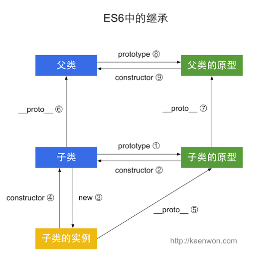

# 面向对象编程


js与java不同,它是真正的面向对象编程(java是面向类型编程).

其实正经说js的叫做原型编程模型

js的设计者认为对象之间的相似性可以让面向对象的继承得到简化,通过直接复制一个与自己类似的对象,稍作修改就可以实现自己的对象了,真是朴素哇

我们要创建一个新的商品叫莎士比亚全集,那我们直接拿书做原型就行了

如我们前面说了那么多的特殊对象,他们就是原型,使用他们的时候本质上就是用new关键字做一份原型的拷贝对象.


在容器部分我们已经介绍过对象,这边我们从类开始介绍js的面向对象编程.

## 类的语法

从ES6开始关键字`class`可以用于定义类.

下面是一个典型的类定义形式:


```javascript
class Vector {
    constructor(...attributes) {
        this._attributes = attributes
    }
    static FromArray(attributes_arr){
        return new Vector(...attributes_arr)
    }
    get morn(){
        return this._attributes.map((e)=>e**2).reduce((e_f,e_b)=>e_f+e_b)
    }
    get dimension(){
        return this._attributes.length
    }
    
    copy(){
        new new Vector(...this._attributes)
    }
    add(that){
        if (that instanceof Vector){
            if (this.dimension === that.dimension){
                let input = this._attributes.map((e,i)=>e+that._attributes[i])
                return new Vector(...input)
            }else{
                throw "two Vector must have the same morn"                   
            }
        }else{
            throw "a Vector can only add a Vector"
        }
    }
    toString(){
        return `Vector<${this._attributes}>`
    }
}
```


```javascript
typeof Vector
```


    'function'


```javascript
Object.is(Vector,Vector.prototype.constructor)
```


    true


Js中通过类创建实例需要用`new`关键字


```javascript
let v1= new Vector(1,2)
```


```javascript
v1
```


    Vector { _attributes: [ 1, 2 ] }


```javascript
v1.dimension
```


    2


```javascript
v1.toString()
```


    'Vector<1,2>'


```javascript
Object.is(v1.constructor,Vector.prototype.constructor)
```


    true


```javascript
Object.is(v1.toString,Vector.prototype.toString)
```


    true


```javascript
Object.is(v1.add,Vector.prototype.add)
```


    true


### 构造方法

上面代码定义了一个"类".可以看到里面有一个`constructor`方法,这就是构造方法,而`this`关键字则代表实例对象.

这个方法类似python中的`__init__`方法,用于初始化类的实例.不同在于js中没有静态属性,必须在构造方法中设置实例属性.


### 实例方法

Vector类除了构造方法,还定义了一个`toString`方法.注意,定义"类"的方法的时候,前面不需要加上function这个保留字,直接把函数定义放进去了就可以了,这种写法相当于使用非箭头函数定义了一个方法.另外,方法之间不需要逗号分隔.

### 静态方法

在定义方法的时候,前面加上修饰用的关键字`static`就可以构造一个静态方法,通常静态方法用于丰富类的实例构造方法.

### 取值函数(getter)和存值函数(setter)

取值函数(getter)和存值函数(setter)类似python中的属性`@property`,用于惰性求值和拦截该属性的存取行为.这其实是`Object.defineProperty(obj, prop, descriptor)`的语法糖.

存值函数和取值函数是设置在属性的`descriptor`对象上的.


```javascript
class MyClass1 {
  constructor() {
    // ...
  }
  get prop() {
    return 'getter'
  }
  set prop(value) {
    console.log('setter: '+value)
  }
}

```


```javascript
let inst1 = new MyClass1()

inst1.prop = 123
```

    setter: 123


    123


```javascript
inst1.prop
```


    'getter'


## 类的数据类型

类的数据类型就是函数,类本身就指向构造函数.

构造函数的`prototype`属性在ES6的"类"上面继续存在.事实上类的所有方法都定义在类的prototype属性上面.

在类的实例上面调用方法,其实就是调用原型上的方法.

在类结构中的实例方法(除`constructor`以外)都使用`Object.defineProperty(obj, prop, descriptor)`定义在`prototype`对象上面.而静态方法则是直接使用`Object.defineProperty(obj, prop, descriptor)`将方法直接绑定到构造函数.因此才可以使用`get`,`set`关键字定义取值函数和存值函数,从而固定一个字段的可访问情况.


所以类的新方法可以添加在`prototype`对象上面.`Object.assign`方法可以很方便地一次向类添加多个方法.

类的内部所有定义的方法,都是不可枚举的(enumerable).

实例的属性除非显式定义在其本身(即定义在this对象上),否则都是定义在原型上(即定义在class上).类的所有实例共享一个原型对象.

### Class表达式

与函数一样，Class也可以使用表达式的形式定义。


```javascript
const MyClass = class {
  getClassName() {
    return cls.name
  }
}
```


```javascript
MyClass.name
```


    'MyClass'


```javascript
let inst = new MyClass()
```


```javascript
inst instanceof MyClass
```


    true


上面代码使用表达式定义了一个类.需要注意的是,这个类的名字是`MyClass`而不是`cls`,`cls`只在Class的内部代码可用,指代当前类.


```javascript
let inst = new MyClass()
inst.getClassName() // Me
cls.name // Referen
```


    evalmachine.<anonymous>:1

    let inst = new MyClass();

    ^

    

    SyntaxError: Identifier 'inst' has already been declared

        at evalmachine.<anonymous>:1:1

        at Script.runInThisContext (vm.js:123:20)

        at Object.runInThisContext (vm.js:312:38)

        at run ([eval]:1002:15)

        at onRunRequest ([eval]:829:18)

        at onMessage ([eval]:789:13)

        at process.emit (events.js:188:13)

        at emit (internal/child_process.js:828:12)

        at process.internalTickCallback (internal/process/next_tick.js:72:19)


```javascript
inst.name
```

如果Class内部没用到的话可以省略.


```javascript
let person = new class {
  constructor(name) {
    this.name = name
  }

  sayName() {
    console.log(this.name)
  }
}("张三")

person.sayName() // "张三"
```

    张三


上面代码中,person是一个立即执行的Class的实例.

## 继承

ES6中的继承采用extend关键字实现

```javascript
class B extends A {
}
```

extends关键字后面可以跟多种类型的值.只要是一个有prototype属性的函数就能被B继承.由于函数都有prototype属性,因此A可以是任意函数


### super()方法

和python一样,js也有super()方法来构造父类实例(相当于python中的`super().__init__(self,*args)`),
Javascript的继承机制是这样:

1. 先创造父类的实例对象`this`(所以必须先调用super方法)
2. 然后再用子类的构造函数修改`this`


### 获取父类

`Object.getPrototypeOf`方法可以用来从子类上获取父类.也可以在实例上获取其原型


```javascript
Object.getPrototypeOf(foo)
```


    Foo {}


```javascript
Object.getPrototypeOf(Foo)
```


    [Function]


### this指针总结

js中有一个特殊的指针`this`,由于其语义存在歧义,因此它是面向对象编程中的一个难点.

`this`是使用`Function`对象中`prototype`的call方法调用函数时传递的第一个参数,它可以在函数调用时修改,在函数没有调用的时候,`this`的值是无法确定.我们前面已经说过js语境下类其实就是构造函数,或者说类其实就是函数.因此`this`指针是面相对象编程写法中绕不过去的一环.但因为在不同情况下`this`的含义不同,所以比较恶心.

具体点有这些情况:

场景|call的写法|this指代的对象
---|---|---
纯粹的函数调用|`func.call(undefined,...args)`|全局`global`,前端项目中为`Window`
对象中的方法|`obj.method.call(obj,...args)`|所在对象`obj`
构造函数|---|每个构造函数在`new`之后都会返回一个对象，这个对象就是`this`,也就是说构造函数中的`this`指代其使用`new`构造出的实例
箭头函数|---|外层`this`,也就是说箭头函数中没有自己的`this`,如果有闭包环境,那在其中的`this`实际是闭包命名空间的,如果没有那就指代全局`global`
无继承`class`中`constructor`方法|---|指代类`new`操作创建的对象
有继承`class`中`constructor`方法|---|指代类`new`操作创建的对象,需要注意要自定义的话`this`需要由`super()`创建.同时父类中的`this`会被指向子类创建的实例


```javascript
let obj1 = {
    a: function() { console.log(this) },
    b: {
        c: () => {console.log(this)}
    },
    d:{
    e:function(){
    (()=>{console.log(this)})()
}
}
}
```


```javascript
obj1.a()   //没有使用箭头函数打出的是obj
```

    { a: [Function: a],
      b: { c: [Function: c] },
      d: { e: [Function: e] } }


```javascript
obj1.b.c()  //打出的是window对象！！
```

    undefined


```javascript
obj1.d.e() //被闭包捕获
```

    { e: [Function: e] }


```javascript
function getPrototypeChain(instance){
        let protoChain = []
        while (instance = Object.getPrototypeOf(instance)) {
            protoChain.push(instance)
        }
        protoChain.push(null)
        return protoChain
    }
```


```javascript
class F{
    constructor(){
        console.log(getPrototypeChain(this))
    }
}
```


```javascript
let f1 = new F()
```

    [ F {}, {}, null ]


```javascript
console.log(getPrototypeChain(f1))
```

    [ F {}, {}, null ]


```javascript
class C extends F{
    constructor(){
        super()
        console.log(getPrototypeChain(this))
    }
}
```


```javascript
let c1 = new C()
```

    [ C {}, F {}, {}, null ]
    [ C {}, F {}, {}, null ]


```javascript
console.log(getPrototypeChain(c1))
```

    [ C {}, F {}, {}, null ]


## 原型链机制

在语法部分结束之后这边来讲讲js语言机制中的最核心--原型机制.

大家肯定已经发现了js没有真正的类,其面相对象的实现靠的是原型机制,那这个原型机制是个什么呢?它又是怎么来的呢?

### 奇葩历史造就奇葩机制


js的的语言设计在早期可以说相当的让人无语,这也为诞生出原型链这种机制创造了条件.

在最开始的时候js被规划为一种脚本语言,只要能让浏览器可以与网页互动就行,按现在的软件工程理论来说,他们还挺先进的,做了个`mvp`,这个`mvp`就是早期的js.早期的js真的是能省就省.尤其在关键的地方也一点不含糊--js想要面相对象,但又觉得它太复杂,于是它省掉了类...

我们知道类是实例对象的模板,没有类怎么创建实例呢?

js另辟蹊径,用所谓的原型来代替类的功能,为创建实例提供模板.什么意思呢?比如有个对象A,我们希望对象B有和对象A一样的字段,那怎么办?

+ 使用类就是,我在A,B的基础上做一个模板T,这个T做的事情只是确定使用的它对象有什么字段,默认值时什么,然后A和B就通过同样的构造函数来由T创建.
+ 使用原型就是:我们拿对象A做模板,复制一个B出来然后通过构造函数改B

额...简单理解可以认为A充当了模板,在某种意义上来说原型机制就是把继承链上的最后一个父对象当做了类的实现.因此严格意义上来说js只有继承没有类.

### 函数即构造函数

在早期为了省事儿,js把函数和构造函数直接混淆了:

+ 直接调用函数就是调用函数
+ 使用关键字`new`调用函数就是调用构造函数创建实例.

然后为了区分类和函数,js则口头的规定函数名大写的是构造函数,小写的是类...


```javascript
function A_constructor(x,y){
    this.x=x
    this.y=y
    this.calcul_add = function(){
        return this.a+this.b
    }
    return x+y
}
```


```javascript
A_constructor(1,2)
```


    3


```javascript
let a = new A_constructor(1,2)
a
```


    A_constructor { x: 1, y: 2, calcul_add: [Function] }


```javascript
let b = new A_constructor(3,4)
b
```


    A_constructor { x: 3, y: 4, calcul_add: [Function] }


```javascript
a instanceof A_constructor
```


    true


我们可以看到a是类型`A_constructor`的实例,这意味着什么呢,js设计成了构造函数的名字就是类名,或者干脆说构造函数就是类了.真是够偷懒的...

### 使用原型模拟用类构造实例

使用构造函数创建下只有字段保存值得结构还行,绑定函数成为方法就蛋疼了,因为每次new都会创建一个内容一样的函数,这会消耗大量资源.

同时一些比如类属性就没办法实现了


```javascript
Object.is(A_constructor,A_constructor)
```


    true


```javascript
Object.is(a.calcul_add,b.calcul_add)
```


    false


有什么办法可以解决这个问题呢?js就规定可以在构造函数上加一个字段`prototype`,即原型,我们就可以修改构造函数的这个字段,为由它构造的实例对象添加公有方法和共享属性.所有的实例对象也会有一个特殊字段`__proto__`用于保存这个构造函数上加的`prototype`对应的对象的引用.

访问对象字段时,在对象本身没找到对应字段时会去对象的`__proto__`找有没有对应的字段.都找不到才会返回`undefined`


```javascript
A_constructor.prototype
```


    A_constructor {}


```javascript
let A = {
    z:"share",
    calcul_mul:function(){
        return this.x*this.y
    }
}
```


```javascript
A_constructor.prototype = A
```


    { z: 'share', calcul_mul: [Function: calcul_mul] }


```javascript
let c = new A_constructor(10,11)
let d = new A_constructor(11,12)
```


```javascript
c.z
```


    'share'


```javascript
c.calcul_mul()
```


    110


```javascript
d.z
```


    'share'


```javascript
d.calcul_mul()
```


    132


```javascript
c.z = "test"
```


    'test'


```javascript
c.z
```


    'test'


```javascript
d.z
```


    'share'


```javascript
c.__proto__
```


    { z: 'share', calcul_mul: [Function: calcul_mul] }


```javascript
Object.is(c.calcul_mul,d.calcul_mul)
```


    true


### 本地字段和原型字段

弄清了上面的过程,我们就知道该如何构造共享属性和共享方法,这其实就像python中的实例方法和类方法,我们可以定义好构造函数的原型,这个原型本身是共享的

+ 如果要对所有这个类的实例(由这个构造函数构造的实例)操作变化就修改`instance.__proto__.attr`
+ 如果要屏蔽掉对这个共享字段的引用就使用本地字段覆盖掉它`instance.z = undefined`

类似的如果字段是方法,那其实也是一样,不过需要注意的是`this`指代的是实例本身而非原型对象因此其字段的访问原理也是一致的.


```javascript
c.__proto__.z = "testtest"
```


    'testtest'


```javascript
d.z
```


    'testtest'


```javascript
c.z
```


    'test'


```javascript
c.z = undefined
```


```javascript
c.z
```

需要注意,new方法生成的对象,它的原型是复制过来的而非引用,因此使用先前定义A而未给构造函数的`prototype`赋值,创建出来的实例`a`,`b`并不会有后添加的共享属性


```javascript
a.z
```


```javascript
a.__proto__
```


    A_constructor {}


使用构造函数这种方式构造实例对象有明显缺陷:

+ 没有继承语法
+ `this`指针污染`global`环境,这个后面细聊.

### 使用原型规定类间的继承关系

js在早期设计的时候就没想过要让类之间可以有继承,毕竟对于一个文件解决的脚本语言来说继承太复杂了,结果后来就真香了.(js这么语言无处不体现着设计时的短视,现在竟然能火了也是不容易)

为了实现类间的继承关系,js使用了两条继承链.

js中每一个对象都有`__proto__`属性,指向对应的构造函数的prototype属性.Class作为构造函数的语法糖,同时有prototype属性和__proto__属性.

1. 子类的`__proto__`属性,表示构造函数的继承,总是指向父类.

2. 子类`prototype`属性的`__proto__`属性,表示方法的继承,总是指向父类的`prototype`属性.

他们之间的关系可以看这张图:



也正是使用这一机制,js记录了继承链.让他有了面相对象编程中基本的继承.不得不说这种设计很精巧,但不按套路出牌.

### 构建继承链

`Object.create(obj[,propertiesObject]`可以由对象直接创建对象实例并将原对象放入`__proto__`,可以在`propertiesObject`的位置放入要添加到新创建对象的可枚举属性(即其本地枚举属性字段,而不是其原型链上的枚举属性),这种方式常用在继承上.

这种方式构造的对象一般也是用于为构造函数的`prototype`赋值的.

另一种方式为对象构造继承链的方式是使用`Object.setPrototypeOf(obj, prototype)`,这个方法可以直接为一个对象指定原型

下面是一个构造继承的典型例子:


```javascript
function Animal(name,type){
    this.name = name
    this.type = type
}

Animal.prototype = {
    move(){
        console.log(`${this.name} is moving`)
    }
}

function Dog(name){
    this.name = name
    Animal.call(this,this.name,"Dog")
}

Dog.prototype = Object.create(Animal.prototype)
```


    {}


```javascript
let d1 = new Dog("旺财")
```


```javascript
d1.name
```


    '旺财'


```javascript
d1.move()
```

    旺财 is moving


```javascript
d1 instanceof Dog
```


    true


```javascript
d1 instanceof Animal
```


    true


至此js关于原型链的部分就结束了,可以看出这个出发点是简化模型的设计并没有真的简化模型,这套设计的不直观对学习者带来的心智负担一点不比使用其他语言类似的类申明语法轻,其实现也相当晦涩.

下面的部分就是一些使用技巧了

## 构造`callable`的类

既然我们可以继承函数的构造函数即`Function`类,那我们当然可以针对这个搞点事情,比如像python中定义`__call__`一样的定义实例被调用时的行为.


```javascript
class Callable extends Function {

    constructor () {
        //继承 Function,让函数体为`return this.__call__(...args)`即调用实例的`__call__`方法
        super('...args', 'return this.__call__(...args)')
        //将这个函数的this绑定到实例上,生成一个新的函数实例.
        let instance = this.bind(this)
        // 定义实例的属性
        //将这个构造出来的实例作为绑定this的函数的原型
        Object.setPrototypeOf(instance,this)
        //返回绑定this的函数对象
        return instance
    }
    // 定义实例的`__call__`方法
    __call__(...args){
        return 20**2
    }
}

```


    'use strict'


```javascript
let ca = new Callable()
```


```javascript
ca()
```


    400


```javascript
ca instanceof Callable
```


    true


```javascript
ca instanceof Function
```


    true


我们继承这个类看看如何:


```javascript
class Smth extends Callable{
    constructor (x){
        super()
        this.x = x
        //注意关键在将this绑定到`this.__proto__`这一步,否则`callable`的实例无法获取到smth实例中的this指针
        let instance = this.__proto__.bind(this)
        Object.setPrototypeOf(instance,this)
        return instance
        
    }
    __call__(...args){
        return this.x **2
    }
}
```


```javascript
let sm = new Smth(10)
```


```javascript
sm
```


    [Smth: bound anonymous]


```javascript
sm.x
```


    10


```javascript
sm()
```


    100


```javascript
sm instanceof Smth
```


    true


```javascript
sm instanceof Callable
```


    true


```javascript
sm instanceof Function
```


    true


## Mixin模式的实现

Mixin模式指的是将多个类的接口"混入"(mix in)另一个类,在python中我们可以使用多继承实现,但js没有多继承,那该如何实现呢?

只能往原型链中安顺序一个一个添加了,那如何


```javascript
const ToArrayMixin = Sup=>class extends Sup {
    // 需要设置name属性,这个属性返回这个mixin的名字
    static get name() { return "ToArrayMixin" }
    // 主要用于判断依赖的属性
    constructor(...args){
        super(...args)
        if(Object.is(this._attributes,undefined)){
            throw new ReferenceError("Please define _attributes to the Class!")
        }
    }
    // 用于定义方法
    toArray(){
        return Array.from(this._attributes)
    }
}

const ToStringMixin = Sup=>class extends Sup {
    static get name() { return "ToStringMixin" }
    constructor(...args){
        super(...args)
        if(Object.is(this._attributes,undefined)){
            throw new ReferenceError("Please define _attributes to the Class!")
        }
    }
    toString() {
        let content_str = this._attributes.map((x)=>x.toString()).join(",\n")
        return `${this.dimension}D-Vector:\n[${content_str}]`
    }
}
```


```javascript
class Vec extends ToStringMixin(ToArrayMixin(Vector)) {
  
}
```


```javascript
let va = new Vec(1,2,3)
```


```javascript
va
```


    Vec { _attributes: [ 1, 2, 3 ] }


```javascript
va.dimension
```


    3


```javascript
va.toArray()
```


    [ 1, 2, 3 ]


```javascript
va.toString()
```


    '3D-Vector:\n[1,\n2,\n3]'


```javascript
va instanceof Vector
```


    true


```javascript
va instanceof Vec
```


    true


```javascript
va instanceof ToArrayMixin
```


    evalmachine.<anonymous>:1

    va instanceof ToArrayMixin;

       ^

    

    TypeError: Function has non-object prototype 'undefined' in instanceof check

        at Function.[Symbol.hasInstance] (<anonymous>)

        at evalmachine.<anonymous>:1:4

        at Script.runInThisContext (vm.js:123:20)

        at Object.runInThisContext (vm.js:312:38)

        at run ([eval]:1002:15)

        at onRunRequest ([eval]:829:18)

        at onMessage ([eval]:789:13)

        at process.emit (events.js:188:13)

        at emit (internal/child_process.js:828:12)

        at process.internalTickCallback (internal/process/next_tick.js:72:19)


这种写法可以将方法混入进类,但使用`instanceof`无法检测到除了基类外用了哪些混入,算是遗憾,但我们可以用一个函数还专门用于判断是否使用了某个Mixin


```javascript
let Mixin = {
    getPrototypeChain: function(instance){
        let protoChain = []
        while (instance = Object.getPrototypeOf(instance)) {
            protoChain.push(instance)
        }
        protoChain.push(null)
        return protoChain
    },
    getPrototypeChainName: function(instance){
        let protoChain = this.getPrototypeChain(instance)
        return protoChain.map(x=>{
            let result = null
            try{
                result = x.constructor.name
            }catch (err){
                result = x
            }
            return result
        })
    },
    hasMixin: function(instance,mixin_name){
        return this.getPrototypeChainName(instance).filter(x=>x===mixin_name).length !==0
    }
}
```


```javascript
Mixin.getPrototypeChain(va)
```


    [ Vec {}, ToStringMixin {}, ToArrayMixin {}, Vector {}, {}, null ]


```javascript
Mixin.getPrototypeChainName(va)
```


    [ 'Vec', 'ToStringMixin', 'ToArrayMixin', 'Vector', 'Object', null ]


```javascript
Mixin.hasMixin(va,'ToStringMixin')
```


    true


