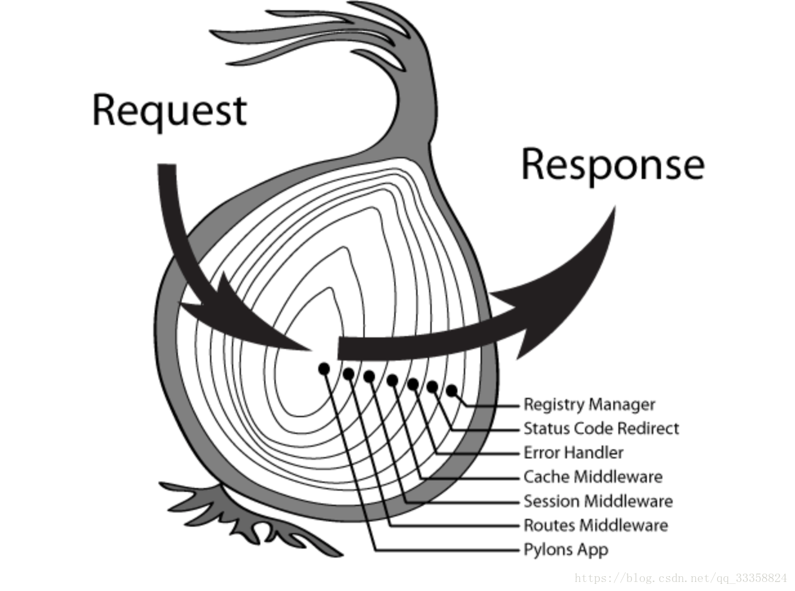

# 使用Javascript构建http接口服务

js有很多优秀的http服务框架,目前最受我个人喜爱的是[koa](https://koa.bootcss.com/).这个框架非常轻量,要正常使用几乎必须使用插件.先来一个[helloworld](https://github.com/TutorialForJavascript/js-server/tree/master/code/RESTful%E6%8E%A5%E5%8F%A3%E6%9C%8D%E5%8A%A1/C0)这个例子没有方法判断,没有路由,没有权限控制,什么都没有只是给出一个最最基础的http服务而已.

```js
import Koa from 'koa'
const app = new Koa()

app.use(async ctx => {
    ctx.response.type='application/json'
    ctx.body = JSON.stringify({
        'message': 'Hello World'
    })
})

app.listen(3000)
```

http协议是本文的基础,不知道http协议或者想对其了解更加深刻的可以去看看[图解HTTP](http://www.ituring.com.cn/book/1229).

## koa的原理

koa的调用结构类似洋葱,请求会封装成`请求响应的上下文对象`会一层一层的传递给下一层的异步函数,直到最后一层处理完再原路一层一层的返回去,再在终点时拆成响应传递出去提供服务.



## 请求响应的上下文对象

这个对象的具体接口可以查看koa的官网,内容很少这边也不再重复,最基本的就是其中

+ `ctx.request`是一次http的请求对象
+ `ctx.response`是与`ctx.request`对应的http的响应对象

我们要做的就是根据`ctx.request`构造`ctx.response`.

ctx也提供了几个特殊对象方便我们构造响应.

+ `ctx.app`对象,即这个服务本身的app对象,这样我们就可以像app对象上挂各种有必要的东西这为服务构造提供了灵活性

+ `ctx.cookies`,可以获取或设置cookie,使用`get`和`set`方法

+ `ctx.throw([status], [msg], [properties])`,抛出http异常,直接中断后续的异步函数操作构造错误响应并传回去

另外由于每次写上`response`或者`request`太长了,ctx中也提供了一些快速访问特定字段的`快捷方式`:

+ Response:

| 对象                         | 可访问性 | 说明                                                                                                                 |
| ---------------------------- | -------- | -------------------------------------------------------------------------------------------------------------------- |
| `ctx.body`                   | 读写     | 响应的body体                                                                                                         |
| `ctx.status`                 | 读写     | 响应的状态码                                                                                                         |
| `ctx.message`                | 读写     | 响应的状态消息,通常与响应状态码有关                                                                                  |
| `ctx.length`                 | 读写     | `Content-Length`设置,类型为int                                                                                       |
| `ctx.type`                   | 读写     | `Content-Type`设置,具体的可以看[MDN上的介绍](https://developer.mozilla.org/zh-CN/docs/Web/HTTP/Headers/Content-Type) |
| `ctx.headerSent`             | 只读     | 用于检查是否已经发送了一个响应头,用于查看客户端是否可能会收到错误通知                                                |
| `ctx.lastModified`           | 只写     | 将`Last-Modified`标头设置为适当的UTC字符串,常使用`new Date()`                                                        |
| ctx.etag                     | 只写     | 设置包含"包裹的ETag响应,常见用法`ctx.etag = crypto.createHash('md5').update(ctx.body).digest('hex')`                 |
| `ctx.redirect(url, [alt])`   | 方法     | 执行[302]重定向到url.字符串"back"是特别提供Referrer支持的,当Referrer不存在时,使用`alt`或"/"                          |
| `ctx.attachment([filename])` | 方法     | 将`Content-Disposition`设置为"附件"以指示客户端提示下载.(可选)指定下载的`filename`                                   |
| `ctx.set(field,value)`       | 方法     | 设置响应标头field到value                                                                                             |
| `ctx.append(field,value)`    | 方法     | 用值val附加额外的标头field                                                                                           |
| `ctx.remove(field)`          | 方法     | 删除标头field                                                                                                        |

+ Request:

| 对象                              | 可访问性 | 说明                                                                                                                                                                   |
| --------------------------------- | -------- | ---------------------------------------------------------------------------------------------------------------------------------------------------------------------- |
| `ctx.header/ctx.headers`          | 只读     | 请求头                                                                                                                                                                 |
| `ctx.method`                      | 读写     | 请求的http方法                                                                                                                                                         |
| `ctx.url`                         | 读写     | 请求的url路径                                                                                                                                                          |
| `ctx.originalUrl`                 | 只读     | 获取请求原始URL                                                                                                                                                        |
| `ctx.origin`                      | 只读     | 获取URL的来源,包括 protocol 和 host                                                                                                                                    |
| `ctx.href`                        | 只读     | 获取完整的请求URL,包括 protocol,host 和 url                                                                                                                            |
| `ctx.path`                        | 读写     | 获取请求路径名                                                                                                                                                         |
| `ctx.query`                       | 读写     | 获取解析的查询字符串,当没有查询字符串时返回一个空对象.                                                                                                                 |
| `ctx.querystring`                 | 读写     | 根据`?`获取原始查询字符串                                                                                                                                              |
| `ctx.host`                        | 只读     | 获取请求的host(hostname:port)                                                                                                                                          |
| `ctx.hostname`                    | 只读     | 获取请求的hostname                                                                                                                                                     |
| `ctx.fresh`                       | 只读     | 检查请求缓存是否"新鲜",也就是内容没有改变.此方法用于`If-None-Match/ETag`,和`If-Modified-Since`和`Last-Modified`之间的缓存协商.在设置一个或多个这些响应头后应该引用它.  |
| `ctx.stale`                       | 只读     | 与`ctx.fresh`相反                                                                                                                                                      |
| `ctx.socket`                      | 只读     | 请求套接字                                                                                                                                                             |
| `ctx.protocol`                    | 只读     | 返回请求协议即'https'或'http'。当`app.proxy`是`true`时支持`X-Forwarded-Proto`                                                                                          |
| `ctx.secure`                      | 只读     | 通过`ctx.protocol == "https"`来检查请求是否通过TLS发出                                                                                                                 |
| `ctx.ip`                          | 只读     | 请求远程地址.当`app.proxy`是`true`时支持`X-Forwarded-Proto`                                                                                                            |
| `ctx.ips`                         | 只读     | 当`X-Forwarded-For`存在并且`app.proxy`被启用时,这些ips的数组会被按从上游到下游的排序返回.禁用时返回一个空数组.                                                         |
| `ctx.subdomains`                  | 只读     | 将子域返回为数组                                                                                                                                                       |
| `ctx.is(types...)`                | 方法     | 检查传入请求是否包含`Content-Type`头字段,并且包含任意的`mime type`.如果没有请求主体返回`null`.如果没有内容类型或者匹配失败则返回`false`.反之则返回匹配的`content-type` |
| `ctx.accepts(types)`              | 方法     | 检查给定的type(s)是否可以接受                                                                                                                                          |
| `ctx.acceptsEncodings(encodings)` | 方法     | 检查encodings是否可以接受                                                                                                                                              |
| `ctx.acceptsCharsets(charsets)`   | 方法     | 检查charsets是否可以接受                                                                                                                                               |
| `ctx.acceptsLanguages(langs)`     | 方法     | 检查langs是否可以接受                                                                                                                                                  |
| `ctx.get(field)`                  | 方法     | 返回请求头中对应`field`的值                                                                                                                                            |

## 插件

这个框架过于轻量以至于几乎无法在稍微复杂的环境下单独使用.要用它必须依赖插件.

### 自己写个插件

我们的第二个例子[C1](https://github.com/TutorialForJavascript/js-server/tree/master/code/RESTful%E6%8E%A5%E5%8F%A3%E6%9C%8D%E5%8A%A1/C1)就是一个自己写的插件,这个插件实现一个没什么用的功能--给所有的response的json体内加上`author:hsz`.

插件和业务逻辑都是使用`app.use()`来调用,但不太一样的是插件是一个包含`ctx`和`next`两个参数的协程函数,而`await next()`则是进入下一层的标志,在其上的是处理请求,在其下的是处理响应.

这个就有点像python中使用`contextlib.contextmanager`写[上下文管理器](https://tutorialforpython.github.io/%E8%AF%AD%E6%B3%95%E7%AF%87/%E6%B5%81%E7%A8%8B%E6%8E%A7%E5%88%B6/%E5%8D%95%E7%BA%BF%E7%A8%8B%E5%90%8C%E6%AD%A5%E6%B5%81%E7%A8%8B%E6%8E%A7%E5%88%B6.html#%E4%BD%BF%E7%94%A8contextmanager).

### 使用插件

和业务逻辑一样,插件也是使用`app.use()`来使用.只是需要注意使用的顺序,即先`use`的在外层,后`use`的在内层.这个在例子[C1]()中也有体现

### 常见插件

但是总不能啥都自己写插件实现,实际上现在已经有不少靠谱的插件可以现成的使用了

+ [koa-route](https://www.npmjs.com/package/koa-route)一个用来实现路由的优质插件,它不光可以管到路由,还可以管到http方法.我们的RESTful接口核心插件就是它了.
+ [koa-compose](https://www.npmjs.com/package/koa-compose)将多个中间件合成一个,配合上面的koa-route,我们可以将路由模块整个打包成一个插件.
+ [koa-compress](https://github.com/koajs/compress)用于使用zlib压缩请求体
+ [koa-body](https://github.com/dlau/koa-body)用于将body体解析为更易懂的形式,比如json这类
+ [koa-jwt](https://github.com/koajs/jwt)jwt认证
+ [koa-pino-logger](https://github.com/pinojs/koa-pino-logger)一个机遇pino的logger,默认的log形式为json更容易被elasticsearch解析
+ [koa2-cors](https://www.npmjs.com/package/koa2-cors)服务端解决跨域问题
+ [koa-sse-stream](https://github.com/yklykl530/koa-sse),一个用于构造sse的插件.

### 关于跨域

关于跨域的问题我写在[前端部分](https://tutorialforjavascript.github.io/web%E5%89%8D%E7%AB%AF%E6%8A%80%E6%9C%AF/%E5%89%8D%E7%AB%AF%E6%A6%82%E8%A7%88/%E5%89%8D%E7%AB%AF%E5%BA%94%E7%94%A8%E4%B8%8E%E9%80%9A%E4%BF%A1/ajax%E5%8F%8A%E7%9B%B8%E5%85%B3%E6%8A%80%E6%9C%AF.html),有兴趣的可以看下.

## 一个完整例子

我们用例子[C2](https://github.com/TutorialForJavascript/js-server/tree/master/code/RESTful%E6%8E%A5%E5%8F%A3%E6%9C%8D%E5%8A%A1/C2)来封装一个服务资源--Notification. 这个Notification包含如下字段:

```json
{
    "id":int,//事件id
    "creater_id":int,//创建者id
    "create_time":DATETIME,//创建时间
    "notify_time":DATETIME,//提醒时间
    "notify_uid":JSON,//要提醒的目标用户
    "message":string,//提醒内容
    "status":ENUM('Pendding', 'Canceled','Done','Error'),//状态
    "status_log":JSON//状态转化的log信息,其结构为`[{from:xxx,to:xxx,at:xxx,msg:xxx},...]`
}
```

同时会为每个创建了的Notification创建一个定时任务的promise,这个任务将会向一个redis的目标用户uid为名的channel发出一个发布订阅的发布请求.
而我们的`/stream/:uid`将会监听redis的uid对应的channel以推送提醒.


这个例子实际上是3个资源加一个sse推送流

+ main,也就是存放Notification和相关资源的容器
+ NotificationList,管理所有Notification实例的容器
+ Notification,管理单个Notification实例
+ stream,管理流数据的推送.

这个例子中使用到了最常用的几个插件,实际上只是将数据库中的数据做了下封装.

这个项目使用的mvc模式设计,因为对于接口来说view层实际上就是json的样式,所以主干在如下两个文件夹

+ `controller`管理资源和路由
+ `module`管理数据库连接和表设计

剩下的是一些辅助工具:

+ `cmd.js`管理命令行解析
+ `config.js`管理配置文件和默认配置
+ `app.js`用于生成app实例
+ `pubsub.js`用于管理redis的发布订阅
