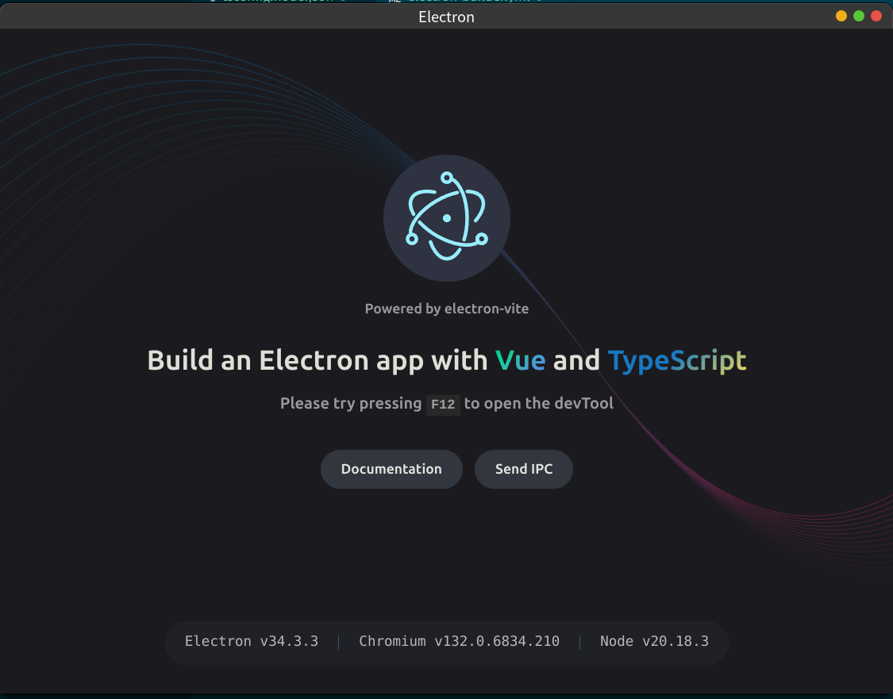

# 用vue写electron应用

electron开发的应用本质上就是一个chromimum浏览器加一个web应用.他的基本结构可以归结为

+ 一个入口进程,管这个应用`chromimum浏览器`的部分,比如顶栏,菜单栏,地址栏,比如点了关闭,点了最小化这些按钮后的操作等,这个入口进程运行在一个内嵌的特殊node环境中,我们可以在其中使用node生态中的大部分库,但如果这个库不是纯js的可能会有些麻烦,同样也可以做访问本地系统,多线程等工作.
+ 一个渲染进程,管这个应用`web应用`的部分,它就是一个纯纯的浏览器环境,浏览器里能用什么它就能用什么.通常这个部分只做交互
+ 一个预渲染脚本,用于在给入口进程和渲染进程间建立统一的上下文用于两边交互

我们用vue开发的其实还是`渲染进程`,但好在和写chrome插件类似,node社区早就有脚手架辅助快速构建electron项目,这个项目就是[electron-vite](https://cn.electron-vite.org/guide/).借助vite,我们可以非常简单的构造一个typescript + vue的electron开发环境,本文也将基于这一套工作流来介绍如何使用vue写electron.

## 项目初始化

使用`npm create @quick-start/electron@latest`就可以创建electron项目的模板.执行后它会让你选框架,选是否使用typescript,选好后会自动创建.在创建完成后我们需要执行`npm install`安装依赖,这两步都执行完项目就初始化好了.

## 项目结构

项目结构的主要部分如下所示

```txt
\--resource\
|
|--src\
      |--main\
      |      |--index.ts
      |
      |--preload\
      |         |--index.d.ts
      |         |--index.ts
      |
      |--renderer\
                 |--index.html
                 |--src
                     |--main.ts
                     |--env.d.ts
                     |--App.vue
                     |--assets\
                     |
                     |--components\
        
```

项目的主体还是在`src`目录下,有三个文件夹

+ `main`,对应入口进程,里面有个`index.ts`即入口脚本

+ `renderer`.对应渲染进程,里面是一个vue项目的基本框架--里面有个`index.html`就是待渲染的页面入口,还有个`src`存放的是vue相关的资源--`assets`用于放置图片,字体等资源;`components`存放vue组建;`main.ts`是vue入口,而`App.vue`是根节点.

除了主体的`src`外,`resource`文件夹则是存放项目图标等入口进程中用到资源地方

## helloworld

这个例子在[electron-helloworld](https://github.com/hsz1273327/TutorialForFront-EndWeb/tree/electron-helloworld)分支,我们通过几个小节来完善它并演示electron相关的内容

实际上`@quick-start/electron`创建的这个模板本身就是一个helloworld,我们可以先试着开发模式运行它然后在每个部分单独讲解

要开发模式运行它只要在项目根目录下执行`npm run dev`即可.它会打开一个想下面这样的页面



我们从入口开始介绍,一步一步介绍各个组建的作用

## 入口进程

在介绍入口进程的基本结构前我们需要先明确几个定义

+ `app`,即这个electron构造的应用
+ `Window`,即electron构造应用渲染进程渲染的窗口,显然作为一个浏览器魔改的框架,多窗口是可以支持的,但对于多数情况我们只需要一个窗口,也就是我们的应用内容的容器,通常我们称其为`mainWindow`.通常应用app会在准备好后展示这个窗口,当关闭窗口后也会有个钩子来给应用app做后处理

入口进程的最基本功能可以归结为

1. 应用生命周期行为,比如定义什么时候开始执行渲染进程,定义关闭时的行为等
2. 一部分应用的运行形态定义,比如定义在程序托盘中的行为,定义在dock中的行为,定义后台执行行为,弹出系统提醒等,这个会在后续详细介绍
3. 窗口样式的定义,比如定义窗口图标,渲染的url或html文件,预渲染脚本等
4. 定义与渲染进程间的交互接口
5. 封装一些node接口以便让渲染进程调用

### 应用生命周期行为

最基本的就是规定启动应用和关闭应用的流程:

+ `main/index.ts`

```ts
import { app, BrowserWindow } from 'electron'
import { electronApp, optimizer } from '@electron-toolkit/utils'

...

// 定义应用窗口的创建流程
function createWindow(){
    ....
}
...

// electron初始化结束后开始执行,这个流程最基本的操作就是创建应用的窗口
// 除此以外有些操作只能在这个步骤中执行
app.whenReady().then(() => {
  // windows用,设置user model id
  electronApp.setAppUserModelId('com.electron')

  //创建好窗口后设置这个创建好的窗口的一些行为
  // + 在开发中默认通过 `F12` 打开或关闭 DevTools，
  // + 在生产中忽略 `CommandOrControl + R`
  app.on('browser-window-created', (_, window) => {
    optimizer.watchWindowShortcuts(window)
  })
  //创建主窗口
  createWindow()
  // macos用,应用没有关闭同时没有窗口时在dock中点击应用图标时创建一个新的窗口
  app.on('activate', function () {
    if (BrowserWindow.getAllWindows().length === 0) {
        createWindow()
    }
  })
})
...
// 生命周期监听
app.on('browser-window-blur', (_event, window) => {
  console.log(`${window.id} browser-window-blur`)
})
app.on('browser-window-focus', (_event, window) => {
  console.log(`${window.id} browser-window-focus`)\
})
// 窗口关闭钩子,当全部窗口被关闭时如果系统是macos则关闭应用
app.on('window-all-closed', () => {
  if (process.platform !== 'darwin') {
    app.quit()
  }
})
```

下面是整理的常用的生命周期事件表格,更多的事件可以查看[官方文档](https://www.electronjs.org/zh/docs/latest/api/app#%E4%BA%8B%E4%BB%B6)

| 生命周期事件             | 回调参数                                                                                                | 作用平台 | 说明                                                                                                                                                                                                                                                                                                              |
| ------------------------ | ------------------------------------------------------------------------------------------------------- | -------- | ----------------------------------------------------------------------------------------------------------------------------------------------------------------------------------------------------------------------------------------------------------------------------------------------------------------- |
| `ready`                  | + `event Event`</br> +`launchInfo Record<string, any>`或`NotificationResponse`(macos)                   | all      | 当 Electron完成初始化时发出一次.</br>一般我们并不监听这个事件,</br>而是使用`app.isReady()`来检查该事件是否已被触发</br>或通过 `app.whenReady()`得到一个当Electron已初始化后的Promise.                                                                                                                             |
| `before-quit`            | + `event Event`                                                                                         | all      | 在程序关闭窗口前发信号,</br>在`Windows`系统中如果应用程序因系统关机/重启或用户注销而关闭,那么这个事件不会被触发.                                                                                                                                                                                                  |#### dock行为
| `window-all-closed`      | ---                                                                                                     | all      | 当所有的窗口都被关闭时触发.如果你没有监听此事件并且所有窗口都关闭了,默认的行为是控制退出程序;</br>但如果你监听了此事件,你可以控制是否退出程序.</br>如果用户按下了`Cmd + Q`,或者开发者调用了`app.quit()`,</br>`Electron`会首先关闭所有的窗口然后触发`will-quit`事件,在这种情况下`window-all-closed`事件不会被触发. |
| `will-quit'`             | + `event Event`                                                                                         | all      | 当所有窗口被关闭后触发,同时应用程序将退出,**注:**在`Windows`系统中如果应用程序因系统关机/重启或用户注销而关闭那么这个事件不会被触发.                                                                                                                                                                              |
| `quit`                   | + `event Event`</br> + `exitCode Integer`                                                               | all      | 在应用程序退出时发出.**注:**在`Windows`系统中如果应用程序因系统关机/重启或用户注销而关闭,那么这个事件不会被触发                                                                                                                                                                                                   |
| `browser-window-blur`    | + `event Event`</br> + `window BrowserWindow`                                                           | all      | 当browserWindow失去焦点时触发                                                                                                                                                                                                                                                                                     |
| `browser-window-focus`   | + `event Event`</br> + `window BrowserWindow`                                                           | all      | 当browserWindow获得焦点时触发                                                                                                                                                                                                                                                                                     |
| `browser-window-created` | + `event Event`</br> + `window BrowserWindow`                                                           | all      | 当一个新的browserWindow被创建时触发                                                                                                                                                                                                                                                                               |
| `second-instance`        | + `event Event`</br> + `argv string[]`</br> + `workingDirectory string`</br> + `additionalData unknown` | all      | 当有新的应用实例被启动时第一个启动的实例会收到                                                                                                                                                                                                                                                                    |

然后macos还有一些额外的和激活行为相关的常用事件

| 事件                | 回调参数                                                | 触发范围                                                                                                                                    | 说明                                   |
| ------------------- | ------------------------------------------------------- | ------------------------------------------------------------------------------------------------------------------------------------------- | -------------------------------------- |
| `activate`          | + `event Event`</br> + `hasVisibleWindows boolean`</br> | + 启动应用程序</br>+ 在应用程序已运行时单击应用程序的坞站</br>+ 在应用程序已运行时单击任务栏图标                                            | 应用进入激活状态                       |
| `did-become-active` | + `event Event`                                         | + 启动应用程序</br>+ 在应用程序已运行时单击应用程序的坞站</br>+ 在应用程序已运行时单击任务栏图标</br> + 用户通过 macOS 应用切换器切换到程序 | 当应用即将被激活                       |
| `did-rele-active`   | + `event Event`                                         | ---                                                                                                                                         | 当程序长时间处于非激活非聚焦状态时触发 |

### 弹出系统消息

在入口进程中有独立的弹出系统消息的接口:

```typescript
import {
  Notification
} from 'electron'
...
new Notification({
  title: 'title',
  body: 'mesage'
}).show()
```

这个和渲染进程中的notification效果差不多.一般多用在debug测试时,真业务里用的不多,但这是我们例子中用于验证行为的必要工具,因此这里先介绍下.

与之类似的是系统对话框`dialog`,它只是相比`notification`多出一个用户点击行为的返回值而已

```typescript
import { dialog } from 'electron'

const userResponse = await dialog.showMessageBox({
  type: 'question',
  buttons: ['是', '否'], //按钮列表
  defaultId: 0,
  title: '系统集成',
  message: '是否将应用程序集成到系统中?(添加到应用菜单)'
})
if (userResponse.response === 0) {
  // userResponse.response会返回用户点击的按钮序号
  ...
}
```

### 窗口定义

窗口定义一般我们会放在一个独立的函数中实现,这个函数会构造一个窗口对象,我们需要为其设置尺寸,图标等一系列东西

```typescript
import {
  app,
  BrowserWindow
} from 'electron'
...
function createWindow(): BrowserWindow {
  // 创建窗口
  const Window = new BrowserWindow({
    title: 'helloworld',
    width: 900,
    height: 670,
    show: false,
    autoHideMenuBar: true,
    ...(process.platform === 'linux' ? { icon } : {}),
    webPreferences: {
      preload: join(__dirname, '../preload/index.js'),
      sandbox: false
    }
  })

  Window.on('ready-to-show', () => {
    Window.show()
  })

  Window.webContents.setWindowOpenHandler((details) => {
    shell.openExternal(details.url)
    return { action: 'deny' }
  })

  // HMR for renderer base on electron-vite cli.
  // Load the remote URL for development or the local html file for production.
  if (is.dev && process.env['ELECTRON_RENDERER_URL']) {
    Window.loadURL(process.env['ELECTRON_RENDERER_URL'])
  } else {
    Window.loadFile(join(__dirname, '../renderer/index.html'))
  }
  return Window
}
...
app.whenReady().then(() => {
  // Set app user model id for windows
  electronApp.setAppUserModelId('com.electron')
  ...
  // 创建主窗口
  createWindow()
  app.on('activate', function () {
    // macos中如果没有窗口存在但程序又在运行中则创建一个新窗口作为主窗口
    if (BrowserWindow.getAllWindows().length === 0) {
      createWindow()
    }
  })
})
```

### 调用node

electron的入口进程是一个非典型的node环境,它可以调用:

+ electron特有的接口
+ 大部分node标准库
+ 大部分的node下的第三方纯js依赖

只有一些底层是C/C++的所谓原生库无法直接使用.用法也很简单,import进来用就好了

```typescript
import sleep from 'await-sleep'
...
...
ipcMain.on('ping', async () => {
  console.log('pong wait 10s')
  await sleep(10000)
  console.log('pong ok')
})
...
```

## 渲染进程

渲染进程就是典型的vue项目了,浏览器中vue怎么写这里还是怎么写,唯一不同的是我们可以使用预加载脚本中定义的接口和入口进程通信.

## 预加载脚本

预加载脚本是入口进程和渲染进程间交互的桥梁,它并不是必须的,但electron-vite提供了现成的模板,我们如果没有必要完全可以不管它,那就留着好了.如果有需要注册的可以修改其中的

```typescript
// Custom APIs for renderer
const api = {}
```

在其中添加要注册的键值对即可,这部分涉及到进程间通信,比较复杂,我们会用有一节专门介绍.
