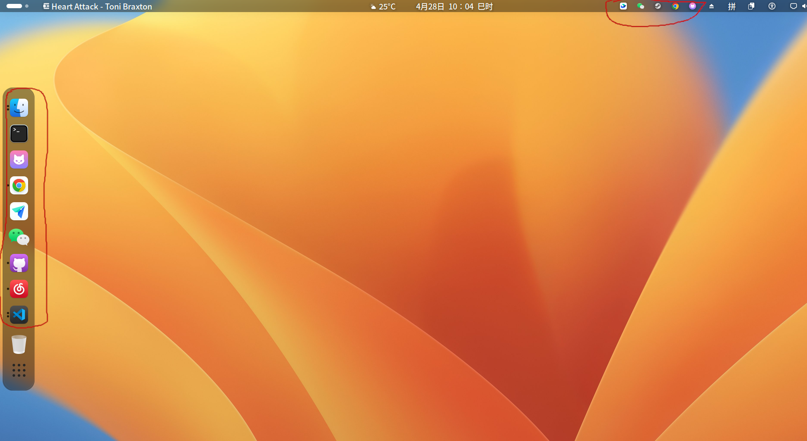

# 窗口外的交互手段

electron应用主要的交互手段当然是窗口,但我们都知道各个操作系统都有一些自己的额外交互逻辑,本文将探讨这些内容.

本文的例子在[electron-other_interface分支](https://github.com/hsz1273327/TutorialForFront-EndWeb/tree/electron-other_interface)

## 不同操作系统窗口以外的交互手段

首先让我们看看各个操作系统窗口以外的交互手段有哪些

> Linux(以Ubuntu为例)

Ubuntu现在使用的是Gnome桌面,提供了顶部右侧系统托盘(System Tray)和侧边程序坞(Dock)两处窗口以外的交互手段



一些能后台运行的应用启动后会在系统托盘放置上自己的图标以提供一些额外快捷操作,而程序坞中则可以固定应用方便快速找到执行左键开启,右键快捷操作以及一些自定义的中键滚轮操作等.

> macos

MacOS提供了顶部右侧状态栏菜单(Status Bar Menu)和底部(可以改到侧边)程序坞(Dock)两处窗口以外的交互手段


一些能后台运行的应用启动后会在状态栏菜单放置上自己的图标以提供一些额外快捷操作,而程序坞中则可以固定应用方便快速找到执行一些快捷操作.

> windows

Windows提供了系统托盘(System Tray)和任务栏(Taskbar),两处窗口以外的交互手段,他们统一都在一个长条状的托盘中,这个托盘win10中可以整体移动放置到侧边或底部,在win11中则固定在底部.


一些能后台运行的应用启动后会在系统托盘放置上自己的图标以提供一些额外快捷操作,而任务栏中则可以固定应用方便快速找到执行一些快捷操作.


从上面看其实虽然名字可能不同,但位置,体验用法上还是很接近的:

1. 都有一个或在底部或在顶部角落里只有应用启动后才会出现小图标区域
2. 都有一个或在底部或在侧边可以放置应用图标用于快速启动的托盘区域

我们统一将第一种称为系统托盘,将第二种称为程序坞

## 菜单对象

在开始介绍之前,我们先来介绍下electron中的菜单对象,毕竟这是electron中很多组件构建的基础

electron中的菜单对象(Menu)是专门用来构造按钮等交互组件的工具,一般来说用它的步骤是

1. 构造menu对象
2. 将menu对象注册到对应交互组件

第二步涉及到交互组建这边先不介绍,我们先专注于如何构造menu对象

要构造menu对象最常用的方法是使用模板,所谓模板是一个`Array<MenuItemConstructorOptions>`形式的数组,而`MenuItemConstructorOptions`满足如下接口

```typescript
interface MenuItemConstructorOptions{
    /**
     * 选项被点击后触发的操作
     */
    click?: (menuItem: MenuItem, window: (BaseWindow) | (undefined), event: KeyboardEvent) => void;
    /**
     * 预设的用途,有定义click的情况下将失效
     */
    role?: ('undo' | 'redo' | 'cut' | 'copy' | 'paste' | 'pasteAndMatchStyle' | 'delete' | 'selectAll' | 'reload' | 'forceReload' | 'toggleDevTools' | 'resetZoom' | 'zoomIn' | 'zoomOut' | 'toggleSpellChecker' | 'togglefullscreen' | 'window' | 'minimize' | 'close' | 'help' | 'about' | 'services' | 'hide' | 'hideOthers' | 'unhide' | 'quit' | 'showSubstitutions' | 'toggleSmartQuotes' | 'toggleSmartDashes' | 'toggleTextReplacement' | 'startSpeaking' | 'stopSpeaking' | 'zoom' | 'front' | 'appMenu' | 'fileMenu' | 'editMenu' | 'viewMenu' | 'shareMenu' | 'recentDocuments' | 'toggleTabBar' | 'selectNextTab' | 'selectPreviousTab' | 'showAllTabs' | 'mergeAllWindows' | 'clearRecentDocuments' | 'moveTabToNewWindow' | 'windowMenu');
    /**
     * 按钮类型,包括 \
     * `normal`, 普通按钮
     * `separator`, 分割线
     * `submenu`, 子菜单
     * `checkbox`, 多选菜单栏
     * `radio`. 单选菜单栏
     */
    type?: ('normal' | 'separator' | 'submenu' | 'checkbox' | 'radio');
    // 标签
    label?: string;
    // 子标签
    sublabel?: string;
    /**
     * macos下才会有用
     * 鼠标悬停在菜单选项时的说明文案
     * @platform darwin
     */
    toolTip?: string;
    // 菜单选项的图标
    icon?: (NativeImage) | (string);
    /**
     * 确定菜单选项是否可用,为false时置灰且不让点击
     */
    enabled?: boolean;
    /**
     * 确定菜单选项是否可见
     */
    visible?: boolean;
    /**
     * 仅在`type`为`checkbox`或`radio`时生效,菜单选项是否已被选中
     */
    checked?: boolean;
    // 定义快捷键,比如'CmdOrCtrl+S'这种
    accelerator?: Accelerator;
    /**
     * 仅在macos平台生效
     * 当菜单选项不可见时是否快捷键还能使用,默认为`true`
     * @platform darwin
     */
    acceleratorWorksWhenHidden?: boolean;
    /**
     * 仅在linux和windows平台生效
     * 默认为true,用于控制快捷键是否会被注册到系统.
     * @platform linux,win32
     */
    registerAccelerator?: boolean;
    /**
     * 仅在macos平台生效
     * 仅在`role`为`shareMenu`时生效
     * 定义SharingItem
     * @platform darwin
     */
    sharingItem?: SharingItem;
    /**
     * 仅在`type`为`submenu`时生效
     * 定义子菜单
     */
    submenu?: (MenuItemConstructorOptions[]) | (Menu);
    /**
     * 指定菜单id,一般不需要
     */
    id?: string;
    /**
     * 指定将本菜单选项放置在哪些菜单选项之前,一般不用设置
     */
    before?: string[];
    /**
     * 指定将本菜单选项放置在哪些菜单选项之后,一般不用设置
     */
    after?: string[];
    /**
     * 指定将本菜单选项放置在哪些菜单组选项之前,一般不用设置
     */
    beforeGroupContaining?: string[];
    /**
     * 指定将本菜单选项放置在哪些菜单组选项之后,一般不用设置
     */
    afterGroupContaining?: string[];
}
```

我们当然并不需要所有字段都填,一般填`label`,`type`和`clicked`就够了,之后我们可以用接口`Menu.buildFromTemplate()`将模板构造为上下文,而这个上下文就是我们设置到各种交互对象上用到的东西了

```typescript
import {

  Menu,

} from 'electron'
///
const template = [
  { label: 'Item1', type: 'radio' },
  { label: 'Item2', type: 'radio' },
  { label: 'Item3', type: 'radio', checked: true },
  { label: 'Item4', type: 'radio' },
  { label: '退出', type: 'normal', click: () => app.quit() }
]
const contextMenu = Menu.buildFromTemplate(template)
...
```

### 菜单项类型和分组

不考虑特殊用途,菜单项类型可以分为`普通按钮(normal)`,`多选按钮(checkbox)`和`单选按钮(radio)`.

为了整洁美观,我们往往会将不同类型或不同功能的菜单项进行分组,分组很简单,就是在两个组间插入一个分割线`{ type: 'separator' }`

#### 普通按钮

`普通按钮(normal)`通常作用就是点击后触发操作,也就是说它的核心是点击的回调

```typescript
const normalTemplates = [
  ...
  { label: '显示', type: 'normal' as const, click: (): void => showWindow() },
  ...
]
```

通常我们会将特定功能封装成函数,在click中调用就好

#### 单选按钮

单选按钮往往是几个组合在一起用于在一个特定范围内进行选择,通常我会这样定义:

```typescript
// 定义单选的范围
enum ItemChoise {
  Item1 = 'Item1',
  Item2 = 'Item2',
  Item3 = 'Item3',
  Item4 = 'Item4'
}
// 定义单选范围内被选中的项目
let itmeChoise: ItemChoise
// 处理单选
function handleRadioMenuClick(label: ItemChoise): void {
  console.log(`${label} clicked`)
  // 在这里处理统一的逻辑
  itmeChoise = label
  ...
}
...
//用单选可选项构造模板
const radioTemplates: MenuItemConstructorOptions[] = []
for (const item of Object.keys(ItemChoise)) {
  const item_enum = ItemChoise[item as keyof typeof ItemChoise]
  radioTemplates.push({
    label: item,
    type: 'radio' as const,
    checked: itmeChoise === item_enum, //判断是否已经被选中
    click: (): void => handleRadioMenuClick(item_enum)
  })
}
```

需要注意的是单选选项的`checked`字段反映了选项对应的内容是否有被选中,一般来说一组单选按钮应该只会有一个选项是被选中的状态

#### 多选按钮

`多选按钮(checkbox)`的作用一般是用来指示和改变一些状态用的,

```typescript
// checkbox
  const checkboxTemplates = [
    ...
    {
      label: 'background',
      type: 'checkbox' as const,
      id: 'background',
      checked: setting.can_background, //状态标识
      click: (menuItem: MenuItem): void => {
        console.log(`background is now ${menuItem.checked ? 'checked' : 'unchecked'}`)
        setSetting({ can_background: menuItem.checked })
        ...
      }
    },
    ...
  ]
```

#### 子菜单

当然还有一类特殊的菜单就是子菜单,也就是菜单里嵌套菜单

```typescript
// submenu
const submenuTemplates = [
  ...
  {
    label: 'submenu',
    type: 'submenu' as const,
    submenu: [
      { label: 'a', type: 'normal' as const, click: (): void => showWindow() },
      { label: 'b', type: 'normal' as const, click: (): void => cleanSetting() }
    ]
  },
  ...
]
```

#### 按需分组

我个人比较习惯像下面这样分组

1. 普通按钮单独分组
2. 子菜单单独分组
3. 多选按钮单独分组
4. 单选按钮每一组单独分组
5. 单选按钮都连在一起
6. 常用的放前面,不常用的放后面
7. 如果有退出功能,放在最后面最不容易误触的地方

## 系统托盘

一般是需要长期驻留在系统中的应用才会占用系统托盘,比如微信qq这类即时通讯工具,音乐电台类音乐播放器工具,后台挂着下载的下载工具,或者防火墙这类才会用到.

electron中使用类`Tray`来规定其行为,基本的形式如下

```typescript
import {
 
  Tray,
  nativeImage,
  Menu,
  MenuItem
} from 'electron'
// 导入图标图片
import icon from '../../resources/icon.png?asset'
...
// 初始化系统托盘定义
function init_tray(): void {
  // 定义系统托盘的图标
  const tray_icon = nativeImage.createFromPath(icon)
  const tray = new Tray(tray_icon)
  // 定义系统托盘中点击后弹出的菜单
  const contextMenu = Menu.buildFromTemplate([
    ...
  ])
  tray.setContextMenu(contextMenu)
  // 设置鼠标指针在托盘图标上悬停时显示的文本(linux下不支持)
  tray.setToolTip('This is my application')
  // 设置macos中显示在状态栏中托盘图标旁边的标题
  tray.setTitle('This is my title')
}
...
app.whenReady().then(() => {
  ...
  const mainwindow = createWindow()
  ...
  init_tray()
  ...
})
```

系统托盘的定义依赖菜单对象,其基本流程就是

1. 创建系统托盘对象(需要指定图标)
2. 构造系统托盘的菜单
3. 将系统托盘的菜单设置到系统托盘对象中

### 系统托盘的功能

系统托盘通常只有需要后台长时间运行应用才会设置,因此必然有如下两个按钮

+ `显示窗口`,这样如果程序在后台运行没有窗口时就创建窗口,有则提到最前面
+ `关闭应用`,这样如果程序在后台运行没有窗口时也可以用它关闭

除了这两个功能外,另一个重要功能就是指示一些状态,比如chrome会用多选菜单项标明是否让chrome在后台运行.

### 刷新托盘中的选项状态

无论是多选还是单选,他们都有标识状态的字段`checked`,当点击后我们需要去刷新托盘中菜单选项的状态.
要刷新托盘中菜单选项的状态会比较麻烦--要刷新需要有待刷新的托盘对象tray,但当定义menu模板时tray对象一般都还没有被创建.因此我们需要迂回下,使用一个全局变量`let tray: Tray | null = null`来保存一个全局的托盘对象,我们在点击的回调函数中判断这个全局对象`tray`是否存在,只要存在的就在点击回调的最后调用这个刷新函数即可.而这个`tray`我们在初始化时为它赋值.

```typescript
...
let tray: Tray | null = null

function soft_update_tray_menu(): void {
  if (tray) {
    const contextMenu = update_tray_menu()
    tray.setContextMenu(contextMenu) // 重新设置菜单
  }
}
...
const checkboxTemplates = [
    {
      label: 'background',
      type: 'checkbox' as const,
      id: 'background',
      checked: setting.can_background,
      click: (menuItem: MenuItem): void => {
        ...
        if (soft_update_tray_menu) {
          soft_update_tray_menu()
        }
      }
    },
    {
      label: 'hide as close',
      type: 'checkbox' as const,
      id: 'hide_as_close',
      checked: setting.window_hide_as_close,
      click: (menuItem: MenuItem): void => {
        ...
        if (soft_update_tray_menu) {
          soft_update_tray_menu()
        }
      }
    }
  ]
...
tray = new Tray(tray_icon)
const contextMenu = update_tray_menu()
tray.setContextMenu(contextMenu)
...
```

### 不同平台的额外操作

`tray`对象可以通过`on(事件,回调函数)`接口来监听一些额外操作

#### 全平台可用的额外操作

系统托盘本身全平台都可以的操作只有鼠标左键点击即`click`事件,但需要注意,在linux下所谓的`click`事件未必是单击鼠标左键,比如在ubuntu中实际是被双击鼠标左键触发的.

#### windows和macos下可以的额外操作

在windows和macos下都可以监听的额外操作包括

+ `right-click`,右键点击
+ `double-click`,左键双击
+ `mouse-enter`/`mouse-leave`/`mouse-move`鼠标在托盘图标范围内进入/离开/移动

#### 仅windows下可以的额外操作

windows下还可以额外监听`middle-click`中键点击事件.除此之外,更重要的是多一个系统托盘气泡提醒功能--在系统托盘的位置可以由应用呼出一个提示气泡作为消息提醒用户.也就是说在windows下系统托盘可以在后台执行时额外提供一种侵入性没那么大的提醒功能.我们可以将它放在`main/tray_operate.ts`中随时被系统调用

```typescript
...
function show_balloon(options: Electron.DisplayBalloonOptions): void {
  if (process.platform === 'win32' && tray) {
    tray.displayBalloon(options)
    return
  }
}
...

export { show_balloon }
```

其中`options`满足接口`Electron.DisplayBalloonOptions`

```typescript
interface DisplayBalloonOptions {
    //可选的图标
    icon?: (NativeImage) | (string);
    //可选的图标类型
    iconType?: ('none' | 'info' | 'warning' | 'error' | 'custom');
    // 提醒标题
    title: string;
    // 提醒内容
    content: string;
    // 当有参数icon时是否使用大图标,默认true
    largeIcon?: boolean;
    // 提醒是否发出声音,默认false
    noSound?: boolean;
    // 是否在系统的免打扰模式下显示提醒,默认false
    respectQuietTime?: boolean;
  }

```

当然了与之对应的还有如下额外的事件可以监听:

+ `balloon-show`,气泡提醒显示时触发

+ `balloon-click`,气泡提醒被点击时触发

+ `balloon-closed`,气派提醒被关闭时触发

#### macos下可以的额外操作

macos下的特殊操作有两个方面

> 允许将文件拖拽到任务栏图标以实现一些特定功能.对应的事件包括

1. `drop`事件,当有任何拖动项拖到该任务栏图标上时触发该事件

2. `drag-enter`,当有任何拖动操作进入(拖动未结束)该任务栏图标时，触发该事件。

3. `drag-leave`当有任何拖动操作离开该任务栏图标时触发该事件。
4. `drag-end`当有任何拖动操作在托盘或其他地方结束时触发该事件

5. `drop-files`,当有任何**文件**被拖到该任务栏图标上时触发该事件.回调函数形式为`(event:Event, files :string[])=>void`,其中参数`files`为拖至任务栏图标上的文件的路径,

6. `drop-text`,当有任何**文字**被拖到该任务栏图标上时触发该事件.回调函数形式为`(event:Event, text string)=>void`,其中参数`text`为拖至任务栏图标上的文本内容,

> 允许设置按下后展示的图标

使用接口`tray.setPressedImage(image:NativeImage | string)`,这个接口的意义在于在交互曾提醒用户图标被点下了.

### 例子中的系统托盘

我们依然将系统托盘部分的创建逻辑抽出来放在`main/tray_operate.ts`

```typescript
import { Tray, nativeImage, Menu, MenuItem, MenuItemConstructorOptions } from 'electron'
import sleep from 'await-sleep'
import icon from '../../resources/icon.png?asset'
import { getSetting, setSetting, cleanSetting } from './setting'
import { showWindow, sendToMainWindow } from './window_operate'
import { app_soft_quit } from './app_operate'
import { dockBounce, setDockProgressBar, setDockBadge } from './dock_operate'

let tray: Tray | null = null
// windows 下的托盘气泡提示
function show_balloon(options: Electron.DisplayBalloonOptions): void {
  if (process.platform === 'win32' && tray) {
    tray.displayBalloon(options)
    return
  }
}

function soft_update_tray_menu(): void {
  if (tray) {
    const contextMenu = update_tray_menu()
    tray.setContextMenu(contextMenu) // 重新设置菜单
  }
}
// let soft_update_tray_menu: (() => Promise<void>) | null = null
enum ItemChoise {
  Item1 = 'Item1',
  Item2 = 'Item2',
  Item3 = 'Item3',
  Item4 = 'Item4'
}

let itmeChoise: ItemChoise
// 处理
function handleRadioMenuClick(label: ItemChoise): void {
  console.log(`${label} clicked`)
  // 在这里处理统一的逻辑
  itmeChoise = label
  if (soft_update_tray_menu) {
    soft_update_tray_menu()
  }
}

let badge: number = 0
function update_tray_menu(): Menu {
  const setting = getSetting()
  // normal
  let normalTemplates = [
    { label: '显示', type: 'normal' as const, click: (): void => showWindow() },
    { label: '还原设置', type: 'normal' as const, click: (): void => cleanSetting() },
    {
      label: '更新时间',
      type: 'normal' as const,
      click: (): void => sendToMainWindow('nowtime', new Date().toLocaleString())
    }
  ]

  if (process.platform === 'win32' || process.platform === 'darwin') {
    normalTemplates = normalTemplates.concat([
      {
        label: 'dock抖动',
        type: 'normal' as const,
        click: (): void => {
          const cancelBounce = dockBounce()
          setTimeout(() => {
            console.log('cancelBounce...')
            cancelBounce()
          }, 2000)
        }
      },
      {
        label: 'dock进度条',
        type: 'normal' as const,
        click: async (): Promise<void> => {
          setDockProgressBar(0)
          for (let i = 0; i <= 20; i++) {
            await sleep(1000)
            const progress = i / 20
            setDockProgressBar(progress)
            console.log(`Electron progress_bar: ${progress}%`)
          }
          setDockProgressBar(-1)
        }
      },
      {
        label: 'dockBadge+1',
        type: 'normal' as const,
        click: (): void => {
          if (badge > 9) {
            badge = 0
          } else {
            badge += 1
          }
          if (badge == 0) {
            setDockBadge('')
          } else {
            setDockBadge(`${badge}`)
          }
        }
      }
    ])
  }
  if (process.platform === 'win32') {
    normalTemplates = normalTemplates.concat([
      {
        label: '托盘气泡',
        type: 'normal' as const,
        click: (): void => {
          show_balloon({
            title: '托盘气泡',
            content: '这是一个托盘气泡提示'
          })
        }
      }
    ])
  }
  // checkbox
  const checkboxTemplates = [
    {
      label: 'background',
      type: 'checkbox' as const,
      id: 'background',
      checked: setting.can_background,
      click: (menuItem: MenuItem): void => {
        console.log(`background is now ${menuItem.checked ? 'checked' : 'unchecked'}`)
        setSetting({ can_background: menuItem.checked })
        if (soft_update_tray_menu) {
          soft_update_tray_menu()
        }
      }
    },
    {
      label: 'hide as close',
      type: 'checkbox' as const,
      id: 'hide_as_close',
      checked: setting.window_hide_as_close,
      click: (menuItem: MenuItem): void => {
        console.log(`hide as close is now ${menuItem.checked ? 'checked' : 'unchecked'}`)
        setSetting({ window_hide_as_close: menuItem.checked })
        if (soft_update_tray_menu) {
          soft_update_tray_menu()
        }
      }
    }
  ]

  const radioTemplates: MenuItemConstructorOptions[] = []
  for (const item of Object.keys(ItemChoise)) {
    const item_enum = ItemChoise[item as keyof typeof ItemChoise]
    radioTemplates.push({
      label: item,
      type: 'radio' as const,
      checked: itmeChoise === item_enum,
      click: (): void => handleRadioMenuClick(item_enum)
    })
  }

  const Templates: MenuItemConstructorOptions[] = [
    ...normalTemplates,
    { type: 'separator' },
    ...checkboxTemplates,
    { type: 'separator' },
    ...radioTemplates,
    { type: 'separator' },
    {
      label: '退出',
      type: 'normal' as const,
      click: (): void => {
        app_soft_quit()
      }
    }
  ]
  const contextMenu = Menu.buildFromTemplate(Templates)
  return contextMenu
}

// 系统托盘设置
function init_tray(): void {
  // macos推荐尺寸为16x16,其他的也都可以接受就直接用16x16就好
  const tray_icon = nativeImage.createFromPath(icon).resize({ width: 16, height: 16 })
  tray = new Tray(tray_icon)
  // soft_update_tray_menu = soft_update_tray_menu_factory(tray)
  const contextMenu = update_tray_menu()
  tray.setContextMenu(contextMenu)
  //设置鼠标指针在托盘图标上悬停时显示的文本(linux下不支持)
  tray.setToolTip('This is my application')
  // if (platform === 'darwin') {
  //   // macOS
  //   tray.setPressedImage(tray_icon)
  // }
}

export { init_tray, show_balloon }
```

## 程序坞

程序坞通常是提供快速启动的位置,在程序运行时它会提供一些额外操作入口以及一些特殊的提醒功能.程序坞各个平台的逻辑并不相同:

+ 在linux(ubuntu的gnome桌面环境)中它仅用于快速启动和指示启动的窗口数量.而窗口数量是自带的功能,我们能自定义的只有快速启动的相关设置.

+ 在macos中程序坞并不能定义快速启动相关的东西,但它允许在启动后提供额外的操作选项,进度条提示以及高亮抖动提示

+ 在windows中程序坞对应的任务栏中每一个应用的图标在未启动时都可以提供快速启动的功能能,而启动后则可以指示的堆叠的应用的窗口以及窗口对应的进度条提示以及高亮抖动提示,另外它还提供了缩略图功能,为应用提供给了类似macos中程序坞的额外的操作选项.

因此针对不同的平台,我们的定义方式也是不同的

### 定义启动项

定义启动项说白了就是用不同命令航参数启动的快捷方式,因此用到这一特性的前提是你先要定义好启动参数.我们的例子早已经定义过了这边就不再赘述了.

支持定义启动项的只有linux和window

#### linux

linux中我们并不能在程序中指定快速启动项,只能在`.desktop`中额外设置`Actions`字段.在基于`electron-vite`的项目中,我们并不能做什么设置,能做的仅有定义命令行参数以及对应参数下启动的效果.

当然如果你的应用像我推荐的那样仅在linux下支持appimage格式,且提供自集成功能,我们还是可以像例子中一样在这个自集成的过程中做点文章的:

+ `main/linux_init.ts`

```typescript
...
async function getSourceDesktopFileContent(): Promise<string> {
  const source_dir = appDir as string
  const appimage_dir = process.cwd()
  const source_desktop_path = join(source_dir, `${appName}.desktop`)
  let result = await fs.readFile(source_desktop_path, 'utf-8')
  // 替换Exec
  result = result.replace(/Exec=AppRun/g, `Exec=${appimage_dir}/${appName}-${appVersion}.AppImage`)
  // 替换Icon
  result = result.replace(`Icon=${appName}`, `Icon=${target_icon_path}`)
  // 添加 Actions 字段
  result += `
Actions=CleanSetting;SendNowtime;Exit;

[Desktop Action CleanSetting]
Name=Clean Setting
Exec=${appimage_dir}/${appName}-${appVersion}.AppImage --no-sandbox --usercmd=cleansetting

[Desktop Action SendNowtime]
Name=Send Nowtime
Exec=${appimage_dir}/${appName}-${appVersion}.AppImage --no-sandbox --usercmd=sendnowtime

[Desktop Action Exit]
Name=Exit
Exec=${appimage_dir}/${appName}-${appVersion}.AppImage --no-sandbox --usercmd=exit
`
  return result
}
...
```

我们可以在自集成的过程中自动为其添加action集成,需要注意请一定要在命令中增加`--no-sandbox`以避免无法启动.

#### windows

在windows平台下我们通过接口`app.setUserTasks(Electron.Task[])`接口来定义任务栏启动项,其中`Electron.Task`满足接口

```typescript
interface Task {
    /**
     * 命令行参数
     */
    arguments: string;
    /**
     * 启动项描述
     */
    description: string;
    /**
     * 图标位置索引,从0开始
     */
    iconIndex: number;
    /**
     * 图标位置
     */
    iconPath: string;
    /**
     * 启动程序,通常用`process.execPath`即可
     */
    program: string;
    /**
     * 启动项标题
     */
    title: string;
    /**
     * 启动位置,默认为空
     */
    workingDirectory?: string;
}
```

比如下面:

```typescript
...
if (process.platform === 'win32') {
  // Windows
  ...
  app.setUserTasks([
    {
      program: process.execPath,
      arguments: '--usercmd=cleansetting',
      iconPath: process.execPath,
      iconIndex: 0,
      title: '还原设置',
      description: 'Restore settings'
    },
    {
      program: process.execPath,
      arguments: '--usercmd=sendnowtime',
      iconPath: process.execPath,
      iconIndex: 1,
      title: '更新时间',
      description: 'Update time'
    },
    {
      program: process.execPath,
      arguments: '--usercmd=exit',
      iconPath: process.execPath,
      iconIndex: 2,
      title: '关闭应用',
      description: 'close app'
    }
  ])
  ...
}
...
```

### 定义启动后提供额外的操作选项

应用启动后提供额外操作的平台只有macos和windows,其中macos是以按钮的形式进行交互的,看起来和自定义启动项很像;而windows中则是以缩略图工具栏的形式进行交互的,用户点击任务栏中已经启动的应用图标,有对应设置的应用就会弹出一个缩略图小框,小框的底部可以自己定义一些按钮图标.

#### macos

macos下app提供一个字段`dock`专门用于控制程序坞,其中的按键则使用前面介绍的`Menu`来定义.我们先定义好menu,然后使用接口`app.dock?.setMenu(dockMenu)`将菜单设置到dock上即可.当然了和tray中一样,如果包含状态提示,需要定义一个外部的函数在需要刷新的回调中执行刷新.

```typescript
if (process.platform === 'darwin') {
  // macOS
  const dockMenu = Menu.buildFromTemplate([
    { label: '还原设置', type: 'normal' as const, click: (): void => cleanSetting() },
    {
      label: '更新时间',
      type: 'normal' as const,
      click: (): void => sendToMainWindow('nowtime', new Date().toLocaleString())
    },
    {
      label: '退出',
      type: 'normal' as const,
      click: (): void => {
        app_soft_quit()
      }
    }
  ])
  app.dock?.setMenu(dockMenu)
}
```

#### windows

windows中的额外操作是选中后会有一个小框,框中上面是应用窗口的缩略图,下面则是自定义按钮(ThumbarButton),我们要做的就是自定义这些按钮然后将他们绑定到创建出来的每一个窗口中.

```typescript
thumbarButtons = [
  {
    tooltip: '更新时间',
    icon: nativeImage.createFromPath(buttonclock).resize({ width: 16, height: 16 }),
    click: (): void => sendToMainWindow('nowtime', new Date().toLocaleString())
  }
]
...
Window.setThumbarButtons(thumbarButtons)
```

windows中的额外操作逻辑是跟随window而非应用的,通常我们可以在多个窗口间切换然后选择需要的窗口进行操作.当然在我们的例子中由于我们的应用仅提供一个窗口所以很多东西可以简化,但更合适的方法是在创建窗口时就为其添加.

我们将原本`main/window_operate.ts`中的`createWindow() => BrowserWindow`改为工厂函数`createWindowFactory(thumbarButtons: ThumbarButton[]): () => BrowserWindow`

```typescript
let createWindow: (() => BrowserWindow) | null = null
// 创建窗口的工厂函数
function createWindowFactory(thumbarButtons: ThumbarButton[]): () => BrowserWindow {
  const _create_window = (): BrowserWindow => {
    // Create the browser window.
    const Window = new BrowserWindow({
      title: 'helloworld',
      width: 900,
      height: 670,
      show: false,
      autoHideMenuBar: true,
      ...(process.platform === 'linux' ? { icon } : {}),
      webPreferences: {
        preload: join(__dirname, '../preload/index.js'),
        sandbox: false
      }
    })

    Window.on('ready-to-show', () => {
      Window.show()
    })
    // 拦截窗口关闭事件
    Window.on('close', (event) => {
      const all_windows = BrowserWindow.getAllWindows()
      if (all_windows.length == 1) {
        // 如果只有一个窗口,检查是否需要拦截
        const setting = getSetting()
        // 检查设置,如果设置为允许后台运行，则拦截
        if (setting.can_background) {
          console.log('Window close event triggered')
          event.preventDefault() // 阻止默认关闭行为
          if (setting.window_hide_as_close) {
            console.log('window_hide_as_close')
            Window.hide() // 隐藏窗口
          } else {
            Window?.destroy() // 销毁窗口对象
            mainWindow = null
            console.log('Window destroy')
          }
        }
      }
    })

    Window.webContents.setWindowOpenHandler((details) => {
      shell.openExternal(details.url)
      return { action: 'deny' }
    })

    if (thumbarButtons && thumbarButtons.length > 0) {
      Window.setThumbarButtons(thumbarButtons)
    }

    // HMR for renderer base on electron-vite cli.
    // Load the remote URL for development or the local html file for production.
    if (is.dev && process.env['ELECTRON_RENDERER_URL']) {
      Window.loadURL(process.env['ELECTRON_RENDERER_URL'])
    } else {
      Window.loadFile(join(__dirname, '../renderer/index.html'))
    }
    mainWindow = Window
    return Window
  }
  createWindow = _create_window
  return _create_window
}
```

这样每次调用这个工厂函数后就会重置`createWindow`函数,而这个工厂函数是个闭包,它可以在调用时保存传入的参数`thumbarButtons`,这样每次调用创建出来的`createWindow`函数时就会自带`thumbarButtons`的设置

而参数`thumbarButtons`则来自`main/dock_operate.ts`中的初始化函数`init_dock(): ThumbarButton[]`,它会根据操作系统返回这些自定义按钮的设置--仅在windows中会有值,否则都返回空的列表.

```typescript
// dock以及windows上的任务栏操作
function init_dock(): ThumbarButton[] {
  let thumbarButtons: ThumbarButton[] = []
  if (process.platform === 'darwin') {
    // macOS
    const dockMenu = Menu.buildFromTemplate([
      { label: '还原设置', type: 'normal' as const, click: (): void => cleanSetting() },
      {
        label: '更新时间',
        type: 'normal' as const,
        click: (): void => sendToMainWindow('nowtime', new Date().toLocaleString())
      },
      {
        label: '退出',
        type: 'normal' as const,
        click: (): void => {
          app_soft_quit()
        }
      }
    ])
    app.dock?.setMenu(dockMenu)
  } else if (process.platform === 'win32') {
    // Windows
    app.setUserTasks([
      {
        program: process.execPath,
        arguments: '--usercmd=cleansetting',
        iconPath: process.execPath,
        iconIndex: 0,
        title: '还原设置',
        description: 'Restore settings'
      },
      {
        program: process.execPath,
        arguments: '--usercmd=sendnowtime',
        iconPath: process.execPath,
        iconIndex: 1,
        title: '更新时间',
        description: 'Update time'
      },
      {
        program: process.execPath,
        arguments: '--usercmd=exit',
        iconPath: process.execPath,
        iconIndex: 2,
        title: '关闭应用',
        description: 'close app'
      }
    ])
    thumbarButtons = [
      {
        tooltip: '更新时间',
        icon: nativeImage.createFromPath(buttonclock).resize({ width: 16, height: 16 }),
        click: (): void => sendToMainWindow('nowtime', new Date().toLocaleString())
      }
    ]
  }
  return thumbarButtons
  // linux下需要在electron-builder.yml中配置
}
```

这样在`main/index.ts`中我们就可以先初始化程序坞,再将初始化后的结果传给创建window的函数来创建第一各窗口,顺便初始化窗口创建函数.

```typescript
app.whenReady().then(async () => {
    // Set app user model id for windows
    electronApp.setAppUserModelId('com.electron')
    app.on('browser-window-created', (_, window) => {
      optimizer.watchWindowShortcuts(window)
    })
    // 初始化 IPC
    init_ipc()
    //初始化 dock
    const thumbarButtons = init_dock()
    // 创建窗口
    createWindowFactory(thumbarButtons)()
    // 初始化系统托盘
    init_tray()
    ...
    }
)
```

### 跳动提醒

跳动提醒,即让dock中应用的图标跳动.通常用来提醒用户重新关注应用

支持程序坞跳动提醒的只有macos和windows平台

#### macos

macos中图标跳动使用接口`app.dock?.bounce('critical')`,其中参数可选项有两个

+ `critical`: 表示需要用户立即关注的紧急情况.Dock图标会持续跳动直到用户点击应用程序或切换到应用程序窗口
+ `informational`: 表示非紧急的通知.Dock 图标会跳动几次后自动停止.

macos中图标只有在应用不在焦点时才可以跳动,否则即便调用接口也不会有反应.

```typescript
function dockBounce(): () => void {
  if (process.platform === 'darwin') {
    const id = app.dock?.bounce('critical')
    // const id = app.dock?.bounce('informational')
    console.log('dockBounce', id)
    return () => {
      app.dock?.cancelBounce(id)
      console.log('dockBounce canceled', id)
    }
  }
  ...
}
```

上面的样例中我们的`dockBounce`函数会返回一个用于主动取消抖动的函数,我们可以在调用后主动控制取消抖动

```typescript
const cancelBounce = dockBounce()
....
setTimeout(() => {
  console.log('cancelBounce...')
  cancelBounce()
}, 2000)
...
```

#### windows

在windows中抖动的是窗口,一般我们会让主窗口抖动,对于我们的例子,只有最多一个窗口,因此也就只需要监控`BrowserWindow.getAllWindows()`接口返回值的第一个窗口对象即可.

在windows平台使用的接口是`Window.flashFrame(true)`来激活抖动,如果要取消抖动将参数置为`false`即可

```typescript
// 让支持的平台实现dock抖动
function dockBounce(): () => void {
  if (process.platform === 'win32') {
    // Windows
    const allWindows = BrowserWindow.getAllWindows()
    if (allWindows.length > 0) {
      const mainWindow = allWindows[0]
      mainWindow.flashFrame(true)
      return () => {
        mainWindow.flashFrame(false)
      }
    } else {
      return () => {
        console.log('dockBounce not support without window')
      }
    }
  }
  ...
}
```

### 进度条提醒

dock应用图标的下方会构造一个进度条,通常用于提醒用户一些有进度的任务的完成情况,比如下载任务.

目前看支持进度条提醒的只有macos和windows平台.

electron中使用`Window.setProgressBar(value:number)`设置进度条.`value`的取值范围为`(-inf,1]`根据`value`的取值进度条的状态会有变化

+ 当取值为负数时没有进度条
+ 当取值在`[0,1]`时进度条出现,`0`表示刚开始,`1`表示进度跑满

由于设置进度条是窗口的方法,一般我们会让主窗口负责展示进度条,对于我们的例子,只有最多一个窗口,因此也就只需要监控`BrowserWindow.getAllWindows()`接口返回值的第一个窗口对象即可.

```typescript
function setDockProgressBar(value: number): void {
  const allWindows = BrowserWindow.getAllWindows()
  if (allWindows.length > 0) {
    const mainWindow = allWindows[0]
    mainWindow.setProgressBar(value)
  }
}
```
