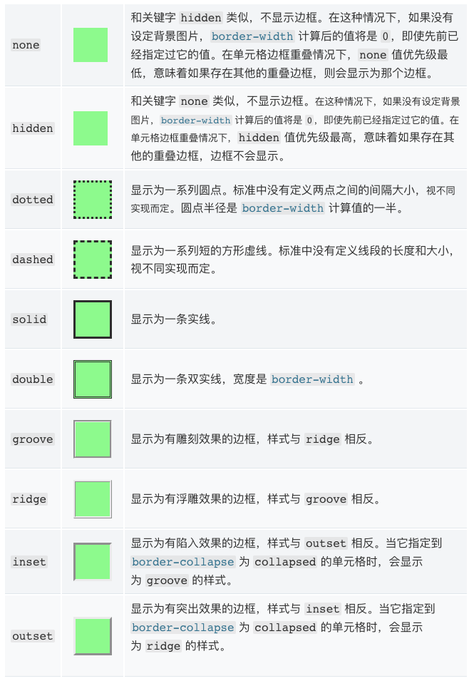
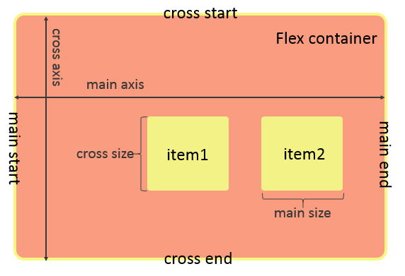

# 语义化标签与页面布局

在html5之前,html通常使用无意义的`div`标签构造结构,然后使用css对不同class的div标签做样式声明.而现在,html5更加强调语义化标签.加上css3的flex布局模式,前端项目可以更好的适应多平台.

**本节的代码在[C1-S2](https://github.com/TutorialForJavascript/frontend-basic/tree/master/code/C1/S2)中**

## 为什么要使用语义化标签

1. 为了在没有CSS的情况下页面也能呈现出很好地内容结构,代码结构
2. 提升用户体验,例如title、alt用于解释名词或解释图片信息,label标签的活用
3. 有利于SEO,可以和搜索引擎建立良好沟通,有助于爬虫抓取更多的有效信息,爬虫依赖于标签来确定上下文和各个关键字的权重
4. 方便其他设备解析(如屏幕阅读器,盲人阅读器,移动设备)以意义的方式来渲染网页
5. 代码优雅便于团队开发和维护.语义化更具可读性,是下一步吧网页的重要动向,遵循W3C标准的团队都遵循这个标准,可以减少差异化

## 如何做到尽量语义化

1. 尽可能少的使用无语义的标签`div`和`span`.在html5之前我们都是用div配合css来操作页面样式的,到了现在很多前端样式框架也是这个风格.我们应该尽量将其改为语义化标签.
2. 在语义不明显时,即可以使用`div`或者`p`时,尽量用`p`,因为`p`在默认情况下有上下间距,对兼容特殊终端有利
3. 不要使用纯样式标签,如:`b`,`font`,`u`等，改用css设置.需要强调的文本,可以包含在`strong`或者`em`标签中(浏览器预设样式,能用CSS指定就不用他们),`strong`默认样式是加粗(不要用b),`em`是斜体(不用i)
4. 使用表格时,标题要用`caption`,表头用`thead`,主体部分用`tbody`包围，尾部用`tfoot`包围.表头和一般单元格要区分开,表头用`th`,单元格用td;
5. 表单域要用`fieldset`标签包起来,并用`legend`标签说明表单的用途;
6. 每个`input`标签对应的说明文本都需要使用`label`标签,并且通过为`input`设置`id`属性,在`lable`标签中设置`for=someld`来让说明文本和相对应的`input`关联起来。

## 语义化布局的语义化标签

即便是有了语义化标签,布局依然是css的工作,但有了语义化标签,那么描述起来就会方便许多.我们可以使用css3中的[Flex布局](http://www.runoob.com/css3/css3-flexbox.html)实现符合语义的布局.
下图是常见语义化标签的布局位置.


标签|说明
---|---
article|定义文章
aside|定义文章的侧边栏
figure|一组媒体对象以及文字
figcaption|定义 figure 的标题
footer|定义页脚
header|定义页眉
hgroup|定义对网页标题的组合
nav|定义导航
section|定义文档中的区段
time|定义日期和时间
dialog|定义一个对话框
header|定义文章顶部

## css的盒子模型

在讲flex布局前我们先来了解下css的盒子模型.

所有HTML元素可以看作盒子,在CSS中,`box model`这一术语是用来设计和布局时使用.

CSS盒模型本质上是一个盒子,封装周围的HTML元素,它包括:边距,边框,填充,和实际内容.

盒模型允许我们在其它元素和周围元素边框之间的空间放置元素.

下面的图片说明了盒子模型(Box Model):


### Margin(外边距)


清除边框外的区域,外边距是透明的.使用的属性为`margin`,其形式语法: `[ <length> | <percentage> | auto ]{1,4}`它接受1~4个可选参数,每个参数用空格隔开.

+ 当只有一个值时,这个值会被指定给全部的四个边.
+ 当两个值时,第一个值被匹配给`上`和`下`,第二个值被匹配给`左`和`右`.
+ 当三个值时,第一个值被匹配给`上`,第二个值被匹配给`左`和`右`, 第三个值被匹配给`下`.
+ 当四个值时,会依次按`上`,`右`,`下`,`左`的顺序匹配(即顺时针顺序)

每个参数可以选择的值有3种:
+ `<length>`指定一个固定的宽度,可以为负数.通常使用单位`px`即像素
+ `<percentage>`相对于该元素的包含块的宽度(相对于该块的百分比).该值可以为负数.
+ `auto`浏览器会自动选择一个合适的margin来应用.它可以用于将一个块居中.

### `Border`(边框)

围绕在内边距和内容外的边框.我们可以定义边框的颜色,形状,粗细,阴影,角的弧度,甚至使用渐变或者图片构造边框.

#### 形状`border-style`

要使用边框必须要指定边框的样式,css支持的样式有:



`border-style`等价于四个角的弧度定义的简写形式即:`border-top-style`,`border-right-style`,`border-left-style`,`border-bottom-style`.

`border-style`其形式语法为:

```bash
<line-style>{1,4}
where 
<line-style> = none | hidden | dotted | dashed | solid | double | groove | ridge | inset | outset
```

即也是允许1到4个值,每个位置取值范围就在枚举`none | hidden | dotted | dashed | solid | double | groove | ridge | inset | outset`中

+ 当只有一个值时,这个值会被指定给全部的四个边.
+ 当两个值时,第一个值指定横线,第二个指定竖线.
+ 当三个值时,第一个值为`上`,第二个值被匹配给`左`和`右`的边, 第三个值被匹配给`下`.
+ 当四个值时,会依次按`上`,`右`,`下`,`左`的顺序匹配(即顺时针顺序)

#### 粗细`border-width`

要使用边框必须要指定边框的粗细,

`border-width`等价于四个角的弧度定义的简写形式即:`border-top-width`,`border-right-width`,`border-left-width`,`border-bottom-width`.

`border-width`设定边框的粗细有三种指定方式:

1. 固定粗细

    这时候可以使用1至4个值来定义四边的粗细,每一位的值通常使用px即像素来作为单位:

    + 当只有一个值时,这个值会被指定给全部的四个边.
    + 当两个值时,第一个值指定横线,第二个指定竖线.
    + 当三个值时,第一个值为`上`,第二个值被匹配给`左`和`右`的边, 第三个值被匹配给`下`.
    + 当四个值时,会依次按`上`,`右`,`下`,`左`的顺序匹配(即顺时针顺序)

2. 使用全局关键字

    全局关键字不是所有浏览器都支持,不建议使用,在mozilla的教程中,全局关键字包括3个`inherit(继承父元素的)`,`initial(初始值)`,`unset(不设置)`.此处不多介绍,不建议用.

3. 使用预设粗细关键字

    此时只可以有一个值,为`thin | medium | thick`中的一个.

值|含义
---|---
thin | 细边线
medium | 中等边线
thick | 粗边线


#### 角弧度`border-radius`

`border-radius`允许你设置元素的外边框圆角.当使用一个半径时确定一个圆形,当使用两个半径时确定一个椭圆.这个(椭)圆与边框的交集形成圆角效果.

`border-radius`等价于四个角的弧度定义的简写形式即:`border-top-left-radius`,`border-top-right-radius`,`border-bottom-right-radius`,`border-bottom-left-radius`.

我们当然可以单独定义各个角的弧度,但个人更喜欢直接使用`border-radius`定义全部.

其形式语法为:

```bash
<length-percentage>{1,4} [ / <length-percentage>{1,4} ]?
where
<length-percentage> = <length> | <percentage>
```

它可以有1至4个值:

+ 当只有一个值时,表示边框四角的圆角半径
+ 当两个值时,第一位表示`左上和右下`,第二位表示`左下和右上`
+ 当三个值时,`左上`,`右上和左下`,`右下`
+ 当四个值时,会依次按`左上`,`右上`,`右下`,`左下`的顺序匹配(即顺时针顺序)

每一位可以取两种值

+ `<length>`指定一个固定的半径或用`/`分隔的两个值分别为半长轴和半短轴.不可以为负数.通常使用单位`px`即像素
+ `<percentage>`使用百分比表示半径或半长轴半短轴的长度.水平半轴相对于盒模型的宽度；垂直半轴相对于盒模型的高度.

#### 颜色`border-color`

css中表示颜色的常见方式有3种:

+ 使用16进制表示RGB色代码,形式为`#<red:hex><green:hex><blue:hex>`
+ 使用预定义的颜色枚举,如`red`,`green`,具体有哪些可以查看[w3c上的表格](http://www.w3school.com.cn/cssref/css_colornames.asp)
+ 使用rgba颜色,其语法为`rgba(red:int, green:int, blue:int, alpha:float)`,`alpha`参数是介于`0.0`(完全透明)与`1.0`(完全不透明)的数字

`border-color`等价于四个角的弧度定义的简写形式即:`border-top-color`,`border-right-color`,`border-left-color`,`border-bottom-color`.

使用`border-color`定义边框颜色有两种用法:

1. 固定颜色

    这时候可以使用1至4个值来定义四边的颜色:

    + 当只有一个值时,这个值会被指定给全部的四个边.
    + 当两个值时,第一个值指定横线,第二个指定竖线.
    + 当三个值时,第一个值为`上`,第二个值被匹配给`左`和`右`的边, 第三个值被匹配给`下`.
    + 当四个值时,会依次按`上`,`右`,`下`,`左`的顺序匹配(即顺时针顺序)

2. 使用全局关键字
    全局关键字不是所有浏览器都支持,不建议使用,颜色可以使用的全局关键字有`inherit(继承父元素的)`

#### 阴影`box-shadow`和`-webkit-box-shadow`

该属性可以让几乎所有元素的边框产生阴影.如果元素同时设置了`border-radius`即角弧度,阴影也会有圆角效果.

其形式语法为:

```bash
none | [inset? && [ <offset-x> <offset-y> <blur-radius>? <spread-radius>? <color>? ] ]#
```

他有两种用法:

1. 固定的阴影形式

    这时使用2至5个参数,
    + 当只有两个值时,第一个为x偏移量,第二个为y偏移量
    + 当三个值时,第一个为x偏移量,第二个为y偏移量,第三个值如果是颜色信息则是阴影颜色,如果是`1px`这样的长度数据,则表示阴影的模糊半径
    + 当四个值时,第一个为x偏移量,第二个为y偏移量,第三个阴影的模糊半径,第四个值如果是颜色信息则是阴影颜色,如果是`1px`这样的长度数据,则表示阴影扩散半径
    + 当五个值时,第一个为x偏移量,第二个为y偏移量,第三个阴影的模糊半径,第四个表示阴影扩散半径,第五个值表示阴影颜色

2. 使用全局关键字

    全局关键字不是所有浏览器都支持,不建议使用,在mozilla的教程中,全局关键字包括3个`inherit(继承父元素的)`,`initial(初始值)`,`unset(不设置)`.此处不多介绍,不建议用.

#### 使用图片构造边框`border-image`

`border-image`属性允许在元素的边框上绘制图像.这使得绘制复杂的外观组件更加简单,也不用在某些情况下使用九宫格了.
使用`border-image`时,其将会替换掉`border-style`属性所设置的边框样式.

`border-image`属性是如下子属性的简写.

+ `border-image-source`边框图像资源,可以是
    + `url(xxxx)`表示图片源文件位置
    + `repeating-linear-gradient(angle, side-or-corner, color-stop...)`定义重读渐变

属性|描述
---|---
`angle`|定义渐变的角度方向.从`0deg`到`360deg`,默认为`180deg`.
`side-or-corner`|指定线性渐变的起始位置.由两个关键字组成:第一个为指定水平位置(`left`或`right`),第二个为指定垂直位置(`top`或`bottom`).顺序是随意的,每个关键字都是可选的.
`color-stop1, color-stop2,...`|指定渐变的起止颜色,由颜色值,停止位置(可选,使用百分比指定)组成.也或者使用`transparent`表示透明化

    + `linear-gradient(direction, color-stop1, color-stop2, ...)`定义线性渐变

属性|描述
---|---
`direction`|定义渐变的角度方向,由两个关键字组成:第一个为指定水平位置(`left`或`right`),第二个为指定垂直位置(`top`或`bottom`)
`color-stop1, color-stop2,...`|用于指定渐变的起止颜色

    + `radial-gradient(shape size at position, start-color, ..., last-color)`定义径向渐变

        属性:
        + `shape`确定圆的类型:
            + `ellipse`(默认):指定椭圆形的径向渐变;
            + `circle`:指定圆形的径向渐变
        + `size`定义渐变的大小,可能值:
            + `farthest-corner`(默认):指定径向渐变的半径长度为从圆心到离圆心最远的角
            + `closest-side`:指定径向渐变的半径长度为从圆心到离圆心最近的边
            + `closest-corner`:指定径向渐变的半径长度为从圆心到离圆心最近的角
            + `farthest-side`:指定径向渐变的半径长度为从圆心到离圆心最远的边
        + `position`定义渐变的位置.可能值:
            + center(默认):设置中间为径向渐变圆心的纵坐标值
            + top:设置顶部为径向渐变圆心的纵坐标值
            + bottom:设置底部为径向渐变圆心的纵坐标值
        + `start-color, ..., last-color`用于指定渐变的起止颜色.

+ `border-image-slice`通过`border-image-source`引用边框图片后,`border-image-slice`属性会将图片使用四条切片线分割为9个区域:

    + 四个角
    + 四个边
    + 中心区域

    这条切线它们各自的侧面设置给定距离,控制区域的大小.
    

    上图说明了每个区域的位置.
    + 区域1-4为角区域(corner region).每一个都用一次来形成最终边界图像的角点.
    + 区域5-8边区域(edge region).在最终的边框图像中重复,缩放或修改它们以匹配元素的尺寸.
    + 区域9为中心区域(middle region).它在默认情况下会被丢弃,但如果设置了关键字fill,则会将其用作背景图像.
    中间的区域9将不会被边框使用,但当设置有`fill`关键词时将会被作为`background-image`.这个关键词可以被设置在属性的任何一个位.

    `border-image-slice`可以取1到4个值,取值可以是百分比或者数字.

    + 当只有一个值时,这个值会被指定给全部的四个切线.
    + 当两个值时,第一个值指定`垂直方向`,第二个指定`水平方向`
    + 当三个值时,第一个值为`顶部`,第二个值被匹配给`垂直方向`, 第三个值被匹配给`底部`.
    + 当四个值时,会依次按`上`,`右`,`下`,`左`的顺序匹配(即顺时针顺序)

+ `border-image-width`边框图像的宽度,可以是百分比或者长度.
+ `border-image-outset`边框图像可超出边框盒的大小,取值可以是长度或者百分比
+ `border-image-repeat`用于定义边框图像的填充方式,取值范围为枚举:
    + `stretch`拉伸图片以填充边框
    + `repeat`平铺图片以填充边框
    + `round`平铺图像.当不能整数次平铺时,根据情况放大或缩小图像.
    + `space`平铺图像.当不能整数次平铺时,会用空白间隙填充在图像周围(不会放大或缩小图像)
    中的一个,


定义`border-image`属性时其形式语法为:

```bash
<'border-image-source'> || <'border-image-slice'> [ / <'border-image-width'> | / <'border-image-width'>? / <'border-image-outset'> ]? || <'border-image-repeat'>
```

当然如果要使用图片作为边框的话定义还是比较复杂的,建议直接以`border-image-source`这样的子属性定义.

***需要注意使用`border-image`必须要先定义`border`,即便其定义会被遮盖掉.***

### `Padding`(内边距)

清除内容周围的区域,内边距是透明的.


`padding`等价于四个边的的内边距的简写,即

+ `padding-bottom`
+ `padding-left`
+ `padding-right`
+ `padding-top`

`padding`其形式语法为:

```bash
[ <length> | <percentage> ] && [ border-box | content-box ]? | available | min-content | max-content | fit-content | auto
```

即有两种用法:

1. 固定长度

即允许1到4个值,每个位置取值可以是长度或者百分比或者使用`auto`.

+ 当只有一个值时,这个值会被指定给全部的四个边.
+ 当两个值时,第一个值指定横线,第二个指定竖线.
+ 当三个值时,第一个值为`上`,第二个值被匹配给`左`和`右`的边, 第三个值被匹配给`下`.
+ 当四个值时,会依次按`上`,`右`,`下`,`左`的顺序匹配(即顺时针顺序)
  
2. 使用预设的关键字

    此时只可以有一个值,为`border-box|content-box|max-content|min-content|available|fit-content|auto`中的一个.

值|含义
---|---
`border-box`|如出现,之前的值应用到元素的边框盒子.
`content-box`|如出现,之前的值应用到元素的内容盒子.
`max-content`|固有的首选宽度.
`min-content`|固有的最小宽度.
`available`|包含块的宽度减去水平margin,border和padding
`fit-content`|以下两种情况下的较大值:固有的最小宽度;固有首选宽度(max-content)和可用宽度(available)的较小值
`auto`|浏览器将会为指定的元素计算并选择一个宽度

### `Content`(内容)

盒子的内容,显示文本和图像.

主要的属性有:

+ `width`定义宽度
+ `max-width`定义最大宽度,`width`不可以大于这个值
+ `min-width`定义最小宽度,`width`不可以小于这个值
+ `height`定义高度
+ `max-height`定义最大高度,`height`不可以大于这个值
+ `min-height`定义最小高度,`height`不可以小于这个值
+ `background`定义[元素内背景](https://developer.mozilla.org/zh-CN/docs/Web/CSS/background)
+ `color`定义元素内文本颜色

## flex布局

既然有了盒子模型,那所谓的布局也就是如何摆箱子的问题了.

[flex](https://developer.mozilla.org/zh-CN/docs/Web/CSS/CSS_Flexible_Box_Layout)(flexible box:弹性布局盒模型),是2009年w3c提出的一种可以简洁,快速弹性布局的属性.主要思想是给予容器控制内部元素高度和宽度的能力.其中在webkit内核的浏览器中使用时,必须加上`-webkit-`前缀.

使用flex布局的容器(flex container),它内部的元素自动成为flex项目(flex item).容器拥有两根隐形的轴--水平的主轴(main axis),和竖直的交叉轴(cross axis).

主轴开始的位置,即主轴与右边框的交点,称为`main start`;主轴结束的位置称为`main end`;交叉轴开始的位置称为`cross start`;交叉轴(侧轴)结束的位置称为`cross end`.item按主轴或交叉轴排列,
item在主轴方向上占据的宽度称为`main size`,在交叉轴方向上占据的宽度称为`cross size`.



此外，需注意使用flex容器内元素,即`flex item`的`float`，`clear`、`vertical-align`属性将失效.

### 弹性容器(Flex container)

包含着弹性项目的父元素.通过设置`display`属性的值为`flex`或`inline-flex`来定义弹性容器.

在一个标签称为弹性容器后,我们可以为其设置一些元素来定义在这个弹性容器中的布局方式.比如排列方向,换行行为,对齐方式等.

一个典型的弹性容器这样定义:

```css
.flex-container{
    display: flex;
}
```

**属性**:

+ `display`
    可选的值有:
    + `flex`使弹性容器成为块级元素
    + `inline-flex`使弹性容器成为单个不可分的行内级元素
    + `-webkit-flex`webkit使用的`flex`,意义同`flex`
    + `-webkit-inline-flex`webkit使用的`inline-flex`,意义同`inline-flex`

+ `inline-flex`和`-webkit-inline-flex`描述容器中的元素的排列方式
    可选的值有:
    + `row`从左向右横向排列(默认)
    + `row-reverse`从右向左横向排列
    + `column`从上到下纵向排列
    + `column-reverse`从下向上纵向排列

+ `flex-wrap`和`-webkit-flex-wrap`描述当当在一条线上排不下后的换行行为,假设我们有12个元素,但一行只能放下10个了
    可选的值有:
    + `nowrap` 不换行(默认)
    ```bash
    1,2,3,4,5,6,7,8,9,10
    ```
    + `wrap` 换行,另起的行与原来行一致
    ```bash
    1,2,3,4,5,6,7,8,9,10
    11,12
    ```
    + `wrap-reverse`换行,第一行在下方
    ```bash
    11,12
    1,2,3,4,5,6,7,8,9,10
    ```

+ `flex-flow` `flex-direction`属性和`flex-wrap`属性的简写形式,格式为`flex-flow: <flex-direction> <flex-wrap>;`默认值为`row nowrap`

+ `justify-content`项目在主轴上的对齐方式

    可选的值有:
    + `flex-start`左对齐(默认值)
    + `flex-end`右对齐
    + `center`居中
    + `space-between`两端对齐,项目之间的间隔相等
    + `space-around`每个项目两侧的间隔相等.所以,项目之间的间隔比项目与边框的间隔大一倍

+ `align-items`项目在交叉轴上的对齐方式

    可选的值有:
    + `flex-start` 交叉轴的起点(顶部)对齐
    + `flex-end` 交叉轴的终点(底部)对齐
    + `center` 交叉轴的中点对齐
    + `baseline` 项目的第一行文字的基线对齐
    + `stretch` 如果项目未设置高度属性或设为`auto`,将占满整个容器的高度(默认)

+ `align-content`定义了多根轴线的对齐方式,如果项目只有一根轴线,该属性不起作用。
    可选的值有:
    + `flex-start`与主轴,交叉轴的起点对齐
    + `flex-end`与主轴的起点,交叉轴的终点对齐
    + `center`与主轴和交叉轴的中点对齐
    + `space-between`拉伸元素,与主轴和交叉轴两端对齐,轴线之间的间隔平均分布
    + `space-around`每根轴线两侧的间隔都相等.所以,轴线之间的间隔比轴线与边框的间隔大一倍.
    + `stretch`轴线占满整个交叉轴(默认)

### 弹性项目(Flex item)

弹性容器的每个子元素都称为弹性项目.弹性容器直接包含的文本将被包覆成匿名弹性单元.

每个弹性项目可以有的属性有:

+ `order`
+ `flex-grow`定义弹性盒子项(flex item)的拉伸因子.其值是数值,默认值是0.
    增加的宽度计算公式为:
    $$
    WIncrease_i = {{g_i} / {\sum g_i}} \times (W_container - \sum W_i)
    $$

    最终宽度计算公式为

    $$
    WFinal_i = \sum W_i /count(i) + WIncrease_i
    $$

    例:如果为四个`flex item`分别设置`flex-grow`为`0,1,3,1`那么:
    `flex container`的宽度 $$W_container$$ 是`600px`,四个`flex item`的宽度和 $$\sum W_i$$ 是`400px`,所以还有`200px`的未占用空间.

flex item|增加的宽度|最终宽度
---|---|---
A|0/(0+1+3+1) * 200px = 0px|100 + 0 = 100px
B|1/(0+1+3+1) * 200px = 40px|100 + 40 = 140px
C|3/(0+1+3+1) * 200px = 120px|100 + 120 = 220px
D|1/(0+1+3+1) * 200px = 40px|100 + 40 = 140px

+ `flex-shrink`定义了`flex items`的收缩规则.取值是数值,默认值是1,当`flex items`的宽度和大于`flex container`的宽度时,用此属性来收缩`flex item`的宽度.

+ `flex-basis`取值是长度值,默认值是auto.指定了`flex items`在主轴方向上的初始大小.如果不使用`box-sizing`来改变盒模型的话,那么这个属性就决定了`flex items`的内容盒(`content-box`)的宽或者高(取决于主轴的方向)的尺寸大小.
    前面介绍的`flex-grow`和`flex-shrink`都是基本`flex item`的宽度值(`width`)来计算的,如果`flex item`设置了`flex-basis`属性,那么会直接忽略`flex item`的宽度,来基于此属性设置的长度值计算.

+ `align-self`控制`flex items`的分布行为.具体的:

`flex-direction`的值|`align-items`的使用场景
---|---
`row`|当`flex items`的高度和小于`flex container`的高度时,控制`flex items`在`cross axis`上如何分布
`column`|当`flex items`的宽度和小于`flex container`的宽度时,控制`flex items`在`cross axis`上如何分布

    可以取值为:
    + `stretch`(默认值)弹性元素被在侧轴方向被拉伸到与容器相同的高度或宽度.

    + `flex-start`元素向侧轴起点对齐

    + `flex-end`元素向侧轴终点对齐

    + `center`元素在侧轴居中.如果元素在侧轴上的高度高于其容器,那么在两个方向上溢出距离相同.
