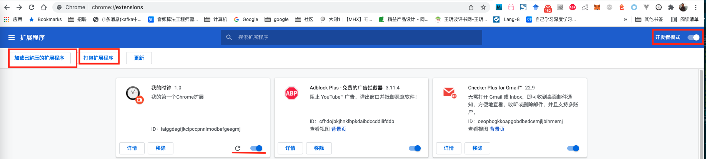
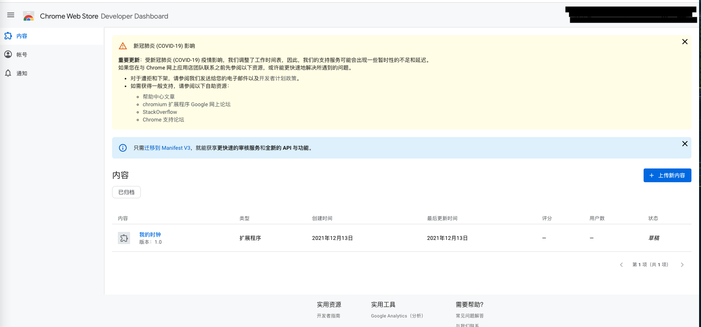
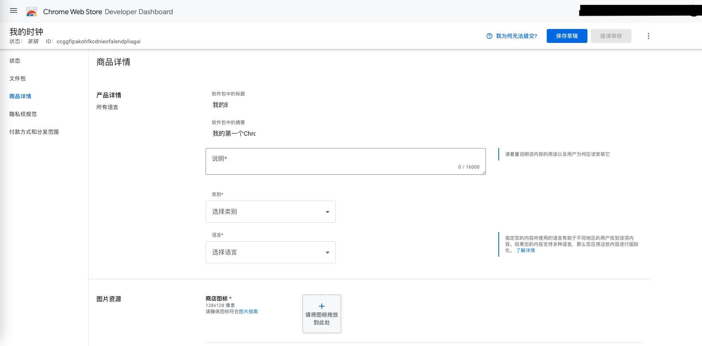

# Chrome扩展

Chrome是当今最流行的浏览器,而其可定制性也非常强,一些软件也依附于其上形成了一个生态.比如google自家的office套件就有chrome应用版本,像eth的钱包metamask也是一个chrome扩展.

Chrome的扩展基本上是web应用的延伸,完全兼容html5,因此开发成本相对很小--只要和web版本一起开发稍微改改就可以了;它也有一些独特的api和交互特性.许多服务在做好web版本后会"顺便"再做一份chrome扩展.

本系列文章将介绍Chrome扩展的基本概念并结合例子介绍不同类型的chrome该怎么构造.

## Chrome扩展的官方分类

Chrome将其平台上的程序分为扩展与应用,并且使用了同样的文件结构,那么两者的区别是什么呢?
在早期的Chrome版本中两者的区别非常模糊,而且有些扩展也可以用应用实现,反之亦然.
但今天看来Google正在努力使两者的界限变得清晰.现如今新应用已经不再允许进入官方市场,只能专供`chromeOs`.
这极大地限制了应用的使用范围.

本文将只介绍Chrome扩展,毕竟通常没啥人会用`ChromeOS`.

## Chrome扩展的开发模式

chrome扩展的基本开发模式是一个包含`manifest.json`的文件夹.而这个`manifest.json`就是这个扩展的配置文件(目前的最新版本是[Manifest V3](https://developer.chrome.com/docs/extensions/develop/migrate/what-is-mv3?hl=zh-cn)),其基本形式如下:

```json
{
  // Required
  "manifest_version": 3,
  "name": "My Extension",
  "version": "versionString",

  // Recommended
  "action": {...},
  "default_locale": "en",
  "description": "A plain text description",
  "icons": {...},

  // Optional
  "author": ...,
  "automation": ...,
  "background": {
    // Required
    "service_worker": "background.js",
    // Optional
    "type": ...
  },
  "chrome_settings_overrides": {...},
  "chrome_url_overrides": {...},
  "commands": {...},
  "content_capabilities": ...,
  "content_scripts": [{...}],
  "content_security_policy": {...},
  "converted_from_user_script": ...,
  "cross_origin_embedder_policy": {"value": "require-corp"},
  "cross_origin_opener_policy": {"value": "same-origin"},
  "current_locale": ...,
  "declarative_net_request": ...,
  "devtools_page": "devtools.html",
  "differential_fingerprint": ...,
  "event_rules": [{...}],
  "externally_connectable": {
    "matches": ["*://*.example.com/*"]
  },
  "file_browser_handlers": [...],
  "file_system_provider_capabilities": {
    "configurable": true,
    "multiple_mounts": true,
    "source": "network"
  },
  "homepage_url": "https://path/to/homepage",
  "host_permissions": [...],
  "import": [{"id": "aaaaaaaaaaaaaaaaaaaaaaaaaaaaaaaa"}],
  "incognito": "spanning, split, or not_allowed",
  "input_components": ...,
  "key": "publicKey",
  "minimum_chrome_version": "versionString",
  "nacl_modules": [...],
  "natively_connectable": ...,
  "oauth2": ...,
  "offline_enabled": true,
  "omnibox": {
    "keyword": "aString"
  },
  "optional_permissions": ["tabs"],
  "options_page": "options.html",
  "options_ui": {
    "chrome_style": true,
    "page": "options.html"
  },
  "permissions": ["tabs"],
  "platforms": ...,
  "replacement_web_app": ...,
  "requirements": {...},
  "sandbox": [...],
  "short_name": "Short Name",
  "storage": {
    "managed_schema": "schema.json"
  },
  "system_indicator": ...,
  "tts_engine": {...},
  "update_url": "https://path/to/updateInfo.xml",
  "version_name": "aString",
  "web_accessible_resources": [...]
}
```

其中比较常用的有

+ `manifest_version`定义使用的配置协议版本
+ `icons`定义插件使用的图标
+ `action`定义在浏览器右上角扩展列中点击扩展图标后的行为.
+ `background`定义后台执行的脚本位置
+ `permissions`定义应用要申请的执行权限
+ `storage`定义本地存储声明

其他全部的配置项说明可以查看官方的[插件api文档](https://developer.chrome.com/docs/extensions/mv3/manifest/),其中比较常用的配置我们会用到时进行介绍.

需要注意这个`manifest.json`配置文件和webapp的清单并不一样,不要混淆.

## 一个helloworld

依然是一个惯例的helloworld开始我们的介绍.这个项目在[chrome-ext-my_clock分支](https://github.com/hsz1273327/TutorialForFront-EndWeb/tree/chrome-ext-my_clock)上.这个扩展的功能是在点击右上角扩展图标后会展示当前时间并实时刷新.

其中的内容包括如下:

+ `package.json`,项目设置文件

    ```json
    {
      "name": "my_clock",
      "version": "1.0.0",
      "description": "一个简单的时钟插件",
      "main": "index.js",
      "scripts": {
        "build": "node_modules/.bin/tsc",
        "test": "echo \"Error: no test specified\" && exit 1"
      },
      "author": "hsz",
      "license": "GPL-3.0",
      "devDependencies": {
        "typescript": "^5.6.2"
      }
    }
    ```

+ `tsconfig.json`,typescript编译配置文件

    ```json
    {
        "compilerOptions": {
            "module": "system",
            "noImplicitAny": true,
            "removeComments": true,
            "preserveConstEnums": true,
            "outDir": "./app/js",
            "sourceMap": true
        },
        "include": [ "src/*" ]
    }
    ```

    我们将源文件放在`src`文件夹下,编译后的目标文件夹放在`app/js`

+ `app/manifest.json`,配置文件,配置了这个插件的基本信息和使用的页面,其中`action->default_popup`指定了点击扩展图标后弹出的页面

    ```json
    {
        "manifest_version": 3,
        "name": "我的时钟",
        "version": "1.0",
        "description": "我的第一个Chrome扩展",
        "icons": {
            "16": "images/icon16.png",
            "19": "images/icon19.png",
            "38": "images/icon38.png",
            "48": "images/icon48.png",
            "128": "images/icon128.png"
        },
        "action": {
            "default_icon": {
                "19": "images/icon19.png",
                "38": "images/icon38.png"
            },
            "default_title": "我的时钟",
            "default_popup": "popup.html"
        }
    }
    ```

+ `app/popup.html`定义了弹出页面的内容

    ```html
    <html>
    <head>
    <link rel="stylesheet" href="style.css" type="text/css"></link>
    </head>
    <body>
    <div id="clock_div"></div>
    <script src="js/my_clock.js"></script>
    </body>
    </html>
    ```

+ `app/style.css`定义了弹出页面的基本样式

    ```css
    * {
        margin: 0;
        padding: 0;
    }

    body {
        width: 200px;
        height: 100px;
    }

    div {
        line-height: 100px;
        font-size: 42px;
        text-align: center;
    }
    ```

+ `src/my_clock.ts`定义了页面的执行逻辑,其源码的ts内容为

    ```ts
    function my_clock(el: HTMLElement) {
        const today = new Date()
        const h = today.getHours()
        const m = today.getMinutes()
        const s = today.getSeconds()

        const hours = h.toString()
        const minutes = m >= 10 ? m.toString() : ('0' + m.toString())
        const secondes = s >= 10 ? s.toString() : ('0' + s.toString())
        el.innerHTML = h + ":" + m + ":" + s
        setTimeout(() => my_clock(el), 1000)
    }

    const clock_div = document.getElementById('clock_div')
    if (clock_div) {
        my_clock(clock_div)
    }
    ```

    之后调用`npm run build`编译js代码到目标文件夹

## 插件的生命周期

插件被安装到浏览器后就已经存在,但根据其生命周期可以分为:

+ `background生命周期`,表现为打开浏览器插件就已经加载好,这个由`manifest.json`中的`background`字段

    ```js
    "background": {
        "scripts": [
            "background.js"
        ]
    }
    ```

    这个指定的后台运行脚本即`Extension Service Worker`是html中service worker(`Web Service Worker`)的扩展.`Extension Service Worker`在需要时加载,并在其进入休眠状态时取消加载.只要`Extension Service Worker`在加载后还会主动接收事件它就会运行,而且它可以关闭.与对应的`Web Service Worker`一样,`Extension Service Worker`也无法访问DOM,不过我们可以使用document接口下不用展示的接口,比如`document.createElement("audio")`.

    `Extension Service Worker`不只是网络代理.除了标准`Web Service Worker`事件之外,它们还会响应扩展程序事件,例如导航到新页面,点击通知或关闭标签页.它们的注册和更新方式也与`Web Service Worker`不同.`Extension Service Worker`可以和当前插件域下的所有线程通信,同时也可以调用浏览器的开放的大量接口

+ `content_scripts生命周期`,即设定`content_scripts`字段的插件,这类插件仅会在访问到`content_scripts`中匹配的网页时激活对应的js脚本执行
+ `popup生命周期`,即设置`browser_action.default_popup`的插件.这种插件基本全靠点击扩展界面的popup弹出的小窗口实现逻辑

需要注意这3种生命周期并不是非此即彼的,而是相互独立可以同时存在的.多数应用也往往是他们的融合

## 插件可以控制的交互要素

插件可以控制的交互要素总结下来有如下

+ `扩展图标`,表现形式为插件栏中显示的图标,这个由`manifest.json`中的`icons`字段指定,如果希望在运行时变更图标,也可以在`Extension Service Worker`中调用接口`chrome.browserAction.setIcon({ path: { '19': 'images/icon19_' + index + '.png' } })`来实现.

+ `扩展图标badge`,表现形式为插件栏中显示图标的右下角的区域,作用类似手机应用中的左上角红点,比如邮件应用就可以使用`badge`来显示未读邮件.可以在`Extension Service Worker`中通过`chrome.browserAction.setBadgeBackgroundColor({color: '#0000FF'})`设置`badge`的底色,通过`chrome.browserAction.setBadgeText({text: 'Dog'})`设置`badge`的文字内容

+ `扩展标题`,表现形式为在插件栏中悬停到插件图标上显示的内容,这个由`manifest.json`中的`name`字段指定,长度上限为75个字符,如果希望在运行时变更图标,也可以在`Extension Service Worker`中调用接口`chrome.browserAction.setTitle({title: 'This is a new title'})`来实现.

+ `扩展界面popup`,表现形式为点击插件后弹出的ui界面,本质上就是一个html文件,可以理解为点击图标就打开了一个本地的webapp.`popup`通过在`manifest.json`中的`browser_action.default_popup`字段指定html文件位置来实现.这也是vue可以派上用场的地方.

+ `options_page`,表现在插件栏中右键点击扩展图标后点击弹出菜单中的`选项`时跳转到的页面,这个页面一般是用来配置扩展的,也是vue可以派上用场的地方.

+ `桌面提醒`,表现形式为浏览器弹出提醒框,本质上就是html中的`notifications`,要使用桌面提醒,必须在`manifest.json`中的`permissions`字段中设置`notifications`权限.接着在`Extension Service Worker`使用`chrome.notifications.create(notification)`创建并触发提醒.

+ `右键菜单`,表现形式为定义鼠标右键弹出菜单的修改.右键菜单可以定义一些全局页面工具,比如全页面图片下载呀啥的.右键菜单需要在`manifest.json`中的`permissions`字段中设置`contextMenus`权限才能作为交互要素,在`Extension Service Worker`中使用`chrome.contextMenus.create(setting)`进行设置

+ `commands`,表现形式为通过键盘上的按键组合激活特定的逻辑,我们通过`manifest.json`中的`commands`字段设置允许的组合对应的`command`,然后在`Extension Service Worker`中使用`chrome.commands.onCommand.addListener((command) => {...});`设置触发后的回调操作

+ `Omnibox`,表现形式为在地址栏输入关键字后激活对应交互.需要在`manifest.json`中的设置字段`omnibox.keyword`.然后在`Extension Service Worker`中通过`chrome.omnibox`对象实现对应功能

+ 默认标签页,书签页,历史页.表现为替换这些页面.这些位置可以在`manifest.json`中的`chrome_url_overrides`字段进行设置,

## 大致的插件分类

根据上面的生命周期和可控制的交互要素,我们大致可以将插件分为如下这些类型:

+ `background插件`,以`background生命周期`为核心构造的插件,最基础的形式是仅有一个`service worker`脚本,在它的基础上可以添加`popup`或`options_page`用于设置`service worker`的运行时参数.这类插件一般是为控制浏览器全局行为而生的,比如网络代理类插件一般都是这种

+ `content_scripts插件`,以`content_scripts生命周期`为核心构建的插件.最基础的形式是仅有一个`content_scripts`.这种一般是专门针对特定网站的魔改插件,在它的基础上可以添加`background生命周期`用于做网络代理,修改`扩展图标`,`扩展图标badge`,`扩展标题`,`桌面提醒`等,也可以做一些常驻操作;也可以添加`popup`来让用户快速访问目标站点的资源,`options_page`让用户可以设置扩展.这类插件一般是给特定网站做辅助用的,比如我建一个`xxx`网站提供基础服务,再做一个`xxx助手`这样的插件做大会员可用增值服务

+ `popup插件`,以`popup生命周期`为核心构造的插件.最基础的形式是仅有一个`popup`,在它的基础上可以添加`service worker`脚本用于做网络代理,修改`扩展图标`,`扩展图标badge`,`扩展标题`,`桌面提醒`等,也可以做一些常驻操作;也可以添加`options_page`让用户可以设置扩展,这是最常见的一类插件,专注于实现自己的功能,可以将其理解为一个入口为`popup`的常驻浏览器的webapp,我们的helloworld例子就是这类

+ `美化插件`,最基础的插件,能力为替换默认标签页,书签页,历史页的.不需要任何生命周期.,也可以放一个`service worker`提供一些网络服务

后续的部分我们也以这个分类来介绍如何构造插件.

## 调试方法

要调试可以按如下步骤操作:

1. 在chrome中选择`扩展程序=>管理扩展程序`(或者直接输入url<chrome://extensions/>)来进入插件管理界面.
2. 勾选`开发者模式`
3. 使用`加载已解压扩展程序`,选择项目根目录下有`manifest.json`的文件夹即可(例子中的`app`文件夹)



要重载只要在要调试的插件位置点击`重新加载`就可以,要调试页面也只要点击其中的`背景页`就可以当一般的前端调试了.

## 发布项目

要发布项目有几个前提

1. 首先你得拥有谷歌开发者账号,这个账号可以直接用谷歌邮箱申请.
2. 你的账号需要开通两步认证

当然了上面两步的前提都是你得能先翻墙出去.在完成了上面的前提设置后我们可以登录自己的[Chrome Web Store Developer Dashboard](https://chrome.google.com/webstore/devconsole/),在`内容->上传新内容`中上传zip压缩好的项目文件就可以创建一个应用的发布草稿.



我们在这个草稿中填写好相关的信息就可以提交审核申请了



一旦审核通过我们的应用就可以在chrome应用商店中被找到了

## 单独打包分发

并不是所有的开发者都能直接在chrome商店更新扩展的.如果没有条件使用chrome应用商店分发或者只是希望小范围内分发可以通过在chrome扩展页点击`打包扩展程序`,然后选中你的项目(根目录下有`manifest.json`的文件夹)然后点击`打包应用程序`就可以获得到一个以`.crx`结尾的文件和一个以`.pem`的文件.其中`.crx`就是扩展,`.pem`则是应用程序的签名.

***需要注意这样的扩展如果没有在应用商店中注册也是无法使用的***,因此这种方式更加适合一些已经注册过的扩展项目做小范围版本测试.

如果我们的这个插件没有注册也要进行分发,那就基本只能直接分发源码文件了.
