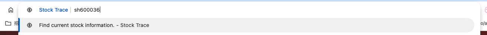
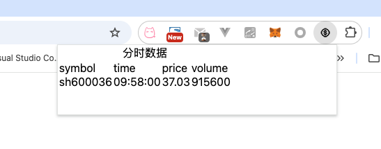
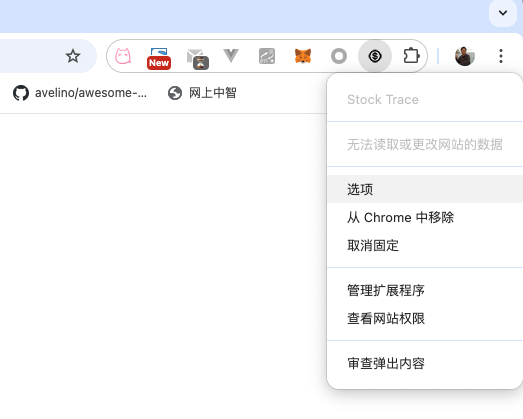
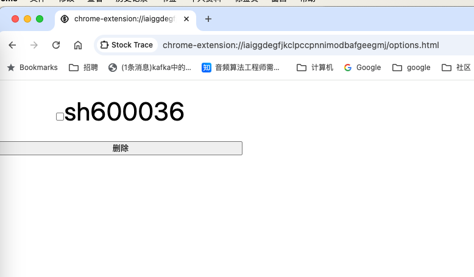

# background

接下来我们通过一个例子来简单看下后台服务型插件的形式有哪些.这个例子我们由浅入深,从一个纯后台插件开始一步一步扩展为一个有状态可配置的后台插件.这个例子在[chrome-ext-stock_trace分支](https://github.com/hsz1273327/TutorialForFront-EndWeb/tree/chrome-ext-stock_trace)

## 纯后台插件

这个纯后台插件我们就用一个查股票的功能来开始介绍.这个插件的核心是调用api,我们使用新浪财经作为数据源,这个数据源api为`https://finance.sina.com.cn/realstock/company/${symbol}/nc.shtml`

在这个纯后台版本中我们通过在地址栏中输入`stock`关键字加`空格`加`股票symbol`的形式触发插件执行,


在触发后会建一个tag跳转到对应页面.

一个纯后台插件通常只有一个后台脚本.这种插件的一般在manifest中只要声明后台脚本和使用的权限即可

+ `manifest.json`

    ```json
    {
        "manifest_version": 3,
        "name": "Stock Trace",
        "version": "1.0",
        "description": "查询股票",
        "background": {
            "service_worker": "js/background.js", // 后台service worker的位置
            "type": "module" //加载方式,固定为module
        },
        "icons": {
            "16": "images/icon16.png"
        },
        "omnibox": {
            "keyword": "stock" //定义关键字
        },
        "host_permissions": [
            "*://finance.sina.com.cn/*"
        ]
    }
    ```

    由于我们要访问外部网址,我们需要将这个网址的权限加入`host_permissions`

之后定义我们的`service worker`

+ `src/background.ts`

    ```ts
    function gotoSinaFinance(symbol: string) {
        chrome.tabs.create({ url: `https://finance.sina.com.cn/realstock/company/${symbol}/nc.shtml` })
    }

    chrome.omnibox.setDefaultSuggestion(
        {
            description: 'Find current stock information.'
        }
    )
    chrome.omnibox.onInputEntered.addListener(gotoSinaFinance)
    ```

其中`gotoSinaFinance`是我们的核心逻辑,其输入就是我们在`空格`后面的输入,我们监听`onInputEntered`这个事件,这个事件会在地址栏按了回车后被触发.

## 可展示状态的后台插件

继续扩展我们的插件,让它可以记录我们的查询过的symbol,并在插件图标的`badge`部分记录个数.


这需要用到插件的本地存储,并且要让图标可变,我们需要修改manifest.

+ `manifest.json`

    ```json
    {
        ...,
        "permissions": [
            "storage"
        ],
        "action": {
            "default_icon": {
                "16": "images/icon16.png"
            }
        }
    }
    ```

然后在`service worker`中定义行为

+ `src/background.ts`

    ```ts
    async function gotoSinaFinance(symbol: string): Promise<void> {
        await chrome.tabs.create({ url: `https://finance.sina.com.cn/realstock/company/${symbol}/nc.shtml` })
        const historySymbolsInStorage = await chrome.storage.local.get("history-symbols")
        let historySymbolsSet = new Set(historySymbolsInStorage["history-symbols"])
        historySymbolsSet.add(symbol)
        const historySymbols = Array.from(historySymbolsSet)
        await chrome.storage.local.set({
            "history-symbols": historySymbols
        })
        const historySymbolsCount = historySymbols.length
        await chrome.action.setBadgeText({ text: `${historySymbolsCount}` })
    }
    chrome.omnibox.setDefaultSuggestion(
        {
            description: 'Find current stock information.'
        }
    )
    chrome.omnibox.onInputEntered.addListener(gotoSinaFinance)
    ```

    我们将监听的回调函数改成了异步的,然后通过Set对历史symbol做去重,每次有symbol传进来后我们就刷新下存储中的历史记录.

当然为了让Promise,Set等es2015以后出现的特性被typescript能正常识别编译,我们还需要修改`tsconfig.json`

```json
{
    "compilerOptions": {
        ...,
        "lib": [
            "ES2015",
            "dom"
        ],
    },
    ...
}
```

## 使用popup展示和编辑注册过的symbol的分时数据

我们记录历史symbol自然是要用的,可以做一个popup界面,点击插件图标后打开展示历史symbol的当前分时数据.



分时数据的api是`https://vip.stock.finance.sina.com.cn/quotes_service/view/vML_DataList.php?asc=j&symbol=${symbol}&num={number}`,因此需要给`host_permissions`中添加上对应的地址匹配.popup也需要声明`action`的对应字段

+ `manifest.json`

    ```json
    {
        ...
        "host_permissions": [
            ...,
            "*://finance.sina.com.cn/*"
        ],
        ...
        "action": {
            "default_icon": {
                "16": "images/icon16.png"
            },
            "default_popup": "popup.html"
        }
        ...
    }
    ```

之后我们来构造这个popup页面

+ `popup.html`

    ```html
    <html>
        <head>
            <meta charset="UTF-8">
            <link rel="stylesheet" href="style.css" type="text/css"></link>
        </head>
        <body>
            <div id="popup_div"></div>
            <script src="js/popup.js"></script>
        </body>
    </html>
    ```

+ `src/popup.ts`

    ```ts
    async function main(el: HTMLElement) {
        // 构造表标题
        let table = document.createElement("table")
        let caption = table.createCaption()
        caption.innerText = "分时数据"
        //构造表头
        let thead = table.createTHead()
        let Cols = thead.insertRow()
        for (let coltxt of ["symbol", "time", "price", "volume"]) {
            let newCell = Cols.insertCell() 
            newCell.innerText = coltxt
        }
        // 插入数据
        const number = 1
        const historySymbolsInStorage = await chrome.storage.local.get("history-symbols")
        let historySymbolsSet: Set<string> = new Set(historySymbolsInStorage["history-symbols"])
        const historySymbols = Array.from(historySymbolsSet)
        for (let symbol of historySymbols) {
            const url = `https://vip.stock.finance.sina.com.cn/quotes_service/view/vML_DataList.php?asc=j&symbol=${symbol}&num=${number}`
            const res = await fetch(url)
            let content = await res.text()
            // 解析结果构造每行的数据
            content = content.replace("var minute_data_list = ", "").replace(/\[/g, "").replace(/\]/g, "").replace(/\;/g, "").replace(/\'/g, "")
            const row = content.split(",")
            const time = row[0]
            const price = row[1]
            const volume = row[2]
            const rowcontent = [symbol, time, price, volume]
            let newRow = table.insertRow()
            for (let content of rowcontent) {
                let newCell = newRow.insertCell()
                newCell.innerText = content
            }
        }
        el.appendChild(table)
    }

    const popup_div = document.getElementById('popup_div')
    if (popup_div) {
        main(popup_div)
    }
    ```

## 构造配置页配置分时数据请求的额外参数

那我们希望追踪的股票当然应该支持编辑,这个编辑操作可以在`popup页`做也可以在`配置页`做,我们就以在`配置页`做为例子演示如何通过配置页改变后台插件的行为.

要使用配置页我们一样需要先在`manifest`中声明,有两种表现形式

+ 完整配置页形式.打开的配置页会在一个新的tab中展示,对应的配置方式是
    + `manifest.json`

        ```json
        {
            ...
            "options_page": "options.html",
            ...
        }
         ```

        这种方式适合配置项多或长度不定的场景

+ 嵌入式配置页形式.打开的配置页会在当前tab中以弹窗的形式展示,对应的配置方式是

    + `manifest.json`

        ```json
        {
            ...
            "options_ui": {
                "page": "options.html",
                "open_in_tab": false
            },
            ...
        }
        ```

        这种方式适合配置项少的场景

这两种大体差不多,但还是有如下几个区别:

1. 大小,`完整配置页形式`是一个完整的页面,我们像处理正常html一样处理它就行,但`嵌入式配置页形式`是个弹窗,我们就必须根据内容自动确定大小.
2. API区别,`完整配置页形式`可以顺利的使用`Tabs API`,因此可以像别处一样的发送消息;但`嵌入式配置页形式`不能使用该接口,我们需要使用`runtime.connect()`和`runtime.sendMessage()`替代,同时系统将不设置使用该接口发消息不会有发件人的标签页信息,而是会设置发件人的网址是选项页面网址.
3. 指向选项页面的链接有区别,如果是`完整配置页形式`,我们可以在`popup`页面使用`chrome.runtime.openOptionsPage()`方式跳转到配置页,但`嵌入式配置页形式`不能,因此我们要跳转到配置页要像下面这样写.

    ```js
    if (chrome.runtime.openOptionsPage) {
        chrome.runtime.openOptionsPage();
    } else {
        window.open(chrome.runtime.getURL('options.html'));
    }
    ```

我们右键点击插件图标,然后点击`选项`就可以进入插件的配置页.



我们的配置页要做的是允许用户删除记录的股票symbol,因此写个简单的html将symbol作为多选框列出来,然后加个按钮可以执行批量删除即可



+ `options.html`

    ```html
    <html>
        <head>
            <meta charset="UTF-8">
            <link rel="stylesheet" href="style.css" type="text/css"></link>
        </head>
        <body>
            <div id="options_div"></div>
            <script src="js/options.js"></script>
        </body>
    </html>
    ```

+ `src/options.ts`

    ```typescript
    async function option_main(el: HTMLElement) {
        let form = document.createElement("form")
        // form.setAttribute()

        const historySymbolsInStorage = await chrome.storage.local.get("history-symbols")
        let historySymbolsSet: Set<string> = new Set(historySymbolsInStorage["history-symbols"])
        const historySymbols = Array.from(historySymbolsSet)
        let opts: HTMLInputElement[] = []
        for (let symbol of historySymbols) {
            let div = document.createElement("div")
            let opt = document.createElement("input")
            let label = document.createElement("label")
            opt.type = "checkbox"
            opt.value = symbol
            opt.id = symbol
            label.htmlFor=symbol
            label.textContent = symbol
            div.appendChild(opt)
            div.appendChild(label)
            form.appendChild(div)
            opts.push(opt)
        }
        let submit_button = document.createElement("button")
        submit_button.type = "button"
        submit_button.textContent = "删除"
        submit_button.addEventListener("click", async (evt: MouseEvent) => {
            console.log("clicked**************")
            for (let opt of opts) {
                if (opt.checked) {
                    console.log(`${opt.value} checked**************`)
                    historySymbolsSet.delete(opt.value)
                    opt.disabled = true
                }
            }
            const newhistorySymbols = Array.from(historySymbolsSet)
            await chrome.storage.local.set({
                "history-symbols": newhistorySymbols
            })
            console.log(`set storage ok`)
            const historySymbolsCount = newhistorySymbols.length
            await chrome.action.setBadgeText({ text: `${historySymbolsCount}` })
        })
        form.appendChild(submit_button)
        el.appendChild(form)
    }

    const options_div = document.getElementById('options_div')
    if (options_div) {
        option_main(options_div)
    }
    ```

这篇文章虽然是介绍后台插件的形式,实际我们已经将chrome插件的基本形式已经介绍了五分之三了.后续这部分主要是接收chrome提供的接口让我们可以知道chrome插件能力的边界.