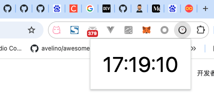

# popup

popup是我们最常能接触到的扩展部分,几乎所有插件都多少会搞个popup.,要么做用法说明,要么提供设置,要么直接作为操作界面.

我们从一个helloworld开始

## helloworld

依然是一个惯例的helloworld开始我们的介绍.这个项目在[chrome-ext-my_clock分支](https://github.com/hsz1273327/TutorialForFront-EndWeb/tree/chrome-ext-my_clock)上.这个扩展的功能是在点击右上角扩展图标后会展示当前时间并实时刷新.

其中的内容包括如下:

+ `package.json`,项目设置文件

    ```json
    {
      "name": "my_clock",
      "version": "1.0.0",
      "description": "一个简单的时钟插件",
      "main": "index.js",
      "scripts": {
        "build": "node_modules/.bin/tsc",
        "test": "echo \"Error: no test specified\" && exit 1"
      },
      "author": "hsz",
      "license": "GPL-3.0",
      "devDependencies": {
        "typescript": "^5.6.2"
      }
    }
    ```

+ `tsconfig.json`,typescript编译配置文件

    ```json
    {
        "compilerOptions": {
            "module": "system",
            "noImplicitAny": true,
            "removeComments": true,
            "preserveConstEnums": true,
            "outDir": "./app/js",
            "sourceMap": true
        },
        "include": [ "src/*" ]
    }
    ```

    我们将源文件放在`src`文件夹下,编译后的目标文件夹放在`app/js`

+ `app/manifest.json`,配置文件,配置了这个插件的基本信息和使用的页面,其中`action->default_popup`指定了点击扩展图标后弹出的页面

    ```json
    {
        "manifest_version": 3,
        "name": "我的时钟",
        "version": "1.0",
        "description": "我的第一个Chrome扩展",
        "icons": {
            "16": "images/icon16.png",
            "19": "images/icon19.png",
            "38": "images/icon38.png",
            "48": "images/icon48.png",
            "128": "images/icon128.png"
        },
        "action": {
            "default_icon": {
                "19": "images/icon19.png",
                "38": "images/icon38.png"
            },
            "default_title": "我的时钟",
            "default_popup": "popup.html"
        }
    }
    ```

+ `app/popup.html`定义了弹出页面的内容

    ```html
    <html>
    <head>
    <link rel="stylesheet" href="style.css" type="text/css"></link>
    </head>
    <body>
    <div id="clock_div"></div>
    <script src="js/my_clock.js"></script>
    </body>
    </html>
    ```

+ `app/style.css`定义了弹出页面的基本样式

    ```css
    * {
        margin: 0;
        padding: 0;
    }

    body {
        width: 200px;
        height: 100px;
    }

    div {
        line-height: 100px;
        font-size: 42px;
        text-align: center;
    }
    ```

+ `src/my_clock.ts`定义了页面的执行逻辑,其源码的ts内容为

    ```ts
    function my_clock(el: HTMLElement) {
        const today = new Date()
        const h = today.getHours()
        const m = today.getMinutes()
        const s = today.getSeconds()

        const hours = h.toString()
        const minutes = m >= 10 ? m.toString() : ('0' + m.toString())
        const secondes = s >= 10 ? s.toString() : ('0' + s.toString())
        el.innerHTML = h + ":" + m + ":" + s
        setTimeout(() => my_clock(el), 1000)
    }

    const clock_div = document.getElementById('clock_div')
    if (clock_div) {
        my_clock(clock_div)
    }
    ```

    之后调用`npm run build`编译js代码到目标文件夹

这就是最简单的chrome扩展形式.在安装好后点击扩展图标就可以弹出这个时间界面了.



