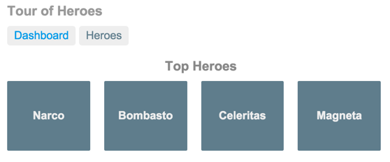
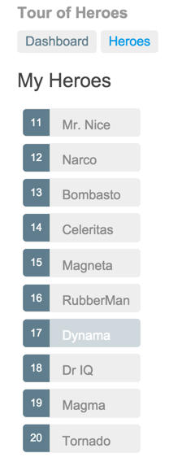

# 基于vue构建前端

vue的主战场就在浏览器,在浏览器上我们可以发挥vue的全部特性.

本文会用一个"英雄指南"项目来演示vue在复杂前端项目中的用法

本文将以组合式api的vue3为基准

## 前端vue项目基本结构

一个前端的vue项目的基本结构如下:

```bash
helloworld--|
            |--dist //编译完成后的项目
            |--node_modules //依赖的模块
            |--public--|
            |          |--index.html //入口html文件,必须包含`<div id="app"></div>`
            |          |--favicon.ico //前端页的窗口图标
            |
            |--src--|
                    |--main.js/main.ts //vue项目的入口
                    |--App.vue //vue项目的跟组件
                    |--assets //存放图片资源
                    |--router //定义路由,内部是js/ts文件
                    |--store //定义状态,内部是js/ts文件
                    |--views //展示视图组件
                    |--components //其他组件
                    |--apis //管理所有的远程数据获取
```

vue.js是完全组件化的,通常每个文件就是一个组件,管理页面中的一个元素,组件之间可以嵌套,构造成一个组件树,这个组件树就是我们要表现的页面了.我们要表现的完整页面通常被称为视图(view)会放在单独的文件加下管理,通常组件树的根节点并不直接包含视图节点,而是通过路由来串联.

## 英雄指南项目

这是个非常经典的样例项目,是[angular教程](https://angular.cn/tutorial)使用的例子.它包含如下功能:

1. 仪表盘
2. 英雄列表
3. 英雄录入
4. 英雄详情

当然这个例子还不够复杂,我们会在本章节中逐渐增加它的复杂度,从而让他可以:

1. 与后端交互获取和提交数据
2. 使用数据可视化技术展示英雄属性
3. 通过动画过渡提高交互体验

这个项目原始有3个页面

+ 首页仪表盘



+ 英雄列表



+ 英雄详情


我们会增加一个页面`创建英雄`以让这个项目更加丰富

但在开始之前我们先来介绍下用到的其他库:

1. [element-plus](https://element-plus.org/zh-CN/component/overview),应该是vue生态下最知名的综合性组件库,可以满足90%的web开发需求,通过`npm install element-plus --save`
2. [Vue Router](https://router.vuejs.org/zh/),vue官方的路由插件,在创建项目时选择安装
3. [pinia](https://pinia.vuejs.org/zh/),vue官方的状态管理插件,在创建项目时选择安装
4. [vue-echarts](https://github.com/ecomfe/vue-echarts/blob/main/README.zh-Hans.md),[echarts](https://echarts.apache.org/zh/index.html)项目的vue组件封装,直接`npm install echarts vue-echarts`安装

补充:

1. 我们的服务端在[hero-tutorial-api分支](https://github.com/hsz1273327/TutorialForFront-EndWeb/tree/hero-tutorial-api)
