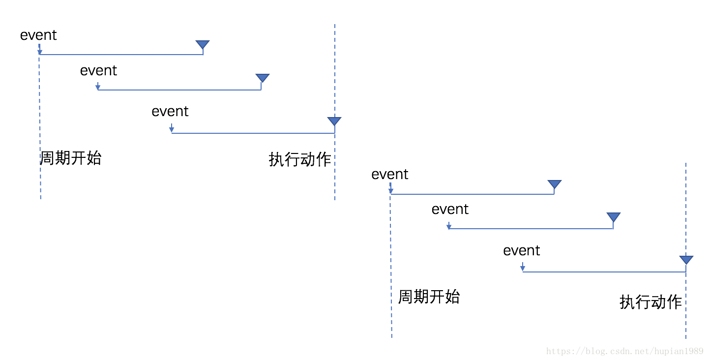
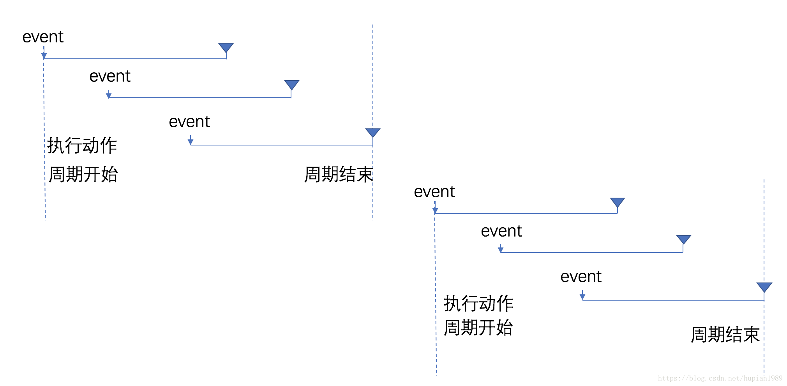
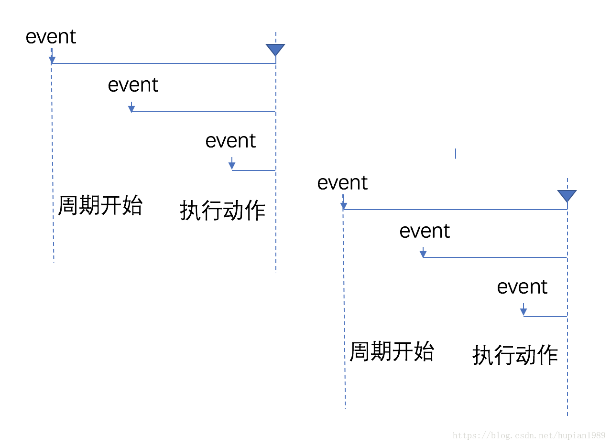
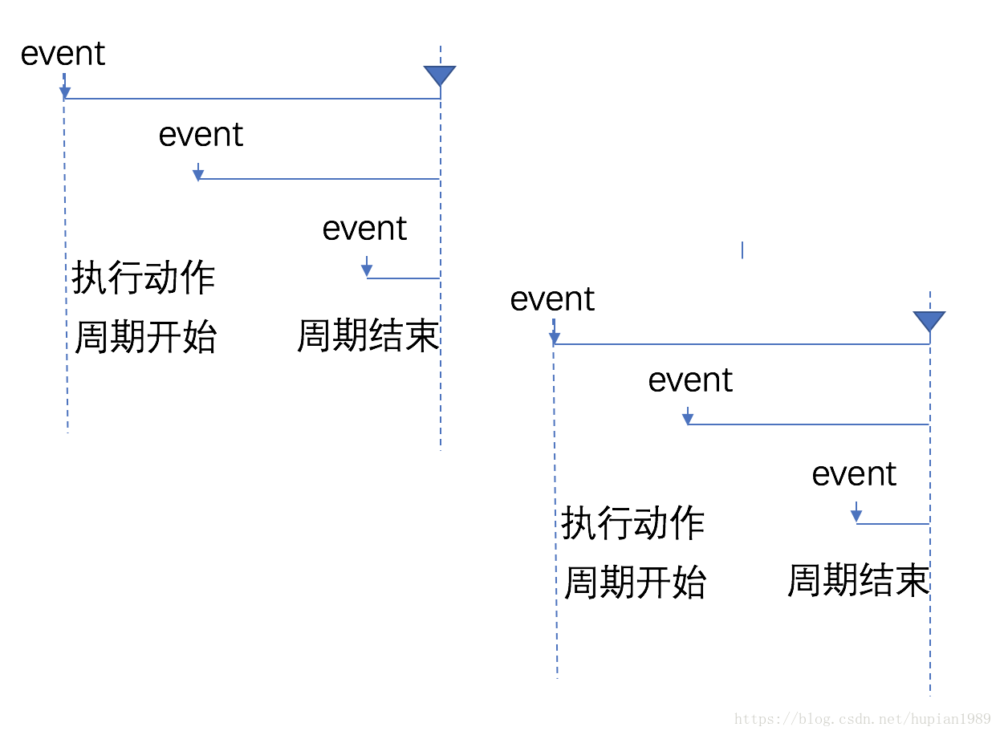

# 组件内部逻辑

组件的内部逻辑由`data`,`computed`,`methods`和`watch`四个属性决定.它们大致就决定了组件如何运作.

## 组件状态

组件对象的`$data`属性保存并监听组件内部的状态,组件对象是它的代理.当data变化时,会触发生命周期中的`update`行为.

### 调用方式

1. 在组件模板中调用其值可以直接使用字段名;
2. 在组件的`<script>`部分可以使用`this.<字段名>`或者`this.$data.<字段名>`
3. 使用组合式api时在组件的`<script setup>`或者`setup`部分由于setup的调用时机问题,组件实际上还没有绑定上`$data`,因此无法使用`this`指针访问它代理的值.为了解决这个问题我们必须调用使用[响应性api](https://v3.cn.vuejs.org/api/reactivity-api.html).

需要注意并不是所有的字段都可以注册到`$data`中,以`_`或者`$`开头的命名的字段是无法被注册进`$data`的

#### 响应性api

所谓响应性api,其本质是Proxy.这个代理所代理的值可以通过`.value`访问到.而在将响应性api赋值给`$data`后组件也可以像正常的值一样使用.在定义data时一般我们使用vue库的函数`ref`来构造一个参数引用.然后对这个引用进行操作.组件会解包setup的返回值将其中的值正确的绑定到`$data`

```vue
<template>
  <div class="hello">
    ...
    <a v-bind:href="url">baidu...</a>
    ....
  </div>
</template>
<script>
import { ref } from "vue";
  setup(){
    const url = ref("http://www.baidu.com")
    url.value = "http://www.taobao.com"
  }
</script>
```

### 基本定义方式

在基本用法中它通过一个返回Object的函数的字段`data`定义,返回值就是`$data`.

组件的实例会代理由`data`字段函数返回的对象,因此在模板等其他地方可以直接使用这个字段,比如下例中:

```vue
<template>
  <div class="hello">
    ...
    <a v-bind:href="url">baidu...</a>
    ....
  </div>
</template>

<script>
import { defineComponent } from "vue";


export default defineComponent({
  ...
  data() {
    return {
      url: "http://www.baidu.com"
    };
  },
  ...
});
</>
```

### 组合式api定义方式

我们也可以使用组合式api定义,也就是在`setup`方法中定义.

```vue
<template>
  <div class="hello">
    ...
    <a v-bind:href="url">baidu...</a>
    ....
  </div>
</template>

<script lang="ts">
import { defineComponent,ref } from "vue";


export default defineComponent({
  ...
  setup(){
    ...
    const url = ref("http://www.baidu.com")
    return {
      url,
      ...
     }
  }
  ...
});
</script>
```

**注意**,要让组件可以访问的属性需要作为setup**返回值的字段**

### script setup定义方式

```vue
<template>
  <div class="hello">
    ...
    <a v-bind:href="url">baidu...</a>
    ....
  </div>
</template>

<script setup>
import { ref } from "vue";

const url = ref("http://www.baidu.com");
</script>

```

## 组件方法

组件实例上可以绑定方法,这些方法一般由`v-on`通过事件触发,又或者逐层调用在其他比如watch,computed中被使用.

### 调用方式

1. 在组件模板中调用就是直接填上方法名调用,和在js中调用没什么区别
2. 在组件的`<script>`部分可以使用`this.<方法名>`调用用法和js中普通的函数没什么区别
3. 使用组合式api时在组件的`<script setup>`或者`setup`部分由于setup的调用时机问题,组件实际上还没有绑定上方法,因此无法使用`this`指针访问它.但通常定义过程也在其中,因此直接调用即可.只是需要注意在这之中定义方法时内部不要使用this指针而是改用响应式api的变量

### 基本定义方式

在基本用法中它通过一个返回Object的函数的字段`methods`定义,注意其中的每个字段都应该是一个函数

组件的实例会代理由`data`字段函数返回的对象,因此在模板等其他地方可以直接使用这个字段,比如下例中:

```vue
<template>
  <div class="hello">
    ...
    <input type="button" value="Submit" @click="SaveToFriendsList" />
    ....
  </div>
</template>

<script>
import { defineComponent } from "vue";

export default defineComponent({
  ...
  methods: {
    SaveToFriendsList: function () {
      let newfriend= {
        name: this.friend_name,
        gender: this.friend_gender,
        phone: this.friend_phone,
      };
      this.friends.push(newfriend);
      this.friend_name = null;
      this.friend_gender = null;
      this.friend_phone = null;
    },
  },
  ...
});
</>
```

这种方式因为要使用this指针访问组件内的状态,因此不应该使用箭头函数定义

### 组合式api定义方式

我们也可以使用组合式api定义,也就是在`setup`方法中定义.

```vue
<template>
  <div class="hello">
    ...
    <input type="button" value="Submit" @click="SaveToFriendsList" />
    ....
  </div>
</template>

<script>
import { defineComponent,ref } from "vue";


export default defineComponent({
  ...
  setup(){
    ...
    const SaveToFriendsList = () => {
      let newfriend = {
        name: friend_name.value,
        gender: friend_gender.value,
        phone: friend_phone.value,
      };
      friends.value.push(newfriend);
      friend_name.value = "";
      friend_gender.value = "";
      friend_phone.value = 0;
    };
    return {
      ...
      SaveToFriendsList
    };
  }
  ...
});
</script>
```

和data类似,在组合式api中定义的函数如果希望组件内可以调用需要放入返回值.由于组合式api中函数还未绑定到组件对象中,所以`this`是无法指定组件对象的,我们需要使用响应式api构造的参数引用来操作.

### script setup定义方式

```vue
<template>
  <div class="hello">
    ...
    <input type="button" value="Submit" @click="SaveToFriendsList" />
    ....
  </div>
</template>

<script setup>
import { ref } from "vue";

const SaveToFriendsList = () => {
  let newfriend = {
    name: friend_name.value,
    gender: friend_gender.value,
    phone: friend_phone.value,
  };
  friends.value.push(newfriend);
  friend_name.value = "";
  friend_gender.value = "";
  friend_phone.value = 0;
};
</script>

```

和data类似,在顶部定义的函数会被自动解析后绑定到组件中.

### 异步方法

我们定义的`method`也可以是异步方法,这并不会影响其使用,只是在组件模板中使用时它会被异步执行而已.但这其实也和在js中直接执行异步函数是一样的

### 防抖和节流(引用自[防抖(debounce) 和 节流(throttling)](https://blog.csdn.net/hupian1989/article/details/80920324),感谢作者起晚的蜗牛)

防抖和节流是针对响应跟不上触发频率这类问题的两种解决方案.在给DOM绑定事件时有些事件我们是无法控制触发频率的.比如鼠标移动事件`onmousemove`,滚动滚动条事件`onscroll`，窗口大小改变事件`onresize`等,瞬间的操作都会导致这些事件会被高频触发.如果事件的回调函数较为复杂就会导致响应跟不上触发出现页面卡顿,假死现象.在实时检查输入时,如果我们绑定`onkeyup`事件发请求去服务端检查,用户输入过程中事件的触发频率也会很高,会导致大量的请求发出,响应速度会大大跟不上触发.

针对此类快速连续触发和不可控的高频触发问题`debounce`(防抖)和`throttling`(节流)给出了两种解决策略:

+ `debounce`防抖策略是当事件被触发时设定一个周期延迟执行动作,若期间又被触发则重新设定周期直到周期结束后执行动作.这是`debounce`的基本思想,在后期又扩展了前缘`debounce`即执行动作在前,然后设定周期,周期内有事件被触发不执行动作且周期重新设定.
    + 延迟防抖示意图
      

    + 前缘防抖示意图
      

    `debounce`的特点是当事件快速连续不断触发时动作只会执行一次.延迟debounce是在周期结束时执行,前缘debounce是在周期开始时执行.但当触发有间断且间断大于我们设定的时间间隔时动作就会有多次执行

+ `throttling`节流策略是固定周期内只执行一次动作.若有新事件触发不执行.周期结束后又有事件触发才开始新的周期.节流策略也分前缘和延迟两种.与debounce类似延迟是指周期结束后执行动作,前缘是指执行动作后再开始周期
    + 延迟节流示意图
      
    + 前缘节流示意图
      

    `throttling`的特点在连续高频触发事件时动作会被定期执行,响应平滑

`debounce`和`throttling`各有特点,在不同的场景应该根据需求合理的选择策略.如果事件触发是高频但是有停顿时可以选择`debounce`;在事件连续不断高频触发时只能选择`throttling`,因为`debounce`可能会导致动作只被执行一次则界面出现跳跃.

vue并没有自带防抖和节流,我们可以借助[lodash-es](https://lodash.com/)实现.

```bash
npm i lodash-es
npm i --save-dev @types/lodash-es
```

常用的方法是在`created`和`unmounted`两个钩子上挂载lodash.当然了用组合式api的话并不需要使用`created`,我们以script setup定义方式为例

```vue
<template>
  <div class="hello">
    ...
    <input type="button" value="Submit" @click="SaveToFriendsList" />
    ....
  </div>
</template>

<script setup>
function _SaveToFriendsList() {
  let newfriend = {
    name: friend_name.value,
    gender: friend_gender.value,
    phone: friend_phone.value,
  };
  friends.value.push(newfriend);
  friend_name.value = "";
  friend_gender.value = "";
  friend_phone.value = 0;
}

const SaveToFriendsList = debounce(_SaveToFriendsList, 500);
onUnmounted(() => SaveToFriendsList.cancel());
</script>
```

## 组件的计算属性

所谓的计算属性可以理解为一类特殊的方法,他会在依赖的组件状态更新后第一时间执行,并将结果缓存起来,在依赖的组件状态不变的情况下无论怎么调用都只是获取缓存的结果.

这一特性非常适合用来做data的衍生数据.

### 调用方式

1. 在组件模板中调用其值可以直接使用字段名,就和调用data一样;
2. 在组件的`<script>`部分可以使用`this.<字段名>`
3. 使用组合式api时在组件的`<script setup>`或者`setup`部分由于setup的调用时机问题,组件实际上还没有绑定上计算属性,因此无法使用`this`指针访问它代理的值.为了解决这个问题我们必须调用使用vue的函数`computed`来定义,它的返回值是一个只读的响应式引用,我们可以像使用data时一样使用它就行,只是注意它的只读的.

### 基本定义方式

```vue
<template>
...
<a v-bind:href="url"> to {{ host }}</a>
...
</template>
<script>
  ...
  computed:{
    host(){
      return this.url.replaceAll("http://","").replaceAll("https://","")
    }
  },
  ...

</script>
```

### 组合式api定义方式

```vue
<template>
...
<a v-bind:href="url"> to {{ host }}</a>
...
</template>
<script>
import {
  computed
} from "vue";
  ...
  setup() {
    const url = ref("http://www.baidu.com");
    const host = computed(() =>
      url.value.replaceAll("http://", "").replaceAll("https://", "")
    );

    return {
      url,
      host,
    };
  },
  ...
</script>
```

注意`computed`返回的类型为`ComputedRef`

### script setup定义方式

```vue
<template>
...
<a v-bind:href="url"> to {{ host }}</a>
...
</template>
<script setup>
import { computed } from "vue";

const url = ref("http://www.baidu.com");
const host = computed(() =>
  url.value.replaceAll("http://", "").replaceAll("https://", "")
);

</script>
```

## 侦听器

侦听器可以用于监听组件状态变化,并在变化时执行相应的操作.这听起来和上面的计算属性很像,不过侦听器相对更加通用.

监听器的签名是`<T>(new:T, old:T)=>void`它可以获取到监听的属性的当前状态和前一状态,因此相比起计算属性可以更加通用.同时因为它功能更加强大,侦听器也很容易被滥用.它适合那些需要异步或开销较大的操作,如果只是随着属性变化进行简单变化,那么我们应该使用计算属性.

侦听器被定义后不能被调用,它只会在触发时自动执行.

需要注意侦听的元素只能是简单类型,array类型等复杂类型无法监测

### 基本定义方式

我们可以声明一个`watch`用于监控组件中属性状态的变化,比如上面的例子我们可以添加watch监控`friend_name`,当有变化时我们弹出一个提示.

```vue
<script>
  watch: {
    friend_name(val, oldVal) {
      if (oldVal!=""){
        alert("拼错了?")
      }
    },
  },
</script>
```

这种方式下watch的字段就是要侦听的字段名

### 组合式api定义方式

组合式api方式使用vue的`watch`函数来定义

```vue
<script>
import {
  watch,
} from "vue";
export default {
  ...
  setup(): SetupReturn {
    const friend_name = ref<string>("");
    watch(friend_name, (val, oldVal) => {
      if (oldVal != "") {
        alert("拼错了?");
      }
    });
    ...
  },
};
</script>
```

### script setup定义方式

```vue
<script setup>
import { watch } from "vue";
...
const friend_name = ref<string>("");
watch(friend_name, (val, oldVal) => {
  if (oldVal != "") {
    alert("拼错了?");
  }
});
</script>
```

## expose[vue 3.2+]

expose这个字段用于控制暴露在公共组件实例上的`property`列表.默认情况下通过`$refs`,`$parent`或`$root`访问到的公共实例与模板使用的组件内部实例是一样的.`expose`选项将限制公共实例可以访问的 property.

### 基本定义方式

```vue
<script>
export default {
  expose:["friends","host"],
  ...
}
</script>
```

### 组合式api定义方式

在`setup`中我们无法定义expose

### script setup定义方式

与使用基本定义方式相反,使用`<script setup>`的组件是默认关闭的,也即通过模板`ref`或者`$parent`链获取到的组件的公开实例不会暴露任何`<script setup>`中声明的绑定

为了在`<script setup>`组件中明确要暴露出去的属性.使用`defineExpose`编译器宏

```vue
<script setup>
...
defineExpose({
  host,
  friends
})
</script>
```
