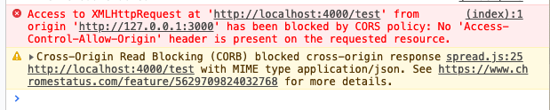

# ajax及相关技术

前端项目往往只是作为展现层(view层).数据,业务运算往往要依赖后端服务器,因此与服务器间的通信是非常重要的.在最开始的时候http协议只想做个用于发布和接收HTML页面的协议,它不想搞得太复杂,但随着时代的变迁,越来越多的通信需求让它与服务器间的交互手段越来越多,web的发展是在太快,很少有实现快于标准的技术,而web技术就是一个.回顾历史,在最初的时候前端app只能通过[提交表单](https://tutorialforjavascript.github.io/web%E5%89%8D%E7%AB%AF%E6%8A%80%E6%9C%AF/%E5%89%8D%E7%AB%AF%E6%A6%82%E8%A7%88/%E5%89%8D%E7%AB%AF%E5%BA%94%E7%94%A8%E9%A1%B5%E9%9D%A2%E8%A7%84%E8%8C%83/%E4%BA%A4%E4%BA%92%E4%BA%8B%E4%BB%B6.html#%E8%A1%A8%E5%8D%95form)来与服务器交互,到后来出现了ajax,可以通过XML作为数据的表现层协议来做到与服务端的频繁通讯.再后来json逐渐取代了XML的地位,而更加规范更加符合直觉的[RESTful接口](http://blog.hszofficial.site/recommend/2019/03/14/RESTful%E9%A3%8E%E6%A0%BC%E7%9A%84%E6%8E%A5%E5%8F%A3%E8%AE%BE%E8%AE%A1/)成了前端与后台通讯的首选.现在facebook提倡的[GraphQL](http://graphql.cn/)

这些花样繁多的技术其本质都是一样的,即请求响应模式:

1. 前端向后端发起请求
2. 后端响应请求并带上请求的结果数据.

这其实就是利用的http协议本身.浏览器获取页面也是同样的模式.

下面开始我们从例子出发来看看如何向后端发起请求.

本文适合配合本js攻略的[使用Javascript构建RESTful接口服务](https://tutorialforjavascript.github.io/%E4%BD%BF%E7%94%A8Javascript%E6%90%AD%E5%BB%BA%E5%90%8E%E7%AB%AF%E6%9C%8D%E5%8A%A1/RESTful%E6%8E%A5%E5%8F%A3%E6%9C%8D%E5%8A%A1.html)文章一起看

本文例子在[C3-S1](https://github.com/TutorialForJavascript/frontend-basic/tree/master/code/C3/S1)

## axios

本文例子在[C3-S1-P1](https://github.com/TutorialForJavascript/frontend-basic/tree/master/code/C3/S1/P1)

本质上[axios](https://github.com/axios/axios)是各家浏览器[XMLHttpRequest](https://developer.mozilla.org/zh-CN/docs/Web/API/XMLHttpRequest)的封装,因此它具有最好的通用性,而且node中也可以使用,所以是向后端发起请求的首选工具.

我们来实现一个网页来抓取github上最近注册的用户数据,并展示到页面上.这个页面和项目C0功能一样,我们这边只是替换其请求方式.

## fetch

[fetch](https://developer.mozilla.org/zh-CN/docs/Web/API/Fetch_API)是一个和XMLHttpRequest同级的底层接口,但老浏览器并不支持它使他的使用受到了限制,我们在项目[C0](https://github.com/TutorialForJavascript/frontend-basic/tree/master/code/C0)中已经实现了这个例子这边就不再重复

顺道一提要在node中使用`fetch`可以安装`node-fetch`

## 浏览器的同源策略与跨域请求

上面的例子中我们很轻易的就访问到了数据,但并不是所有的请求都可以如此轻易,因为浏览器有同源策略--前端页面只能访问与之协议同域名同端口的后端服务.

服务器`A`上的页面想要获取服务器`B`上的资源,这种行为叫跨域请求.

这个可以看项目[C3-S1-P2](https://github.com/TutorialForJavascript/frontend-basic/tree/master/code/C3/S1/P2).这个项目会在端口4000起一个后端服务来提供api,而前端静态页面服务的端口是3000.

可以看到结果,在4000端口的页面正常使用,而3000端口的会报错误,F12打开控制台可以看到是跨域错误.

这个问题呢其实比较尴尬,是只有通过浏览器访问才会碰到的问题所以应该归属于前端问题,但其解决方案和前端没有一点关系.解决跨域问题常见的是两种方式:

+ 服务端添加跨域支持
+ 使用反向代理

如果是使用服务端添加跨域支持的方法,那么就要用到`CORS`(跨域共享请求Cross-origin resource sharing).其实现方式就是浏览器会检查上面服务器`B`的HTTP头(HEAD请求),如果`Access-Control-Allow-Origin`中有"A",或者是通配符`*`,浏览器就会允许跨域,

本文的例子[P3](https://github.com/TutorialForJavascript/frontend-basic/tree/master/code/C3/S1/P3)就是借助[koa2-cors](https://www.npmjs.com/package/koa2-cors)做的一个支持跨域的服务端.执行这个例子,我们可以看到问题就解决了.

如果希望使用代理解决,那么可以看我关于[nginx的这篇博客]中的相关内容.

