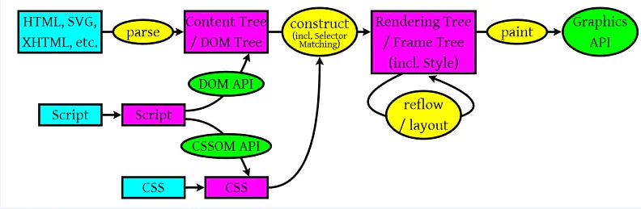
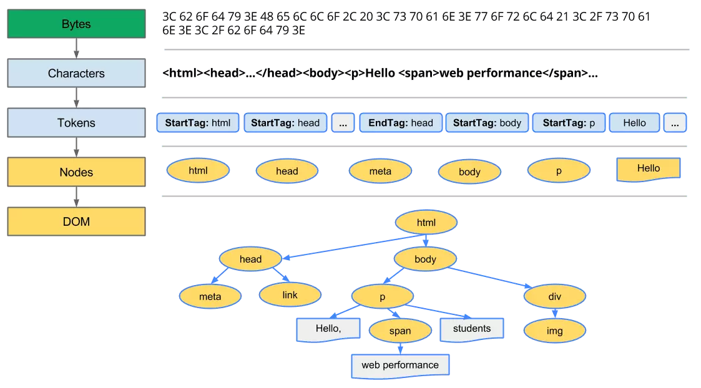
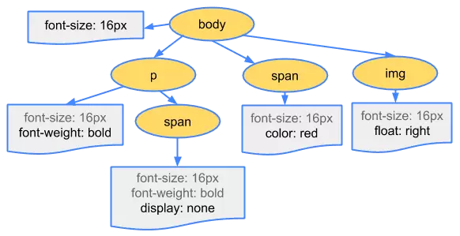

# 浏览器渲染页面

浏览器渲染的步骤如下:

1. 处理HTML标记并构建DOM树
2. 处理CSS标记并构建CSSOM树
3. 将DOM与CSSOM合并成一个渲染树
4. 根据渲染树来布局,计算每个节点的布局信息
5. 将各个节点绘制到屏幕上
6. 如果DOM或CSSOM被js修改,就会从3开始重新执行上面所有步骤



可以看到与浏览器渲染相关的资源无非不过:

+ html文件作为初始化dom树的描述
+ css文件作为初始化cssom树的描述
+ js文件作为定义各种情况下改变渲染树的描述

## 渲染DOM

在第一步时浏览器会解析HTML文档,以完成以下步骤:

1. 读取HTML的原始字节,根据文件制定编码(现在通常是utf-8)解析为各个字符
2. 将字符串转化为各种标签,HTML是XML的子集,这个步骤就是解析xml
3. 将标签转化为node节点
4. 使用节点构建DOM树



## CSSOM

浏览器解析HTML时,遇到link标签会发出请求并返回CSS资源,从而开始解析CSS.CSS字节转换为字符,接着转换成令牌和节点,最后构建生成CSSOM.



CSSOM和DOM是独立的数据结构,渲染树由这两个树构建而成,构建完成后计算每个可见元素的布局,并输出给绘制流程,将像素渲染到屏幕上.

构建渲染树的步骤:

1. 从DOM树的根节点开始遍历每个可见节点(display:none与visibility:hidden的区别)
2. 对于每个可见节点为其找到适配的CSSOM规则并应用它
3. 生成渲染树
4. 布局阶段:输出盒模型
5. 绘制:输出到屏幕上的像素

## 阻塞渲染

CSS是阻塞渲染的资源,需要将它尽早尽快地下载到客户端,以便缩短首次渲染的时间.这就是为什么我们将外部样式的引入放在head标签中的原因,在body渲染前先把相对完整CSSOM Tree构建好.

对于某些CSS样式只在特定条件下使用可以添加媒体查询解决.请注意"阻塞渲染"仅是指浏览器是否需要暂停网页的首次渲染直至该资源准备就绪.无论哪一种情况,浏览器仍会下载CSS资源,只不过非阻塞渲染的资源优先级较低罢了.

使用`script`标签引入JavaScript代码默认也会阻塞渲染.为了实现最佳性能,可以让JavaScript异步执行,并去除关键渲染路径中任何不必要的JavaScript.但我们可以为其添加属性以改变这种行为:

+ `async`属性:加载和渲染后续文档元素的过程将和脚本的加载与执行并行执行.无顺序
+ `defer`属性:加载后续文档元素的过程将和脚本的加载并行进行,但脚本的执行要在所有元素解析完成之后,DOMContentLoaded事件触发之前完成.

## 在浏览器中使用ES module

`script`可以设置参数`type="module"`来激活使用ES module,这样你的脚本中就可以使用`import`语法加载模块了.在浏览器中`import`不光可以从本地加载模块还可以使用http协议获取模块

```html
<script type="module">
  import { getOriginPrivateDirectory } from 'https://cdn.jsdelivr.net/npm/native-file-system-adapter/mod.js'
  // Get a directory handle for a sandboxed virtual file system
  // same as calling navigator.storage.getDirectory()
  const dirHandle1 = await getOriginPrivateDirectory()
  // or use an adapter (see adapters table above for a list of available adapters)
  const dirHandle2 = await getOriginPrivateDirectory(import('https://cdn.jsdelivr.net/npm/native-file-system-adapter/src/adapters/<adapterName>.js'))
</script>
```
