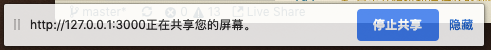

# 使用本地摄像头和麦克风

在2015年的时候我在法国第一次和班上的朋友通过facebook在**网页上**视频通话,当时只有一种感觉--黑科技.
要实现视频通话需要:

+ 让浏览器可以访问到摄像头
+ 让浏览器可以访问到麦克风
+ 让摄像头和麦克风的数据可以传输到远端

客户端视频通话没什么稀奇的,但网页端视频通话就厉害了.能实现这一功能益于一项革命性的技术--webrtc.

我们这一节只先讨论如何让浏览器获取摄像头和麦克风中的输入数据.在后面与服务端交互的部分我们会将在网页上做视频通话这一目标完成.

目前至少chrome支持`webm`格式录制视频,而如果要将录制下来的视频转变为常见的格式我们还需要借助`ffmpeg.js`和`webworker`来实现.这部分我们会在后面的`webworker`部分完善这个例子.

本节的代码在**[C2-S3](https://github.com/TutorialForJavascript/frontend-basic/tree/master/code/C2/S3)**.本节的代码魔改自[这个项目](https://github.com/webrtc/samples).

## `navigator.mediaDevices`访问摄像头和麦克风的主要接口


`navigator.mediaDevices`允许浏览器调用摄像头,麦克风.这样可以做一些比如自拍,录像这样的功能,获取摄像头和麦的捕捉信息由`navigator.mediaDevices.getUserMedia(c:Constraints)`对象获得,它通过参数对象`<Constraints>`来设置要捕获的流种类.

```ts
interface Constraints {
    audio: boolean||Object
    video: boolean||Object
}
```
它会返回一个promise,如果成功,就会获得一个`Stream`,失败就会返回一个`error`

### 设备选择

Constraints的内容中可以允许指定输出设备(用设备id),

```js
constraints = {
    audio: { deviceId: audioSource ? { exact: audioSource } : undefined },
    video: { deviceId: videoSource ? { exact: videoSource } : undefined }
};
```

视屏输出的音频输出设备可以用`<HTMLVideoElement>.setSinkId(deviceId)`来指定.

可以用`navigator.mediaDevices.enumerateDevices()`收集系统上可用的媒体输入和输出设备的信息(deviceInfo[]),之后用then中的回调函数选择用哪个,放在一个容器中,

每个deviceInfo会包含有:

+ deviceId,设备编号
+ kind ,设备类型,包括audioinput,audiooutput,videoinput
+ label ,设备标签

这样只要将这些获得的deviceId放在指定的位置就可以自由的调换设备了


## 例子介绍

本段的例子是逐步递进式的,分为如下几个:

### 选择获取设备,并将摄像头捕捉到的内容捕捉到`video`标签

本段的代码在**[C2-S3-P1](https://github.com/TutorialForJavascript/frontend-basic/tree/master/code/C2/S3/P1)**
本段的例子目的有以下几个:

+ 申请获取音频视频的输入输出权限,并可以选择使用的设备
+ 获取到输入设备后再页面上展示视频,音频也获取输入后直接输出到`video`标签

本段给出了主要结构,即使用类`RecordApplication`来描述这个项目的功能.


+ index.html:

```html
<main>
    <div id="container">
        <h1> WebRTC samples<span>选择输出的设备</span></h1>
        <p>使用<code>mediaDevices.enumerateDevices()</code>获取可用的音频/视频输入资源,以及输出设备,然后使用<code>deviceId</code>指定
            要使用的资源给<code>getUserMedia()</code></p>

        <div class="select">
            <label for="audioSource">音频输入: </label><select id="audioSource"></select>
        </div>
        </br>
        <div class="select">
            <label for="audioOutput">音频输出: </label><select id="audioOutput"></select>
        </div>
        </br>
        <div class="select">
            <label for="videoSource">视频输入: </label><select id="videoSource"></select>
        </div>
        </br>
        <video id="video" playsinline autoplay></video>
        <p class="small"><b>注意:</b> 如果听到混响声,则说明麦克风正在获取你的输出,请降低音量或将麦克风远离扬声器/耳机</p>
    </div>
</main>
```

在html部分,我们使用`select`标签来作为选择输入输出设备的界面.在选在好后通过绑定其事件`onchange`来触发播放.

要播放的视频资源会绑定到`video`标签渲染成对象的资源`videoElement.srcObject = stream`.

+ index.js

```js
/**
 * 录像用的前端项目
 */
class RecordApplication {
    /**
     * @public {HTMLElement} videoElement - 展示摄像机捕获内容的video标签
     * @public {HTMLElement} audioInputSelect - 选择音频输入的元素
     * @public {HTMLElement} audioOutputSelect - 选择音频输出的元素
     * @public {HTMLElement} videoSelect - 选择视频输入的元素
     * @public {Array[HTMLElement]} selectors - 保存所有的输入输出设备元素
     */
    constructor() {
        this.videoElement = document.querySelector('video')
        this.audioInputSelect = document.querySelector('select#audioSource')
        this.audioOutputSelect = document.querySelector('select#audioOutput')
        this.videoSelect = document.querySelector('select#videoSource')
        this.selectors = [this.audioInputSelect, this.audioOutputSelect, this.videoSelect]
        this.bindEvent()
    }
    /**
     * 为输入输出设备和按钮绑定事件句柄的回调函数
     */
    bindEvent() {
        this.audioInputSelect.onchange = () => this.display()
        this.audioOutputSelect.onchange = () => this.changeAudioDestination()
        this.videoSelect.onchange = () => this.display()
    }
    /**
     * 初始化页面
     */
    async init_render() {
        try {
            let media_device_infos = await navigator.mediaDevices.enumerateDevices()
            this.renderDevices(media_device_infos)
        } catch (error) {
            console.log('navigator.getUserMedia error: ', error)
        }
    }
    /**
     * 将指定的输出音频设备放入指定媒体元素
     * @param {HTMLElement} element - 要重置的video元素
     * @param {string} sinkId - 音频设备id
     */
    async attachSinkId(element, sinkId) {
        if (typeof (element.sinkId) !== 'undefined') {
            try {
                await element.setSinkId(sinkId)
                console.log('Success, audio output device attached: ' + sinkId)
            } catch (error) {
                let errorMessage = error
                if (error.name === 'SecurityError') {
                    errorMessage = 'You need to use HTTPS for selecting audio output ' + 'device: ' + error
                }
                console.error(errorMessage)
                // Jump back to first output device in the list as it's the default.
                audioOutputSelect.selectedIndex = 0
            }
        } else {
            console.warn('Browser does not support output device selection.')
        }
    }
    /**
     * 切换音频输出的设备
     */
    async changeAudioDestination() {
        let audioDestination = this.audioOutputSelect.value
        await this.attachSinkId(this.videoElement, audioDestination)
    }
    /**
     * 开始播放收集到的音频视频
     */
    async display() {
        if (window["stream"]) {
            window["stream"].getTracks().forEach((track) => {
                track.stop()
            })
        }
        let audioSource = this.audioInputSelect.value
        let videoSource = this.videoSelect.value
        let constraints = {
            audio: {
                deviceId: audioSource ? {
                    exact: audioSource
                } : undefined
            },
            video: {
                deviceId: videoSource ? {
                    exact: videoSource
                } : undefined
            }
        }
        try {
            let media_stream = await navigator.mediaDevices.getUserMedia(constraints)
            this.setStream(media_stream)
            await this.init_render()
        } catch (error) {
            console.log('navigator.getUserMedia error: ', error)
        }
    }
    /**
     * 通过流数据获取流对应的媒体设备信息
     * @param {MediaStream} stream 
     */
    setStream(stream) {
        window["stream"] = stream // make stream available to console
        // 将数据流绑定到video标签
        this.videoElement.srcObject = stream
        // Refresh button list in case labels have become available
    }
    /**
     * 通过媒体设备信息来构造媒体选择页面
     * @param {MediaDeviceInfo} deviceInfos 
     */
    renderDevices(deviceInfos) {
        // Handles being called several times to update labels. Preserve values.
        let values = this.selectors.map((select) => {
            select.value
        })
        this.selectors.forEach((select) => {
            while (select.firstChild) {
                select.removeChild(select.firstChild)
            }
        })
        // 将设备信息渲染为select中的option选项
        for (let deviceInfo of deviceInfos) {
            let option = document.createElement('option')
            option.value = deviceInfo.deviceId
            switch (deviceInfo.kind) {
                case 'audioinput':
                    option.text = deviceInfo.label || 'microphone ' + (this.audioInputSelect.length + 1)
                    this.audioInputSelect.appendChild(option)
                    break
                case 'audiooutput':
                    option.text = deviceInfo.label || 'speaker ' + (this.audioOutputSelect.length + 1)
                    this.audioOutputSelect.appendChild(option)
                    break
                case 'videoinput':
                    option.text = deviceInfo.label || 'camera ' + (this.videoSelect.length + 1)
                    this.videoSelect.appendChild(option)
                    break
                default:
                    console.log('Some other kind of source/device: ', deviceInfo)
            }
        }
    }
}
/**
 * 入口函数,这个入口函数是一个异步函数
 */
async function main() {
    let app = new RecordApplication()
    await app.init_render()
    await app.display()
}

main()
```

这段代码中主要的操作在

1. 将设备信息渲染为select中的option选项
2. 将流数据绑定到video标签.


### 让输入视频可以是屏幕

本段的代码在**[C2-S3-P2](https://github.com/TutorialForJavascript/frontend-basic/tree/master/code/C2/S3/P2)**

本段的例子目的有以下几个:

+ 获取屏幕的媒体数据流

要捕获屏幕数据,需要使用接口`navigator.mediaDevices.getDisplayMedia({ video: true })`

它和`getUserMedia`一样返回一个`promise`对象,调用成功返回媒体流,将这个流赋给`video`元素即可

我们在`videoSelect`中添加一位值和文本都是`"Local Display"`,用它表示我们屏幕上的输出.
修改`display`方法,如果选了视频中的`"Local Display"`则会将`navigator.mediaDevices.getDisplayMedia({ video: true })`获得的流中的视频的`tracks`添加到
`input_video_tracks`,并将`input_video_tracks`中原本的视频`Tracks`删除.


下面是MediaStream对象的属性:

属性|说明
---|---
`MediaStream.ended`|只读,布尔型.如果 ended事件在这个对象上触发了,也就是说这个流已经被完全读取,值为true.如果还没有到达这个流的尾部,值为false.
`MediaStream.id`|只读,这是一个包含36个字符的`DOMString`,用来作为这个对象的唯一标识符.

下面是MediaStream对象的事件句柄:

事件句柄|说明
---|---
`MediaStream.onaddtrack`|这是`addtrack`事件在这个对象上触发时调用的事件处理器,这时一个`MediaStreamTrack`对象被添加到这个流.回调函数参数为`event`,可以通过其上的属性`track`来获取这个被添加的track
`MediaStream.onended`|这是当流终止`ended`时触发的事件.
`MediaStream.onremovetrack`|这是`removetrack`事件在这个对象上触发事调用的事件处理器,这时一个对象从流上移除.回调函数参数为`event`,可以通过其上的属性`track`来获取这个被删除的track

下面是MediaStream对象支持的方法:

方法|说明
---|---
`MediaStream.addTrack()`|存储传入参数`MediaStreamTrack`的一个副本.如果这个轨道已经被添加到了这个媒体流,什么也不会发生;如果目标轨道为"完成"状态(也就是已经到尾部了),一个`INVALID_STATE_RAISE`异常会产生.
`MediaStream.clone()`|返回这个`MediaStream`对象的克隆版本.返回的版本会有一个新的ID.返回给定ID的轨道.如果没有参数或者没有指定ID的轨道将返回null.如果有几个轨道有同一个ID,将返回第一个.
`MediaStream.getTracks()`|返回流中所有的`MediaStreamTrack`列表.
`MediaStream.getAudioTracks()`|返回流中`kind`属性为`audio`的`MediaStreamTrack`列表.顺序是不确定的,不同浏览器间会有不同,每次调用也有可能不同.
`MediaStream.getTrackById()`|返回给定ID的轨道,如果没有参数或者没有指定ID的轨道,将返回null.如果有几个轨道有同一个ID将返回第一个.
`MediaStream.getVideoTracks()`|返回流中`kind`属性为`video`的`MediaStreamTrack`列表.顺序是不确定的,不同浏览器间会有不同,每次调用也有可能不同.
`MediaStream.removeTrack()`|移除作为参数传入的`MediaStreamTrack`.如果这个轨道不在`MediaStream`对象中什么也不会发生;如果目标轨道为"完成"状态,一个`INVALID_STATE_RAISE`异常会产生.

需要注意的是:

1. 目前我测试的chrome`72.0.3626.119`版本不支持录制音频.也许后续版本会支持也说不定.
2. 视频共享会跳出一个界面让选择要共享的是哪块屏幕.
3. 当使用录屏后视屏输入显示的还是`Face Time HD Camera`,需要点击页面下方的`停止共享`才能退出



### 录制

本段的代码在**[C2-S3-P3](https://github.com/TutorialForJavascript/frontend-basic/tree/master/code/C2/S3/P3)**

在完成上段例子的基础上我们添加录制功能

本段的例子目的有以下几个:
+ 点击开始按钮后将获取到的视频输入,音频输入并录制,可选格式为`webm`.
+ 点击download将录制的数据保存为对应的格式
+ 点击截图获取当前录到的图片

录制需要使用`MediaRecorder`类,我们创建一个实例


```js
let options = {
    mimeType: this.MimetypeSelect.value
}
new MediaRecorder(window["stream"], options)
```

并为其定义一个事件句柄:

```js
mediaRecorder.ondataavailable = (event) => {
    if (event.data && event.data.size > 0) {
        this.recordedBlobs.push(event.data)
    }
}
```
这个实例会将在有新数据后就将数据保存到一个名为`recordedBlobs`的array中.

使用`mediaRecorder.start(timeslice)`开始录制,使用`mediaRecorder.stop()`停止了录制.录完的结果就保存在`lastrecordedBlobs`中.


#### 文件保存

由于我们想用`button`的点击事件来触发下载,那最简单的方式就是模拟一个`a`标签的点击事件

```js
savefile(data,filename){
    // 创建一个a标签
    let save_link = document.createElement('a')
    // 绑定地址
    save_link.href = data
    // 绑定文件名
    save_link.download = filename

    // 使a标签的点击事件触发
    let event = document.createEvent('MouseEvents')
    event.initEvent("click", true, false)
    save_link.dispatchEvent(event)
}
```

这个函数可以实现只要调用它就可以触发下载界面.

#### 下载录像

要下载保存录下来的录像,我们需要创建一个`Blob`对象.然后为这个blob对象创建一个URL用来作为data.

```js
let blob = new Blob(this.lastrecordedBlobs, {
    type: mimetype
})
let data = window.URL.createObjectURL(blob)
```

#### 截图

我们就不复杂化了就保存`png`格式的图片.我们只需要将`video`标签的元素放入`canvas.getContext('2d').drawImage`的第一位,并将图片的大小划分好这个作图的上下文就会保存在canvas中.

之后使用`toDataURL(content-type)`创建图片的数据对象.我们需要将图片的数据对象中的`image/octet-stream`改为png的`content-type`即可

```js
this.canvas.getContext('2d').drawImage(this.videoElement, 0, 0, this.canvas.width, this.canvas.height)
let img_png_src = this.canvas.toDataURL("image/png")
let imgData = img_png_src.replace("image/png",'image/octet-stream')
let filename = new Date().toISOString()+".png"
this.savefile(imgData,filename)
```

最后再调用文件保存函数即可

