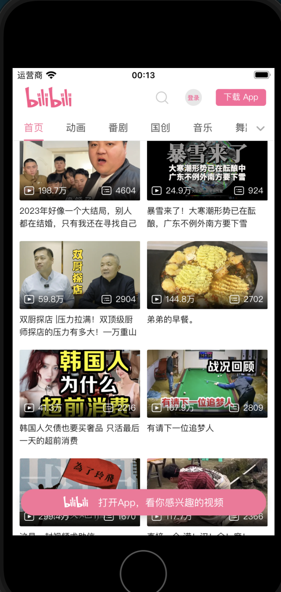

# webview

webview是一类特殊的基础组件,它的作用是渲染html文本内容,也可以认为webview类的组件就是一个简单的浏览器实现(`android`使用[android.webkit.WebView](https://developer.android.com/reference/android/webkit/WebView)也就是`chromium`的内核,`ios`使用[WKWebView](https://developer.apple.com/documentation/webkit/wkwebview)也就是`safari`的内核).

这类组件通常也往往一个组件就占一个页面,而且往往是一些奇技淫巧的基础.

目前有两个webview组件可用:

+ [WebView](https://docs.nativescript.org/ui/web-view)组件是官方提供的原生组件.
+ [@nativescript-community/ui-webview](https://github.com/nativescript-community/ui-webview)社区维护的webview组件,其特点是支持捕获页面上的url以及可以执行本地JavaScrip脚本和css样式

`WebView`的用法很简单,就是标签指定一个网址,这个网址默认只能是`https`协议的.

+ android效果
  
    
+ ios效果

    
    
如果要用`http`协议需要做出额外设置

+ `android`: 进入`App_Resources/Android/src/main/AndroidManifest.xml`,编辑其中的内容加上`android:usesCleartextTraffic="true"`:

    ```xml
    <?xml version="1.0" encoding="utf-8"?>
    <manifest xmlns:android="http://schemas.android.com/apk/res/android" package="__PACKAGE__">
        ...

        <application
            ...
            android:usesCleartextTraffic="true">

    ```