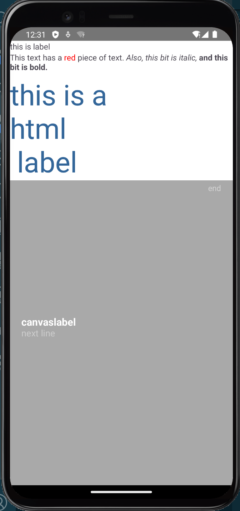
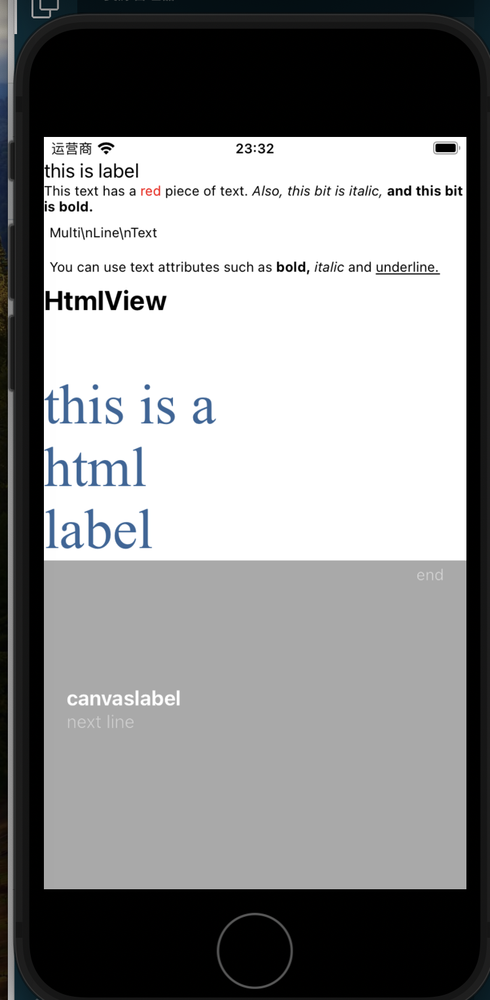
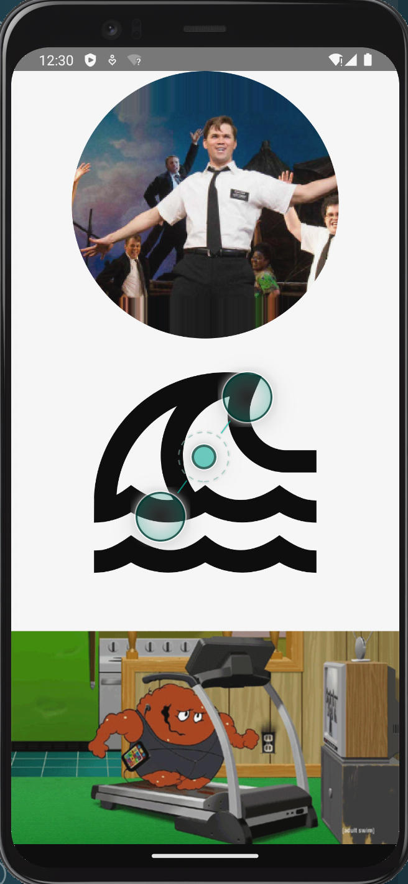
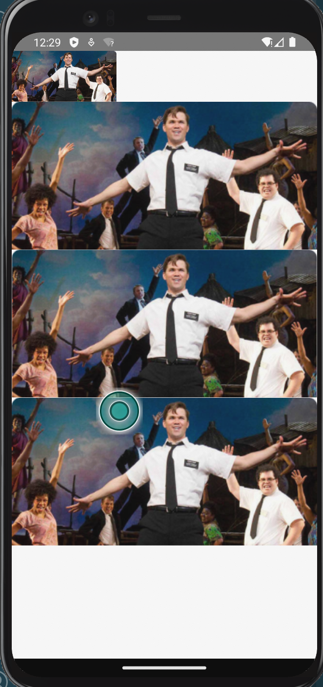
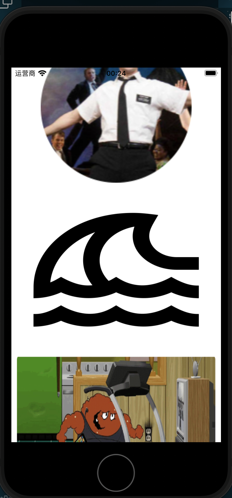
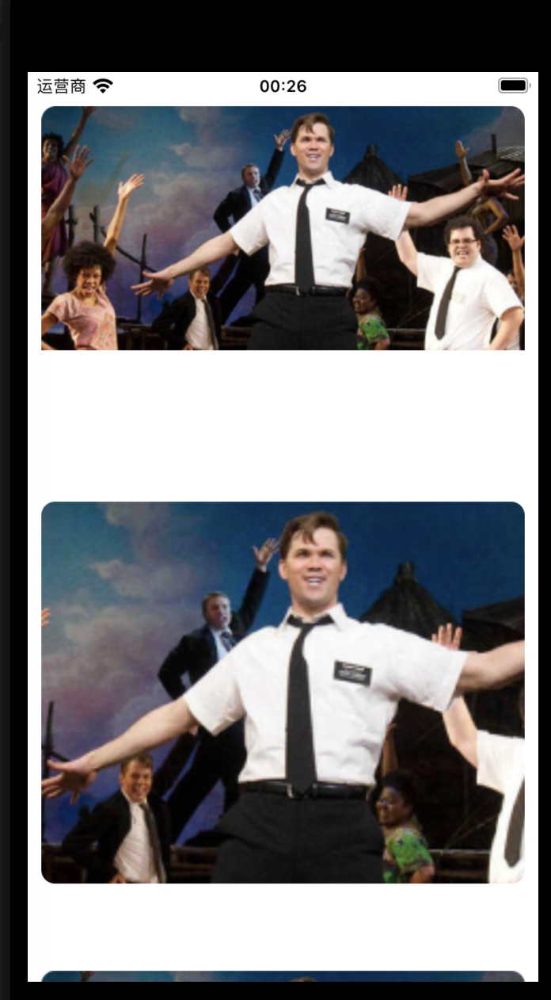
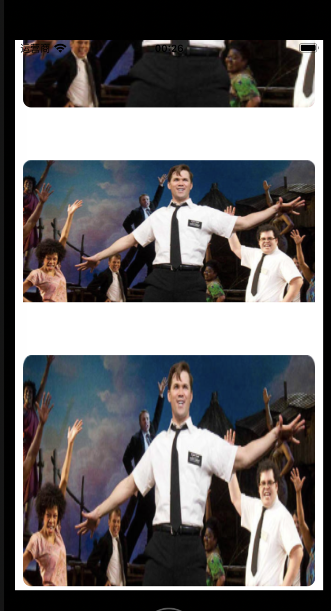

# 展示型组件

展示型组件就是指那种纯用于展示的组件,大致可以分为

+ 文本展示
+ 图片展示

## 文本

标签用于展示只读文本.文本的展示主要是字体,大小,颜色,背景色,是否加黑加粗,换行等.文本的展示主要是要能在不花里胡哨的前提下突出重点.

### Label

[Label](https://nativescript-vue.org/cn/docs/elements/components/label/)是原生的标签组件.用法有两种:

+ 简单用法:

    ```vue
    <Label text="Label" />
    ```

+ 带样式的标签用法:

    ```Vue
    <Label textWrap="true">
        <FormattedString>
            <Span text="This text has a " />
            <Span text="red " style="color: red" />
            <Span text="piece of text. " />
            <Span text="Also, this bit is italic, " fontStyle="italic" />
            <Span text="and this bit is bold." fontWeight="bold" />
        </FormattedString>
    </Label>
    ```

### TextView

方组件[TextView](https://nativescript-vue.org/cn/docs/elements/components/text-view/)是一个专门用于展示多行数据的文本展示型组件.这个组件通过属性`editable`控制是否可以编辑.也就是说如果单纯作为展示型组件,我们需要将其属性`editable`设置为`false`

单纯作为展示型组件他有两种用法:

+ 简单长文本

    ```Vue
    <TextView text="Multi\nLine\nText" editable="false"/>
    ```

+ 复杂样式的长文本

    ```vue
    <TextView editable="false">
      <FormattedString>
        <Span text="You can use text attributes such as " />
        <Span text="bold, " fontWeight="Bold" />
        <Span text="italic " fontStyle="Italic" />
        <Span text="and " />
        <Span text="underline." textDecoration="Underline" />
      </FormattedString>
    </TextView>
    ```

当然了由于`TextView`可以切换为可编辑状态,我们也常在一些需要在只读和可编辑状态间切换的场景使用它.

### HtmlView

官方提供的html渲染组件[HtmlView](https://docs.nativescript.org/ui/html-view)用于渲染html文本.使用这个组件我们就可以利用HTML中的文本格式标签来输出文本了.需要注意这个标签并不支持图片,视频等其他标签,也不知加载额外css,js等,它只能渲染纯html标签

```vue
<HtmlView :html="htmlString" />
```


### HTMLLabel

社区提供的[@nativescript-community/ui-label](https://github.com/nativescript-community/ui-label)组件,可以使用html的子集来方便的构造标签,要使用它需要先按如下步骤设置:

1. 安装`@nativescript-community/ui-label`
2. [ios]`App_Resources/ios`中修改`Podfile`,其中添加`pod 'DTCoreText'`
3. 安装插件[@nativescript-community/text](https://github.com/nativescript-community/text)
4. [ios]入口文件中添加

    ```vue
    import { enableIOSDTCoreText } from '@nativescript-community/ui-label';

    if (global.isIOS) {
        enableIOSDTCoreText();
    }
    ...
    ```

5. 入口文件中添加

    ```vue
    import { registerElement } from 'nativescript-vue';
    import { Label as HTMLLabel } from '@nativescript-community/ui-label';
    ...
    registerElement('HTMLLabel', () => HTMLLabel);
    ...
    ```

用的时候也很简单,标签为`HTMLLabel`,基本只要将文本填入属性`html`即可.除此之外还可以设置属性`linkColor`,`linkUnderline`,`linkTap`来设置`html`属性中填的`<a>`标签的行为

### CanvasLabel

社区提供的基于canvas的[@nativescript-community/ui-canvaslabel](https://github.com/nativescript-community/ui-canvas)label组件特点是使用canvas渲染,性能更好,要使用它需要先安装`@nativescript-community/ui-canvas`,`@nativescript-community/arraybuffers`和`@nativescript-community/ui-canvaslabel`,然后在入口文件中注册:

```Vue
import CanvasLabel from '@nativescript-community/ui-canvaslabel/vue';
...
createApp(Home).use(CanvasLabel);
```

### 例子

```Vue
<template>
    <Page actionBarHidden="true">
        <StackLayout>
            <Label text="this is label"></Label>
            <Label textWrap="true">
                <FormattedString>
                    <Span text="This text has a " />
                    <Span text="red " style="color: red" />
                    <Span text="piece of text. " />
                    <Span text="Also, this bit is italic, " fontStyle="italic" />
                    <Span text="and this bit is bold." fontWeight="bold" />
                </FormattedString>
            </Label>
            <HTMLLabel fontSize="50" fontFamily="Cabin Sketch,res/cabinsketch" width="100%" paddingTop="5" color="#336699"
                textWrap="true" :html="htmlText" verticalAlignment="top" />
            <CanvasLabel id="canvaslabel" fontSize="10" color="white" backgroundColor="darkgray">
                <CGroup fontSize="18" verticalAlignment="middle" paddingLeft="20">
                    <CSpan :text="line('canvaslabel')" fontWeight="bold" />
                    <CSpan :text="line('next line')" color="#ccc" fontSize="16" />
                </CGroup>
                <CSpan text="end" color="lightgray" fontSize="14" textAlignment="right" paddingRight="20" paddingTop="4" />
            </CanvasLabel>
        </StackLayout>
    </Page>
</template>

<script lang="ts" setup>
import { ref } from "nativescript-vue";

const htmlText = ref("this is a <br>html<br> label")

function line(row: string): string {
    return `${row}\n`
}
</script>
```

+ andoird样式
    

+ ios样式
    

### 使用总结

| 项目          | 场景                                        |
| ------------- | ------------------------------------------- |
| `Label`       | 通用场景                                    |
| `TextView`    | 长文本,需要在一定时候切换到可编辑模式的文本 |
| `HtmlView`    | 希望使用html渲染内容的场景                  |
| `HTMLLabel`   | 希望使用html渲染内容且有`<a>`标签的场景     |
| `CanvasLabel` | 希望获得更好渲染性能的场景                  |

## 图片

图片组件用于展示现成的图片文件,通常图片有png,jpg,webp,svg,gif这几种格式,图片的展示也包括填充方式,相框形状等很多设置.图片是很显眼的东西,主要要考虑的点

1. 加载速度
2. 不要太过抢眼挡住了其他内容的展示

### Image

[Image](https://nativescript-vue.org/cn/docs/elements/components/image/)是原生的图片组件,注意只能使用的格式是`png`或者`jpg`,如果图片格式为`jpeg`可以直接修改后缀为`jpg`.

+ 可以使用属性`src`设置图片的资源,支持
    + 本地应用中已经注册了的图片,使用`res://icon`形式的值
    + 本地未注册的图片,使用`~/logo.png`形式的值
    + 通过URL使用远程服务器上的图片,使用`https://art.nativescript-vue.org/NativeScript-Vue-White-Green.png`的形式
    + base64编码后的图片内容文本,使用`data:Image/png;base64,iVBORw...`的形式
+ 可以设置属性`loadMode`为`async`(默认)或者`sync`来设置加载图片是同步方式还是异步方式.
+ 可以设置属性`stretch`来设置图片的填充方式,可选为
    + `aspectFill`等比放大,将最短的拉满,长的部分截去
    + `aspectFit`等比放大,将最长的打满,短的用背景色填充
    + `fill`不等比放大并填满
    + `none`默认,不填充,放置在左上角

### NSImg

相比于原版,我更加推荐使用社区提供的[@nativescript-community/ui-image](https://github.com/nativescript-community/ui-image),图片渲染本身就是一个比较复杂的事情,原版的接口过于简单.社区提供的这个图片扩展组件提供了更多的样式设置选项以及一些实用功能.但也只能使用的格式是`png`或者`jpg`
可以额外设置如下实用属性

+ `placeholderImageUri`,用于占位符图像`URI`的字符串值,通常所有的占位符图像是同一个
+ `failureImageUri`,当加载图片不成功时使用的占位图片,可用取值形式和src一致
+ `fadeDuration`,使用淡入效果渲染并设置淡入的动画时长,单位milliseconds
+ `blurRadius`设置模糊半径,值越大意味着处理越慢.例如值为`10`意味着图像中的每个像素都将使用距离为`10`的所有相邻像素进行模糊处理.
+ `aspectRatio`设置固定的宽高比
+ `progressiveRenderingEnabled`是否启动渐进式渲染,默认false
+ `roundAsCircle`,将图片截为圆形,一般和`stretch=fitCenter`搭配使用
+ `stretch`,注意和原版的不同,支持的
    + `center`,子级放在中间,不填充
    + `centerCrop`,缩放子级,使其两个维度都大于或等于父对象的相应维度
    + `centerInside`, 子级放置在中间,缩放子级,使其完全适应父级
    + `fitCenter`,等比放大填满父级
    + `aspectFit`,等比放大,将最长的打满,短的用背景色填充
    + `fitStart`
    + `fitEnd`
    + `fitXY` - Scales width and height independently, so that the child matches the parent exactly.
    + `fill`不等比放大并填满
    + `focusCrop` - Scales the child so that both dimensions will be greater than or equal to the corresponding dimension of the parent.
    + `aspectFill`,等比放大,将最短的拉满,长的部分截去

要使用它需要先安装`@nativescript-community/ui-image`,然后在入口文件中注册:

```ts
import ImageModulePlugin from '@nativescript-community/ui-image/vue';
import { initialize as imageInitialize} from '@nativescript-community/ui-image';

imageInitialize({isDownsampleEnabled: true});
createApp(Home).use(ImageModulePlugin);
```

除了上面的展示图片,还可以使用插件[@nativescript-community/ui-image-colorfilter](https://github.com/nativescript-community/ui-image/tree/master?tab=readme-ov-file#installation-1)进行颜色筛选,用插件[@nativescript-community/ui-zoomimage](https://github.com/nativescript-community/ui-image/tree/master?tab=readme-ov-file#installation-2)进行缩放

### SVGView

如果我们的图片是svg,我们就必须使用[@nativescript-community/ui-svg](https://github.com/nativescript-community/ui-canvas?tab=readme-ov-file#installation-2)这个插件来加载图片了,它也依赖于canvas渲染,要使用它也就需要先安装`@nativescript-community/ui-canvas`,`@nativescript-community/arraybuffers`.

使用时先安装`@nativescript-community/ui-svg`,然后在入口文件中注册:

```ts
import CanvasSVG from '@nativescript-community/ui-svg/vue';

createApp(Home).use(CanvasSVG);
```

### GIF

一些视频网站可能会希望用户在视频列表阶段就可以略微的看到一小段视频,这就可以使用`gif`格式的图片,`gif`就是所谓的动图,原生组件自然是不支持的,我们可以使用第三方插件[nativescript-gif](https://github.com/bradmartin/nativescript-gif)让它提供一个`GIF`标签来支持播放gif图片.

使用时先安装`nativescript-gif`,然后在入口文件中注册:

```ts
import { Gif } from 'nativescript-gif';

registerElement('Gif', () => Gif);
```

需要注意由于经过了webpack打包,我们还需要将`.gif`格式的图片注册进webpack的设置中

+ `webpack.config.js`

    ```js
    module.exports = (env) => {
      webpack.init(env);
      webpack.Utils.addCopyRule('**/*.gif') //重点是这个
      return webpack.resolveConfig();
    };
    ```

### 例子

```Vue
<template>
    <Frame>
        <Page actionBarHidden="true">
            <ListView height="100%" separatorColor="transparent" :items="types">
                <template #default="{ item }">
                    <GridLayout height="280" borderRadius="10" class="bg-secondary" rows="*, auto, auto" columns="*"
                        margin="5 10" padding="0">
                        <NSImg v-if="item === 'NSImg'" src="~/assets/bookofmormon.png" stretch="fitCenter"
                            roundAsCircle="true" />
                        <SVGView v-if="item === 'SVG'" src="~/assets/tsunami_black_24dp.svg" stretch="fitCenter" />
                        <Gif v-if="item === 'GIF'" src="~/assets/meatwad.gif" height="100" ></Gif>
                        <image v-else row="0" margin="0" src="~/assets/bookofmormon.png" :stretch="item" />
                    </GridLayout>
                </template>
            </ListView>
        </Page>
    </Frame>
</template>
  
<script lang="ts" setup>
import { ref } from "nativescript-vue";
const types = ref(["none", "aspectFill", "aspectFit", "fill", "NSImg", "SVG","GIF"])
</script>
```

+ andoird样式
    
    

+ ios样式
    
    
    

### 使用总结

| 项目      | 场景                                               |
| --------- | -------------------------------------------------- |
| `Image`   | 仅仅需要简单展示下图片                             |
| `NSImg`   | 通用场景                                           |
| `SVGView` | 需要渲染svg图片的场景                              |
| `GIF`     | 需要展示gif图片的场景,通常是视频列表中展示视频内容 |
