# 提示型组件

本文的演示示例在[nsv-notify分支](https://github.com/hsz1273327/TutorialForFront-EndWeb/blob/nsv-notify).

提示型组件是用于提示某种状态或者提供一些主动交互的组件,可以分为

1. 状态提示组件
2. 交互提示

## 状态提示组件

状态提示组件一般使用直观的图片或者动画提示一种状态.一般用于提示加载,下载等需要等待的功能的状态.又可以细分为

1. 圆形加载动画提示
2. 进度条

### 圆形加载动画提示

圆形加载动画提示一般都只用于展示等待状态.一般都是以一个boolean型的值来设置,为true则展示否则不展示.

+ [ActivityIndicator](https://nativescript-vue.org/cn/docs/elements/components/activity-indicator/)

    原生组件,在android下和ios下动画不同,但都是圆形,通过设置属性`busy`来控制是否展示,还可以监听事件`busyChange`来监控`busy`的取值变化.

+ [@nativescript-community/ui-material-activityindicator](https://www.npmjs.com/package/@nativescript-community/ui-material-activityindicator)

    material风格的圆型加载动画,其接口和`ActivityIndicator`完全一致,要用它我们需要安装`@nativescript-community/ui-material-activityindicator`,然后在入口文件中导入它

    ```ts
    import ActivityIndicatorPlugin from '@nativescript-community/ui-material-activityindicator/vue';

    Vue.use(ActivityIndicatorPlugin);
    ```

> 例子: 下面的例子将使用一个switch组件控制两个圆形加载动画提示组件的展示

```Vue
<template>
    <Frame>
        <Page actionBarHidden="true">
            <StackLayout>
                <Label text="Home--等待状态"></Label>
                <Switch v-model="isBusy" />
                <Label :visibility="isBusy ? 'visible' : 'collapsed'" text="ActivityIndicator:"></Label>
                <ActivityIndicator :busy="isBusy" @busyChange="onBusyChanged" />
                <Label :visibility="isBusy ? 'visible' : 'collapsed'" text="MDActivityIndicator:"></Label>
                <MDActivityIndicator :busy="isBusy" @busyChange="onBusyChanged" />
            </StackLayout>
        </Page>
    </Frame>
</template>
  
<script lang="ts" setup>
import { onMounted, ref } from "nativescript-vue";
import { EventData } from "@nativescript/core/data/observable";
import { ActivityIndicator } from "@nativescript/core/ui/activity-indicator";

onMounted(() => console.log("&&&&mounted home frame"))
const isBusy = ref(true)
function onBusyChanged(evt: EventData) {
    let obj = evt.object as ActivityIndicator;
    console.log(`is busy ${obj.busy}`);
}
</script>
```

我们可以在android和ios上分别对比他们

+ android


+ ios


一般圆形加载动画的展示方法有两种:

1. 全页展示一个圆形加载动画,当等待时导航到这个加载页,加载完成退出导航回去
2. 页面最外层使用`<GridLayout rows="auto, *">`,主要内容和加载页都设置`row="0"`,圆形加载动画提示组件放在`<StackLayout row="0" rowSpan="2" :visibility="isBusy ? 'visible' : 'collapsed'" backgroundColor="#ECEFF1" opacity="0.5">`中.`opacity`用于设置透明度.一般带点透明效果体验会更好.

>例子

```Vue
<GridLayout rows="auto, *">
    <StackLayout row="0">
    <Label text="Home--等待状态"></Label>
    <Switch v-model="isBusy" />
    </StackLayout>
    <StackLayout
    row="0"
    rowSpan="2"
    :visibility="isBusy ? 'visible' : 'collapsed'"
    backgroundColor="#ECEFF1"
    opacity="0.5"
    >
    <ActivityIndicator
        row="1"
        width="100"
        height="100"
        busy="true"
        @busyChange="onBusyChanged"
    />
    </StackLayout>
</GridLayout>
```

+ 效果演示


#### 下拉刷新

圆形加载动画最常见的应用场景就是下拉刷新了.一般内容平台的推荐页都会使用下拉刷新这种方式来刷新内容.社区提供了现成的组件[@nativescript-community/ui-pulltorefresh](https://github.com/nativescript-community/ui-pulltorefresh)实现了这一功能.要使用它需要先安装`@nativescript-community/ui-pulltorefresh`,然后在入口文件中进行注册

```TypeScript
import { createApp, registerElement } from 'nativescript-vue';
...
registerElement('PullToRefresh', () => require('@nativescript-community/ui-pulltorefresh').PullToRefresh);
...
createApp(Home).start();
```

使用的时候主要是必须监听`refresh`事件,并在其中控制组件实例的`refreshing`属性,在数据加载完后置为`false`

>例子:

```Vue
<template>
    <Frame>
        <Page>
            <PullToRefresh @refresh="refreshList">
                <ListView :items="listOfItems">
                    <template #default="{ item }">
                        <StackLayout padding="10 20">
                            <label :text="item.text" />
                        </StackLayout>
                    </template>
                </ListView>
            </PullToRefresh>
        </Page>
    </Frame>
</template>
  
<script lang="ts" setup>
import { ref } from 'nativescript-vue';
const listOfItems = ref([{
    text: "item0",
}, {
    text: "item1",
}, {
    text: "item2",
}, {
    text: "item3",
}])
function refreshList(args) {
    var pullRefresh = args.object;
    setTimeout(function () {
        pullRefresh.refreshing = false;
    }, 1000);
}
</script>
```

### 进度条

进度条一般用在一些异步计算或者io任务中,比如上传下载,有时候也用于指示大型表单的填写进度.

+ [Progress](https://nativescript-vue.org/cn/docs/elements/components/progress/)

    原生组件,会从左到右显示进度,通过设置属性`value`和`maxValue`(默认100)控制进度.也可以监听`valueChange`事件监听每次value的变化.

+ [@nativescript-community/ui-material-progress](https://www.npmjs.com/package/@nativescript-community/ui-material-progress)

    material风格的圆型加载动画,其接口继承自`Progress`,同时增加了两个属性用于在无法知道maxValue时使用:

    + `indeterminate`,默认false,当设置为true时组件变为等待模式,动画为进度条会一直循环,受属性`busy`控制,此时其功能和`圆形加载动画提示`一样.
    + `busy`,默认false,当`indeterminate`为true时如果设置为true则显示,否则不显示

    要用它我们需要安装`@nativescript-community/ui-material-progress`,然后在入口文件中导入它

    ```ts
    import ProgressPlugin from '@nativescript-community/ui-material-progress/vue';

    createApp(Home).use(ProgressPlugin).start();
    ```

>例子:

```Vue
<template>
    <Frame>
        <Page actionBarHidden="true">
            <StackLayout>
                <Label text="Home--进度状态"></Label>
                <Label text="Progress:"></Label>
                <Progress :value="currentProgress" />
                <Label text="MDProgress:"></Label>
                <MDProgress :value="currentProgress" maxValue="100" />
                <Label text="MDProgress-busy:"></Label>
                <MDProgress busy="true" indeterminate="true" />
            </StackLayout>

        </Page>
    </Frame>
</template>
  
<script lang="ts" setup>
import { ref, onMounted, onBeforeUnmount } from "nativescript-vue";
import { setInterval, clearInterval } from "@nativescript/core/timer";

const currentProgress = ref(50)
const interval = ref<number | null>(null)

onMounted(() => {
    interval.value = setInterval(() => {
        const newValue = (currentProgress.value + 1) % 100;
        currentProgress.value = newValue;
    }, 100)
})
onBeforeUnmount(() => {
    if (interval.value !== null) {
        clearInterval(interval.value);
    }
})
</script>
```

+ ios效果

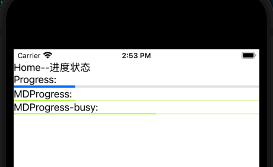

+ android效果

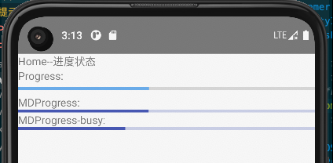

### 弹出式状态提示

上面的状态提示都仅仅是一个图标,优点是简单,但缺点也很明显--无法提示屏蔽操作.比如我们需要点击某个按钮后等待回应,在回应未完成期间不允许用户再执行其他相关操作,如果使用上面的状态提示组件我们就需要也很多重复的屏蔽逻辑.

弹出式状态提示就是解决这个问题的.它会弹出一个加载状态的页面覆盖原有页面,这样就天然的提示了当前页面不可操作.社区有实现这一功能的插件[@nstudio/nativescript-loading-indicator](https://github.com/nstudio/nativescript-plugins/blob/main/packages/nativescript-loading-indicator/README.md).它不光实现了弹出式状态提示,更丰富了弹出页的状态提示类型.支持的类型包括

+ `Indeterminate`,不定加载状态,使用圆形加载动画

    + ios
        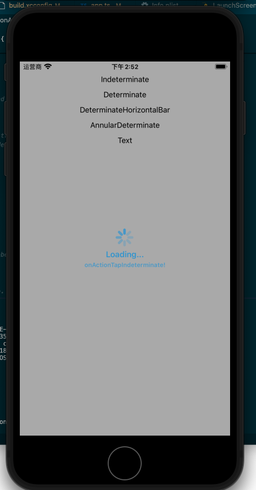
    + android
        

+ `Determinate`,确定加载状态,使用圆形进度条形式

    + ios
        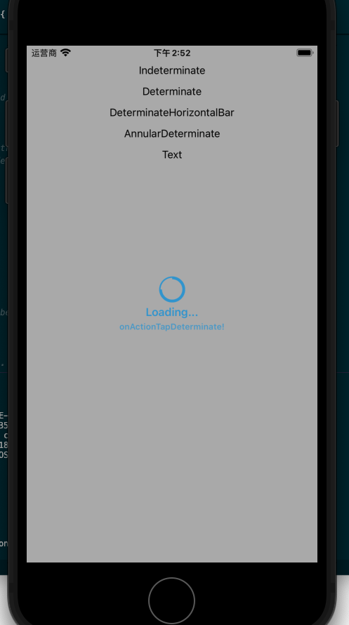
    + android
        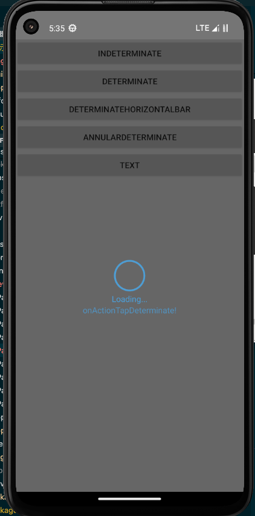

+ `DeterminateHorizontalBar`,确定加载状态,使用进度条

    + ios
        
    + android
        

+ `AnnularDeterminate`确定加载状态,使用环状进度条

    + ios
        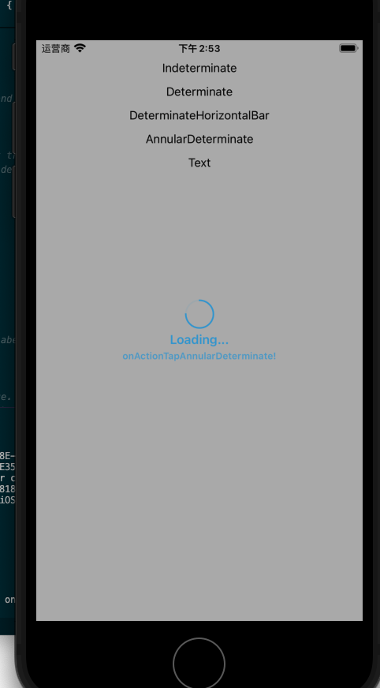
    + android
        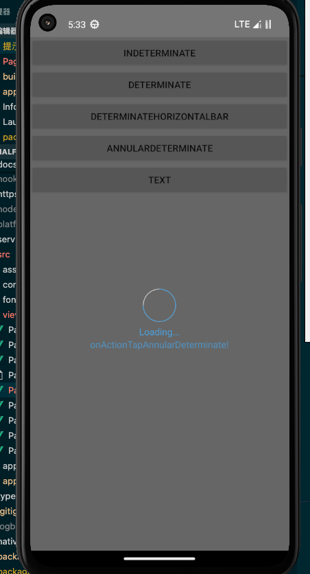

+ `Text`,文本形式

    + ios
        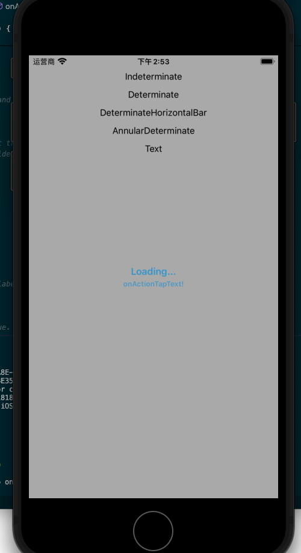
    + android
        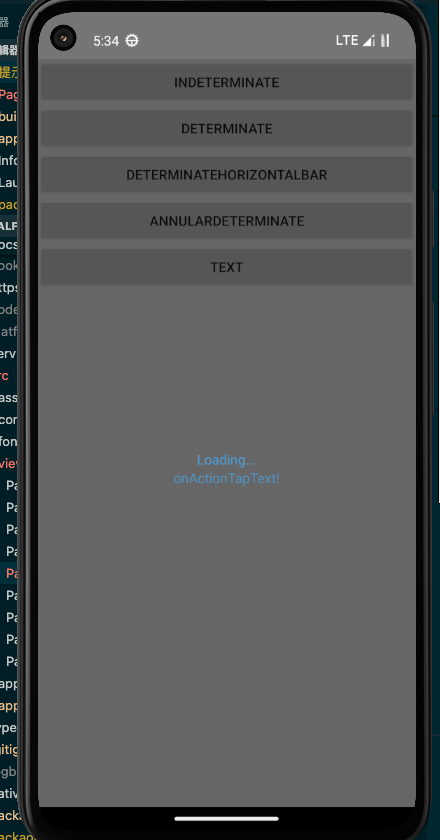

+ `CustomView`,自定义view作为弹出状态,本文就不介绍了.

#### 用法

插件使用接口`loader.show(options?: OptionsCommon)=>any`弹出状态提示,使用`loader.hide()=>void`关闭状态提示.其中`OptionsCommon`的接口为

```ts
interface OptionsCommon {
    /**
     * 加载视图上展示的标题文本信息
     */
    message?: string;
  
    /**
     * 加载视图上展示的详细文本信息
     */
    details?: string;
  
    /**
     * 加载视图上展示的文本颜色
     */
    color?: string;
  
    /**
     * 加载视图上的背景色
     */
    backgroundColor?: string;
  
    /**
     * 确定加载状态视图中的进度信息,取值范围0~1
     */
    progress?: number;
  
    /**
     * 加载视图中的信息和图标到视图挡板边缘的边距
     */
    margin?: number;
  
    /**
     * 是否允许用户交互,当为true时用户可以透过弹出视图点击后面的内容
     */
    userInteractionEnabled?: boolean;
  
    /**
     * 是否调暗弹出视图后面的内容.
     */
    dimBackground?: boolean;
  
    /**
     * 是否隐藏视图中的挡板
     */
    hideBezel?: boolean;
  
    /**
     * 视图模式
     */
    mode?: Mode;
  
    /**
     * 设置自定义视图,这里不讨论
     */
    customView?: any;
  
    /**
     * iOS 的特属设置,这里不讨论
     */
    ios?: OptionsIOS;
  
    /**
     * Android 的特殊设置,这里不讨论.
     */
    android?: OptionsAndroid;
  }
```

使用的时候我们先实例化`LoadingIndicator`,之后使用上面的接口呼出或隐藏弹出式状态提示

```ts
import { LoadingIndicator } from '@nstudio/nativescript-loading-indicator'
...

const loader = new LoadingIndicator()
loader.show(options)
loader.hide()
```

通常我们会固定设置一些参数让状态提示更加明显,同时挡住后面的操作

```ts
const options = {
    ...
    dimBackground: true,
    userInteractionEnabled: false,
    hideBezel: true,
    ...
}
```

> 不定加载状态

不定加载我们只要设置mode为`Mode.Indeterminate`即可,它会自己有加载动画.

```ts
import { Mode, OptionsCommon } from '@nstudio/nativescript-loading-indicator'
...

const options: OptionsCommon = {
    ...
    dimBackground: true,
    userInteractionEnabled: false,
    hideBezel: true,
    mode: Mode.Indeterminate,
}
loader.show(options)
```

> 固定加载状态

上面的`Mode.Determinate`,`Mode.DeterminateHorizontalBar`和`Mode.AnnularDeterminate`都是固定记载状态,固定加载状态中`progress`字段用于控制展示的当前进度,`0`就是未开始,`1`就是结束.每次一次`show()`调用展示的进度都是固定的,所以我们需要在进度变化时就调一次`show()`接口.

```ts
...
const sleep = (time: number) => new Promise((res, rej) => setTimeout(res, time));
...
for (let i of [0, 0.25, 0.5, 0.75]) {
    let options: OptionsCommon = {
        message: 'Loading...',
        details: 'onActionTapAnnularDeterminate!',
        progress: i,
        margin: 10,
        dimBackground: true,
        color: '#4B9ED6', // color of indicator and labels
        // background box around indicator
        // hideBezel will override this if true
        backgroundColor: 'yellow',
        userInteractionEnabled: false, // default true. Set false so that the touches will fall through it.
        hideBezel: true, // default false, can hide the surrounding bezel
        mode: Mode.AnnularDeterminate,
    };
    loader.show(options)
    await sleep(1000)
}
```

> 结束状态

无论是不定加载状态还是固定加载状态,我们都会在最后结束时再展示一个较短时间的`Mode.Text`的结束状态以明确等待已经结束.再这个短时间的等待结束后我们才会真正的调用`hide()`接口关闭弹出式状态提示

```ts
...
let options = {
    message: 'Loading Completed',
    details: 'onActionTapAnnularDeterminate!',
    progress: 1,
    margin: 10,
    dimBackground: true,
    color: '#4B9ED6', // color of indicator and labels
    // background box around indicator
    // hideBezel will override this if true
    backgroundColor: 'yellow',
    userInteractionEnabled: false, // default true. Set false so that the touches will fall through it.
    hideBezel: true, // default false, can hide the surrounding bezel
    mode: Mode.AnnularDeterminate,
};
loader.show(options)
await sleep(500)
loader.hide()
```

#### 例子


```vue
<template>
    <Frame>
        <Page actionBarHidden="true">
            <ScrollView>
                <StackLayout>
                    <Button text="Indeterminate" @tap="onActionTapIndeterminate" />
                    <Button text="Determinate" @tap="onActionTapDeterminate" />
                    <Button text="DeterminateHorizontalBar" @tap="onActionTapDeterminateHorizontalBar" />
                    <Button text="AnnularDeterminate" @tap="onActionTapAnnularDeterminate" />
                    <!-- <Button text="CustomView" @tap="onActionTapCustomView"/> -->
                    <Button text="Text" @tap="onActionTapText" />
                </StackLayout>
            </ScrollView>
        </Page>
    </Frame>
</template>

<script lang="ts" setup>
import { EventData } from '@nativescript/core'
import { LoadingIndicator, Mode, OptionsCommon } from '@nstudio/nativescript-loading-indicator'

const sleep = (time: number) => new Promise((res, rej) => setTimeout(res, time));

const loader = new LoadingIndicator()

async function onActionTapIndeterminate(evt: EventData) {
    const options: OptionsCommon = {
        message: 'Loading...',
        details: 'onActionTapIndeterminate!',
        margin: 10,
        dimBackground: true,
        color: '#4B9ED6',
        backgroundColor: 'yellow',
        userInteractionEnabled: false,
        hideBezel: true,
        mode: Mode.Indeterminate,
    };
    loader.show(options)
    await sleep(4000)
    loader.hide()
}

async function onActionTapDeterminate(evt: EventData) {
    for (let i of [0, 0.25, 0.5, 0.75]) {
        let options: OptionsCommon = {
            message: 'Loading...',
            details: 'onActionTapDeterminate!',
            progress: i,
            margin: 10,
            dimBackground: true,
            color: '#4B9ED6',
            backgroundColor: 'yellow',
            userInteractionEnabled: false,
            hideBezel: true,
            mode: Mode.Determinate,
        };
        loader.show(options)
        await sleep(1000)
    }
    let options = {
        message: 'Loading Completed',
        details: 'onActionTapDeterminate!',
        progress: 1,
        margin: 10,
        dimBackground: true,
        color: '#4B9ED6',
        backgroundColor: 'yellow',
        userInteractionEnabled: false,
        hideBezel: true,
        mode: Mode.Determinate,
    };
    loader.show(options)
    await sleep(500)
    loader.hide()
}
async function onActionTapDeterminateHorizontalBar(evt: EventData) {
    for (let i of [0, 0.25, 0.5, 0.75]) {
        let options: OptionsCommon = {
            message: 'Loading...',
            details: 'onActionTapDeterminateHorizontalBar!',
            progress: i,
            margin: 10,
            dimBackground: true,
            color: '#4B9ED6',
            backgroundColor: 'yellow',
            userInteractionEnabled: false, 
            hideBezel: true,
            mode: Mode.DeterminateHorizontalBar,
        };
        loader.show(options)
        await sleep(1000)
    }
    let options = {
        message: 'Loading Completed',
        details: 'onActionTapDeterminateHorizontalBar!',
        progress: 1,
        margin: 10,
        dimBackground: true,
        color: '#4B9ED6',
        backgroundColor: 'yellow',
        userInteractionEnabled: false,
        hideBezel: true,
        mode: Mode.DeterminateHorizontalBar,
    };
    loader.show(options)
    await sleep(500)
    loader.hide()
}

async function onActionTapAnnularDeterminate(evt: EventData) {
    for (let i of [0, 0.25, 0.5, 0.75]) {
        let options: OptionsCommon = {
            message: 'Loading...',
            details: 'onActionTapAnnularDeterminate!',
            progress: i,
            margin: 10,
            dimBackground: true,
            color: '#4B9ED6',
            backgroundColor: 'yellow',
            userInteractionEnabled: false,
            hideBezel: true,
            mode: Mode.AnnularDeterminate,
        };
        loader.show(options)
        await sleep(1000)
    }
    let options = {
        message: 'Loading Completed',
        details: 'onActionTapAnnularDeterminate!',
        progress: 1,
        margin: 10,
        dimBackground: true,
        color: '#4B9ED6',
        backgroundColor: 'yellow',
        userInteractionEnabled: false,
        hideBezel: true,
        mode: Mode.AnnularDeterminate,
    };
    loader.show(options)
    await sleep(500)
    loader.hide()
}

async function onActionTapText(evt: EventData) {
    let options: OptionsCommon = {
        message: 'Loading...',
        details: 'onActionTapText!',
        margin: 10,
        dimBackground: true,
        color: '#4B9ED6',
        backgroundColor: 'yellow',
        userInteractionEnabled: false,
        hideBezel: true,
        mode: Mode.Text,
    };
    loader.show(options)
    await sleep(4000)
    options = {
        message: 'Completed!',
        details: 'onActionTapText!',
        margin: 10,
        dimBackground: true,
        color: '#4B9ED6',
        backgroundColor: 'yellow',
        userInteractionEnabled: false,
        hideBezel: true,
        mode: Mode.Text,
    };
    loader.show(options)
    await sleep(500)
    loader.hide()
}
</script>
```

## 交互提示

交互提示指的当然是那种可以进行交互的提示,比较传统的是对话框,更加现代一点的则是顶部Banner/底部Snackbar.

通常来说我们可以将交互提示的特点总结如下表:

| 类型         | 提示重要性 |
| ------------ | ---------- |
| 底部Snackbar | 低         |
| 顶部Banner   | 中         |
| 对话框       | 高         |

底部Snackbar位置不会很醒目,一般用于不太重要的提示,这些提示一般你可以手动关掉或者设置成一定时间内没有操作就自动关掉;
顶部Banner位置相对更显眼些因为一旦出现就会挡住用户视线的最起始位置,一般用于警告,报错,重要信息提示等,类似于flask中的alert.一般点击关闭,一段时间不管也会自动关闭;
对话框会强制跳出当前页,用户的注意力会被强制转移到对话框,这是一种打断行为所以一般用于最重要的提示

但因为通常系统级的消息提示都在顶部,因此一般app中交互提示只会用底部Snackbar和对话框

### 底部Snackbar

组件[@nativescript-community/ui-material-snackbar](https://www.npmjs.com/package/@nativescript-community/ui-material-snackbar)提供了对底部Snackbar的支持.要用它我们需要安装`@nativescript-community/ui-material-snackbar`,然后在需要用到的文件中导入其中的对应方法即可.

```ts
import { SnackBar, showSnack } from '@nativescript-community/ui-material-snackbar';
```

其中`SnackBar`是一个类,它提供了几个接口用于在不同的情况下唤出SnackBar;`showSnack`则可以理解为是一个快捷方式,它使用参数构造SnackBar.通常这俩不会同时使用,个人更倾向于用`showSnack`.

我们调用`showSnack(SnackBarOptions):Promise<showSnackResult>`方法来呼出SnackBar,其中`showSnackResult`包里并没有给需要我们自己定义:

```ts
interface showSnackResult {
  command: SnackBarAction;
  reason: DismissReasons;
  event: number;
}
```

`SnackBarOptions`包里有定义:

```ts
interface SnackBarOptions {
    /**
     * The action button text of the snackbar.
     */
    actionText?: string;

    /**
     * The text of the snackbar.
     */
    message: string;

    /**
     * Delay in ms to hide the snackbar.
     * Note: iOS only allows a maximum of 10s. If the value is more than that for iOS, the hideDelay will be set to 10s
     */
    hideDelay?: number;

    /**
     * Action Text Color of the snackbar.
     */
    actionTextColor?: string;

    /**
     * Text Color of the snackbar.
     */
    textColor?: string;

    /**
     * Background Color of the snackbar.
     */
    backgroundColor?: string;
    /**
     * *Android Only*
     * Set the maxLines if you are displaying a long string of text and it will wrap.
     */
    maxLines?: number;

    /**
     * *Android Only*
     * Use RTL for textview of snackbar.
     */
    isRTL?: boolean;
    /**
     * optional View to attach the snack to
     */
    view?: View;
    /**
     * The view you want to "anchor the snack above".
     * The snackbar will appear above that view
     */
    anchorView?: View;
}
```

> 例子:我们使用一个按钮来呼出Snackbar

```Vue
<template>
    <Frame>
        <Page actionBarHidden="true">
            <StackLayout>
                <Label text="Home" id="banner" ref="banner"></Label>
                <Button text="snackbar" @tap="onActionTapSnackbar" />
            </StackLayout>
        </Page>
    </Frame>
</template>
    
<script lang="ts" setup>
import { EventData } from "@nativescript/core/data/observable";
import { showSnack, SnackBarAction, DismissReasons } from "@nativescript-community/ui-material-snackbar";
interface showSnackResult {
    command: SnackBarAction;
    reason: DismissReasons;
    event: number;
}

function onActionTapSnackbar(evt: EventData) {
    showSnack({
        message: "this is test snack with action!",
        actionText: "done",
    }).then((r: showSnackResult) => {
        console.log("showSnack result", r);
    });
}
</script>
```

+ ios效果

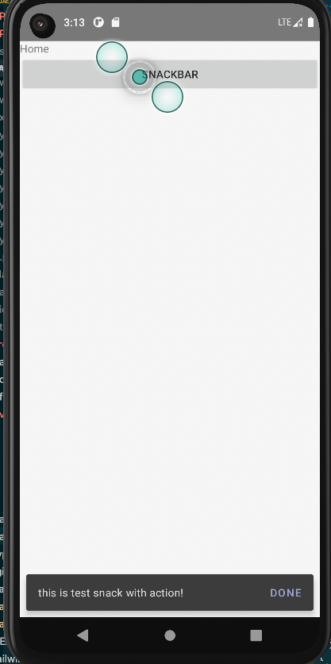

+ android效果

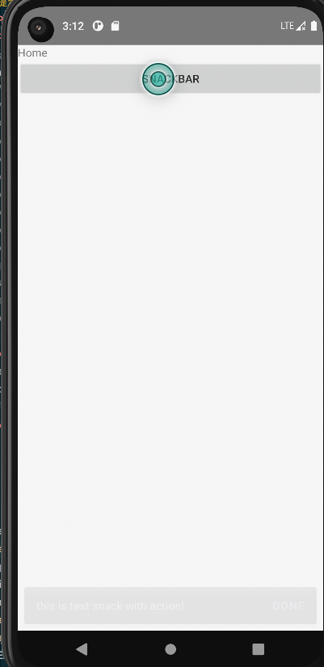

### toasty

`toasty`是一种样式像吐司机弹出吐司一样的交互提示弹框,可以看做是snackbar的一种特殊样式.triniwiz大神提供了插件[@triniwiz/nativescript-toasty](https://github.com/triniwiz/nativescript-plugins/blob/main/packages/nativescript-toasty/README.md)来实现这种交互提示样式.
用法上和上面的snackbar非常接近,但亲测其针对位置参数在android下并不生效,我们不妨就当它只能和底部snackbar一样使用就好了.

`toasty`通过实例化并调用`show()=>void`接口来弹出提示框.

```ts
import { Toasty, ToastDuration, ToastPosition } from '@triniwiz/nativescript-toasty'

const toast = new Toasty(opts: ToastyOptions)
toast.show()
```

其中`ToastyOptions`满足接口

```ts
interface ToastyOptions {
    /**
     * 提示文本
     */
    text: string;

    /**
     * 提示时长,可选有`ToastDuration.SHORT`(2s)和`ToastDuration.LONG`(3s)
     */
    duration?: ToastDuration;

    /**
     * 提示文本颜色
     */
    textColor?: Color | string;

    /**
     * 提示框背景色
     */
    backgroundColor?: Color | string;

    /**
     *  是否点击提示框触发关闭提示
     */
    tapToDismiss?: boolean;
}
```

> 例子: 我们通过按键呼出toasty提示

```vue
<template>
    <Frame>
        <Page actionBarHidden="true">
            <StackLayout>
                <Button ref="anchor" text="Simple Toast" @tap="onActionTapToast" />
                <Button text="Special Place Toast" @tap="onActionTapSpecialPlaceToast" />
            </StackLayout>
        </Page>
    </Frame>
</template>

<script lang="ts" setup>
import { ref } from "nativescript-vue"
import { EventData, Button } from "@nativescript/core"
import { Toasty, ToastDuration } from '@triniwiz/nativescript-toasty'

const anchor = ref()

function onActionTapToast(evt: EventData) {
    const toast = new Toasty({ text: 'Toast message', duration: ToastDuration.SHORT })
    toast.show()
}
function onActionTapSpecialPlaceToast(evt: EventData) {
    const ele = anchor.value._nativeView as Button
    const toast = new Toasty({ text: 'Toast message', duration: ToastDuration.LONG, tapToDismiss: true })
    toast.show()
}
</script>
```

+ ios效果

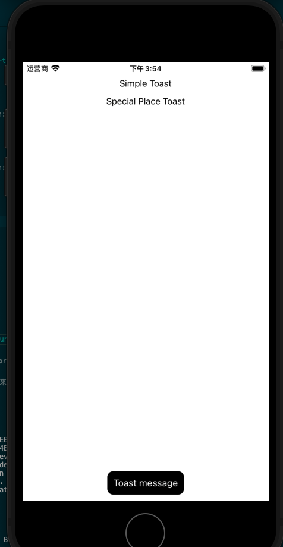

+ android效果

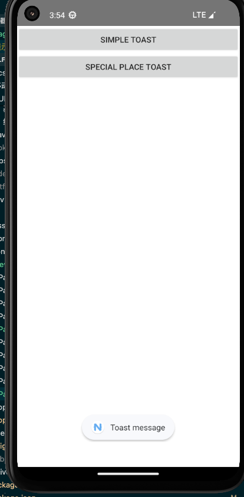

### banner

顶部banner的形式通常是从上向下弹出一个提示框.官方和`nativescript-community`都没有提供banner相关的组件,但github上有个远古时期的插件[nativescript-feedback](https://github.com/EddyVerbruggen/nativescript-feedback)亲测可用.
它不仅提供了banner位置的交互提示功能,还顺便提供了相同样式风格底部snackbar的功能.

用法接近上面snackbar的类实例化的用法.一样是安装好后在用到的地方import进来实例化后调接口即可.

```ts
import {Feedback, FeedbackPosition} from "nativescript-feedback";;
```

其中`Feedback`是一个类,它提供了如下接口:

+ `show(options: FeedbackShowOptions): Promise<void>`,通用的展示接口
+ `hide(options?: FeedbackHideOptions): Promise<void>`,通用的关闭展示接口
+ `success(options: FeedbackShowOptions): Promise<void>`,用于成功提示,默认是绿色背景
+ `warning(options: FeedbackShowOptions): Promise<void>`,用于警告提示,默认是橙黄色背景
+ `error(options: FeedbackShowOptions): Promise<void>`,用于错误提示,默认是红色背景
+ `info(options: FeedbackShowOptions): Promise<void>`,用于提示普通信息,默认是墨色背景

我们通常会在参数中设置如下字段:

+ `title`,提示标题文本
+ `message`,提示信息文本
+ `duration`,自动关闭间隔时间
+ `position`,展示位置,可选`FeedbackPosition.Bottom`,`FeedbackPosition.Top`(默认)
+ `onTap`,提示块点击后的回调,点击后提示会关闭
+ `onShow`,提示块展示后的回调
+ `onHide`,提示块隐藏后的回调

> 例子:我们使用一个按钮来呼出Banner提示

```Vue
<template>
    <Frame>
        <Page actionBarHidden="true">
            <StackLayout>
                <Label text="Home" id="banner" ref="banner"></Label>
                <Button text="Banner" @tap="onActionTapbaner" />
            </StackLayout>
        </Page>
    </Frame>
</template>
    
<script lang="ts" setup>
import { EventData } from "@nativescript/core/data/observable";
import {Feedback, FeedbackPosition} from "nativescript-feedback";

const feedback = new Feedback();

function onActionTapbaner(evt: EventData) {
    feedback.warning({
        message: "a warning right?",
        position: FeedbackPosition.Top,
        onTap: () => console.log("showFeedbackMax tapped"),
        onHide: () => console.log("showFeedbackMax hidden")
    });
}
</script>
```

+ ios效果


+ android效果


### 对话框提示

对话框提示一般是由一些状态触发的,它会弹出一个对话框,我们可以在其中进行一些操作,操作完成后对话框关闭.nativescript中已经预设了几种对话框类型,他们都维护在`@nativescript/core/ui/dialogs`中,使用时像下面这样导入就可以使用:

```ts
import { login, alert, prompt } from "@nativescript/core/ui/dialogs";
```

同时社区也提供了他们的material版本[@nativescript-community/ui-material-dialogs](https://www.npmjs.com/package/@nativescript-community/ui-material-dialogs),要用它我们需要安装`@nativescript-community/ui-material-dialogs`,然后在需要用到的文件中导入其中的对应方法替代原生版本.

```ts
import { login, alert, prompt } from "@nativescript-community/ui-material-dialogs";
```

+ AlertDialog

    通过调用方法`alert(string| AlertOptions):Promise<void>`弹出一个带取消按钮`ok`的对话框从而起到提示作用.这种方式只是纯为了提示,个人认为会比较突兀.

    其中

    ```ts
    interface AlertOptions{
        cancelable?:boolean;
        message?:string;
        okButtonText?:string;
        title?:string;
    }
    ```

+ ConfirmDialog

    通过调用方法`confirm(string | ConfirmOptions):Promise<boolean>`弹出一个带确认和取消两个按钮的对话框,一般用于进行确认.其中

    ```ts
    interface ConfirmOptions{
        cancelable?:boolean;
        message?:string;
        title?:string;
        cancelButtonText?:string;
        okButtonText?:string;
        neutralButtonText?:string;
    }
    ```

+ ActionDialog

    通过调用方法`action(主题文本:string,取消按钮文本:string,选项:array<string>):Promise<string>`或者`action(ActionOptions):Promise<string>`弹出包含可选的选项列表和取消按钮的对话框.一般用于选项过多的单选.

    其中

    ```ts
    interface ActionOptions{
        actions?: Array<string>;
        cancelButtonText?:string;
        cancelable?:boolean;
        destructiveActionsIndexes?:Array<number>;
        message?:string;
        title?:string;
    }
    ```

+ LoginDialog

    通过调用方法`login(LoginOptions):Promise<LoginResult>`弹出包含用户名密码输入框以及取消和确认按钮的对话框.一般用于用户登录,实话说现在已经不流行这种用法了.

    其中

    ```ts
    interface LoginOptions{
        cancelButtonText?:string;
        cancelable?:boolean;
        message?:string;
        neutralButtonText?:string;
        okButtonText?:string;
        title?:string;
        password?:string;
        passwordHint?:string;
        userName?:string;
        userNameHint?:string;
    }

    interface LoginResult{
        password: string;
        result: boolean;
        userName: string;
    }
    ```

+ PromptDialog

    通过调用方法`prompt(PromptOptions):Promise<PromptResult>`弹出包含一个文本输入框以及取消和确认按钮的对话框.一般用于问答之类的提示

    其中

    ```ts
    interface PromptOptions{
        cancelButtonText?:string;
        cancelable?:boolean;
        capitalizationType?:string;
        defaultText?:string;
        inputType?:string;
        message?:string;
        neutralButtonText?:string;
        okButtonText?:string;
        title?:string;
    }

    interface LoginResult{
        result: boolean;
        text: string;
    }
    ```

> 例子:我们使用一个按钮来呼出alert提示

```ts
<template>
    <Frame>
        <Page actionBarHidden="true">
            <StackLayout>
                <Label text="Home" id="banner" ref="banner"></Label>
                <Button text="alert" @tap="onActionTapAlert" />
            </StackLayout>
        </Page>
    </Frame>
</template>
    
<script lang="ts" setup>
import { EventData } from "@nativescript/core/data/observable";
import { alert } from "@nativescript-community/ui-material-dialogs";


function onActionTapAlert(evt: EventData) {
    alert("this is a alert")
}
</script>
```

+ android效果

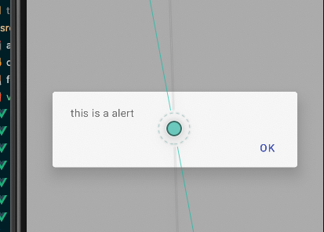


### 自定义弹窗

对话提示框依然局限于简单的交互形式,如果我们有更强的风格化定制化需求就需要使用[自定义弹窗(popover)](https://v4.mui.com/zh/components/popover/).社区提供了[@nativescript-community/ui-popover](https://github.com/nativescript-community/ui-popover),不过目前暂时不支持vue3.等到支持的时候我会回来填坑的.