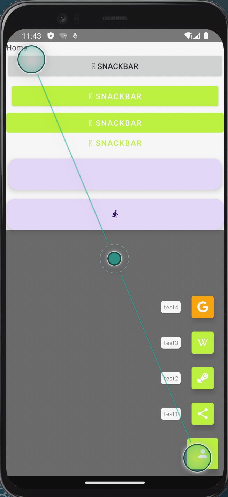
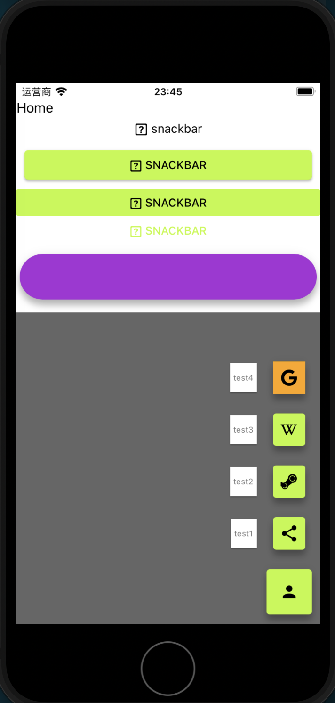
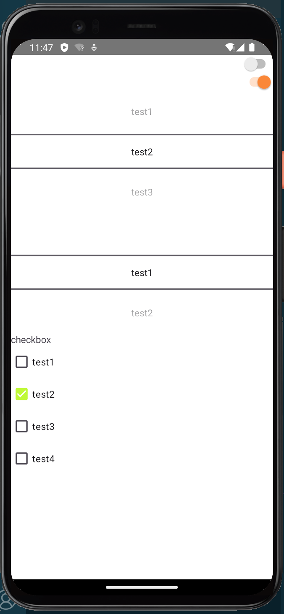
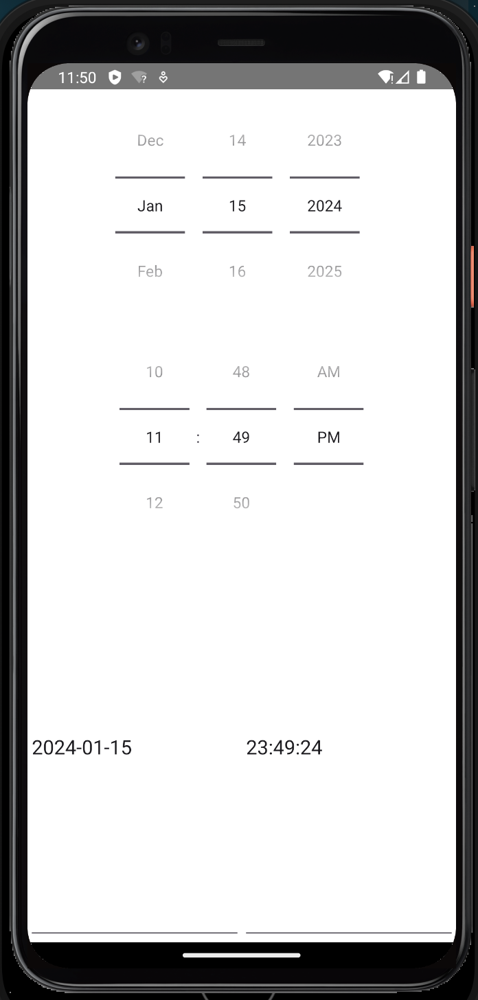
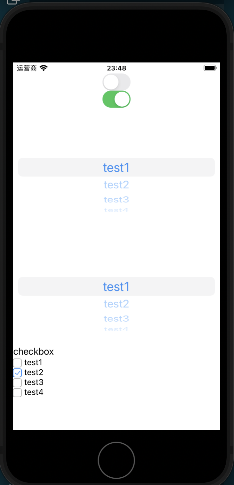
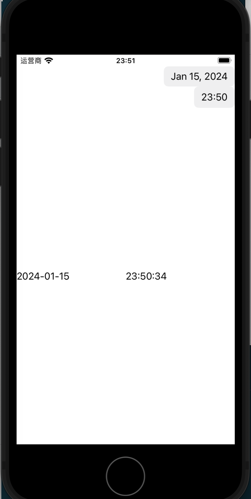
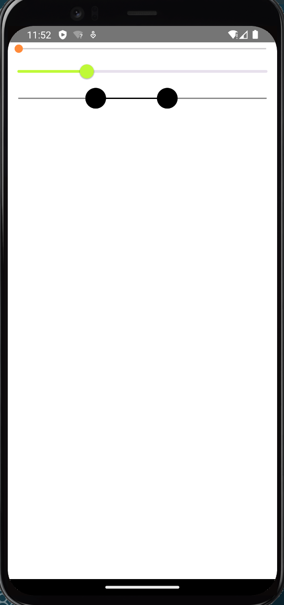
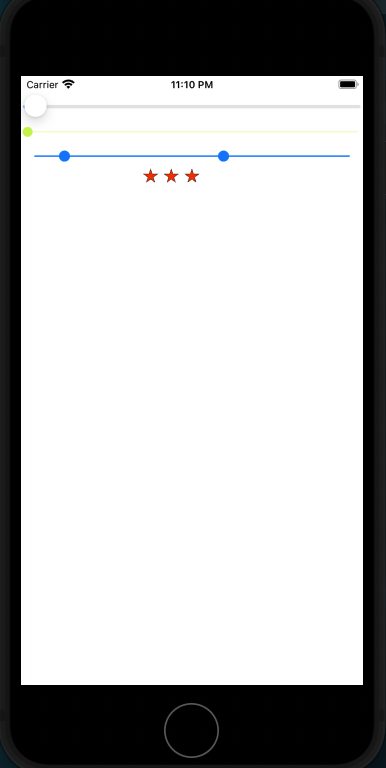
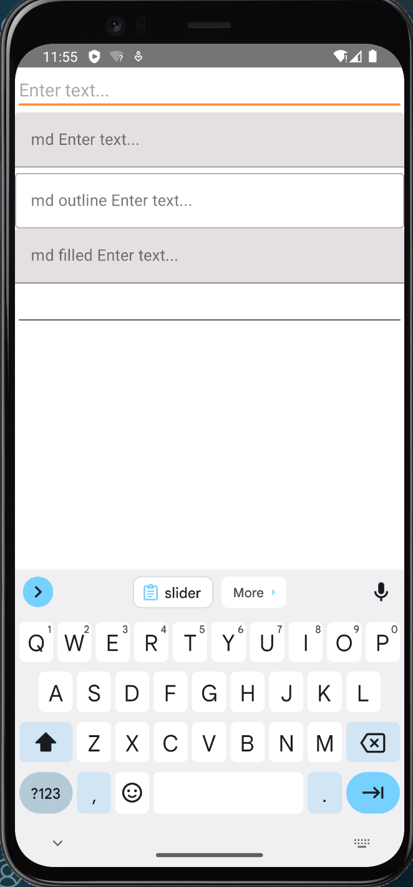
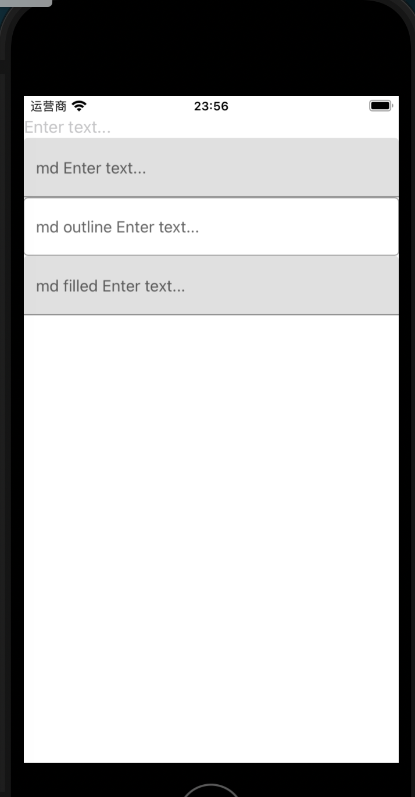

# 输入型组件

由于移动设备屏幕小,一般没有表单概念,表单功能一般直接由一个页面提供.因此输入型组件主要都是些单独功能的组件,可以分为按钮,开关,选择器,多选器,滑块,时间选择器,文本输入框这么几个大类.native-script原生基本都有提供,社区也提供了一些.

## 按钮类

所谓按钮类是一类依靠点击行为驱动的输入型组件,一般通过绑定`tap`,`doubleTap`,`longPress`这些行为事件触发回调实现交互.一般用来触发一些操作.

### 普通按钮

按钮是最基础的按钮类组件,表现形式上就是朴实无华的一个按钮块

#### Button

[Button](https://nativescript-vue.org/cn/docs/elements/components/button/)是原生的按钮组件,它只有`text`和`textWrap`两个属性,.值得注意的是对于图标的处理,在`资源设置`部分已经介绍过如何导入图标,Button的图标只要`text`中填入对应的`unicode`即可

#### MDButton

[@nativescript-community/ui-material-button](https://www.npmjs.com/package/@nativescript-community/ui-material-button),material风格的按钮,是`Button`组件的扩展.其用法也是它的超集,增加了`variant`属性用于确定基本样式,支持`contained`(默认,凸起按钮),`flat`(扁平按钮),`text`(文本按钮)三种.要用它我们当然需要先设置Material.然后安装`@nativescript-community/ui-material-button`,然后在入口文件中导入它

```ts
import ButtonPlugin from '@nativescript-community/ui-material-button/vue';

...

createApp(Home).use(ButtonPlugin);
```

### 悬浮操作按钮(FAB)

悬浮按钮应该是移动端特有的一种按钮类型,它本质上还是按钮,只是被特化为圆形只有图标的形式,一般放在屏幕右侧,相当醒目. 悬浮操作按钮一般放在突出显眼的位置,用于呼出菜单或者官方鼓励的高频快捷操作,在移动端设计上是一种比较常用的组件,比如百度贴吧的发帖按钮就是一个悬浮操作按钮.

#### MDFloatingActionButton

[@nativescript-community/ui-material-floatingactionbutton](https://www.npmjs.com/package/@nativescript-community/ui-material-floatingactionbutton)是material风格的悬浮操作按钮(FAB),依然是`Button`组件的扩展,只是其样式为悬浮图标.

该按钮官方只推荐使用额外的属性`src`来指定一个已经注册的图片资源来作为图标.我个人尝试过使用`text`设置图标,配合`style`也可以做到构造一个圆形的按钮,但符号无法居中也无法设置颜色.

要用它我们当然需要先设置Material.然后安装`@nativescript-community/ui-material-floatingactionbutton`,然后在入口文件中导入它

```ts
import FloatingActionButtonPlugin from '@nativescript-community/ui-material-floatingactionbutton/vue';

createApp(Home).use(FloatingActionButtonPlugin);
```

#### fab

[@nstudio/nativescript-floatingactionbutton](https://github.com/nstudio/nativescript-floatingactionbutton)**推荐使用**,另一个material风格的悬浮操作按钮(FAB),相比`@nativescript-community/ui-material-floatingactionbutton`的优势是可以完美使用`text`设置图标,劣势是需要设置style.使用方法是需要在入口文件中导入

```ts
registerElement(
    'Fab',
    () => require('@nstudio/nativescript-floatingactionbutton').Fab
)
```

### 快速拨号菜单(Speed dial)

快速拨号菜单可以理解为FAB的集成扩展,其形式就是展示一个图标按钮,点击后会呼出菜单让用户进行选择.

#### MDSpeedDial

[@nativescript-community/ui-material-speeddial](https://www.npmjs.com/package/@nativescript-community/ui-material-speeddial)实现了这一功能,旦他有几个缺陷:

1. 与底层导航冲突,底层导航会占掉约一半的快速拨号菜单启动按钮
2. 按钮无法设置为圆形,只能是固定的方形
3. 位置固定只有两个选择,要么左下角(默认)要么右下角,它通过属性`horizontalAlignment`选择`left`或者`right`确定

要用它我们当然需要先设置Material.然后安装`@nativescript-community/ui-material-speeddial`,然后在入口文件中导入它

```ts
import speeddialPlugin from '@nativescript-community/ui-material-speeddial/vue';

createApp(Home).use(speeddialPlugin)
```

### 例子

```Vue
<template>
    <Frame>
        <Page actionBarHidden="true">
            <StackLayout>
                <Label text="Home" id="banner" ref="banner"></Label>
                <Button :text="mood_snackbar" @tap="onActionTap" @doubleTap="onActionDoubleTap"
                    @longPress="onActionLongPress" class="mdi" />
                <MDButton :text="mood_snackbar" @tap="onActionTap" @doubleTap="onActionDoubleTap"
                    @longPress="onActionLongPress" class="mdi" />
                <MDButton :text="mood_snackbar" @tap="onActionTap" @doubleTap="onActionDoubleTap"
                    @longPress="onActionLongPress" variant="flat" class="mdi" />
                <MDButton :text="mood_snackbar" @tap="onActionTap" @doubleTap="onActionDoubleTap"
                    @longPress="onActionLongPress" variant="text" class="mdi" />
                <MDFloatingActionButton rippleColor="blue" src="res://logo" @tap="onActionTap"
                    @doubleTap="onActionDoubleTap" @longPress="onActionLongPress" />

                <fab rippleColor="blue" :text="iconUnicode('\uf214')" class="mdi" @tap="onActionTap" ></fab>

                <MDSpeedDial :text="iconUnicode('\uf207')" buttonClass="mdi" horizontalAlignment="right">
                    <MDSpeedDialItem :text="iconUnicode('\uf35b')" title="test1" buttonClass="mdi" @tap="onActionTap" />
                    <MDSpeedDialItem :text="iconUnicode('\uf35e')" title="test2" buttonClass="mdi" @tap="onActionTap" />
                    <MDSpeedDialItem :text="iconUnicode('\uf362')" title="test3" buttonClass="mdi" @tap="onActionTap" />
                    <MDSpeedDialItem :text="iconUnicode('\uf34e')" title="test4" buttonClass="mdi" backgroundColor="orange"
                        @tap="onActionTap" />
                </MDSpeedDial>
            </StackLayout>
        </Page>
    </Frame>
</template>
    
<script lang="ts" setup>
import { EventData } from "@nativescript/core/data/observable";

const mood_unicode = "\uf214"
const mood_snackbar = `${mood_unicode} snackbar`
function iconUnicode(icon: string): string {
    return `${icon}`;
}
function onActionTap(evt: EventData) {
    console.log("tap ok");
}
function onActionDoubleTap(evt: EventData) {
    console.log("double tap ok");
}
function onActionLongPress(evt: EventData) {
    console.log("long press ok");
}
</script>
```

+ andoird样式
    

+ ios样式
    

### 总结

下面是不同按钮的总结列表

| 组件                     | 类型         | 场景                       |
| ------------------------ | ------------ | -------------------------- |
| `Button`                 | 普通按钮     | 通用                       |
| `MDButton`               | 普通按钮     | 使用mdi样式的场景          |
| `MDFloatingActionButton` | 悬浮按钮     | 使用图片作为按钮图标的场景 |
| `fab`                    | 悬浮按钮     | 使用font作为按钮图标的场景 |
| `MDSpeedDial`            | 快速拨号按钮 | 通用                       |

## 选择类

选择类组件是在几个候选项中选择若干个元素作为输入的组件,根据候选范围和可选个数又可以进一步细分.一般用来输入枚举型的数据

### 开关

开关组件一般用于输入boolean类型的数据,目前只找到了官方组件[Switch](https://nativescript-vue.org/cn/docs/elements/components/switch/).并没有其他社区实现.

一般用法有两种:

+ 使用v-mode绑定一个变量

    ```Vue
    <Switch v-model="itemEnabled" />
    ```

+ 设置初始值并监听变化:

    ```Vue
    <Switch checked="true" @checkedChange="callback" />
    ```

### 单选器

单选器组件一般用于多选一,比如选择地址一般会用省,市,区三级选择器,目前只找到了官方组件[ListPicker](https://nativescript-vue.org/cn/docs/elements/components/list-picker/),并没有其他社区实现.

一般用法有两种:

+ 给以一个初始的选择列表,使用v-mode绑定一个变量用于获取被选择的值

    ```Vue
    <ListPicker :items="listOfItems" v-model="selectedItem" />
    ```

+ 给以一个初始的选择列表和一个初始的选择,通过监听变化实现功能

    ```Vue
    <ListPicker :items="listOfItems" selectedIndex="0" @selectedIndexChange="callback" />
    ```

### 多选器

官方并没有给出多选器,但社区给了[@nativescript-community/ui-checkbox](https://github.com/nativescript-community/ui-checkbox#nativescript-vue-usage-sample)组件让我们可以用它组合构造多选器,要使用我们需要先安装`@nativescript-community/ui-checkbox`,然后在入口文件处注册:

```ts
import CheckBoxPlugin from '@nativescript-community/ui-checkbox/vue';

createApp(Home).use(CheckBoxPlugin);
```

需要注意这个插件完成度不高,并不支持v-mode方式双向绑定,一个比较通用的写法是用代码手工绑定

### 时间选择器

原生提供了日期选择器[DatePicker](https://nativescript-vue.org/cn/docs/elements/components/date-picker/)和时间选择器[TimePicker](https://nativescript-vue.org/cn/docs/elements/components/time-picker/),它们用法基本一样也是两种

+ 使用v-mode绑定一个变量

    ```Vue
    <DatePicker v-model="selectedDate" />
    <TimePicker v-model="selectedTime" />
    ```

+ 设置初始值并监听变化:

    ```Vue
    <DatePicker :date="someDate" @dateChange="onValueChanged"/>
    <TimePicker :hour="selectedHour" :minute="selectedMinute" @timeChange="onValueChanged"/>
    ```

社区也实现了[@nativescript/datetimepicker](https://github.com/NativeScript/nativescript-datetimepicker),它除了有上面两种选择器外,还额外提供了一个用于选择日期+时间的组件`DateTimePickerFields`,要用它我们需要先安装`@nativescript/datetimepicker`,然后在入口文件中注册

```ts
import DateTimePickerPlugin from "@nativescript/datetimepicker/vue";

createApp(Home).use(DateTimePickerPlugin);
```

### 例子

```vue
<template>
...
<StackLayout>
  <Switch v-model="itemEnabled" />
  <Switch checked="true" @checkedChange="switch_callback" />
  <ListPicker :items="listOfItems" v-model="listpicker_selectedItem" />
  <ListPicker :items="listOfItems" selectedIndex="0" @selectedIndexChange="ListPicker_callback" />

  <Label text="checkbox" />
  <template v-for="(item, index)  in  listOfItems " :key="index">
      <check-box :text="item" :checked="isChecked[index]" @checkedChange="isChecked[index] = $event.value" />
  </template>

   <DatePicker v-model="selectedDate" />
    <TimePicker v-model="selectedTime" />
    <DateTimePickerFields hintDate="select date" hintTime="select time" @dateChange="selectedDatetime=$event.value" :date="selectedDatetime" locale="zh_cn" dateFormat="yyyy-MM-dd" timeFormat="HH:mm:ss" pickerTitleDate="choose date" pickerTitleTime="choose time"/>
</StackLayout>
...
</template>

<script lang="ts" setup>
import { ref, watch } from "nativescript-vue";
import { PropertyChangeData } from "@nativescript/core/data/observable";

const itemEnabled = ref(false)
function switch_callback(evt: PropertyChangeData): void {
    console.log(`switchcallback get args`)
}

const listOfItems = ref(["test1", "test2", "test3", "test4"])
const listpicker_selectedItem = ref("test1")
function ListPicker_callback(evt: PropertyChangeData): void {
    console.log(`ListPickercallback get args`)
}

const isChecked = ref([false, false, false, false])
watch(isChecked, (newValue) => {
    console.log(`isChecked changed to ${newValue}`)
}, { deep: true, immediate: true })

let now = new Date()
const selectedDate = ref(now)
const selectedTime = ref(now)
const selectedDatetime = ref(now)
</script>
```

+ andoird样式
    
    

+ ios样式
    
    

### 总结

下面是不同选择类的总结列表

| 组件                   | 类型           | 场景 |
| ---------------------- | -------------- | ---- |
| `Switch`               | 开关           | 通用 |
| `ListPicker`           | 单选器         | 通用 |
| `check-box`            | 多选器         | 通用 |
| `DatePicker`           | 日期选择器     | 通用 |
| `TimePicker`           | 时间选择器     | 通用 |
| `DateTimePickerFields` | 时间日期选择器 | 通用 |

## 滑块类

滑块类组件可以通过滑块在一个连续的范围内选定一个值或一个范围,一般用来输入number型的数据

### 滑块

滑块官方有提供实现,社区也有实现

#### Slider

[Slider](https://nativescript-vue.org/cn/docs/elements/components/slider/)是官方的原生组件,一般用法有两种:

+ 使用v-mode绑定一个变量

    ```Vue
    <Slider v-model="value" />
    ```

+ 设置初始值并监听变化:

    ```Vue
    <Slider value="80" @valueChange="onValueChanged" />
    ```

#### MDSlider

[@nativescript-community/ui-material-slider](https://www.npmjs.com/package/@nativescript-community/ui-material-slider)是material风格的按钮,是`Button`组件的扩展.要用它我们当然需要先设置Material.然后安装`@nativescript-community/ui-material-slider`,然后在入口文件中导入它

```ts
import SliderPlugin from '@nativescript-community/ui-material-slider/vue';

createApp(Home).use(SliderPlugin);
```

它的用法和原生的基本相同,只是多出几个属性可以设置样式:

+ `stepSize` 每步的步长,如果不设置则为连续滑块
+ `trackFillColor`跟踪填充色,默认为`colorPrimary`
+ `trackBackgroundColor`跟踪背景色
+ `thumbColor`滑块颜色,默认为`colorPrimary`

### 范围选择条RangeSeekBar

[@nativescript-community/ui-range-seek-bar](https://github.com/nativescript-community/ui-range-seek-bar),社区开源的范围选择条,要使用需要先安装`@nativescript-community/ui-range-seek-bar`,然后在入口文件中导入

```ts
import SekkBarPlugin from '@nativescript-community/ui-range-seek-bar/vue';

createApp(Home).use(SekkBarPlugin);
```

使用时需要区分几个属性

+ `minValue`可选范围的最小值
+ `maxValue`可选范围的最大值
+ `valueMin`选中范围的最小值
+ `valueMax`选中范围的最大值
+ `minRange`最小的范围值

其他属性只和样式有关,可以参考官方文档

### 例子:

```Vue
<template>
    <Frame>
        <Page actionBarHidden="true">
            <StackLayout>
                <Slider v-model="slider_value" minValue="0" maxValue="100" />
                <MDSlider v-model="md_slider_value" minValue="0" maxValue="100" />
                <RangeSeekBar col="1" :minValue="rangeSeekBarProp.minValue" :maxValue="rangeSeekBarProp.maxValue"
                    :valueMin="rangeSeekBarProp.valueMin" :valueMax="rangeSeekBarProp.valueMax"
                    :minRange="rangeSeekBarProp.minRange" :step="rangeSeekBarProp.step" @valueChanged="valueChanged($event)"
                    @finalValueChanged="finalValueChanged($event)" class="range-seek-bar" />
            </StackLayout>
        </Page>
    </Frame>
</template>

<script lang="ts" setup>
import { ref } from "nativescript-vue";
import { RangeSeekBarEventData } from '@nativescript-community/ui-range-seek-bar';

const slider_value = ref(0.5)
const md_slider_value = ref(0.5)
const rangeSeekBarProp = ref({
    minValue: 0,
    maxValue: 100,
    valueMin: 10,
    valueMax: 60,
    minRange: 10,
    step: 2.4,
})

function valueChanged(event: RangeSeekBarEventData) {
    Object.assign(this.rangeSeekBarProp, event.value);
}
function finalValueChanged(event: RangeSeekBarEventData) {
    Object.assign(this.rangeSeekBarProp, event.value);
}
</script>


<style scoped>
.range-seek-bar {
    bar-color: #8990c4;
    bar-highlight-color: #2434ad;
    thumb-color: #1a246d;
    bar-height: 10;
    corner-radius: 30;
}
</style>

```

+ andoird样式
    

+ ios样式
    

### 总结

下面是不同滑块类的总结列表

| 组件           | 类型     | 场景              |
| -------------- | -------- | ----------------- |
| `Slider`       | 单值滑条 | 通用              |
| `MDSlider`     | 单值滑条 | 使用mdi样式的场景 |
| `RangeSeekBar` | 范围滑条 | 通用              |

## 文本输入类

文本输入类组件会给一个带光标的输入空间,一般用来输入字符串型数据

### 输入框

输入框通常用于输入一行文本,按回车通常表示输入结束

#### TextField

[TextField](https://nativescript-vue.org/cn/docs/elements/components/text-field/)是原生的文本输入框,基本用法也是两种:

+ 使用v-mode绑定一个变量

    ```Vue
    <TextField v-model="textFieldValue" />
    ```

+ 设置初始值并监听变化:

    ```Vue
    <TextField :text="textFieldValue" hint="Enter text..." @textChange="cb1" @returnPress="cb2"/>
    ```

#### MDTextField

[@nativescript-community/ui-material-textfield](https://www.npmjs.com/package/@nativescript-community/ui-material-textfield)是社区提供的material风格的文本输入框,是`TextField`组件的扩展.要用它我们当然需要先设置Material.然后安装`@nativescript-community/ui-material-textfield`,然后在入口文件中导入它

```ts
import TextFieldPlugin from '@nativescript-community/ui-material-textfield/vue';

createApp(Home).use(TextFieldPlugin);
```

`@nativescript-community/ui-material-textfield`是`TextField`组件的扩展,其用法也是它的超集,增加了`variant`属性用于确定提示语的基本样式,支持`underline`(默认,即在顶部线下),`outline`(在顶部线上),`filled`(填充)三种.

### 文本视图

长文本输入型组件目前只有有官方组件[TextView](https://nativescript-vue.org/cn/docs/elements/components/text-view/).我们在内容展示组件部分已经介绍过其不可编辑状态的用法.
它用于输入和编辑多行文本只需要删掉`editable="false"`即可.作为可编辑的长文本组件,我们通常用`v-model`绑定变量的方法获取输入的文本数据,也可以监听事件`textChange`和`returnPress`来及时的处理内部文字

```Vue
<TextView v-model="textViewValue" />
```

### 例子

```vue
<template>
    <Frame>
        <Page actionBarHidden="true">
            <StackLayout>
                <TextField v-model="textFieldValue" hint="Enter text..." />
                <MDTextField hint="md Enter text..." v-model="MDtextFieldValue" />
                <MDTextField hint="md outline Enter text..." v-model="MDtextFieldValueoutline" variant="outline" />
                <MDTextField hint="md filled Enter text..." v-model="MDtextFieldValuefilled" variant="filled" />
                <TextView v-model="textViewValue" />
            </StackLayout>
        </Page>
    </Frame>
</template>

<script lang="ts" setup>
import { ref } from "nativescript-vue";

const textFieldValue = ref("")
const MDtextFieldValue = ref("")
const MDtextFieldValueoutline = ref("")
const MDtextFieldValuefilled = ref("")

const textViewValue = ref("")
</script>
```

+ andoird样式
    

+ ios样式
    

### 总结

下面是不同文本输入类的总结列表

| 组件          | 类型         | 场景              |
| ------------- | ------------ | ----------------- |
| `TextField`   | 单行文本输入 | 通用              |
| `MDTextField` | 单行文本输入 | 使用mdi样式的场景 |
| `TextView`    | 多行文本输入 | 通用              |