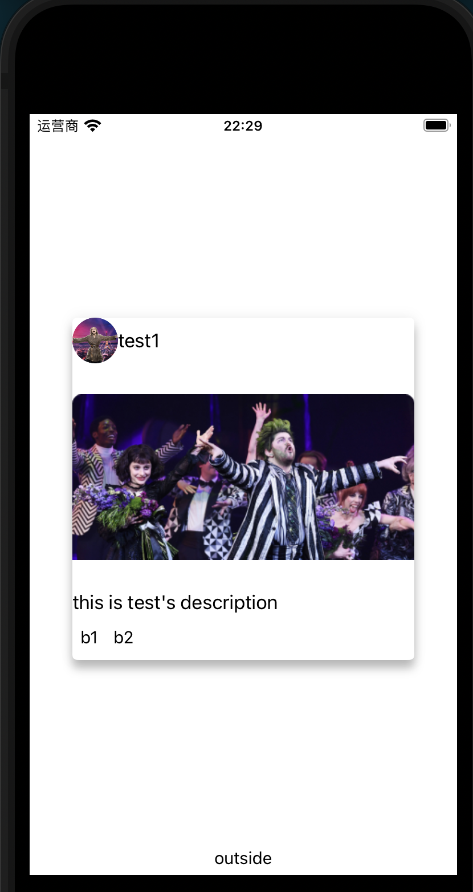

# 信息卡片

信息卡片是一组相关信息和行为的组合,其节本定义可以看[material上的定义](https://material.io/components/cards#anatomy),通常会也不会单独展示,而是以列表的形式出现多个卡片,卡片的信息和交互集中,常常会在内容平台上看到,比如B站的推荐瀑布流中每一条视频都是一个卡片.

一个卡片一般最多可以分为如下几个部分

1. 标题部分,一般是一个容器,里面会有图标,标题文本,副标题,一些强调社交属性的应用也会弄个按钮呼出底部弹出导航用于方便的进行与作者发布者相关的社交行为操作
2. [option]多媒体部分,一般是张图片,也就是封面图
3. [option]简介部分
4. [option]操作部分,一般是个容器,里面排布有按钮,通常是转发,收藏这类针对内容的操作.

卡片组件只有社区实现的[@nativescript-community/ui-material-cardview](https://www.npmjs.com/package/@nativescript-community/ui-material-cardview).
要用它我们当然需要先设置Material.然后安装`@nativescript-community/ui-material-cardview`,然后在入口文件中导入它

```ts
import CardViewPlugin from '@nativescript-community/ui-material-cardview/vue';

createApp(Home).use(CardViewPlugin)
```

它本质上就是一个`StackLayout`的扩展,只是可以设置`elevation`,`dynamicElevationOffset`,`rippleColor`,`shape`这几个css样式属性而已.

卡片这种我们一般也是将它写成一个组件,然后传入数据套用样式会比较多

## 例子

+ 创建一个定义的卡片组件`components/SimpleCard.vue`

    ```vue
    <template>
      <MDCardView
        margin="10"
        width="200"
        height="200"
        rippleColor="blue"
        elevation="6"
      >
        <GridLayout rows="40,*,auto,30">
          <!--title部分-->
          <StackLayout orientation="horizontal" row="0">
            <GridLayout columns="40,*">
              <NSImg
                :src="iconImgURL"
                stretch="fitCenter"
                roundAsCircle="true"
                col="0"
              />
              <Label :text="title" class="title"  col="1"></Label>
            </GridLayout>
          </StackLayout>
          <!--多媒体部分 -->
          <NSImg :src="mediaImgURL"  row="1" />
          <!--文本部分 -->
          <Label :text="description" row="2" />
          <!--按钮部分 -->
          <StackLayout orientation="horizontal" row="3">
            <Button text="b1" />
            <Button text="b2" />
          </StackLayout>
        </GridLayout>
      </MDCardView>
    </template>
      
    <script lang="ts">
    import Vue from "nativescript-vue";

    export default Vue.extend({
      props: {
        title: String,
        iconImgURL: String,
        mediaImgURL: String,
        description: String,
      }
    });
    </script>
    ```

    可以看出单纯的`MDCardView`只是给了一个框,我们还是需要单独对其中的内容进行排版,设置行为回调等细化处理,因此通常它也是用于构造组件而非页面

+ 使用`views/Home.vue`

    ```vue
    <template>
      <Page actionBarHidden="true">
        <GridLayout rows="*,auto">
          <SimpleCard v-bind="simplecardprops" />
          <Button row="1" text="outside" />
        </GridLayout>
      </Page>
    </template>
    <script lang="ts">
    import Vue from "vue";

    import SimpleCard from "../components/SimpleCard.vue"

    export default Vue.extend({
      components:{
        SimpleCard
      },
      data:function(){
        return {
          simplecardprops:{
            title: "test1",
            iconImgURL: "~/imgs/锦叶绿萝.png",
            mediaImgURL: "~/imgs/锦叶绿萝.png",
            description: "this is test's description"
          }
        }
      }
    });
    </script>
    ```

## 样式

+ android

  

+ ios

  