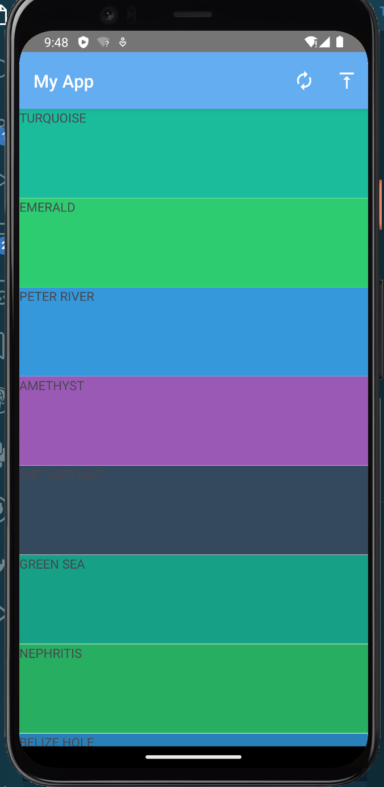
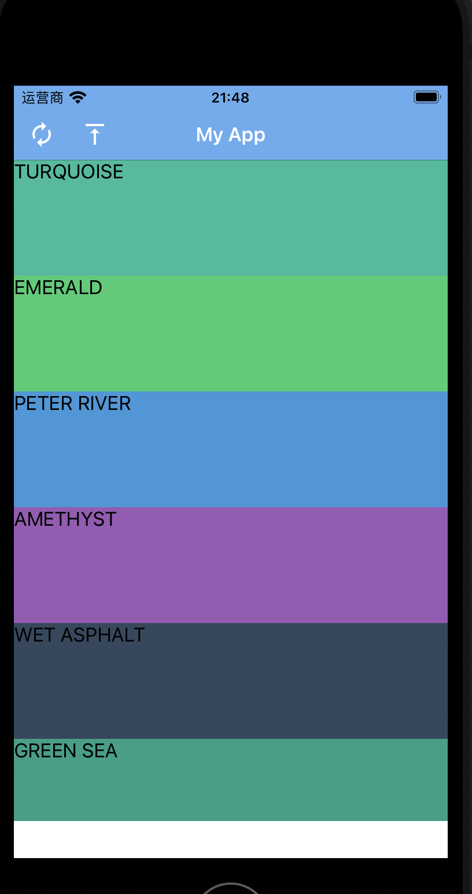
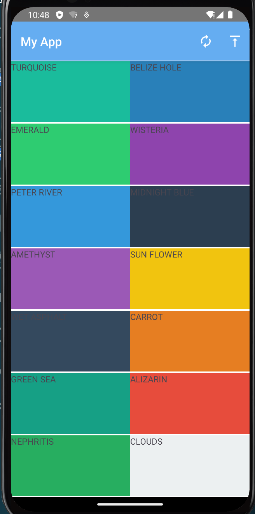
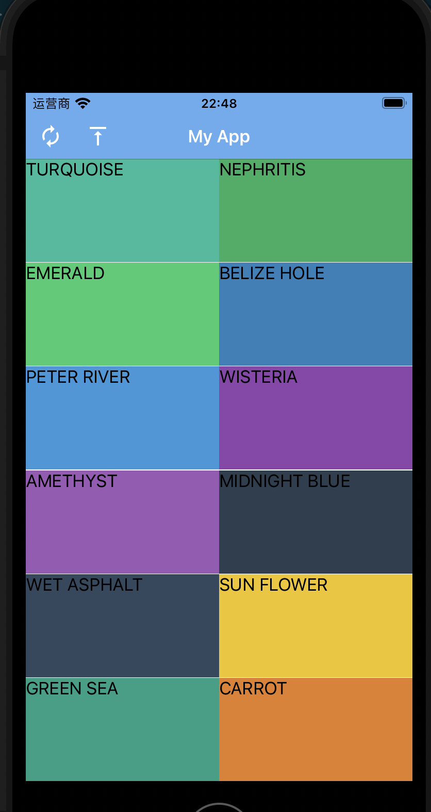
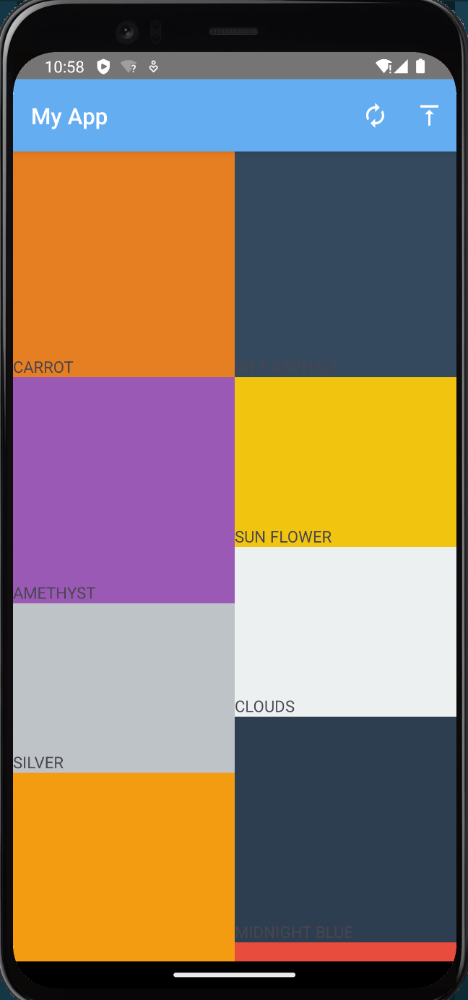
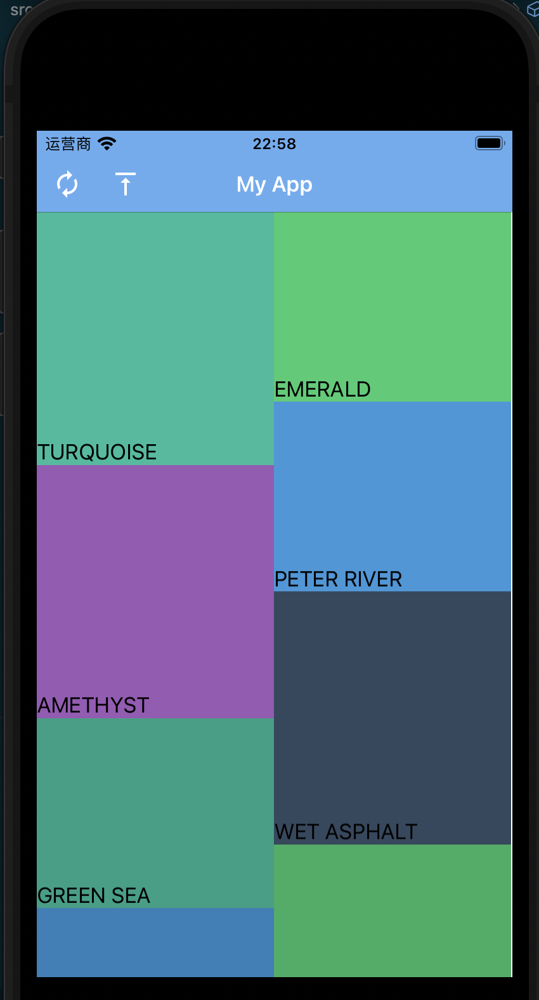

# 内容列表

对于内容平台型的app,比如电商,视频站这类应用,内容列表是最基础的组合组件.

所谓内容列表就是将内容顺序排列出来的一种展示用组合组件.其中每项内容是一个单独的单元,他们合起来就共同构成了内容列表.

## 垂直滚动列表

垂直滚动列表是最常见的内容列表形式,列表中的元素安顺序从上到下的渲染展示,通常一个版面4~8个元素,这种形式兼顾信息密度和渲染效率.

垂直滚动列表通常支持如下操作:

1. 划动查看
2. 点击选中
3. 滑动到底部加载更多
4. 顶部下拉全局刷新

### ScrollView


(https://docs.nativescript.org/ui/scroll-view)


带滚动条的容器,用于展示

### ListView

在`nativescript-vue`中原生的列表渲染方式是[list-view](https://docs.nativescript.org/ui/list-view),

其基本用法如下:

```vue
<ListView :items="listOfItems">
  <template #default="{ item }" >
    <Label :text="item.text" /> 
  </template>
</ListView>
```

用法上来说比较需要注意下与网页版的vue中`v-for`构造列表的区别.

在网页版的vue中我们通常都是用[v-for](https://blog.hszofficial.site/TutorialForFront-EndWeb/#/%E6%B5%8F%E8%A7%88%E5%99%A8%E7%8E%AF%E5%A2%83%E7%9A%84%E5%89%8D%E7%AB%AF%E5%BA%94%E7%94%A8/%E5%9F%BA%E4%BA%8Evue%E6%9E%84%E5%BB%BA%E5%89%8D%E7%AB%AF/vue%E7%9A%84%E5%9F%BA%E6%9C%AC%E6%A6%82%E5%BF%B5/%E7%BB%84%E4%BB%B6%E6%A8%A1%E6%9D%BF?id=%e5%be%aa%e7%8e%af%e6%8c%87%e4%bb%a4)构造列表的,在nativescript-vue中我们当然也可以使用,但它适用于一步到位的渲染,它会将遍历对象中的所有内容都一次渲染到位.通常会用在那种内容没有很多的场景.我们的`helloworld`例子中`Details.vue`中就用它展示`details`字段中的内容.

而在[ListView](https://docs.nativescript.org/ui/list-view)只渲染可见项,当用户滑动时通过重用不再可见项的视图来渲染新项(这通常被称为视图回收).这种方式适用于列表项目较多的场景,这种情况下我们的屏幕就那么大,一次全部渲染会造成性能浪费甚至卡顿.我们的`helloworld`例子中`Home.vue`中每个电影都是用它渲染的.

`ListView`必须搭配`<v-template>`使用,在`<ListView>`标签中用`items`指定要遍历的列表,然后在`<template>`中指定`#default="{ item }"`让每个项目被赋值到`item`.

需要注意`ListView`通常都会要设置`rowHeight`,这样可以有更好的性能.

我们可以看到`ListView`中每个元素之间都会有个分割线,可以使用属性`separatorColor`设置分割线的颜色,也可以设置为`transparent`来取消分割线.

需要注意`<template>`的下一级必须只有**单独一个组件**,如果我们需要点击项目后有触发操作,可以在这个`<template>`下一级的组件上绑定`onTap`操作.

我们的`ListView`仅实现了垂直滚动列表的前3个:

+ 划动查看,
+ 点击选中,有两种方式实现:
    + 在`ListView`组件上监听事件`@itemTap`,回调函数签名为`(evt: ItemEventData)->void`
    + 在`<template>`内的第一层组件上监听事件`@tap=callback(item)`,回调签名为`(item)->void`
+ 滑动到底部加载更多,可以在`ListView`组件上监听事件`@loadMoreItems`,`(evt: EventData)->void`

### 下拉刷新

单纯的`ListView`的一大问题是无法下拉刷新的,又或者说下拉刷新这个操作使用范围并不局限于垂直滚动列表.社区提供了一个插件[@nativescript-community/ui-pulltorefresh](https://github.com/nativescript-community/ui-pulltorefresh)用于单独实现这一功能.

安装好后我们通过如下代码导入

```ts
import { registerElement } from 'nativescript-vue';
registerElement(
  'PullToRefresh',
  () => require('@nativescript-community/ui-pulltorefresh').PullToRefresh
)
```

之后就可以使用组件`PullToRefresh`了.

我们在组件`PullToRefresh`上绑定事件`@refresh`,就可以在下拉时触发回调了,回调的签名为`(evt: EventData)->void`.需要注意的是下拉操作后会出现提示等待的圆形加载动画,这个动画需要在`@refresh`的回调函数中关闭

```ts
import { PullToRefresh } from '@nativescript-community/ui-pulltorefresh'
function refresh(evt: EventData) {
    let pullRefresh: PullToRefresh = evt.object
    ...
    pullRefresh.refreshing = false //手动关闭加载动画
}
```

#### 例子

```vue
<template>
    <frame>
        <Page>
            <ActionBar title="My App">
                <template v-if="isIOS">
                    <ActionItem :icon="fontRefresh" ios.position="left" class="mdi-ab" @tap="refresh" />
                    <ActionItem :icon="fonttoTop" ios.position="left" class="mdi-ab" @tap="toTop" />
                </template>
                <template v-else>
                    <ActionItem :icon="fontRefresh" android.position="actionBar" class="mdi-ab" @tap="refresh" />
                    <ActionItem :icon="fonttoTop" android.position="actionBar" class="mdi-ab" @tap="toTop" />
                </template>
            </ActionBar>
            <PullToRefresh @refresh="refresh">
                <ListView ref="collection" height="100%" separatorColor="transparent" :items="itemList" colWidth="50%"
                    rowHeight="100" @itemTap="tapItem" @loadMoreItems="moreItems">
                    <template #default="{ item }">
                        <StackLayout :backgroundColor="item.color" height="100">
                            <Label :text="item.name" />
                        </StackLayout>
                    </template>
                </ListView>
            </PullToRefresh>

        </Page>
    </frame>
</template>
<script lang="ts" setup>
import { ref } from "nativescript-vue";
import { EventData, ItemEventData, ListView } from '@nativescript/core';
import { PullToRefresh } from '@nativescript-community/ui-pulltorefresh'
const collection = ref()
const isIOS = ref(global.isIOS)

const fontRefresh = "font://\uf1b9"
const fonttoTop = "font://\uf252"
interface Card {
    name: string
    color: string
}
const itemList = ref<Card[]>([
    { name: 'TURQUOISE', color: '#1abc9c' },
    { name: 'EMERALD', color: '#2ecc71' },
    { name: 'PETER RIVER', color: '#3498db' },
    { name: 'AMETHYST', color: '#9b59b6' },
    { name: 'WET ASPHALT', color: '#34495e' },
    { name: 'GREEN SEA', color: '#16a085' },
    { name: 'NEPHRITIS', color: '#27ae60' },
    { name: 'BELIZE HOLE', color: '#2980b9' },
    { name: 'WISTERIA', color: '#8e44ad' },
    { name: 'MIDNIGHT BLUE', color: '#2c3e50' },
    { name: 'SUN FLOWER', color: '#f1c40f' },
    { name: 'CARROT', color: '#e67e22' },
    { name: 'ALIZARIN', color: '#e74c3c' },
    { name: 'CLOUDS', color: '#ecf0f1' },
    { name: 'CONCRETE', color: '#95a5a6' },
    { name: 'ORANGE', color: '#f39c12' },
    { name: 'PUMPKIN', color: '#d35400' },
    { name: 'POMEGRANATE', color: '#c0392b' },
    { name: 'SILVER', color: '#bdc3c7' },
    { name: 'ASBESTOS', color: '#7f8c8d' }
]);

const shuffle = (array: any[]) => {
    return array.slice().sort(() => Math.random() - 0.5);
}
function refresh(evt: EventData) {
    let pullRefresh = evt.object as PullToRefresh
    itemList.value = shuffle(itemList.value)
    console.log("refresh ok")
    pullRefresh.refreshing = false
}

function toTop(evt: EventData) {
    (collection.value.$el.nativeView as ListView).scrollToIndex(0)
}

function tapItem(evt: ItemEventData) {
    console.log(`tap item with index ${evt.index}`)
}
function moreItems(evt: EventData) {
    console.log(`load more items ${evt.eventName}`)
}
</script>
```

**需要注意**:

1. 回到顶部的函数`toTop`中我们调用了`nativescript`中ListView组件的方法,但这个方法并没有被`nativescript-vue`封装,我们就需要使用`.$el.nativeView`直接访问被包装的原始组件.
2. `ListView`的`rowHeight`在ios中不生效,我们需要设置`template`下第一层的容器高度才能在两个平台保持一致

#### 样式

+ android



+ ios


### CollectionView

垂直滚动列表的另一个选择是[@nativescript-community/ui-collectionview](https://github.com/nativescript-community/ui-collectionview?tab=readme-ov-file#nativescript-communityui-collectionview),它除了有原生`ListView`的能力外对`grid list view`有更好的支持,也就是说我们可以很轻易的在一行中展示多个项目,这样信息密度更大,多数应用也都是这样设计的.

要使用它我们需要安装插件`@nativescript-community/ui-collectionview`,之后在入口注册

```ts
import CollectionView from '@nativescript-community/ui-collectionview/vue3'
createApp(Home).use(CollectionView)
```

这样我们就可以在vue中使用组件`CollectionView`了.

#### 例子

```vue
<template>
    <frame>
        <Page>
            <ActionBar title="My App">
                <template v-if="isIOS">
                    <ActionItem :icon="fontRefresh" ios.position="left" class="mdi-ab" @tap="refresh" />
                    <ActionItem :icon="fonttoTop" ios.position="left" class="mdi-ab" @tap="toTop" />
                </template>
                <template v-else>
                    <ActionItem :icon="fontRefresh" android.position="actionBar" class="mdi-ab" @tap="refresh" />
                    <ActionItem :icon="fonttoTop" android.position="actionBar" class="mdi-ab" @tap="toTop" />
                </template>
            </ActionBar>
            <PullToRefresh @refresh="refresh">
                <CollectionView ref="collection" :items="itemList" colWidth="50%" rowHeight="100" orientation="horizontal" @itemTap="tapItem" @loadMoreItems="moreItems">
                    <template #default="{ item }">
                        <StackLayout :backgroundColor="item.color">
                            <Label :text="item.name" />
                        </StackLayout>
                    </template>
                </CollectionView>
            </PullToRefresh>
        </Page>
    </frame>
</template>
<script lang="ts" setup>
// import { ObservableArray } from '@nativescript/core';
import { ref } from "nativescript-vue";
import { EventData } from '@nativescript/core';
import { CollectionViewItemEventData } from "@nativescript-community/ui-collectionview"
import { PullToRefresh } from '@nativescript-community/ui-pulltorefresh'
const collection = ref()
const isIOS = ref(global.isIOS)
const fontRefresh = "font://\uf1b9"
const fonttoTop = "font://\uf252"
const itemList = ref([
{ name: 'TURQUOISE', color: '#1abc9c' },
    { name: 'EMERALD', color: '#2ecc71' },
    { name: 'PETER RIVER', color: '#3498db' },
    { name: 'AMETHYST', color: '#9b59b6' },
    { name: 'WET ASPHALT', color: '#34495e' },
    { name: 'GREEN SEA', color: '#16a085' },
    { name: 'NEPHRITIS', color: '#27ae60' },
    { name: 'BELIZE HOLE', color: '#2980b9' },
    { name: 'WISTERIA', color: '#8e44ad' },
    { name: 'MIDNIGHT BLUE', color: '#2c3e50' },
    { name: 'SUN FLOWER', color: '#f1c40f' },
    { name: 'CARROT', color: '#e67e22' },
    { name: 'ALIZARIN', color: '#e74c3c' },
    { name: 'CLOUDS', color: '#ecf0f1' },
    { name: 'CONCRETE', color: '#95a5a6' },
    { name: 'ORANGE', color: '#f39c12' },
    { name: 'PUMPKIN', color: '#d35400' },
    { name: 'POMEGRANATE', color: '#c0392b' },
    { name: 'SILVER', color: '#bdc3c7' },
    { name: 'ASBESTOS', color: '#7f8c8d' }
]);

function shuffle (array: any[]) {
    return array.slice().sort(() => Math.random() - 0.5);
}
function refresh(evt: EventData) {
    let pullRefresh = evt.object as PullToRefresh
    itemList.value = shuffle(itemList.value)
    console.log("refresh ok")
    pullRefresh.refreshing = false
}

function toTop(evt: EventData) {
    collection.value.$el.nativeView.scrollToIndex(0, true)
}
function tapItem(evt: CollectionViewItemEventData) {
    console.log(`tap item with index ${evt.index}`)
}
function moreItems(evt: EventData) {
    console.log(`load more items ${evt.eventName}`)
}
</script>
```

#### 样式

+ android



+ ios



### 瀑布流

所谓瀑布流实际就是垂直滚动列表的一个样式上的变化,特点是参差不齐的多栏布局.

插件[@nativescript-community/ui-collectionview](https://github.com/nativescript-community/ui-collectionview)同样提供了瀑布流功能.要使用它除了要安装上面的`@nativescript-community/ui-collectionview`外还需要安装`@nativescript-community/ui-collectionview-waterfall`,然后在入口文件中除了要注册组件`CollectionView`外还要注册`waterfall`的插件

```ts
import CollectionView from '@nativescript-community/ui-collectionview/vue3'
import waterfallInstall from '@nativescript-community/ui-collectionview-waterfall';

...
waterfallInstall();
createApp(Home).use(CollectionView)
```

使用时设置属性`layoutStyle="waterfall"`即可.

#### 例子

```vue
<template>
    <frame>
        <Page>
            <ActionBar title="My App">
                <template v-if="isIOS">
                    <ActionItem :icon="fontRefresh" ios.position="left" class="mdi-ab" @tap="refresh" />
                    <ActionItem :icon="fonttoTop" ios.position="left" class="mdi-ab" @tap="toTop" />
                </template>
                <template v-else>
                    <ActionItem :icon="fontRefresh" android.position="actionBar" class="mdi-ab" @tap="refresh" />
                    <ActionItem :icon="fonttoTop" android.position="actionBar" class="mdi-ab" @tap="toTop" />
                </template>
            </ActionBar>
            <PullToRefresh @refresh="refresh">
                <CollectionView ref="collection" :items="itemList" colWidth="50%" @itemTap="tapItem" @loadMoreItems="moreItems"  layoutStyle="waterfall" orientation="vertical">
                    <template #default="{ item }">
                        <GridLayout :height="randomHeight(item.color)" rows="*, auto" :backgroundColor="item.color"
                            class="item">
                            <StackLayout row="1" :backgroundColor="item.color">
                                <Label row="1" :text="item.name" />
                            </StackLayout>
                        </GridLayout>
                    </template>
                </CollectionView>
            </PullToRefresh>
        </Page>
    </frame>
</template>
<script lang="ts" setup>
// import { ObservableArray } from '@nativescript/core';
import { ref } from "nativescript-vue";
import { EventData } from '@nativescript/core';
import { CollectionViewItemEventData } from "@nativescript-community/ui-collectionview"
import { PullToRefresh } from '@nativescript-community/ui-pulltorefresh'
const collection = ref()
const isIOS = ref(global.isIOS)
const fontRefresh = "font://\uf1b9"
const fonttoTop = "font://\uf252"

const itemList = ref([
{ name: 'TURQUOISE', color: '#1abc9c' },
    { name: 'EMERALD', color: '#2ecc71' },
    { name: 'PETER RIVER', color: '#3498db' },
    { name: 'AMETHYST', color: '#9b59b6' },
    { name: 'WET ASPHALT', color: '#34495e' },
    { name: 'GREEN SEA', color: '#16a085' },
    { name: 'NEPHRITIS', color: '#27ae60' },
    { name: 'BELIZE HOLE', color: '#2980b9' },
    { name: 'WISTERIA', color: '#8e44ad' },
    { name: 'MIDNIGHT BLUE', color: '#2c3e50' },
    { name: 'SUN FLOWER', color: '#f1c40f' },
    { name: 'CARROT', color: '#e67e22' },
    { name: 'ALIZARIN', color: '#e74c3c' },
    { name: 'CLOUDS', color: '#ecf0f1' },
    { name: 'CONCRETE', color: '#95a5a6' },
    { name: 'ORANGE', color: '#f39c12' },
    { name: 'PUMPKIN', color: '#d35400' },
    { name: 'POMEGRANATE', color: '#c0392b' },
    { name: 'SILVER', color: '#bdc3c7' },
    { name: 'ASBESTOS', color: '#7f8c8d' }
]);

function shuffle (array: any[]) {
    return array.slice().sort(() => Math.random() - 0.5);
}
function refresh(evt: EventData) {
    let pullRefresh = evt.object as PullToRefresh
    itemList.value = shuffle(itemList.value)
    console.log("refresh ok")
    pullRefresh.refreshing = false
}

function toTop(evt: EventData) {
    collection.value.$el.nativeView.scrollToIndex(0, true)
    // console.log(`toTop get ${Object.keys(collection.value.$el.nativeView.scrollToIndex)}`)
}
function tapItem(evt: CollectionViewItemEventData) {
    console.log(`tap item with index ${evt.index}`)
}
function moreItems(evt: EventData) {
    console.log(`load more items ${evt.eventName}`)
}
function randomHeight(color) {
    if (parseInt(color.substr(1), 16) % 2 === 0) {
        return 200;
    }
    return 150;
}
</script>
```

瀑布流由于元素卡片的大小并不一样,我们需要将元素用`<GridLayout rows="*, auto"></GridLayout>`包裹,这样就不会出现上下有白色填充的情况.

#### 样式

+ android



+ ios



### 横向翻页

`CollectionView`可以设置参数`orientation="horizontal"`让一页填满后不是上下滑动而是左右滑动进行翻页,这在一些情况下也挺好用.

## 水平滑动列表

水平滑动列表的形式可以参考各种首页的顶部的banner,通常一次只展示一个元素,可以手动左右滑动,也可以自动定时滑动来轮流展示列表中的元素,这个一般用在活动广告,新品推广等地方.

### Pager

社区提供了插件[@nativescript-community/ui-pager](https://github.com/nativescript-community/ui-pager)用于支持水平滑动列表这种样式.但目前该项目未提供对vue3的支持.
