# 图表

图表是数据可视化使用的工具.表格提供结构化的数据让我们可以清晰的查看数据;而图则让数据可以更直观的展现.

对于表格,我们通常用内容列表来实现.对于图,社区提供了一个基本可用的图表组件库[@nativescript-community/ui-chart](https://github.com/nativescript-community/ui-chart).它基于画板因此性能不错.但总的来说样式并不丰富只能算能用.

`@nativescript-community/ui-chart`接口基本与[MPAndroidChart](https://github.com/PhilJay/MPAndroidChart)一致.

要使用它我们需要:

1. 安装[@nativescript-community/gesturehandler](https://github.com/nativescript-community/gesturehandler)以支持手势操作
2. 安装`@nativescript-community/ui-chart`
3. 在入口文件中注册自己需要的组件,比如`registerElement('ScatterChart', () => require("@nativescript-community/ui-chart/charts").ScatterChart);`

每个组件都可以设置一些基本的属性,比如图例上的样式,是否可以缩放,是否可以拖拽点击等,一些类型的图还会有比如x轴,y轴,网格线等额外的属性可以设置.而图表要渲染的数据则通过若干个设置项来表达,每一个设置项会包括数据以及图例文本,最终调用`.setData(data)`接口后图表就会渲染起来.我们也可以在组件上设置属性`hardwareAccelerated="true"`开启硬件渲染,这可以提高渲染效率.

总体来说.`@nativescript-community/ui-chart`的写法配置化做的并不好,因此处理数据时不会像echarts那么方便,图的种类也没那么多,但好歹是有,总比没有好.

例子在[nsv-chart分支](https://github.com/hsz1273327/TutorialForFront-EndWeb/tree/nsv-chart)中, 同时我将会将比较常用的设置项封装出来构造使用可以序列化为json的对象就可以配置的简单图表组件,放在`configurable-ui-chart`目录中,如果有需要的可以直接复制下来使用.

## 图表结构

1个图表可以分为

+ 图例
+ XY轴线
+ 数据图

3个部分,再加上整体的背景交互操作设置一共4块.其中数据图不同的类型可以设置的尽相同,但其他部分基本都是一样的.

### 全图交互操作设置

图表默认无法交互操作,需要按需设置开启交互行为,主要包括

```ts
// 设置图表的背景色
chart.backgroundColor = "white";
// 设置为非只读可操作
chart.setTouchEnabled(true);
// 设置不画出网格
chart.setDrawGridBackground(false);
// 设置为可拖拽
chart.setDragEnabled(true);
// 设置为可伸缩
chart.setScaleEnabled(true);
// 设置强制捏合手势用于聚焦
chart.setPinchZoom(true);
//设置启用每次点击突出显示
chart.setHighlightPerTapEnabled(true);
//设置启用每次拖拽突出显示
chart.setHighlightPerDragEnabled(true);
```

### 图例设置

图例设置主要包括

```ts
// 设置是否启用图例
l.setEnabled(true)
// 设置纵向对齐方式
l.setVerticalAlignment(LegendVerticalAlignment.TOP)
//设置横向对齐方式
l.setHorizontalAlignment(LegendHorizontalAlignment.RIGHT)
// 设置字体方向
l.setOrientation(LegendOrientation.VERTICAL)
// 设置是否画在图内部    
l.setDrawInside(false)
// 设置图例在X轴上的偏移量
l.setXOffset(5)
// 设置图例使用的字体
l.setFont(new Font("serif", 10, FontStyle.ITALIC, FontWeight.EXTRA_LIGHT))
```

### XY轴设置

XY轴都可以进行的设置包括

```ts
// 设置轴上的最小值
l.setAxisMinimum(0)
// 设置轴上的最大值
l.setAxisMaximum(100)
// 设置轴线宽度
l.setAxisLineWidth(3)
// 设置轴线颜色
l.setAxisLineColor("blue")
// 设置是否有轴线平行线作为网格线
l.setDrawGridLines(false)
```

X轴还可以额外设置

```ts
// 设置X轴所在位置
xl.setPosition(XAxisPosition.BOTTOM)
// 设置X轴上标签的倾斜角度
xl.setLabelRotationAngle(1)
// 设置是否避免第一个和最后一个元素被剪辑
xl.setAvoidFirstLastClipping(true)
// 设置标签的文本格式
xl.setValueFormatter({
    getAxisLabel:  (value: number): string 
})
```

Y轴还可以额外设置

```ts
// 设置顶部预留空间
yl.setSpaceTop(10)
// 设置底部预留空间
yl.setSpaceBottom(10)
// 设置是否额外画出0值对应的轴线
yl.setDrawZeroLine(false)
// 设置Y轴上的标签位置
yl.setPosition(YAxisLabelPosition.OUTSIDE_CHART)
// 设置是否展示最右侧Y轴
chart.getAxisRight().setEnabled(false)
```

除此之外,还可以在轴向上设置辅助线

```ts
// 创建一个LimitLine
ll = new LimitLine(19, "Max Value")
// 设置limitline为虚线
ll.enableDashedLine(10,10,0)
// 设置limitline宽度
ll.setLineWidth(conf.width)
// 设置limitline的标签位置
ll.setLabelPosition(LimitLabelPosition.LEFT_TOP)
// 设置limitline标签字号
ll.setTextSize(conf.textSize)
// 设置limitline颜色
ll.setLineColor(conf.lineColor)
```

之后再在轴对象上添加`LimitLine`对象即可

```ts
yl.addLimitLine(ll)
```

### 图表的通用构造模式

数据图通常都是先构造相应的数据集对象,设置完成后将数据集对象的列表作为参数构造一个数据对象,然后再整体设置这个数据对象,最后将这个数据对象设置到图表对象中.在native-vue3中图表对象通过`ref`获得,整体的结构如下

```vue
<template>
  ...
  <XXXChart ref="Elechart" @loaded="onChartLoaded" />
  ...
</template>
<script lang="ts" setup>
import { ref } from 'nativescript-vue';
const Elechart = ref()
function onChartLoaded() {
  const chart = Elechart.value._nativeView as XXXChart;
  // 设置全图交互操作
  ...
  //设置图例
  ...
  //设置Y轴
  ...
  //设置X轴
  ...
  //设置LimitLine
  ...
  //设置图数据
  let sets = []
  //设置dataset对象
  const set = new XXXDataSet(myData, "label");
  ...
  sets.push(set)
  // 设置data对象
  const ld = new XXXData(sets);
  ...
  //将数据设置进组件中渲染
  chart.setData(ld);
}
</script>
```

## ScatterChart散点图

散点图一般用于展示数据分布.

### 注册组件

```ts
registerElement('ScatterChart', () => require("@nativescript-community/ui-chart/charts").ScatterChart)
```

### 使用

散点图中每条数据的形式满足`Array<Point>`,其中`Point`满足接口.

```ts
interface Point {
  x?: number,
  icon?: ImageSource,
  y: number
}
```

当不设置`x`时x会取值为数据在列表中的位置.当我们需要渲染自己的图形时可以填上`icon`字段.

散点图可以额外设置x轴,y轴,网格等属性.它的每一条要渲染的折线必须是一个`ScatterDataSet`类的实例.而`ScatterDataSet`类的构造函数参数为一个`List[Dict[str,float]]`形式的数组,图例文本,数组中每个元素中x轴的属性名和数组中每个元素中y轴的属性名.我们可以使用方法`.setScatterShape(ScatterShape.X)`设置点的形状,支持的形状包括:

+ `ScatterShape.SQUARE`方块
+ `ScatterShape.CIRCLE`圆点
+ `ScatterShape.TRIANGLE`三角
+ `ScatterShape.CROSS` 十字星
+ `ScatterShape.X`叉
+ `CHEVRON_UP`上v型
+ `ScatterShape.CHEVRON_DOWN`下v型

除了形状,还可以设置颜色进行区分,包括:

+ `.setColor('blue')`设置颜色图标颜色
+ `.setScatterShapeHoleRadius(3)`设置图标(方块,圆点,三角)有中心孔,参数为孔直径
+ `.setScatterShapeHoleColor('green')`设置有中心孔的图标中心孔的颜色

在要渲染的`ScatterDataSet`类的实例都构造好后需要用一个`ScatterData`类的实例将他们都打包起来,最后调动`.setData(data)`接口实现渲染.

### 例子

```vue
<template>
    <frame id="main-frame">
        <Page actionBarHidden="true">
            <StackLayout>
                <ScatterChart ref="Elechart" @loaded="onChartLoaded" />
            </StackLayout>
        </Page>
    </frame>
</template>
<script lang="ts" setup>
import { ref } from 'nativescript-vue';
import { ScatterChart, ScatterShape } from '@nativescript-community/ui-chart/charts/ScatterChart';
import { ScatterData } from '@nativescript-community/ui-chart/data/ScatterData';
import { ScatterDataSet } from '@nativescript-community/ui-chart/data/ScatterDataSet';
import { XAxisPosition } from "@nativescript-community/ui-chart/components/XAxis";
import { LegendForm, LegendOrientation, LegendVerticalAlignment, LegendHorizontalAlignment } from '@nativescript-community/ui-chart/components/Legend';

const Elechart = ref()

function onChartLoaded() {
    const chart = Elechart.value._nativeView as ScatterChart;
    // //显示fps
    // chart.drawFrameRate = true;
    chart.setDrawGridBackground(false);
    chart.setTouchEnabled(true);
    chart.setMaxHighlightDistance(50);
    chart.setDragEnabled(true);
    chart.setScaleEnabled(true);
    chart.setMaxVisibleValueCount(200);
    chart.setPinchZoom(true);
    // 设置图例
    const l = chart.getLegend();
    l.setEnabled(true);
    l.setVerticalAlignment(LegendVerticalAlignment.TOP);
    l.setHorizontalAlignment(LegendHorizontalAlignment.RIGHT);
    l.setOrientation(LegendOrientation.VERTICAL);
    l.setDrawInside(false);
    l.setXOffset(5);
    const yl = chart.getAxisLeft();
    yl.setAxisMinimum(0); // this replaces setStartAtZero(true)
    chart.getAxisRight().setEnabled(false);
    const xl = chart.getXAxis();
    //// 设置x轴的粗度
    xl.setAxisLineWidth(3);
    //// 设置x轴所在的位置,默认在顶部
    xl.setPosition(XAxisPosition.BOTTOM);
    //// 设置隐藏y轴的网格
    xl.setDrawGridLines(false);
    // 设置待渲染的设置对象,构造函数参数为待渲染的数据, 图例标签,待渲染数据中代表x轴的属性名,待渲染数据中代表y轴的属性名
    const values1 = [];
    const values2 = [];
    const values3 = [];
    const range = 100;
    for (let i = 0; i < 20; i++) {
        values1.push({ y: Math.random() * range + 3, x: Math.random() * 5 });
        values2.push({ y: Math.random() * range + 3 + 0.33, x: Math.random() * 5 });
        values3.push({ y: Math.random() * range + 3 + 0.66, x: Math.random() * 5 });
    }
    // create a dataset and give it a type
    const set1 = new ScatterDataSet(values1, 'DS 1', "x", "y");
    set1.setForm(LegendForm.SQUARE);
    set1.setScatterShape(ScatterShape.SQUARE);
    set1.setColor('red');
    const set2 = new ScatterDataSet(values2, 'DS 2', "x", "y");
    set2.setForm(LegendForm.SQUARE);
    set2.setScatterShape(ScatterShape.CIRCLE);
    set2.setScatterShapeHoleColor('green');
    set2.setScatterShapeHoleRadius(3);
    set2.setColor('blue');
    const set3 = new ScatterDataSet(values3, 'DS 3', "x", "y");
    set3.setForm(LegendForm.SQUARE);
    set3.setScatterShape(ScatterShape.X);
    set3.setColor('green');
    set1.setScatterShapeSize(8);
    set2.setScatterShapeSize(8);
    set3.setScatterShapeSize(8);
    // create a data object with the data sets
    const data = new ScatterData([set1, set2, set3]);
    // data.setValueTypeface(tfLight);
    chart.setData(data);
    chart.invalidate();
}
</script>
```

+ android

    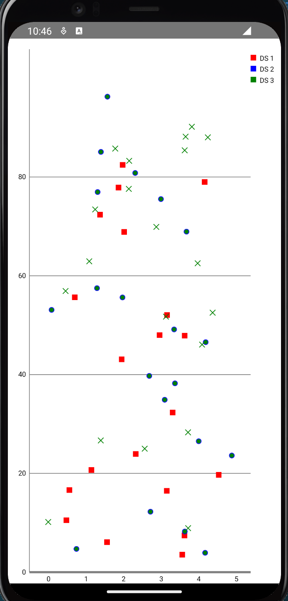

+ ios

    

## BubbleChart气泡图

气泡图可以认为是散点图的扩展,除了可以展示数据分布情况外还可以根据气泡大小看到数据的权重等信息

### 注册组件

```ts
registerElement('BubbleChart', () => require("@nativescript-community/ui-chart/charts").BubbleChart);
```

### 使用

散点图与散点图最大的区别就是数据要增加`size`值,这个`size`用于控制点的大小.其中每条数据的形式满足`Array<WeightedPoint>`,其中`WeightedPoint`满足接口

```ts
interface WeightedPoint {
  x?: number,
  y: number,
  size: number,
}
```

当不设置`x`时x会取值为数据在列表中的位置.当我们需要渲染自己的图形时可以填上`icon`字段.

与散点图不同,它不能设置形状只能设置颜色,如果不设置`icon`则默认为圆形点.

默认情况下size的值会被打印在图上,我们可以使用如下设置去掉size的值.

```ts
data.setDrawValues(false);
data.setValueTextSize(8);
data.setValueTextColor('white');
data.setHighlightCircleWidth(1.5);
```

> 例子:

```vue
<template>
    <frame id="main-frame">
        <Page actionBarHidden="true">
            <StackLayout>
                <BubbleChart ref="Elechart" @loaded="onChartLoaded" />
            </StackLayout>
        </Page>
    </frame>
</template>
<script lang="ts" setup>
import { ref } from 'nativescript-vue';
import { BubbleChart } from '@nativescript-community/ui-chart/charts/BubbleChart';
import { BubbleData } from '@nativescript-community/ui-chart/data/BubbleData';
import { BubbleDataSet } from '@nativescript-community/ui-chart/data/BubbleDataSet';
import { XAxisPosition } from "@nativescript-community/ui-chart/components/XAxis";
import { LegendForm, LegendOrientation, LegendVerticalAlignment, LegendHorizontalAlignment } from '@nativescript-community/ui-chart/components/Legend';

const Elechart = ref()

function onChartLoaded() {
    const chart = Elechart.value._nativeView as BubbleChart;
    chart.setDrawGridBackground(false);
    chart.setTouchEnabled(true);
    // enable scaling and dragging
    chart.setDragEnabled(true);
    chart.setScaleEnabled(true);
    chart.setMaxVisibleValueCount(200);
    chart.setPinchZoom(true);


    const l = chart.getLegend();
    l.setEnabled(true)
    l.setVerticalAlignment(LegendVerticalAlignment.TOP);
    l.setHorizontalAlignment(LegendHorizontalAlignment.RIGHT);
    l.setOrientation(LegendOrientation.VERTICAL);
    l.setDrawInside(false);
    
    const yl = chart.getAxisLeft();
    yl.setSpaceTop(30);
    yl.setSpaceBottom(30);
    yl.setDrawZeroLine(false);
    chart.getAxisRight().setEnabled(false);
    const xl = chart.getXAxis();
    xl.setPosition(XAxisPosition.BOTTOM);
    // 设置待渲染的设置对象,构造函数参数为待渲染的数据, 图例标签,待渲染数据中代表x轴的属性名,待渲染数据中代表y轴的属性名
    const values1 = [];
    const values2 = [];
    const values3 = [];
    for (let i = 0; i < 20; i++) {
        values1.push({
            y: Math.random() * 100,
            x: Math.random() * 10,
            size: Math.random() * 100,
        });
        values2.push({
            y: Math.random() * 100,
            x: Math.random() * 10,
            size: Math.random() * 100,
        });
        values3.push({
            y: Math.random() * 100,
            x: Math.random() * 10,
            size: Math.random() * 100
        });
    }
    // create a dataset and give it a type
    const set1 = new BubbleDataSet(values1, 'DS 1');
    set1.setForm(LegendForm.SQUARE);
    set1.setDrawValues(true);
    set1.setColor('red');
    const set2 = new BubbleDataSet(values2, 'DS 2');
    set2.setForm(LegendForm.SQUARE);
    set2.setDrawValues(true);
    set2.setColor('green');
    const set3 = new BubbleDataSet(values3, 'DS 3');
    set3.setForm(LegendForm.SQUARE);
    set3.setDrawValues(true);
    set3.setColor('blue');
    // create a data object with the data sets
    const data = new BubbleData([set1, set2, set3]);
    data.setDrawValues(false);
    data.setValueTextSize(8);
    data.setValueTextColor('white');
    data.setHighlightCircleWidth(1.5);
    chart.setData(data);
    chart.invalidate();
}
</script>
```

+ android

    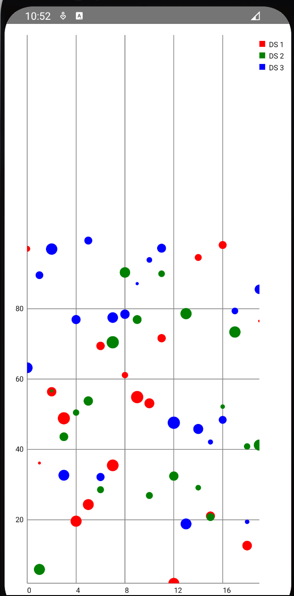

+ ios

    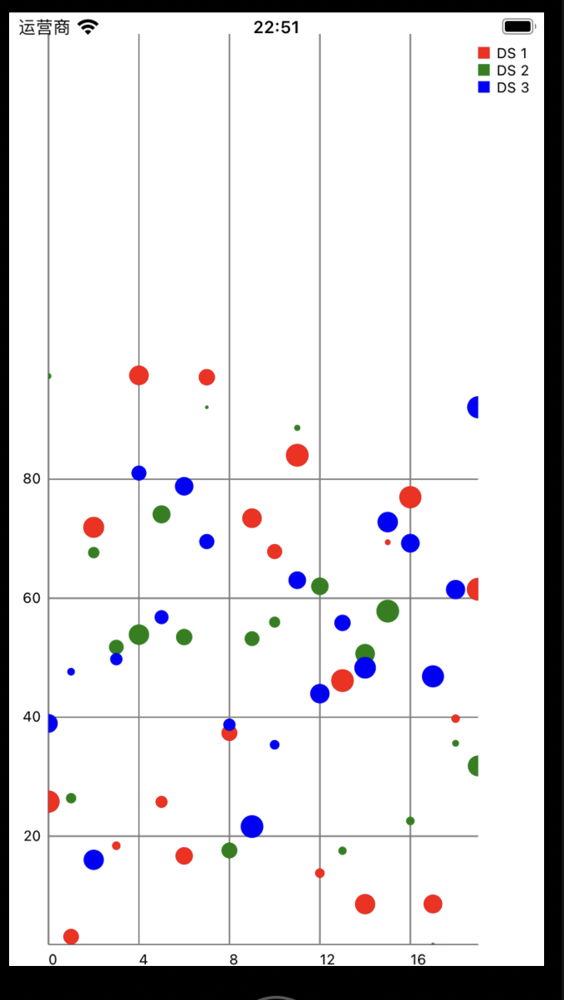


## LineChart线图

线图一般用于展示数据取值的连续变化,比如用于展示数值随时间的变化情况.

线图比较特殊的一点是可以设置渲染模式(mode),支持:

+ `Mode.LINEAR`,线性,即折线图,默认
+ `Mode.STEPPED`,阶梯,即阶梯图
+ `Mode.CUBIC_BEZIER`,三次贝塞尔曲线,即平滑曲线图
+ `Mode.HORIZONTAL_BEZIER`,水平贝塞尔曲线,即平滑曲线图

### 注册组件

```Vue
registerElement('LineChart', () => require("@nativescript-community/ui-chart/charts").LineChart);
```

### 使用

折线图中每条数据的形式满足`Array<Point>`,其中`Point`满足接口

```ts
interface Point {
  x?: number,
  y: number
}
```

如果不设置x则x的取值为在列表中的位置.

折线图可以额外设置x轴,y轴,网格,填充区等属性,同时还可以设置`LimitLine`标明极值.它的每一条要渲染的折线必须是一个`LineDataSet`类的实例.而`LineDataSet`类的构造函数参数为一个`List[Dict[str,float]]`形式的数组,图例文本,数组中每个元素中x轴的属性名和数组中每个元素中y轴的属性名.在要渲染的`LineDataSet`类的实例都构造好后需要用一个`LineData`类的实例将他们都打包起来,最后调动`.setData(data)`接口实现渲染.

> 例子:

```Vue
<template>
    <frame id="main-frame">
        <Page actionBarHidden="true">
            <StackLayout>
                <LineChart ref="Elechart" @loaded="onChartLoaded" />
            </StackLayout>
        </Page>
    </frame>
</template>
<script lang="ts" setup>
import { ref } from 'nativescript-vue';
import { LineChart } from "@nativescript-community/ui-chart/charts/LineChart";
import { LineDataSet } from "@nativescript-community/ui-chart/data/LineDataSet";
import { LineData } from "@nativescript-community/ui-chart/data/LineData";
import { LegendForm } from "@nativescript-community/ui-chart/components/Legend";
import { XAxisPosition } from "@nativescript-community/ui-chart/components/XAxis"
import { LimitLine, LimitLabelPosition } from '@nativescript-community/ui-chart/components/LimitLine';
import { DashPathEffect } from "@nativescript-community/ui-canvas";
import { Font } from '@nativescript/core';
import { FontStyle, FontWeight } from '@nativescript/core/ui/styling/font';

const Elechart = ref()
function onChartLoaded() {
    const chart = Elechart.value._nativeView as LineChart;
    // 设置图表的背景色
    chart.backgroundColor = "white";
    // 设置为非只读可操作
    chart.setTouchEnabled(true);
    // 设置不画出网格
    chart.setDrawGridBackground(false);
    // 设置为可拖拽
    chart.setDragEnabled(true);
    // 设置为可伸缩
    chart.setScaleEnabled(true);
    // 设置强制捏合手势用于聚焦
    chart.setPinchZoom(true);
    //设置启用每次点击突出显示
    chart.setHighlightPerTapEnabled(true);
    //设置启用每次拖拽突出显示
    chart.setHighlightPerDragEnabled(true);
    // 设置图例标签
    const legend = chart.getLegend();
    /// 启用图例
    legend.setEnabled(true);
    /// 设置图例上的字体
    legend.setFont(new Font("serif", 10, FontStyle.ITALIC, FontWeight.EXTRA_LIGHT));
    // 设置坐标轴
    /// 设置x轴
    const xAxis = chart.getXAxis();
    //// 设置x轴的粗度
    xAxis.setAxisLineWidth(3);
    //// 设置x轴所在的位置,默认在顶部
    xAxis.setPosition(XAxisPosition.BOTTOM)
    //// 设置隐藏y轴的网格
    xAxis.setDrawGridLines(false)
    //设置x轴为红色
    // xAxis.setAxisLineColor('red');
    //// x轴网格使用虚线
    // xAxis.enableGridDashedLine(10, 10, 0);
    //// 设置x轴的label展示的字符串
    // xAxis.setValueFormatter({
    //     getAxisLabel(value: number): string {
    //         let v: string | number = value;
    //         if (value == 0) {
    //             v = "日";
    //         }
    //         return `周${v}`;
    //     },
    // });
    xAxis.setValueFormatter({
        getAxisLabel: (value: number): string => {
            switch (value) {
                case 1:
                    {
                        return "Mon"
                    }
                    break;
                case 2:
                    {
                        return "Tue"
                    }
                    break;
                case 3:
                    {
                        return "Wed"
                    }
                    break;
                case 4:
                    {
                        return "Thu"
                    }
                    break;
                case 5:
                    {
                        return "Fri"
                    }
                    break;
                case 6:
                    {
                        return "Sat"
                    }
                    break;
                case 0:
                    {
                        return "Sun"
                    }
                    break;
                default:
                    {
                        return "Unknown"
                    }
                    break;
            }
        }
    })
    /// 设置y轴
    const yAxis = chart.getAxisLeft();
    //// 设置y轴宽度
    yAxis.setAxisLineWidth(3);
    //// 设置y轴的取值范围
    yAxis.setAxisMaximum(100);
    yAxis.setAxisMinimum(0);
    //// 设置y轴颜色
    // yAxis.setAxisLineColor('blue');
    //// y轴使用虚线
    // yAxis.enableGridDashedLine(10, 30, 0);
    //// 设置隐藏x轴的网格
    // yAxis.setDrawGridLines(false)
    /// 设置右轴
    const rightAxis = chart.getAxisRight();
    rightAxis.setEnabled(false);
    // //// 启用右轴
    // rightAxis.setEnabled(true);
    // //// 设置右轴颜色
    // rightAxis.setAxisLineColor('red');
    // //// 设置右轴宽度
    // rightAxis.setAxisLineWidth(2);
    // //// 设置右轴是否画网格线
    // rightAxis.setDrawGridLines(false)
    /// 设置极值线
    const ll1 = new LimitLine(90, 'Upper Limit');
    ll1.setLineWidth(4);
    ll1.enableDashedLine(10, 10, 0);
    ll1.setLabelPosition(LimitLabelPosition.RIGHT_TOP);
    ll1.setTextSize(10);
    const ll2 = new LimitLine(10, 'Lower Limit');
    ll2.setLineWidth(4);
    ll2.enableDashedLine(10, 10, 0);
    ll2.setLabelPosition(LimitLabelPosition.RIGHT_BOTTOM);
    ll2.setTextSize(10);

    // 在数据后面而不是在上面画限制线
    yAxis.setDrawLimitLinesBehindData(true);
    xAxis.setDrawLimitLinesBehindData(true);
    // 添加极值线
    yAxis.addLimitLine(ll1);
    yAxis.addLimitLine(ll2);
    //xAxis.addLimitLine(llXAxis);
    // 构造要渲染的数据,index为横轴,value为纵轴
    const myData = new Array(7).fill(0).map((v, i) => ({
        x: i,
        y: Math.random() * 100,
    }));
    // 设置待渲染的设置对象,构造函数参数为待渲染的数据, 图例标签,待渲染数据中代表x轴的属性名,待渲染数据中代表y轴的属性名
    const sets = [];
    const set = new LineDataSet(myData, "test line", "x", "y");
    /// 设置线条颜色
    set.setColor("blue");
    /// 设置是否开启y轴图标
    set.setDrawIcons(false);
    /// 设置使用虚线,参数为线条长度,空白长度,阶段
    // set.enableDashedLine(10, 5, 0);
    /// 设置点颜色
    set.setCircleColor("black");
    /// 设置线条宽度
    set.setLineWidth(1);
    /// 设置点的直径
    set.setCircleRadius(3);
    /// 设置点为实心点
    set.setDrawCircleHole(false);
    /// 自定义图例
    //// 设置图标样式
    set.setForm(LegendForm.LINE);
    set.setFormLineWidth(1);
    set.setFormLineDashEffect(new DashPathEffect([10, 5], 0));
    set.setFormSize(15);
    //设置值的文本字体大小
    set.setValueTextSize(9);
    // 将选择线画为虚线
    set.enableDashedHighlightLine(10, 5, 0);
    // 设置填充区
    set.setDrawFilled(true);
    set.setFillFormatter({
        getFillLinePosition(dataSet: any, dataProvider: any) {
            console.log(`get dataset ${Object.keys(dataSet)}`)
            console.log(`get dataProvider ${Object.keys(dataProvider)}`)
            return chart.getAxisLeft().getAxisMinimum();
            // return 
        },
    });
    // 设置填充区颜色set color of filled area
    set.setFillColor("red");
    sets.push(set);
    const ld = new LineData(sets);
    //将数据设置进组件中渲染
    chart.setData(ld);
}
</script>
```

+ android

    

+ ios

    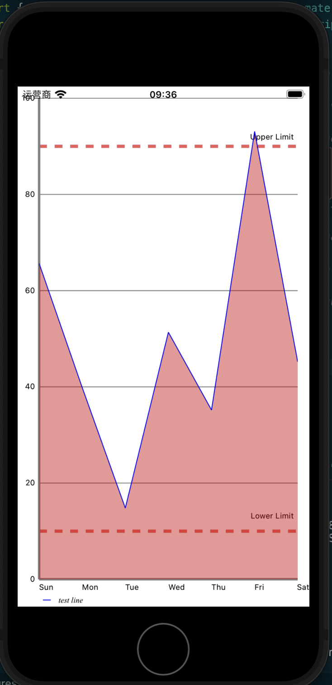

## BarChart柱状图

柱状图可以理解为折线图的扩展,但一般用于观察数据的离散变化,比如展示几个竞品在不同地区的销售数据.柱状图的Y轴只能在左侧有,这一点和其他图有点区别

### 注册组件

```Vue
registerElement('BarChart', () => require("@nativescript-community/ui-chart/charts").BarChart);
```

### 使用

柱状图中每条数据的形式满足`Array<Point>`,其中`Point`满足接口

```ts
interface Point {
  x?: number,
  y: number
}
```

如果不设置x则x的取值为在列表中的位置.

和折线图同样,柱状图可以设置x轴,y轴,网格,`LimitLine`极值,但不能设置填充区.而比起折线图来由于需要区分不同的实体,一般我们会将图例样式设置为`LegendForm.SQUARE`用`set.setStackLabels(["a", "b", "c", "d", "e", "f", "g"]);`而不是`xAxis.setValueFormatter()`填充x轴上的文本,并用`bd.setBarWidth()`设置柱宽,用`bd.groupBars(0, 0.3, 0.1)`将不同实体的柱分开展示

> 例子:

```Vue
<template>
    <frame id="main-frame">
        <Page actionBarHidden="true">
            <StackLayout>
                <BarChart ref="Elechart" width="300" height="400" @loaded="onChartLoaded" hardwareAccelerated="true">
                </BarChart>
            </StackLayout>
        </Page>
    </frame>
</template>
    
<script lang="ts" setup>
import { ref } from 'nativescript-vue';
import { BarChart } from "@nativescript-community/ui-chart/charts/BarChart";
import { BarData } from "@nativescript-community/ui-chart/data/BarData";
import { BarDataSet } from "@nativescript-community/ui-chart/data/BarDataSet";
import { LegendForm } from "@nativescript-community/ui-chart/components/Legend";
import { XAxisPosition } from "@nativescript-community/ui-chart/components/XAxis";
import {
    LimitLine,
    LimitLabelPosition,
} from "@nativescript-community/ui-chart/components/LimitLine";
import { DashPathEffect } from "@nativescript-community/ui-canvas";
import { Font } from "@nativescript/core";
import { FontStyle, FontWeight } from "@nativescript/core/ui/styling/font";

const Elechart = ref()

function onChartLoaded() {
    const chart = Elechart.value._nativeView as BarChart;
    // 设置图表的背景色
    chart.backgroundColor = "white";
    // 设置为非只读可操作
    chart.setTouchEnabled(true);
    // 设置不画出网格
    chart.setDrawGridBackground(false);

    // 设置为可拖拽
    chart.setDragEnabled(true);
    // 设置为可伸缩
    chart.setScaleEnabled(true);

    // 设置强制捏合手势用于聚焦
    chart.setPinchZoom(true);

    //设置启用每次点击突出显示
    chart.setHighlightPerTapEnabled(true);
    //设置启用每次拖拽突出显示
    chart.setHighlightPerDragEnabled(true);

    // 设置图例标签
    const legend = chart.getLegend();
    /// 启用图例
    legend.setEnabled(true);
    /// 设置图例上的字体
    legend.setFont(
        new Font("serif", 10, FontStyle.ITALIC, FontWeight.EXTRA_LIGHT)
    );

    // 设置坐标轴
    /// 设置x轴
    const xAxis = chart.getXAxis();
    //// 设置x轴的粗度
    xAxis.setAxisLineWidth(3);
    //// 设置x轴所在的位置,默认在顶部
    xAxis.setPosition(XAxisPosition.BOTTOM);
    //// 设置隐藏y轴的网格
    xAxis.setDrawGridLines(false);
    // xAxis.setValueFormatter({
    //   getAxisLabel(value: number): string {
    //     let v: string | number = value;
    //     if (value == 0) {
    //       v = "日";
    //     }
    //     return `周${v}`;
    //   },
    // });
    //设置x轴为红色
    // xAxis.setAxisLineColor('red');
    //// x轴网格使用虚线
    // xAxis.enableGridDashedLine(10, 10, 0);

    /// 设置y轴
    const yAxis = chart.getAxisLeft();
    //// 设置y轴宽度
    yAxis.setAxisLineWidth(3);
    //// 设置y轴的取值范围
    yAxis.setAxisMaximum(100);
    yAxis.setAxisMinimum(0);
    //// 设置y轴颜色
    // yAxis.setAxisLineColor('blue');
    //// y轴使用虚线
    // yAxis.enableGridDashedLine(10, 30, 0);
    //// 设置隐藏x轴的网格
    yAxis.setDrawGridLines(false)

    /// 设置右轴
    const rightAxis = chart.getAxisRight();
    rightAxis.setEnabled(false);
    // //// 启用右轴
    // rightAxis.setEnabled(true);
    // //// 设置右轴颜色
    // rightAxis.setAxisLineColor('red');
    // //// 设置右轴宽度
    // rightAxis.setAxisLineWidth(2);
    // //// 设置右轴是否画网格线
    // rightAxis.setDrawGridLines(false)


    //xAxis.addLimitLine(llXAxis);

    // 设置待渲染的设置对象,构造函数参数为待渲染的数据, 图例标签,待渲染数据中代表x轴的属性名,待渲染数据中代表y轴的属性名
    const sets = [];

    for (let x of ["red", "yellow", "blue"]) {
        // 构造要渲染的数据,index为横轴,value为纵轴
        const myData = new Array(7).fill(0).map((v, i) => ({
            x: i,
            y: Math.random() * 100,
        }));
        const set = new BarDataSet(myData, `test bar ${x}`, "x", "y");
        /// 设置线条颜色
        set.setColor(x);
        /// 设置是否开启y轴图标
        set.setDrawIcons(false);
        /// 设置使用虚线,参数为线条长度,空白长度,阶段

        /// 自定义图例
        //// 设置图标样式
        set.setForm(LegendForm.SQUARE);
        // set.setFormLineWidth(1);
        // set.setFormLineDashEffect(new DashPathEffect([10, 5], 0));
        // set.setFormSize(15);
        //设置值的文本字体大小
        set.setValueTextSize(9);
        set.setStackLabels(["a", "b", "c", "d", "e", "f", "g"]);
        // 将选择线画为虚线
        // set.enableDashedHighlightLine(10, 5, 0);

        sets.push(set);
    }

    const bd = new BarData(sets);
    bd.setBarWidth(0.1)
    bd.groupBars(0, 0.3, 0.1);
    //将数据设置进组件中渲染
    chart.setData(bd);
}
</script>
```

+ android

    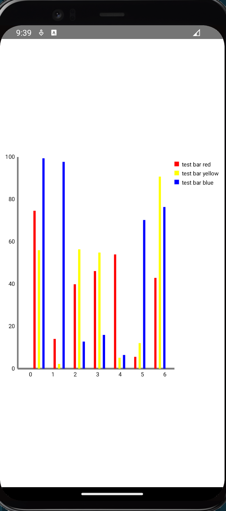

+ ios

    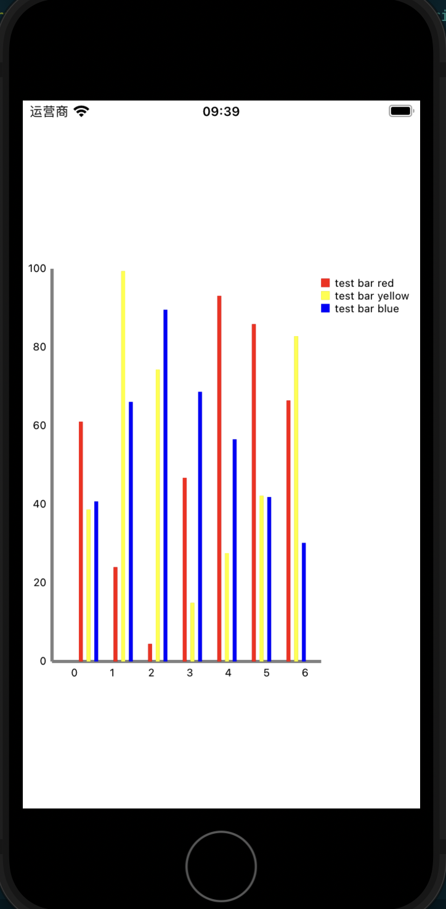

## HorizontalBarChart水平柱状图

水平柱状图和柱状图一样适用于展示离散变化.只是转了个90度方便做成长条利于观察而已.

### 注册组件

```Vue
registerElement('HorizontalBarChart', () => require("@nativescript-community/ui-chart/charts").HorizontalBarChart);
```

### 使用

柱状图中每条数据的形式满足`Array<Point>`,其中`Point`满足接口

```ts
interface Point {
  x?: number,
  y: number
}
```

如果不设置x则x的取值为在列表中的位置

> 例子:

```Vue
<template>
    <Page actionBarHidden="true">
        <StackLayout>
            <HorizontalBarChart ref="Elechart" @loaded="onChartLoaded" />
        </StackLayout>
    </Page>
</template>
    
<script lang="ts" setup>
import { ref } from 'nativescript-vue';
import { HorizontalBarChart } from "@nativescript-community/ui-chart/charts/HorizontalBarChart";
import { BarData } from "@nativescript-community/ui-chart/data/BarData";
import { BarDataSet } from "@nativescript-community/ui-chart/data/BarDataSet";
import { LegendForm } from "@nativescript-community/ui-chart/components/Legend";
import { XAxisPosition } from "@nativescript-community/ui-chart/components/XAxis";
import {
    LimitLine,
    LimitLabelPosition,
} from "@nativescript-community/ui-chart/components/LimitLine";
import { DashPathEffect } from "@nativescript-community/ui-canvas";
import { Font } from "@nativescript/core";
import { FontStyle, FontWeight } from "@nativescript/core/ui/styling/font";

const Elechart = ref()

function onChartLoaded() {
    const chart = Elechart.value._nativeView as HorizontalBarChart;
    // 设置图表的背景色
    chart.backgroundColor = "white";
    // 设置为非只读可操作
    chart.setTouchEnabled(true);
    // 设置不画出网格
    chart.setDrawGridBackground(false);
    // 设置为可拖拽
    chart.setDragEnabled(true);
    // 设置为可伸缩
    chart.setScaleEnabled(true);
    // 设置强制捏合手势用于聚焦
    chart.setPinchZoom(true);
    //设置启用每次点击突出显示
    chart.setHighlightPerTapEnabled(true);
    //设置启用每次拖拽突出显示
    chart.setHighlightPerDragEnabled(true);
    // 设置图例标签
    const legend = chart.getLegend();
    /// 启用图例
    legend.setEnabled(true);
    /// 设置图例上的字体
    legend.setFont(
        new Font("serif", 10, FontStyle.ITALIC, FontWeight.EXTRA_LIGHT)
    );
    // 设置坐标轴
    /// 设置x轴
    const xAxis = chart.getXAxis();
    //// 设置x轴的粗度
    xAxis.setAxisLineWidth(3);
    //// 设置x轴所在的位置,默认在顶部
    xAxis.setPosition(XAxisPosition.BOTTOM);
    //// 设置隐藏y轴的网格
    xAxis.setDrawGridLines(false);
    /// 设置y轴
    const yAxis = chart.getAxisLeft();
    //// 设置y轴宽度
    yAxis.setAxisLineWidth(3);
    //// 设置y轴的取值范围
    yAxis.setAxisMaximum(100);
    yAxis.setAxisMinimum(0);
    yAxis.setDrawGridLines(false)
    const sets = [];
    for (let x of ["red", "yellow", "blue"]) {
        // 构造要渲染的数据,index为横轴,value为纵轴
        const myData = new Array(7).fill(0).map((v, i) => ({
            x: i,
            y: Math.random() * 100,
        }));
        const set = new BarDataSet(myData, `test bar ${x}`, "x", "y");
        /// 设置线条颜色
        set.setColor(x);
        /// 设置是否开启y轴图标
        set.setDrawIcons(false);
        /// 设置使用虚线,参数为线条长度,空白长度,阶段
        set.setForm(LegendForm.SQUARE);
        set.setValueTextSize(9);
        set.setStackLabels(["a", "b", "c", "d", "e", "f", "g"]);
        sets.push(set);
    }
    const bd = new BarData(sets);
    bd.setBarWidth(0.1)
    bd.groupBars(0, 0.3, 0.1);
    //将数据设置进组件中渲染
    chart.setData(bd);
}
</script>
```

+ android

    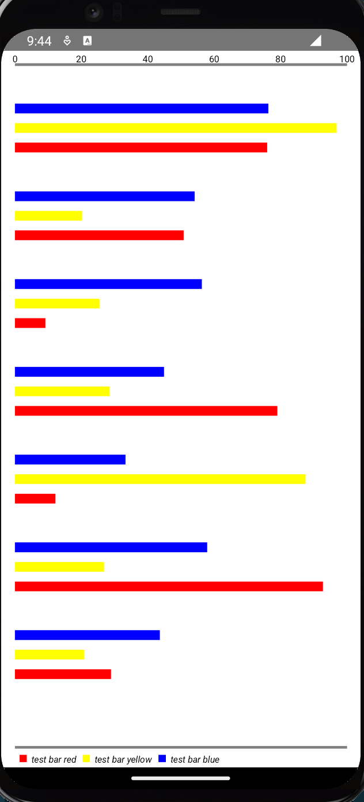

+ ios

    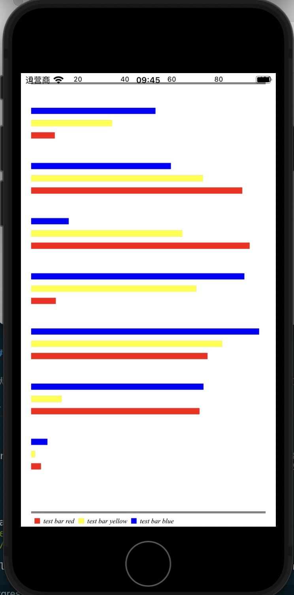


## CandleStickChart蜡烛图

蜡烛图一般也就是k线图,用于展示开始值,结束值,最高值,最低值这4个数据的连续变化情况.

### 注册组件

```Vue
registerElement('CandleStickChart', () => require("@nativescript-community/ui-chart/charts").CandleStickChart);
```

### 使用

柱状图中每条数据的形式满足`Array<KPoint>`,其中`Point`满足接口

```ts
interface KPoint {
  x?: number,
  high: number,
  low: number,
  open: number,
  close: number,
}
```

如果不设置x则x的取值为在列表中的位置.

而在图形上,我们知道k线图有框有上下影线,框表示open,close的值,上下影线则表示最大值最小值.通常如果open>close则表示涨,反之为跌.我们可以通过设置`.setDecreasingColor()`和`.setIncreasingColor()`设置涨跌框的颜色;使用`.setDecreasingPaintStyle()`和`.setIncreasingPaintStyle()`设置涨跌框的样式,支持的样式在`@nativescript-community/ui-canvas`模块中,包括

+ `Style.FILL` 填充满
+ `Style.FILL_AND_STROKE`
+ `Style.STROKE`空框

我们也可以设置影线样式.`setShadowWidth()`可以用于设置影线宽度.`.setShadowColor()`用于设置影线颜色,我们也可以使用`.setShadowColorSameAsCandle(true)`让影线和框颜色一致.

> 例子:

```vue
<template>
    <Page actionBarHidden="true">
        <StackLayout>
            <CandleStickChart ref="Elechart" @loaded="onChartLoaded" />
        </StackLayout>
    </Page>
</template>
  
<script lang="ts" setup>
import { ref } from 'nativescript-vue';
import { Color } from "@nativescript/core";
import { CandleStickChart } from "@nativescript-community/ui-chart/charts/CandleStickChart";
import { CandleData } from "@nativescript-community/ui-chart/data/CandleData";
import { CandleDataSet } from "@nativescript-community/ui-chart/data/CandleDataSet";
import { XAxisPosition } from "@nativescript-community/ui-chart/components/XAxis";
import { AxisDependency } from "@nativescript-community/ui-chart/components/YAxis";
import { Style } from "@nativescript-community/ui-canvas";

const Elechart = ref()
function onChartLoaded() {
    const chart = Elechart.value._nativeView as CandleStickChart;
    // 设置最大可以看见的
    chart.setMaxVisibleValueCount(60);
    // scaling can now only be done on x- and y-axis separately
    chart.setPinchZoom(false);
    chart.getLegend().setEnabled(false);
    chart.setDrawGridBackground(false);
    const xAxis = chart.getXAxis();
    xAxis.setPosition(XAxisPosition.BOTTOM);
    xAxis.setDrawGridLines(false);
    const leftAxis = chart.getAxisLeft();
    //        leftAxis.setEnabled(false);
    leftAxis.setLabelCount(7, false);
    leftAxis.setDrawGridLines(false);
    leftAxis.setDrawAxisLine(false);
    const rightAxis = chart.getAxisRight();
    rightAxis.setEnabled(false);

    // 构造要渲染的数据,index为横轴,value为纵轴

    const values1 = [];
    chart.resetTracking();
    const values = [];
    for (let i = 0; i < 30; i++) {
        const multi = 100 + 1;
        const val = Math.random() * 40 + multi;
        const high = Math.random() * 9 + 8;
        const low = Math.random() * 9 + 8;
        const open = Math.random() * 6 + 1;
        const close = Math.random() * 6 + 1;
        const even = i % 2 == 0;
        values.push({
            high: val + high,
            low: val - low,
            open: even ? val + open : val - open,
            close: even ? val - close : val + close,
        });
    }
    const set1 = new CandleDataSet(values, "Data Set");
    set1.setDrawIcons(false);
    set1.setAxisDependency(AxisDependency.LEFT);
    //设置open<close
    set1.setDecreasingColor("green");
    set1.setDecreasingPaintStyle(Style.FILL);
    //设置open>close
    set1.setIncreasingColor("red");
    set1.setIncreasingPaintStyle(Style.STROKE);
    //设置当open==close的情况
    // set1.setNeutralColor("blue");
    //设置影线
    // set1.setShadowColor("darkgray");
    set1.setShadowColorSameAsCandle(true);
    set1.setShadowWidth(0.7);

    const data = new CandleData([set1]);
    chart.setData(data);
}
</script>
```

+ android

    

+ ios
    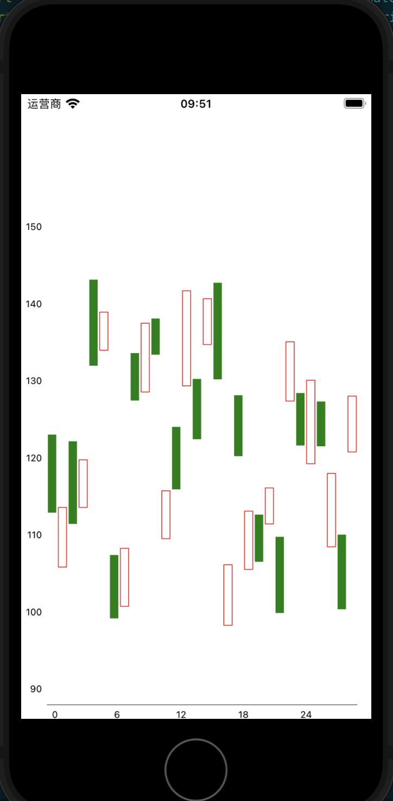

可以看到ios的蜡烛图是有bug的,画不出影线.

## `PieChart`饼图

饼图一般用于展示统计数据占比.比如一个产品不同地区的销售量比例这类.和上面的图不同,饼图没有xy轴,自然也没有网格线和辅助线,操作设置也和上面的不一样,只有点击操作,没有拖拽拉升旋转,数据也必然全部展示,样式主要是中间有没有孔,孔的大小的区别.

### 注册组件

```Vue
registerElement('PieChart', () => require("@nativescript-community/ui-chart/charts").PieChart);
```

### 使用

饼图通常只会有一条数据,这个数据的形式满足`Array<PieValue>`,其中`PieValue`满足接口

```ts
interface PieValue {
  y: number,
  label: string,
}
```

每个元素在列表中的位置会体现在饼图中渲染的位置顺序上.

> 例子:

```vue
<template>
    <Page actionBarHidden="true">
        <StackLayout>
            <PieChart ref="Elechart" @loaded="onChartLoaded" />
        </StackLayout>
    </Page>
</template>
  
<script lang="ts" setup>
import { ref } from 'nativescript-vue';
import {
    LegendHorizontalAlignment,
    LegendOrientation,
    LegendVerticalAlignment,
} from "@nativescript-community/ui-chart/components/Legend";
import { ColorTemplate } from "@nativescript-community/ui-chart/utils/ColorTemplate";
import { PieChart } from "@nativescript-community/ui-chart/charts/PieChart";
import { PieData } from "@nativescript-community/ui-chart/data/PieData";
import { PieDataSet } from "@nativescript-community/ui-chart/data/PieDataSet";

import { PieEntry } from "@nativescript-community/ui-chart/data/PieEntry";
import { BaseEntry } from "@nativescript-community/ui-chart/data/BaseEntry";
import { AxisBase } from "@nativescript-community/ui-chart/components/AxisBase";
import { BarEntry } from "@nativescript-community/ui-chart/data/BarEntry";
import { Entry } from "@nativescript-community/ui-chart/data/Entry";
import { RadarEntry } from "@nativescript-community/ui-chart/data/RadarEntry";
import { BubbleEntry } from "@nativescript-community/ui-chart/data/BubbleEntry";
import { CandleEntry } from "@nativescript-community/ui-chart/data/CandleEntry";
const Elechart = ref()
function onChartLoaded() {
    const chart = Elechart.value._nativeView as PieChart;

    // 设置使用百分比数值
    chart.setUsePercentValues(true);
    chart.getDescription().setEnabled(false);
    chart.setExtraOffsets(5, 10, 5, 5);
    chart.setDragDecelerationFrictionCoef(0.95);
    // 设置中心文本
    chart.setDrawCenterText(true);
    chart.setCenterText("中心文本");
    // 中间留出空洞和空洞样式
    chart.setDrawHoleEnabled(true);
    chart.setHoleColor("white");
    chart.setHoleRadius(58);
    //透明环样式
    chart.setTransparentCircleColor("white");
    chart.setTransparentCircleAlpha(110);
    chart.setTransparentCircleRadius(61);
    //触摸旋转样式设置
    chart.setRotationEnabled(true);
    chart.setRotationAngle(0);
    // 设置点击高亮
    chart.setHighlightPerTapEnabled(true);
    //设置图例
    const l = chart.getLegend();
    l.setEnabled(true);
    l.setVerticalAlignment(LegendVerticalAlignment.TOP);
    l.setHorizontalAlignment(LegendHorizontalAlignment.RIGHT);
    l.setOrientation(LegendOrientation.VERTICAL);
    l.setDrawInside(false);
    l.setXEntrySpace(7);
    l.setYEntrySpace(0);
    l.setYOffset(0);
    //设置实体label的样式
    chart.setEntryLabelColor("white");
    chart.setEntryLabelTextSize(12);
    chart.setDrawEntryLabels(true);


    // 构造要渲染的数据,index为横轴,value为纵轴
    let entries = [];
    const parties = [
        "Party A",
        "Party B",
        "Party C",
        "Party D",
        "Party E",
        "Party F",
        "Party G",
        "Party H",
        "Party I",
        "Party J",
        "Party K",
        "Party L",
        "Party M",
        "Party N",
        "Party O",
        "Party P",
        "Party Q",
        "Party R",
        "Party S",
        "Party T",
        "Party U",
        "Party V",
        "Party W",
        "Party X",
        "Party Y",
        "Party Z",
    ];
    for (let i = 0; i < 10; i++) {
        entries.push({
            y: Math.random() * 50 + 50 / 5,
            label: parties[i % parties.length],
        });
    }
    const dataSet = new PieDataSet(entries, "Pie test labels", "y");
    dataSet.setSliceSpace(3);
    dataSet.setIconsOffset({ x: 0, y: 40 });
    dataSet.setSelectionShift(5);

    //设置颜色,颜色从ColorTemplate中获取,渲染时按位置获取颜色
    const colors = [];
    colors.push(...ColorTemplate.VORDIPLOM_COLORS);
    colors.push(...ColorTemplate.JOYFUL_COLORS);
    colors.push(...ColorTemplate.COLORFUL_COLORS);
    colors.push(...ColorTemplate.LIBERTY_COLORS);
    colors.push(...ColorTemplate.PASTEL_COLORS);
    colors.push(ColorTemplate.getHoloBlue());
    dataSet.setColors(colors);
    //设置渲染每一块时展示的对应文本,只有`getPieLabel`有用其他都只是为了满足接口
    dataSet.setValueFormatter({
        getFormattedValue(value: number, entry?: BaseEntry): string {
            return "";
        },
        getAxisLabel(value: number, axis: AxisBase): string {
            return "";
        },
        getBarLabel(value: any, entry: BarEntry): string {
            return "";
        },
        getBarStackedLabel(value: any, entry: BarEntry): string {
            return "";
        },
        getPointLabel(value: any, entry: Entry): string {
            return "";
        },
        getPieLabel(value: any, entry: PieEntry): string {
            return `${entry.label}:${value}`;
        },
        getRadarLabel(value: any, entry: RadarEntry): string {
            return "";
        },
        getBubbleLabel(value: any, entry: BubbleEntry): string {
            return "";
        },
        getCandleLabel(value: any, entry: CandleEntry): string {
            return "";
        },
    });
    //启用渲染每一块上的文本标识
    dataSet.setDrawValues(true);
    const data = new PieData([dataSet]);

    data.setValueTextSize(11);
    data.setValueTextColor("white");
    chart.setData(data);
}
</script>
```

+ android

    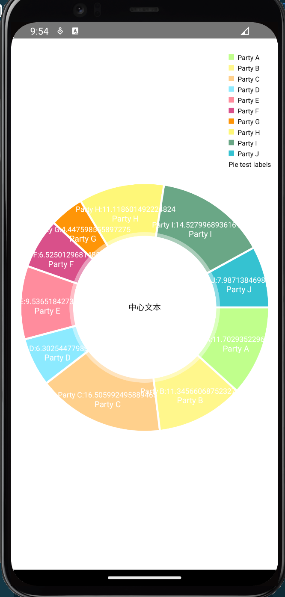

+ ios
    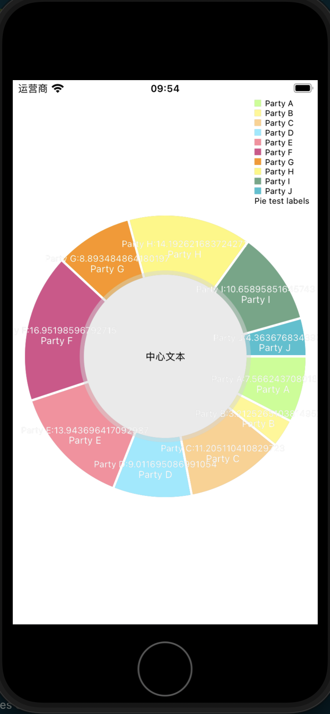


## `RadarChart`雷达图

雷达图一般用于展示一组数据中各个变量的权重高低情况,非常适用于展示性能数据.我们在网页部分的英雄模拟器中就是使用的雷达图展示每个英雄的战斗力属性.

在**旧版本**中`RadarChart`似乎并没有开发好,有一些bug需要在安装好模块后进行修改--修改`node_modules/@nativescript-community/ui-chart/renderer/XAxisRendererRadarChart.js`文件中`XAxisRendererRadarChart->renderAxisLabels`方法

```ts
//const labels = axis.mLabels; //修改这个为下面
const labels = chart.mData.mLabels;
```

如果不修改,我们就没办法为雷达图设置每一条线上的文本标签,当然目前的`^1.2.35`版本是没有问题的.

雷达图有xy轴,,Y轴是蛛网状图从中心点向四周扩散的经线轴,而X轴则是围绕中心的纬线轴.有X,Y轴自然也就可以有辅助线了,不过通常辅助线也都是纬线轴.

需要注意雷达图必须先有一个数据集做初始化,其他的都可以直接创建

### 注册组件

```Vue
registerElement('RadarChart', () => require("@nativescript-community/ui-chart/charts").RadarChart);
```

### 使用

饼图通常只会有一条数据,这个数据的形式满足`Array<RenderValue>`,其中`RenderValue`满足接口

```ts
interface RenderValue {
  y: number
}
```

每个元素在列表中的位置会体现在饼图中渲染的位置顺序上.

雷达图主要的展示元素为同心多边形,看着像蜘蛛网.它的X轴被扭曲为了最外层多边形的边,Y轴则成了中心点向上的半径.X轴和Y轴的设置和其他组件没有太大区别,主要不同的就是对这个`蜘蛛网`的设置.

我们可以用`.setWebxxx()`方法设置这个`蜘蛛网`上的纬线,用`.setWebxxxInner()`方法设置这个`蜘蛛网`上的经线.而数据的标签则需要在`RadarData`实例上通过方法`.setLabels()`设置

> 例子:

```vue
<template>
    <Page actionBarHidden="true">
        <StackLayout>
            <RadarChart ref="Elechart" @loaded="onChartLoaded" />
        </StackLayout>
    </Page>
</template>
    
  
<script lang="ts" setup>
import { ref } from 'nativescript-vue';
import { RadarChart } from "@nativescript-community/ui-chart/charts/RadarChart";
import { RadarData } from "@nativescript-community/ui-chart/data/RadarData";
import { RadarDataSet } from "@nativescript-community/ui-chart/data/RadarDataSet";
import { PieEntry } from "@nativescript-community/ui-chart/data/PieEntry";
import { BaseEntry } from "@nativescript-community/ui-chart/data/BaseEntry";
import { AxisBase } from "@nativescript-community/ui-chart/components/AxisBase";
import { BarEntry } from "@nativescript-community/ui-chart/data/BarEntry";
import { Entry } from "@nativescript-community/ui-chart/data/Entry";
import { RadarEntry } from "@nativescript-community/ui-chart/data/RadarEntry";
import { BubbleEntry } from "@nativescript-community/ui-chart/data/BubbleEntry";
import { CandleEntry } from "@nativescript-community/ui-chart/data/CandleEntry";

const Elechart = ref()
function onChartLoaded() {
    const chart = Elechart.value._nativeView as RadarChart;

    // 设置点击高亮
    chart.setHighlightPerTapEnabled(true);
    chart.setWebColor("red");
    chart.setWebColorInner("blue");

    //y轴
    let yl = chart.getYAxis()
    yl.setSuggestedAxisMinimum(0)
    yl.setSpaceMax(2)
    let xl = chart.getXAxis()
    xl.setTextColor("green");

    // 构造要渲染的数据,index为横轴,value为纵轴
    let entries = [];
    const parties = ["Party A", "Party B", "Party C", "Party D", "Party E"];
    for (let i = 0; i < 5; i++) {
        entries.push({
            y: Math.random() * 10,
        });
    }
    const dataSet = new RadarDataSet(entries, "性能指标", "y");
    dataSet.setValueFormatter({
        getFormattedValue(value: number, entry?: BaseEntry): string {
            return "";
        },
        getAxisLabel(value: number, axis: AxisBase): string {
            return "";
        },
        getBarLabel(value: any, entry: BarEntry): string {
            return "";
        },
        getBarStackedLabel(value: any, entry: BarEntry): string {
            return "";
        },
        getPointLabel(value: any, entry: Entry): string {
            return "";
        },
        getPieLabel(value: any, entry: PieEntry): string {
            return "";
        },
        getRadarLabel(value: any, entry: RadarEntry): string {
            return `${value}`;
        },
        getBubbleLabel(value: any, entry: BubbleEntry): string {
            return "";
        },
        getCandleLabel(value: any, entry: CandleEntry): string {
            return "";
        },
    });
    dataSet.setDrawValues(true);
    const data = new RadarData([dataSet]);
    data.setLabels(parties);
    chart.setData(data);
}
</script>
```

+ android

    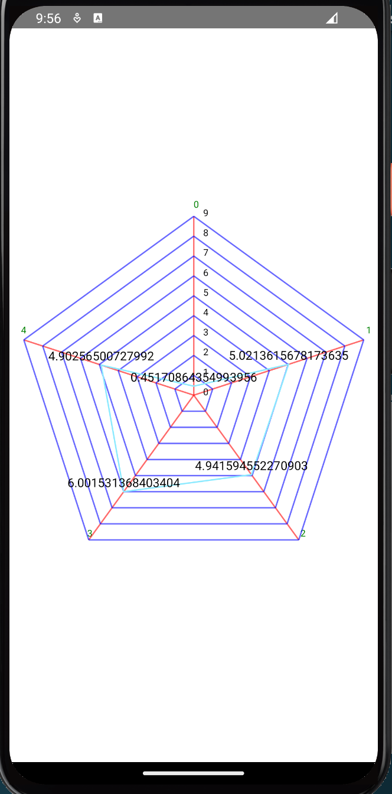

+ ios
    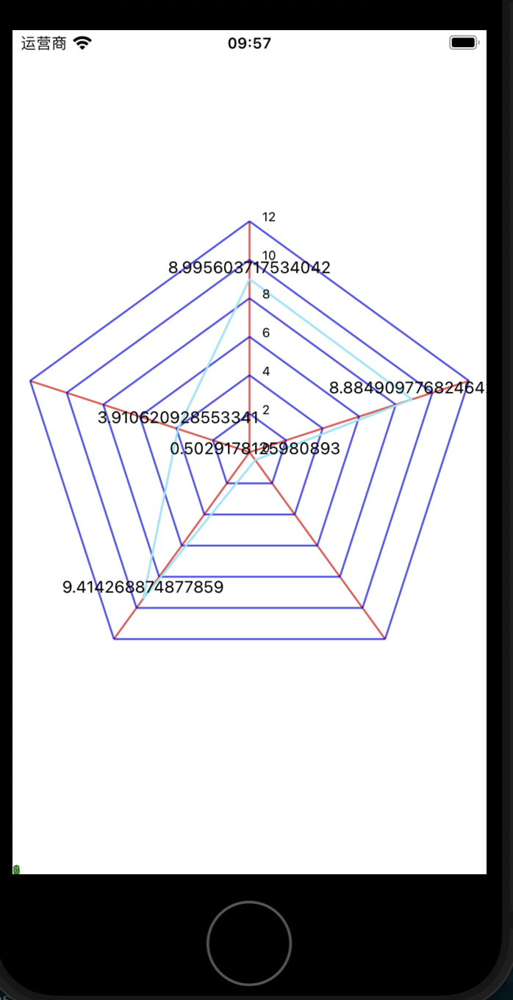

## 动态刷新数据

很多时候,尤其折线图和蜡烛图,我们会需要动态刷新当前数据.上面的静态渲染方式就需要进行修正了.

整体来说动态刷新数据要做两件事

1. 给chart对象更新数据
2. 通知chart对象重新渲染

和上面静态图表不同,通常我们会在动态图表的`@loaded`上绑定一个构造图表基本形态的函数,这个函数一般会给一个空的data或者一个静态的data进行对图表的初始化.而更新这个图表的数据则放在单独的函数中要么定时调用要么通过监听其他比如sse这样的技术来实现数据刷新.在数据更新后我们还要按顺序调用`data.notifyDataChanged()`来通知data对象dataset已经改变,以及`chart.notifyDataSetChanged()`来通知chart对象data已经改变

下面的例子中我们使用双端队列[denque](https://www.npmjs.com/package/denque)来维护折线图中的点模仿性能

> 例子:一个定时更新的折线图

```vue
<template>
    <frame id="main-frame">
        <Page actionBarHidden="true">
            <GridLayout rows="*,auto,auto">
                <LineChart ref="Elechart" @loaded="onChartLoaded" :hardwareAccelerated="hardwareAccelerated" />
                <Switch row="1" v-model="hardwareAccelerated" />
                <Button row="2" text="stop" @tap="stop" />
            </GridLayout>
        </Page>
    </frame>
</template>
  
<script lang="ts" setup>
import { ref,onMounted } from 'nativescript-vue';
import { Color, Frame, Font } from "@nativescript/core";
import { setInterval } from "@nativescript/core/timer";
import { LineChart } from "@nativescript-community/ui-chart/charts/LineChart";
import { LegendForm } from "@nativescript-community/ui-chart/components/Legend";
import { AxisDependency } from "@nativescript-community/ui-chart/components/YAxis";
import { XAxisPosition } from "@nativescript-community/ui-chart/components/XAxis";
import { LineDataSet } from "@nativescript-community/ui-chart/data/LineDataSet";
import { LineData } from "@nativescript-community/ui-chart/data/LineData";
import { ColorTemplate } from "@nativescript-community/ui-chart/utils/ColorTemplate";
import { AxisBase } from "@nativescript-community/ui-chart/components/AxisBase";
import { ViewPortHandler } from "@nativescript-community/ui-chart/utils/ViewPortHandler";
import Denque from "denque";


const Elechart = ref()


const hardwareAccelerated = false
const timer = ref(null)
const indexVal = ref(new Denque([], { capacity: 20 }))
function onChartLoaded() {
    const chart = Elechart.value._nativeView as LineChart;
    chart.setTouchEnabled(true);
    chart.setDragEnabled(true);
    chart.setScaleEnabled(true);
    chart.setDrawGridBackground(false);
    chart.setPinchZoom(true);
    chart.backgroundColor = "lightgray";
    // 绑定一个空的数据对象
    const data = new LineData();
    data.setValueTextColor("white");
    chart.setData(data);
    // 设置图例
    const l = chart.getLegend();
    l.setForm(LegendForm.LINE);
    l.setTypeface(Font.default.withFontFamily("OpenSans-Light"));
    l.setTextColor("white");
    // 设置x轴
    const xl = chart.getXAxis();
    xl.setTextColor("red");
    xl.setDrawGridLines(false);
    xl.setAvoidFirstLastClipping(true);
    xl.setEnabled(true);
    xl.setPosition(XAxisPosition.BOTTOM);
    xl.setValueFormatter({
        getAxisLabel: (
            value: any,
            axis: AxisBase,
            viewPortHandler: ViewPortHandler
        ): string => {
            //在保存的dequeue中找到value对应的时间信息
            let indexarray = indexVal.value.toArray();
            let res = indexarray.filter((e) => e.index == Math.floor(value))
            if (res.length != 1) {
                return `${value}`
            }
            let now = res[0].datetime
            return `${now.getHours()}:${now.getMinutes()}:${now.getSeconds()}`;
        },
    });

    // 设置左轴
    const leftAxis = chart.getAxisLeft();
    leftAxis.setTypeface(Font.default.withFontFamily("OpenSans-Light"));
    leftAxis.setTextColor("white");
    leftAxis.setAxisMaximum(100);
    leftAxis.setAxisMinimum(0);
    leftAxis.setDrawGridLines(true);
    //设置右轴
    const rightAxis = chart.getAxisRight();
    rightAxis.setEnabled(false);
}
function start() {
    if (!timer.value) {
        timer.value = setInterval(addEntry, 1000);
    }
}
function stop() {
    if (timer.value) {
        clearInterval(timer.value);
        timer.value = null;
    }
}
function addEntry() {
    if (!Elechart.value) {
        stop();
        return;
    }
    const chart = Elechart.value._nativeView as LineChart;
    const data = chart.getData();
    if (data != null) {
        let set = data.getDataSetByIndex(0);
        // set.addEntry(...); // can be called as well
        if (set == null) {
            set = createSet();
            data.addDataSet(set);
        }
        // 构造数据
        let datetime = new Date();
        let y = Math.random() * 40 + 30;
        let e = { y };
        // 将数据推入dataset
        data.addEntry(e, 0);
        // 获取数据在dataset中的index
        let dset = data.getDataSetByIndex(0);
        let eindex = dset.getEntryIndex(e);
        //将横轴输入存入dequeue
        let labelindex = { datetime, index: eindex };
        indexVal.value.push(labelindex);

        // 通知data对象dataset已经改变
        data.notifyDataChanged();
        // 通知chart对象data已经改变
        chart.notifyDataSetChanged();
        // 设置可见数据条目最大数量
        chart.setVisibleXRangeMaximum(120);
        // x轴调到最后
        chart.moveViewToX(data.getEntryCount());
    }
}
function createSet() {
    const set = new LineDataSet(null, "Dynamic Data");
    set.setAxisDependency(AxisDependency.LEFT);
    set.setColor(ColorTemplate.getHoloBlue());
    set.setCircleColor("white");
    set.setLineWidth(2);
    set.setCircleRadius(4);
    set.setFillAlpha(65);
    set.setFillColor(ColorTemplate.getHoloBlue());
    set.setHighLightColor(new Color(255, 244, 117, 117));
    set.setValueTextColor("white");
    set.setValueTextSize(9);
    set.setDrawValues(false);
    return set;
}
function redraw() {
    const chart = Elechart.value._nativeView as LineChart;
    chart.invalidate();
}
function onNavigationButtonTap() {
    Frame.topmost().goBack();
}
onMounted(()=>{
    start()
})
</script>
```