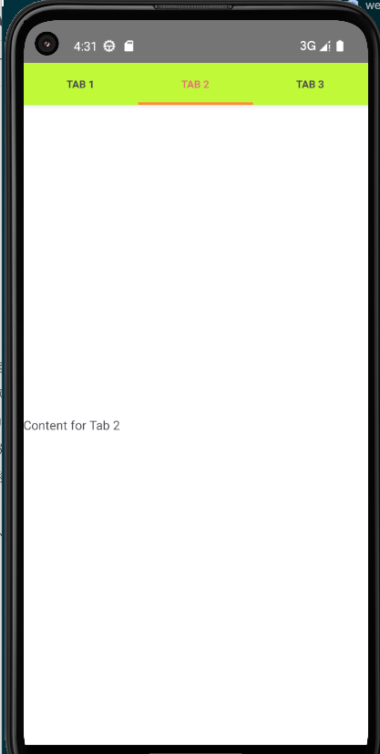
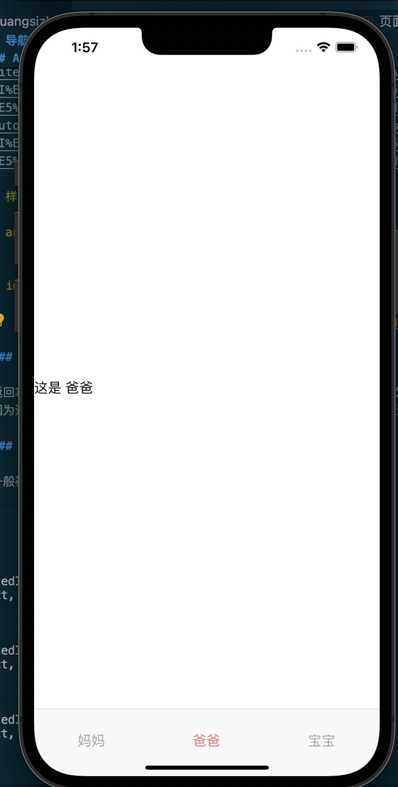
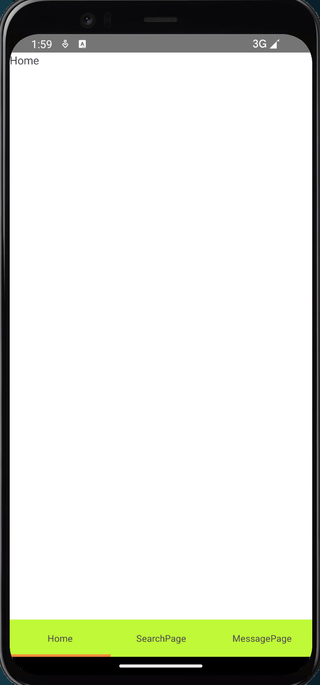
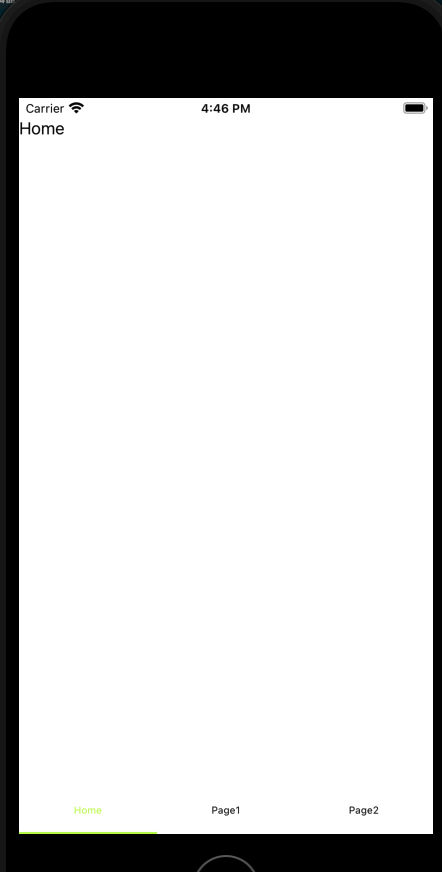
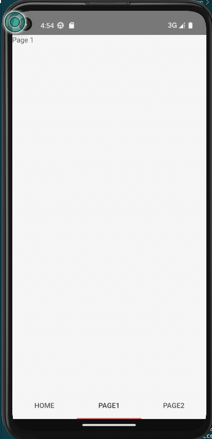
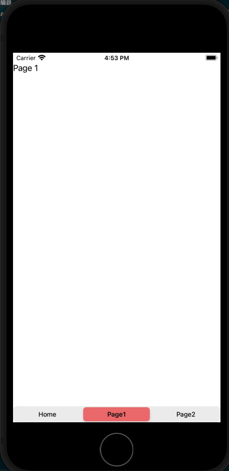
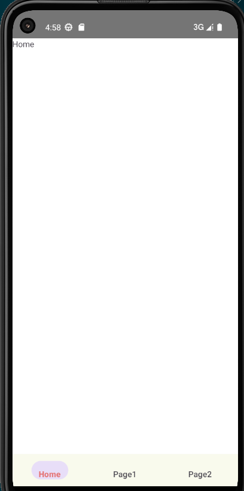
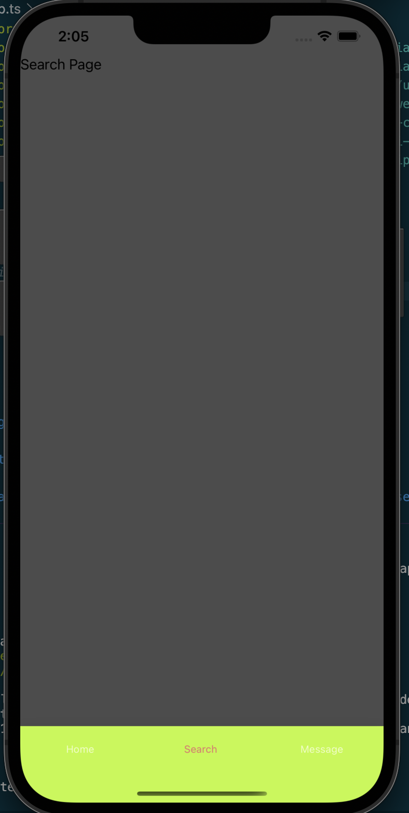
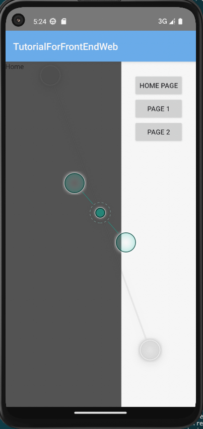
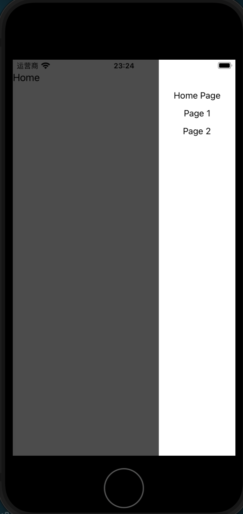

# 导航

如果说容器组件是一本书中的标点符号,那导航就是一本书的目录,没有导航当然也可以组织起一个应用,但用户体验一定是极差的.

导航本质上只要有按钮和页面跳转方法就能实现,但现在应用早已经总结了一套导航的最佳实践并将其固化到了专用的导航组件中.我们也就省去了从按钮开始排版构造导航的麻烦.

要充分理解Nativescript中的导航需要先理清以下这些关键概念和属性:

+ `Page Stack`(页面堆栈): 每个`<Frame>`包含一个页面堆栈用于跟踪用户导航.当用户导航到新页面时该页面被推送到堆栈顶部(push),当用户导航回上一个页面时页面从堆栈中弹出(pop).

+ `Navigating`(导航): `<Frame>`元素允许你使用内置的导航方法在页面之间进行切换.例如你可以使用`$navigateTo`方法导航到新页面,或者使用`$navigateBack`方法返回上一个页面.导航发生在 `<Frame>`元素的上下文中.

+ `Default Page`(默认页面): `<Frame>`可以有一个默认页面,这是应用程序启动时显示的第一个页面.

+ `Navigation Events`(导航事件): `<Frame>` 提供了一些事件,如`navigatingTo`,`navigatedTo`,`navigatingFrom` 和 `navigatedFrom`.这些事件允许你在页面导航的不同阶段执行自定义逻辑.

这套基于`$navigateTo`,`$navigateBack`等接口的路由方式被称为[Manual Routing](https://nativescript-vue.org/en/docs/routing/manual-routing/),它是官方给出的路由解决方案.本文的前半部分将以此为基础,介绍nativescript中的导航逻辑.

本文介绍组件的例子在[nsv-nav分支](https://github.com/hsz1273327/TutorialForFront-EndWeb/blob/nsv-nav)中

## 页面跳转

页面的跳转在nativescript-vue中最常见的是通过调用`$navigateTo(<页面B>, options)`实现的.其中页面B也是一个`Page`标签为最外层标签的vue对象.我们可以通过在`options`中设置导航的具体参数,主要包括:

+ `props`属性传递跳转去页面所需的`props`
+ `transition`或者`transitioniOS`和`transitionAndroid`来设置页面跳转的过渡动画,支持的过渡类型有:

| 选项                | ios可用 | android可用                      |
| ------------------- | ------- | -------------------------------- |
| `fade`              | T       | T                                |
| `flip`/`flipRight`  | T       | T                                |
| `flipLeft`          | T       | T                                |
| `slide`/`slideLeft` | T       | T                                |
| `slideRight`        | T       | T                                |
| `slideTop`          | T       | T                                |
| `slideBottom`       | T       | T                                |
| `curl`/`curlUp`     | T       | F                                |
| `curlDown`          | T       | F                                |
| `explode`           | F       | Android Lollipop(21) and up only |

+ `frame`属性,用于设置在哪个frame上切换Page,即导航的上下文信息

## 导航组件和常用模式

导航组件可以看做是针对导航功能的一组按钮.他们通常有集中,简洁的特点,一般用在页面跳转,相关功能集中展示等情况下.由于移动端屏幕小,通常位置也和固定,按出现位置和形式分可以分为3类:

1. 固定导航,固定在屏幕顶部或底部的导航,一般来说手机纵向空间会大些,固定导航通常会放在这里.顶部/底部固定导航的优点是稳定直观,它总是可见,因此用的最多,多数内容类app都会用它,甚至同时有顶部和底部固定导航.缺点也是稳定,总是可见,它会一直占据屏幕.

2. 底部弹出导航,通常是由tap行为触发,弹出一个导航列表,这种导航优点类似桌面端的右键菜单,但固定从底部弹出,毕竟手机屏幕就那么大.比如图片列表就可以设置长按弹出一个带分享,下载,转发,编辑的底部弹出导航

3. 滑动边栏导航,平时隐藏看不见,只有特定方向的`swipe`(滑动手势)行为发生时才会弹出,且弹出方向和滑动方向也一致.这种导航的优点是不占空间,缺点是欠缺稳定性,毕竟手势操作本身不稳定.如果我们通过额外的按钮呼出侧栏那就和底部弹出导航在形式上重复了.

这三种导航组件并不是孤立的,他们也可以相互配合,但每个导航组件通常最佳使用方法是固定的因此下面我们来结合组件介绍他们的最佳使用方式

### 固定导航

对于固定导航,可以分为两类:

+ 不使用`Manual Routing`或其他路由接口仅通过组件自行切换的`Tab`类导航
+ 相当于是固定位置按钮集合,使用`Manual Routing`或其他路由接口的`NavigationBar`类导航

nativescript原生就给了一个`TabView`组件用于在顶部底部构造固定导航,`nativescript-community/ui-material-components`中又进一步将拆分,提供了顶部导航`@nativescript-community/ui-material-tabs`和底部导航`@nativescript-community/ui-material-bottomnavigationbar`

#### ActionBar

[ActionBar](https://docs.nativescript.org/ui/action-bar)是脱胎于`Android`的`ActionBar`和`iOS`的`NavigationBar`的顶部导航,它的形式一般是最顶部一行,由于位置比较远通常用于作为应用级导航.功能上来说一般提供如下功能

+ 返回
+ 搜索快速入口
+ 分享入口
+ 消息入口
+ 个人账号编辑入口
+ 当前页提示

可以看到基本都是些实用频率较低但又不能没有的功能.这些功能往往不会用文本描述,而是使用图标.我们的例子中使用material-design的图标作为演示

`ActionBar`中有两种专有组件:

+ `NavigationButton`,专门负责返回功能,会固定在最左侧
+ `ActionItem`,导航按钮,

这两个组件在ios和android下配置不同,因此一般`ActionBar`中会使用`v-if`根据设备不同使用两份:

```vue
<template>
    ...
    <ActionBar title="My App">
        <template v-if="isIOS">
        ...
        </template>
        <template v-else>
            ...
        </template>
    </ActionBar>
    ...
</template>
 
<script lang="ts" setup>
import { ref } from "nativescript-vue";
...
const isIOS = ref(global.isIOS)
...
</script>
```

`NavigationButton`在`android`下只能设置`android.systemIcon`,因为只能用于返回所以一般设置为`ic_menu_back`;在`ios`下则只能设置`text`属性.

`ActionItem`在两种设备中通用的属性是`visibility`,`icon`和`text`,通常我们都是放图标的也就是说一般用`icon`就行,`visibility`则可以控制是否要展示.
剩下的我们需要设置元素的摆放位置,在`android`下设置`android.position`,它的取值可以为`actionBar`,`actionBarIfRoom`和`popup`;在ios下则需要设置`ios.position`,它的取值可以为`left`和`right`.

通常我们展示`icon`就和其他位置一样,设置`class`为符号所在的类名,然后使用unicode指定即可,但如果我们希望展示一个图片作为符号(比如已经登录的用户一般会有用户头像作为进入用户设置页的符号),那我们可以在其中包裹一个[image](https://blog.hszofficial.site/TutorialForFront-EndWeb/#/%E7%A7%BB%E5%8A%A8%E7%AB%AF%E5%8E%9F%E7%94%9F%E5%BA%94%E7%94%A8/UI%E7%BB%84%E4%BB%B6/%E5%9F%BA%E7%A1%80%E7%BB%84%E4%BB%B6/%E5%86%85%E5%AE%B9%E5%B1%95%E7%A4%BA%E7%BB%84%E4%BB%B6?id=image)或[NSImg](https://blog.hszofficial.site/TutorialForFront-EndWeb/#/%E7%A7%BB%E5%8A%A8%E7%AB%AF%E5%8E%9F%E7%94%9F%E5%BA%94%E7%94%A8/UI%E7%BB%84%E4%BB%B6/%E5%9F%BA%E7%A1%80%E7%BB%84%E4%BB%B6/%E5%86%85%E5%AE%B9%E5%B1%95%E7%A4%BA%E7%BB%84%E4%BB%B6?id=nsimg)来使用.

##### 返回功能

返回功能通常都是用`NavigationButton`实现的,通常都放在最左顶角,因为无论ios还是android都可以不按这个钮简单的实现返回.也正是因为这个,这个功能往往只在最末端的页面比如内容详情页才会放出来,放出来通常也没人点

##### 搜索快速入口功能

一般视页面actionbar中内容多少有两种选择

+ 使用一个搜索图标的`ActionItem`,点击后进入专门的搜索页

+ 使用`SearchBar`,用户在其中输入要搜索的内容,按回车后带着这个搜索框中填入的内容跳转进入搜索页,进入就展示的是已经搜好的结果

从便利来说第二种方案当然更好,但往往我们会追求简洁,因此通常第一种方案用的反而多些

##### 分享入口

分享通常会做成点击后触发底部弹出导航的形式.这也是为什么这个不部分的例子会和底部弹出导航的在一起.

##### 消息入口

消息入口一般就是点击就跳转到专门的消息页面

##### 个人账号编辑入口

这个位置通常需要做状态判定--如果是未登录的用户通常给个账号图标,点击后进入注册登录页面;而已登录的用户通产会展示用户头像作为图标

##### 当前页提示

一般是两种形式:

+ 页面名,也就是给出当前的页面名
+ 页面路径,也就是模仿网页的形式给出一个路径信息

第一种相对更多些,毕竟路径比较长,容易影响后面的其他按钮

通常直接设置actionbar的titl就可以提示当前页了,但如果有排版要求可以插入`Label`类组件,

##### 隐藏ActionBar

很多页面我们并不需要ActionBar,这时可以在`Page`标签中将`actionBarHidden`设置为`true`

#### TabView(原生)

[TabView](https://nativescript-vue.org/cn/docs/elements/components/tab-view/)是nativescript原生提供的`Tab`类导航组件,他有如下特点:

1. 在ios下固定在底部,在android中则可以使用属性`androidTabsPosition`设置在顶部(`top`)还是底部(`bottom`),默认在顶部.
2. 可以通过设置`selectedIndex`来设置选中index的初始值,`selectedTabTextColor`来设置被选中index的高亮颜色.
3. 子组件`TabViewItem`按顺序从0开始计数.
4. **每个`TabViewItem`中只允许有一个直系子组件**.且**子组件只在构造页面时渲染,切换index不会重复渲染**
5. 点击切换index切换其对应的`TabViewItem`中的子组件展示.我们可以通过监听事件`selectedIndexChange`来监听index的变化,但无法借助这个回调控制修改选中的index.`selectedIndexChange`触发后会给绑定的回调函数传递一个对象,理论上它应该满足[SelectedIndexChangedEventData](https://v7.docs.nativescript.org/api-reference/interfaces/_ui_tab_view_.selectedindexchangedeventdata.html)接口,但实际上这个对象没有`newIndex`和`oldIndex`属性,但有`value`和`oldValue`属性做同样的事情,这应该是一个bug.因此在ts下我们需要对回调的参数声明做一些改动:

```ts
...
import { EventData } from "@nativescript/core/data/observable";

interface SelectedIndexChangedEventData extends EventData {
  oldValue: number;

  /**
   * The new selected index.
   */
  value: number;
}

...
methods: {
  ...
  tabChangeHandler(evt: SelectedIndexChangedEventData){},
}
```

由于有上面介绍的性质,tabview和我们期望的仅做为按键集合有着较大区别,它基本只能作为一个根Page的最外层的容器使用.

> 样式:

+ android
    

+ ios

    

> 使用方法:

它的使用方式可以分为两种思路:

1. 用于导航组件集合.这是最简单的用法,本质上它并不是导航,只是展示的组件进行切换而已.这种用法多用在相关且处于同一层次结构的内容组之间进行导航,还是同一个Page内元素组合的切换,比如有个户口本页面就可以将爸爸,妈妈,孩子三个人的信息使用TabView进行导航.

    + `views/Main.Vue`

    ```Vue
    <template>
      <Frame>
        <Page actionBarHidden="true">
          <TabView selectedIndex="1" selectedTabTextColor="#e57373" @selectedIndexChange="tabChangeHandler">
            <TabViewItem title="Tab 1">
              <Label text="Content for Tab 1" />
            </TabViewItem>
            <TabViewItem title="Tab 2">
              <Label text="Content for Tab 2" />
            </TabViewItem>
            <TabViewItem title="Tab 3">
              <Label text="Content for Tab 3" />
            </TabViewItem>
          </TabView>
        </Page>
        </Frame>
    </template>

    <script lang="ts" setup>
    import { EventData } from "@nativescript/core/data/observable";

    interface SelectedIndexChangedEventData extends EventData {
      oldValue: number;
      /**
       * The new selected index.
      */
      value: number;
    }

    function tabChangeHandler(evt: SelectedIndexChangedEventData) {
      console.log("!!!!");
      console.log(evt.eventName);
      console.log(Object.keys(evt));
      console.log(evt.oldValue);
      console.log(evt.value);
    }
    </>
    ```

2. 用于导航多个Frame,这种方式适合需要多个Frame的情况,一般这些Frame是平行关系,且不会相互影响.比如我们希望一个tab下进行一些操作后点击另一tab再进行一些操作,回到原来tab下不会重新渲染.具体一点比如文本编辑器中多个文件间的切换就可以用这种逻辑.

    + `views/Main.vue`

        ```vue
        <template>
          <Frame>
            <Page actionBarHidden="true">
              <TabView selectedIndex="0" selectedTabTextColor="#e57373" @selectedIndexChange="tabChangeHandler">
                <TabViewItem title="Tab 1">
                  <Frame id="home-frame">
                    <HomePage />
                  </Frame>
                </TabViewItem>
                <TabViewItem title="Tab 2">
                  <Frame id="page-frame-1">
                    <Page1 />
                  </Frame>
                </TabViewItem>
                <TabViewItem title="Tab 3">
                  <Frame id="page-frame-2">
                    <Page2 />
                  </Frame>
                </TabViewItem>
              </TabView>
            </Page>
          </Frame>
        </template>
            
        <script lang="ts" setup>
        import { EventData } from "@nativescript/core/data/observable";
        import HomePage from "./HomePage.vue";
        import Page1 from "./Page1.vue";
        import Page2 from "./Page2.vue";


        interface SelectedIndexChangedEventData extends EventData {
          oldValue: number;
          /**
          * The new selected index.
          */
          value: number;
        }

        function tabChangeHandler(evt: SelectedIndexChangedEventData) {
          console.log("!!!!");
          console.log(evt.eventName);
          console.log(Object.keys(evt));
          console.log(evt.oldValue);
          console.log(evt.value);
        }
        </script>
        ```

    + `views/HomePage.vue`

        ```Vue
        <template>
          <Page actionBarHidden="true">
              <StackLayout>
                  <Label text="Home"></Label>
              </StackLayout>
          </Page>
      </template>
          
      <script lang="ts" setup>
      import { onMounted } from "nativescript-vue";

      onMounted(() => console.log("&&&&mounted home frame"))
      </script>
        ```

    + `views/Page1.Vue`

        ```Vue
        <template>
            <Page actionBarHidden="true">
                <StackLayout>
                    <Label text="Page 1"></Label>
                </StackLayout>
            </Page>
        </template>

        <script lang="ts" setup>
        import { onMounted } from "nativescript-vue";

        onMounted(() => console.log("&&&&mounted page1 frame"))
        </script>
        ```

    + `views/Page2.Vue`

        ```Vue
        <template>
            <Page actionBarHidden="true">
                <StackLayout>
                    <Label text="Page 2"></Label>
                </StackLayout>
            </Page>
        </template>

        <script lang="ts" setup>
        import { onMounted } from "nativescript-vue";

        onMounted(() => console.log("&&&&mounted page2 frame"))
        </script>
        ```

当然了上面两种思路也是可以融合的,具体怎么用还是要看业务需求,只要记住在同一个`Frame`中才在同一个导航的上下文中就行了.

#### ui-material-tabs

[@nativescript-community/ui-material-tabs](https://www.npmjs.com/package/@nativescript-community/ui-material-tabs)是原生tabview组件的material风格扩展,也是`Tab`类导航,它在使用思路上和原生的完全一样只是主要多了如下细节:

1. 无论在ios还是android中都可以使用属性`tabsPosition`设置在顶部(`top`)还是底部(`bottom`).
2. 没有`selectedTabTextColor`属性了,高亮选中的index使用material风格
3. 增加`swipeEnabled`属性用于开启滑动
4. 增加`offscreenTabLimit`属性,当tab过多是可以用它设置屏幕上展示的个数,隐藏的可以滑动后找到

要用它我们当然需要先设置Material.然后安装`@nativescript-community/ui-material-tabs`,然后在入口文件中导入它

```ts
import { createApp, registerElement } from 'nativescript-vue';
import TabsPlugin from '@nativescript-community/ui-material-tabs/vue';

createApp(Home).use(TabsPlugin)
```

> 样式:

+ android
    

+ ios

    

> 用法:

和上面原生的可以直接替换,由于用法思路一样我们就用`@nativescript-community/ui-material-tabs`复刻上面第二个例子,我们只要改`Main.vue`的写法就可以无缝替换,主要看tab功能写法上的不同.

+ `views/Main.vue`

    ```Vue
    <template>
        <Frame>
            <Page actionBarHidden="true">
                <MDTabs selectedIndex="0" tabsPosition="bottom" swipeEnabled="true" @selectedIndexChanged="tabChangeHandler">
                    <!-- The bottom tab UI is created via TabStrip (the containier) and TabStripItem (for each tab)-->
                    <MDTabStrip>
                        <MDTabStripItem>
                            <Label text="Home"></Label>
                        </MDTabStripItem>
                        <MDTabStripItem class="special">
                            <Label text="Page1"></Label>
                        </MDTabStripItem>
                        <MDTabStripItem class="special">
                            <Label text="Page2"></Label>
                        </MDTabStripItem>
                    </MDTabStrip>

                    <!-- The number of TabContentItem components should corespond to the number of TabStripItem components -->
                    <MDTabContentItem>
                        <Frame id="home-frame">
                            <HomePage />
                        </Frame>
                    </MDTabContentItem>
                    <MDTabContentItem>
                        <Frame id="page-frame-1">
                            <Page1 />
                        </Frame>
                    </MDTabContentItem>
                    <MDTabContentItem>
                        <Frame id="page-frame-2">
                            <Page2 />
                        </Frame>
                    </MDTabContentItem>
                </MDTabs>
            </Page>
        </Frame>
    </template>
      
    <script lang="ts" setup>
    // import NavMDBottom from "../components/NavMDBottom.vue";
    import { SelectedIndexChangedEventData } from "@nativescript-community/ui-material-core-tabs/tab-navigation-base";
    import HomePage from "./HomePage.vue";
    import Page1 from "./Page1.vue";
    import Page2 from "./Page2.vue";

    function tabChangeHandler(evt: SelectedIndexChangedEventData) {
        console.log("!!!!");
        console.log(evt.eventName);
        console.log(Object.keys(evt));
        console.log(evt.oldIndex);
        console.log(evt.newIndex);
    }
    </script>
    ```

#### SegmentedBar(原生)

[SegmentedBar](https://nativescript-vue.org/cn/docs/elements/components/segmented-bar/)是原生的离散选择`NavigationBar`类导航,他和上面连个组件不同点在于它没有固定位置,基本可以理解为就是按钮集合.要使用它我们需要结合容器组件.

`SegmentedBar`通过监听`onIndexSelected`事件来导航,其中元素从0开始计数.
我们可以通过设置`selectedIndex`来设置选中index的初始值,使用`selectedBackgroundColor`设置选中项的背景色.

它的最佳使用方法是结合Frame使用,思路是

1. 在root-frame中构造一个main-frame用于展示主体
2. 导航放置在root-frame中和main-frame平级,main-frame中放置被导航的页面
3. 监听组件`SegmentedBar`的`onIndexSelected`事件导航页面
4. 使用`GridLayout`组件排版nav-frame和main-frame,`<GridLayout rows="auto,*">`为顶部导航,`<GridLayout rows="*, auto">`则为底部导航

> 样式:

+ android
    

+ ios

    

> 用法

我们用`SegmentedBar`来继续为HomePage,Page1,Page2三个页面导航.我们只要修改`Main.vue`并增加一个`NavMDBottom.vue`组件用于抽出导航逻辑

+ `views/Main.vue`

    ```Vue
    <template>
        <Frame>
            <Page actionBarHidden="true">
                <!--底部导航-->
                <GridLayout rows="*, auto">
                    <Frame id="main-frame" row="0">
                        <HomePage />
                    </Frame>
                    <NavSegmentedBar row="1" />
                </GridLayout>
                <!--顶部导航-->
                <!-- <GridLayout rows="auto,*">
            <NavSegmentedBar row="0"/>
            <Frame id="main-frame" row="1">
              <Home />
            </Frame>
          </GridLayout> -->
            </Page>
        </Frame>
    </template>
      
    <script lang="ts" setup>
    import NavSegmentedBar from "../components/NavSegmentedBar.vue";
    import HomePage from "./HomePage.vue";
    </script>
    ```

+ `components/NavSegmentedBar.vue`

    ```vue
    <template>
        <SegmentedBar selectedBackgroundColor="#e57373" selectedIndex="0" @selectedIndexChanged="onIndexSelected"
            id="nav-segbar">
            <SegmentedBarItem title="Home" />
            <SegmentedBarItem title="Page1" />
            <SegmentedBarItem title="Page2" />
        </SegmentedBar>
    </template>
        
    <script lang="ts" setup>
    import { $navigateTo } from "nativescript-vue";
    import { SelectedIndexChangedEventData } from "@nativescript/core/ui/segmented-bar";
    import HomePage from "../views/HomePage.vue";
    import Page1 from "../views/Page1.vue";
    import Page2 from "../views/Page2.vue";

    function onIndexSelected(evt: SelectedIndexChangedEventData) {
        console.log("!!!!!");
        switch (evt.newIndex) {
            case 0:
                {
                    $navigateTo(HomePage, {
                        transition: { name: "fade" },
                        frame: "main-frame",
                    });
                }
                break;
            case 1:
                {
                    $navigateTo(Page1, {
                        transition: { name: "fade" },
                        frame: "main-frame",
                    });
                }
                break;
            case 2:
                {
                    $navigateTo(Page2, {
                        transition: { name: "fade" },
                        frame: "main-frame",
                    });
                }
                break;
            default:
                console.log(`unknown index ${evt.newIndex}`);
        }
    }
    </script>
    ```

上面的例子是最基本的用法,就像上面说的`SegmentedBar`本身与位置无关,因此使用上非常灵活.几个扩展思路总结如下:

1. 顶栏底栏双层`SegmentedBar`.类似桌面端的侧栏和顶栏配合用法,只是侧栏被替换成了底栏.底栏更容易触达,用于应用整体导航,顶栏触达会稍微远一点,用于页面逻辑中的导航
2. 滑动边栏和底栏双层`SegmentedBar`.滑动边栏用于导航最外层的业务分类,底栏用于复杂业务页面的导航.

#### ui-material-bottomnavigationbar

[@nativescript-community/ui-material-bottomnavigationbar](https://www.npmjs.com/package/@nativescript-community/ui-material-bottomnavigationbar)是material风格的离散选择`NavigationBar`类导航,要使用它需要设置Material.它和`SegmentedBar`一样并没有固定位置,而且更加接近按钮集合的概念,我们用它需要结合容器组件.

要用它我们当然需要先设置Material.然后安装`@nativescript-community/ui-material-bottomnavigationbar`,然后在入口文件中导入它

```ts
import { createApp, registerElement } from 'nativescript-vue';
import BottomNavigationBar from '@nativescript-community/ui-material-bottomnavigationbar/vue'
createApp(Home).use(BottomNavigationBar)
```

`MDBottomNavigationBar`通过监听`tabSelected`事件来导航,其中的元素按顺序从0开始计数.
我们可以通过设置`selectedTabIndex`来设置选中index的初始值,`activeColor`来设置被选中index的高亮颜色,`badgeColor`来设置未被选中的高亮颜色.
每次切换index后绑定的回调函数会收到一个`TabSelectedEventData`对象,它会包含`oldIndex`和`newIndex`两个属性分别表示上一index和当前的index.

和上面`SegmentedBar`一样它的最佳使用方法是结合Frame使用,思路是

1. 在root-frame中构造一个main-frame用于展示主体
2. 导航放置在root-frame中和main-frame平级,main-frame中放置被导航的页面
3. 监听组件`MDBottomNavigationBar`的`tabSelected`事件导航页面
4. 使用`GridLayout`组件排版nav-frame和main-frame,`<GridLayout rows="auto,*">`为顶部导航,`<GridLayout rows="*, auto">`则为底部导航

> 样式:

+ android
    

+ ios

    

> 用法

我们用`ui-material-bottomnavigationbar`来继续为HomePage,Page1,Page2三个页面导航.我们只要修改`Main.vue`并增加一个`NavMDBottom.vue`组件用于抽出导航逻辑

+ `views/Main.vue`

    ```Vue
    <template>
        <Frame>
            <Page actionBarHidden="true">
                <!--底部导航-->
                <GridLayout rows="*, auto">
                    <Frame id="main-frame" row="0">
                        <HomePage />
                    </Frame>
                    <NavMDBottom row="1" />
                </GridLayout>
                <!--顶部导航-->
                <!-- <GridLayout rows="auto,*">
            <NavMDBottom row="0"/>
            <Frame id="main-frame" row="1">
              <Home />
            </Frame>
          </GridLayout> -->
            </Page>
        </Frame>
    </template>
      
    <script lang="ts" setup>
    import NavMDBottom from "../components/NavMDBottom.vue";
    import HomePage from "./HomePage.vue";

    </script>
    ```

    作为入口`Page`,`Main.vue`负责为导航和主Frame搭好框架分配好屏幕的占用.

+ `components/NavMDBottom.vue`

    ```Vue
    <template>
        <MDBottomNavigationBar activeColor="#e57373" badgeColor="#1976d2" selectedTabIndex="0"
            @tabSelected="onBottomNavigationTabSelected">
            <MDBottomNavigationTab title="Home" />
            <MDBottomNavigationTab title="Page1" />
            <MDBottomNavigationTab title="Page2" />
        </MDBottomNavigationBar>
    </template>
        
    <script lang="ts" setup>
    import { $navigateTo } from "nativescript-vue";
    import { TabSelectedEventData } from "@nativescript-community/ui-material-bottomnavigationbar";
    import HomePage from "../views/HomePage.vue";
    import Page1 from "../views/Page1.vue";
    import Page2 from "../views/Page2.vue";

    function onBottomNavigationTabSelected(args: TabSelectedEventData) {
        console.log("!!!!!");
        console.log(args.oldIndex);
        console.log(args.newIndex);
        switch (args.newIndex) {
            case 0:
                {
                    $navigateTo(HomePage, {
                        transition: { name: "fade" },
                        frame: "main-frame",
                    });
                }
                break;
            case 1:
                {
                    $navigateTo(Page1, {
                        transition: { name: "fade" },
                        frame: "main-frame",
                    });
                }
                break;
            case 2:
                {
                    $navigateTo(Page2, {
                        transition: { name: "fade" },
                        frame: "main-frame",
                    });
                }
                break;
            default:
                console.log(`unknown index ${args.newIndex}`);
        }
    }
    </script>
    ```

    `NavMDBottom.vue`负责将导航逻辑打包好,使用`MDBottomNavigationBar`的最大优点就是它并不与位置绑定,你甚至可以在顶部底部的滑动边栏导航中使用它.

上面的例子是最基本的用法,就像上面说的`MDBottomNavigationBar`本身与位置无关,因此使用上非常灵活.几个扩展思路总结如下:

1. 顶栏底栏双层`MDBottomNavigationBar`.类似桌面端的侧栏和顶栏配合用法,只是侧栏被替换成了底栏.底栏更容易触达,用于应用整体导航,顶栏触达会稍微远一点,用于页面逻辑中的导航
2. 滑动边栏和底栏双层`MDBottomNavigationBar`.滑动边栏用于导航最外层的业务分类,底栏用于复杂业务页面的导航.

**不过需要注意**:

1. MDBottomNavigationBar无法使用Vue上后绑定的方法,比如下面的底部弹出导航就无法使用

### 底部弹出导航

这个没有原生的,只有[@nativescript-community/ui-material-bottomsheet](https://www.npmjs.com/package/@nativescript-community/ui-material-bottomsheet)这一个选择.

要用它我们当然需要先设置Material.然后安装`@nativescript-community/ui-material-bottomsheet`,然后在入口文件中导入它

```ts
import { createApp, registerElement } from 'nativescript-vue';
import BottomSheetPlugin from '@nativescript-community/ui-material-bottomsheet/vue3';
import { install as installBottomsheet } from "@nativescript-community/ui-material-bottomsheet";
installBottomsheet();
createApp(Home).use(BottomSheetPlugin);
```

每个vue实例会获得

+ 方法`showBottomSheet(Component, options)`(来自`import { useBottomSheet } from "@nativescript-community/ui-material-bottomsheet/vue3";  const { showBottomSheet,closeBottomSheet } = useBottomSheet()`),执行后就会弹出底部弹出导航.options满足接口 [VueBottomSheetOption](https://github.com/nativescript-community/ui-material-components/blob/master/src/bottomsheet/vue/index.ts),除了文档中列出的属性可以设置外我们也可以用属性`prop`传递参数给`Component`.需要注意的是
  
    1. `options`中可以设置`closeCallback`属性,它的参数为`...args`,当它弹出的底部弹出导航被关闭后它会被调用.
    2. 亲测`BottomSheet`无法与`MDBottomNavigationBar`配合使用,

+ 方法`closeBottomSheet(...args)`(来自`import { useBottomSheet } from "@nativescript-community/ui-material-bottomsheet/vue3";const {  showBottomSheet,closeBottomSheet } = useBottomSheet()`),执行后如果有参数,则会被传递给`showBottomSheet`中设置的`closeCallback`中作为参数.

> 样式:

+ android
    

+ ios

    

> 用法

我们使用一个顶部按钮来呼出底部弹出导航,然后用它继续为HomePage,Page1,Page2三个页面导航.

+ `views/Main.vue`,我们用一个按键的tap事件触发弹出底部弹出导航页面

    ```vue
    <template>
        <Frame>
            <Page>
                <ActionBar title="My App">
                    <template v-if="isIOS">
                        <!-- <NavigationButton :text="iconback" /> -->
                        <ActionItem :icon="fontback" ios.position="left" class="mdi-ab" />
                        <!-- <SearchBar hint="Search..." /> -->
                        <ActionItem :icon="fontsearch" ios.position="left" class="mdi-ab" />
                        <ActionItem :icon="fontshare" ios.position="right" class="mdi-ab" @Tap="onButtonTap"/>
                        <ActionItem :icon="fontmessage" ios.position="right" class="mdi-ab" />
                        <ActionItem ios.position="right" >
                            <NSImg :src="src_account_login" roundAsCircle="true" stretch=fitCenter class="avatar" ></NSImg>
                        </ActionItem>
                        <!-- <ActionItem :icon="fontaccount" ios.position="right" class="mdi" /> -->
                    </template>
                    <template v-else>
                        <NavigationButton android.systemIcon="ic_menu_back" />
                        <!-- <ActionItem :icon="fontback" android.position="actionBar" class="mdi" /> -->
                        <!-- <SearchBar hint="Search..." /> -->

                        <ActionItem :icon="fontsearch" android.position="actionBar" class="mdi-ab" />
                        <ActionItem :icon="fontshare" android.position="actionBar" class="mdi-ab" @Tap="onButtonTap"/>
                        <ActionItem :icon="fontmessage" android.position="actionBar" class="mdi-ab" />
                        <ActionItem android.position="actionBar">
                            <NSImg :src="src_account_login" roundAsCircle="true" stretch=fitCenter></NSImg>
                        </ActionItem>
                        <!-- <ActionItem :icon="fontaccount" android.position="actionBar" class="mdi" /> -->
                    </template>
                </ActionBar>
                <GridLayout rows="auto,*">
                    <Frame id="main-frame" row="1">
                        <HomePage />
                    </Frame>
                </GridLayout>
            </Page>
        </Frame>
    </template>
    
    <script lang="ts" setup>
    import { ref } from "nativescript-vue";
    import { TapGestureEventData } from "@nativescript/core/ui/gestures";
    import HomePage from "./HomePage.vue";
    import ShareBottomBar from "../components/ShareBottomBar.vue";
    import { useBottomSheet } from "@nativescript-community/ui-material-bottomsheet/vue3";

    const isIOS = ref(global.isIOS)
    const { showBottomSheet } = useBottomSheet()
    const fontback = "font://\uf2fa"
    const fontsearch = "font://\uf1c3"
    const fontshare = "font://\uf35b"
    const fontmessage = "font://\uf15a"
    const fontaccount = "font://\uf207"
    const src_account_login = "https://img.duoziwang.com/2021/04/08101559830055.jpg"

    const defaultIndex = ref(0)
    function onButtonTap(evt: TapGestureEventData) {
        showBottomSheet(ShareBottomBar, {
            dismissOnBackgroundTap: true,
            props: {
                canCloseBottomSheet: true,
                defaultIndex: defaultIndex.value,
            },
            closeCallback: (...args: any[]) => {
                console.log("bottom sheet closed", args);
                try {
                    defaultIndex.value = args[0][0][1];
                } catch (e) {
                    defaultIndex.value = 0
                }
            },
        });
    }
    </script>
    ```

+ `components/ShareBottomBar.vue`,这里使用`NavSegmentedBar`来实现

    ```Vue
    <template>
        <SegmentedBar selectedBackgroundColor="#e57373" :selectedIndex="defaultIndex" @selectedIndexChanged="onIndexSelected"
            id="share-segbar" height="50" class="mdi">
            <SegmentedBarItem :title="icon_google" class="mdi" height="50"/>
            <SegmentedBarItem :title="icon_github" class="mdi-ab" height="50" />
            <SegmentedBarItem :title="icon_twitter" class="mdi-ab" height="50"/>
        </SegmentedBar>
    </template>
        
    <script lang="ts" setup>
    import { defineProps, $navigateTo, ref } from "nativescript-vue";
    import { View } from "@nativescript/core";
    import { SelectedIndexChangedEventData } from "@nativescript/core/ui/segmented-bar";
    import { useBottomSheet } from "@nativescript-community/ui-material-bottomsheet/vue3";

    const { closeBottomSheet } = useBottomSheet()
    const icon_google = ref("\uf34e")
    const icon_github = ref("\uf345")
    const icon_twitter = ref("\uf360")
    const props = defineProps({
        canCloseBottomSheet: {
            type: Boolean,
            default: false,
        },
        defaultIndex: {
            type: Number,
            default: 0,
        },
    })

    function onIndexSelected(evt: SelectedIndexChangedEventData) {
        console.log("!!!!!");
        switch (evt.newIndex) {
            case 0:
                {
                    console.log("google")
                }
                break;
            case 1:
                {
                    console.log("twitter")
                }
                break;
            case 2:
                {
                    console.log("github")
                }
                break;
            default:
                console.log(`unknown index ${evt.newIndex}`);
        }
        if (props.canCloseBottomSheet) {
            let obj = evt.object as View;
            try {
                closeBottomSheet(obj.id, evt.newIndex);
            } catch (e) {
                console.log(`try to closeBottomSheet get error: ${e}`)
            }
        }
    }
    </script>
    ```

    由于`BottomSheet`并不是一个单独的Frame而是每次呼出时重新渲染,因此我们必须修改`NavMDBottom`让他可以从外部传入初始化参数,否则每次呼出都会回到首页.这里我们使用了vue的`props`来做单向数据传输,当然做的复杂也可以使用vuex.同时我们还必须可以将选中的index传出给调用它的组件,以便下次再呼出底栏时可以知道要用哪个index作为初始值,这里可以很好的利用`showBottomSheet`的可选参数`closeCallback`.

    构造`SegmentedBar`实例时最开始就会根据`selectedIndex`设置index进行渲染,这会触发我们的`onIndexSelected`,但此时`closeBottomSheet`中实际上调用会报错,因为`showBottomSheet`实际上并没有处理完.因此我们需要用`try`语句处理下这个问题.

### 滑动边栏导航

滑动边栏导航我们可以使用[@nativescript-community/ui-drawer](https://github.com/nativescript-community/ui-drawer).它支持四个位置的边栏.要用它我们需要安装`@nativescript-community/ui-material-bottomsheet`,然后在入口文件中导入它

```ts
import DrawerPlugin from '@nativescript-community/ui-drawer/vue3'
import { install as installUIDrawer} from '@nativescript-community/ui-drawer';
installUIDrawer()
Vue.use(DrawerPlugin);
```

使用方法可以总结为:

1. 页面最外层使用组件`<Drawer ref="drawer">`,其中每个元素可以使用属性指定功能:
    1. `~leftDrawer`,左侧边栏
    2. `~rightDrawer`,右侧边栏
    3. `~topDrawer`,顶部边栏
    4. `~bottomDrawer`,底部边栏
    5. `~mainContent`主体部分

2. 如果要直接呼出边栏或收回边栏,可以做如下操作:
    1. 在`<template>`中将`<Drawer>`标签元素注册到一个变量中

        ```vue
        <template>
            ...
            <Drawer ref="drawer">
                ...
            </Drawer>
        </template>
        <script lang="ts" setup>
        import { ref } from 'vue'
        ...
        const drawer = ref()
        ...
        </script>
        ```

    2. 在需要执行操作的函数中调用这个变量对应元素的`open()`或`close()`接口

        ```vue
        <script lang="ts" setup>
        ...
        drawer.open('left')
        drawer.close('left')
        ...
        </script>
        ```

        其中open和close的参数可以是`left`,`right`,`top`,`bottom`,其含义是呼出或者收回那个侧栏.

> 样式:

+ android
    

+ ios

    <--缺失-->

> 用法

设置四个方向的滑动边栏导航,用它们继续为HomePage,Page1,Page2三个页面导航.

我们将上下两个方向的设为`NavMDBottom`,剩下侧边的重新弄一个竖排版的组件`SideSheet`

+ `views/Main.vue`

    ```vue
    <template>
        <Frame>
            <Page>
                <Drawer ref="drawer">
                    <SideSheet ~leftDrawer />
                    <SideSheet ~rightDrawer />
                    <NavMDBottom ~topDrawer />
                    <NavMDBottom ~bottomDrawer />
                    <Frame ~mainContent id="main-frame">
                        <HomePage />
                    </Frame>
                </Drawer>
            </Page>
        </Frame>
    </template>
    
    <script lang="ts" setup>
    import HomePage from "./HomePage.vue";
    import SideSheet from "../components/SideSheet.vue"
    import NavMDBottom from "../components/NavMDBottom.vue";
    </script>
    ```

+ `components/SideSheet.vue`

    ```Vue
    <template>
        <Stacklayout backgroundColor="white" padding="25">
            <Button id="to-homepage-btn" @tap="toHomePage" text="Home Page"></Button>
            <Button id="to-page1-btn" @tap="toPage1" text="Page 1"></Button>
            <Button id="to-page2-btn" @tap="toPage2" text="Page 2"></Button>
        </Stacklayout>
    </template>
    
    <script lang="ts" setup>
    import { $navigateTo } from "nativescript-vue";
    import { TapGestureEventData } from "@nativescript/core/ui/gestures";
    import HomePage from "../views/HomePage.vue";
    import Page1 from "../views/Page1.vue";
    import Page2 from "../views/Page2.vue";

    function toHomePage(evt: TapGestureEventData) {
        $navigateTo(HomePage, {
            transition: { name: "fade" },
            frame: "main-frame",
        });
    }
    function toPage1(evt: TapGestureEventData) {
        $navigateTo(Page1, {
            transition: { name: "fade" },
            frame: "main-frame",
        });
    }
    function toPage2(evt: TapGestureEventData) {
        $navigateTo(Page2, {
            transition: { name: "fade" },
            frame: "main-frame",
        });
    }
    </script>
    ```

在使用滑动边栏导航时我们通常是有条件的选择滑动方向的

1. 在ios中顶部底部上划本身是一个全局操作,因此顶部底部通常都不会使用
2. 一些应用会使用侧滑导航的顶栏,两侧滑动也就很容易误触,因此也要谨慎使用
