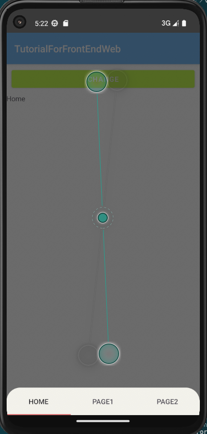
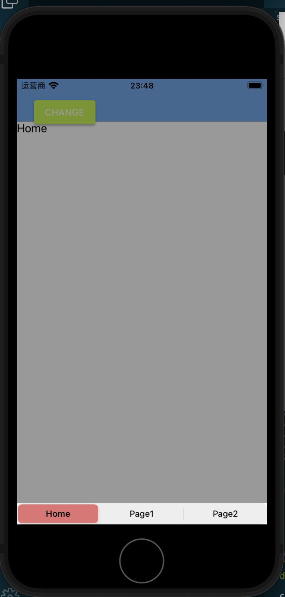

# 弹出框

弹出框指的是由事件唤出的功能性组件框,通常它的表现形式是悬浮在原本的视图之上,要么呼出一组按钮提供相应功能,要么弹出一个地图,视频或者相机窗口用来临时执行一下操作.

它与对话框还不一样,对话框更多的是提示作用,而弹出框更多的是提供功能.

## 快速拨号菜单(Speed dial)

[快速拨号菜单](https://m2.material.io/components/buttons-floating-action-button#behavior)是一组按键的收纳,平时展示为一个按键,当点击时会弹出其中的所有按键并将按键之外的页面作为背景,如果你点击其中的某个按键就会执行相应的操作;如果点击按键之外的地方则退回到原本收纳的状态.

快速拨号菜单可以理解为[悬浮按钮FAB](https://blog.hszofficial.site/TutorialForFront-EndWeb/#/%E7%A7%BB%E5%8A%A8%E7%AB%AF%E5%8E%9F%E7%94%9F%E5%BA%94%E7%94%A8/UI%E7%BB%84%E4%BB%B6/%E5%9F%BA%E7%A1%80%E7%BB%84%E4%BB%B6/%E8%BE%93%E5%85%A5%E5%9E%8B%E7%BB%84%E4%BB%B6?id=%e6%82%ac%e6%b5%ae%e6%93%8d%e4%bd%9c%e6%8c%89%e9%92%aefab)的集成扩展,其形式就是展示一个图标按钮,点击后会呼出菜单让用户进行选择.

社区提供了插件[@nativescript-community/ui-material-speeddial](https://www.npmjs.com/package/@nativescript-community/ui-material-speeddial)实现了这一功能,旦他有几个特点:

1. 与底层导航冲突,底层导航会占掉约一半的快速拨号菜单启动按钮
2. 按钮无法设置为圆形,只能是固定的方形
3. 位置固定只有两个选择,要么左侧(默认)要么右侧,它通过属性`horizontalAlignment`选择`left`或者`right`确定,且永远在父容器的垂直居中位置
4. 点击后菜单永远是向上弹的,菜单中的按键顺序与展示顺序相反

要用它我们当然需要先设置Material.然后安装`@nativescript-community/ui-material-speeddial`,然后在入口文件中导入它

```ts
import speeddialPlugin from '@nativescript-community/ui-material-speeddial/vue';

createApp(Home).use(speeddialPlugin)
```

### 例子

快速拨号菜单虽然看着不错,其实它比较僵硬,位置放置并不方便,而且只能弹出按钮,方向还是固定的向上,因此使用场景比较局限,基本只能是列表页面中的额外操作悬浮按钮

```Vue
<template>
    <Frame>
        <Page actionBarHidden="true">
            <GridLayout>
                <ListView ref="collection" height="100%" width="100%" separatorColor="transparent" :items="itemList"
                    colWidth="50%" rowHeight="100">
                    <template #default="{ item }">
                        <StackLayout :backgroundColor="item.color" height="100">
                            <Label :text="item.name" />
                        </StackLayout>
                    </template>
                </ListView>
                <MDSpeedDial :text="iconUnicode('\uf19c')" buttonClass="mdi" horizontalAlignment="right">
                    <MDSpeedDialItem :text="iconUnicode('\uf250')" buttonClass="mdi" @tap="onActionTap" />
                    <MDSpeedDialItem :text="iconUnicode('\uf1b9')" buttonClass="mdi" @tap="onActionTap" />
                    <MDSpeedDialItem :text="iconUnicode('\uf278')" buttonClass="mdi" backgroundColor="orange"
                        @tap="onActionTap" />
                    <MDSpeedDialItem :text="iconUnicode('\uf252')" buttonClass="mdi" @tap="onActionTap" />
                </MDSpeedDial>
            </GridLayout>
        </Page>
    </Frame>
</template>

<script lang="ts" setup>
import { ref } from 'nativescript-vue'
import { EventData } from "@nativescript/core/data/observable";
interface Card {
    name: string
    color: string
}
const itemList = ref<Card[]>([
    { name: 'TURQUOISE', color: '#1abc9c' },
    { name: 'EMERALD', color: '#2ecc71' },
    { name: 'PETER RIVER', color: '#3498db' },
    { name: 'AMETHYST', color: '#9b59b6' },
    { name: 'WET ASPHALT', color: '#34495e' },
    { name: 'GREEN SEA', color: '#16a085' },
    { name: 'NEPHRITIS', color: '#27ae60' },
    { name: 'BELIZE HOLE', color: '#2980b9' },
    { name: 'WISTERIA', color: '#8e44ad' },
    { name: 'MIDNIGHT BLUE', color: '#2c3e50' },
    { name: 'SUN FLOWER', color: '#f1c40f' },
    { name: 'CARROT', color: '#e67e22' },
    { name: 'ALIZARIN', color: '#e74c3c' },
    { name: 'CLOUDS', color: '#ecf0f1' },
    { name: 'CONCRETE', color: '#95a5a6' },
    { name: 'ORANGE', color: '#f39c12' },
    { name: 'PUMPKIN', color: '#d35400' },
    { name: 'POMEGRANATE', color: '#c0392b' },
    { name: 'SILVER', color: '#bdc3c7' },
    { name: 'ASBESTOS', color: '#7f8c8d' }
]);


function iconUnicode(icon: string): string {
    return `${icon}`;
}
function onActionTap(evt: EventData) {
    console.log("tap ok");
}
</script>
```

+ andoird样式
    

+ ios样式
    

## 气泡式弹出框(Popover)

气泡式弹出框是一个瞬态视图,当您点击某个控件或区域时它会显示在屏幕上其他内容的上方.通常弹出窗口包括指向其出现位置的箭头.Popovers可以是非模式的或模式的.点击弹出框外区域或它上面的按钮，可以消除非模态弹出框;点击弹出框上的"取消"或其他按钮可以消除模态弹出框.

相比较起快速拨号菜单,气泡式弹出框适用范围会更大,它可以弹出帮助文档,弹出菜单,弹出提示相关控件等等.常用于引导指示,快速导航,提供功能操作选项等场景.

社区提供了插件[@nativescript-community/ui-popover](https://github.com/nativescript-community/ui-popover)用于实现该视图.不过截止至2024年3月14日官方并没有提供vue3的支持.我已经向该仓库提供了一个pullrequest用于提供vue3支持,目前就等它合并了.临时的措施是自己创建一个包装层,比如在我们的例子中我放在`utils/popover.ts`中.里面是如下内容

```ts
import { createNativeView, Component } from 'nativescript-vue';
import { Color, View } from '@nativescript/core'
import { showPopover, PopoverOptions, HorizontalPosition, VerticalPosition } from '..'
import { ComponentCustomProperties } from '@vue/runtime-core';

declare module '@vue/runtime-core' {
    interface ComponentCustomProperties {
        $showPopover(component: Component, options: VuePopoverOptions): Promise<void>;
        $closePopover(result?: any);
    }
}

interface VuePopoverOptions {
    anchor: View;
    props?: any;
    vertPos?: VerticalPosition; // Android
    horizPos?: HorizontalPosition; // Android
    x?: number;
    y?: number;
    fitInScreen?: boolean; // Android
    outsideTouchable?: boolean;
    transparent?: boolean; // iOS
    backgroundColor?: Color; // iOS
    canOverlapSourceViewRect?: boolean; // iOS
    context?: any;
    hideArrow?: boolean; // iOS
    onDismiss?: Function;
}

const modalStack: any[] = [];

function _showPopover(component: Component, options: VuePopoverOptions): Promise<void> {
    let navEntryInstance = createNativeView(
        component,
        Object.assign(
            options.props ?? {},
        )
    )
    navEntryInstance.mount();
    const p = new Promise<void>(async (resolve, reject) => {
        let resolved = false;
        const closeCallback = (result) => {
            if (resolved) {
                return
            }
            resolved = true
            modalStack.pop()
            options.onDismiss?.()
            resolve(result)
            navEntryInstance.unmount()
            navEntryInstance = null
        }
        let opt: PopoverOptions = {
            anchor: options.anchor,
            vertPos: options.vertPos,
            horizPos: options.horizPos,
            x: options.x,
            y: options.y,
            fitInScreen: options.fitInScreen,
            outsideTouchable: options.outsideTouchable,
            transparent: options.transparent,
            backgroundColor: options.backgroundColor,
            canOverlapSourceViewRect: options.canOverlapSourceViewRect,
            context: options.context,
            hideArrow: options.hideArrow,
            onDismiss: closeCallback
        }
        try {
            modalStack.push(showPopover(navEntryInstance.nativeView, opt));
        } catch (err) {
            console.error(err);
            reject(err);
        }
    })
    return p
}

async function _closePopover(result?: any) {
    const modalPageInstanceInfo = modalStack[modalStack.length - 1];
    if (modalPageInstanceInfo) {
        return modalPageInstanceInfo.close(result);
    }
};

const PopoverPlugin = {
    install(app) {
        const globals = app.config.globalProperties

        globals.$showPopover = _showPopover
        globals.$closePopover = _closePopover
    }
};
const usePopover = () => {
    const showPopover = async (component: Component, options: VuePopoverOptions) => await _showPopover(component, options)
    const closePopover = async (result?: any) => await _closePopover(result)

    return {
        showPopover,
        closePopover
    };
};

export { PopoverPlugin, usePopover, VuePopoverOptions };
```

这也是我提交给官方的实现.该实现参考自下面会介绍的底部弹出框`@nativescript-community/ui-material-bottomsheet`的相关实现.我们的例子以这个临时方案为例,以后如果官方合并了我们pullrequest,只要把`./utils/popover`替换成`@nativescript-community/ui-popover/vue3`即可.

这个模块提供三个工具

+ `PopoverPlugin`用于注册方法`$showPopover`和`$closePopover`到vue3的`app.config.globalProperties`.可以用可不用,如果要用就在入口文件`app.ts`中使用`app.use()`方法注册

    ```ts
    import { PopoverPlugin } from './utils/popover'
    ...
    createApp(Home).use(PopoverPlugin).start()
    ```

    之后在vue组件中就可以使用上下文中的对应方法来呼出或者关闭弹出框了

    ```ts
    import { getCurrentInstance } from "nativescript-vue";
    const { appContext } = getCurrentInstance() as ComponentInternalInstance
    ...
    await appContext.config.globalProperties.$showPopover(Component, VuePopoverOptions) //呼出弹框
    await appContext.config.globalProperties.$closePopover() //关闭弹框
    ```

+ `VuePopoverOptions`是呼出弹框的参数,满足如下接口

    ```ts
    interface VuePopoverOptions {
        //锚点,即弹框指向的view,注意取值类型为nativescript的原生view对象,在nativescript中需要从nativescript-vue中解包得到
        anchor: View;
        //跳转到组件的构造props
        props?: any; 
        // Android可用,纵向位置,枚举,取值为
        //     CENTER = 0
        //     ABOVE = 1
        //     BELOW = 2
        //     ALIGN_TOP = 3
        //     ALIGN_BOTTOM = 4
        vertPos?: VerticalPosition; 
        // Android可用,横向位置,枚举,取值为
        //     CENTER = 0
        //     LEFT = 1
        //     RIGHT = 2
        //     ALIGN_LEFT = 3
        //     ALIGN_RIGHT = 4
        horizPos?: HorizontalPosition;
        // 左上端点的x坐标
        x?: number;
        // 左上端点的y坐标
        y?: number;
        // Android适用,自动适应屏幕大小
        fitInScreen?: boolean;
        // 设置弹框外部是否可以点击
        outsideTouchable?: boolean;
        // iOS适用,设置弹窗是否透明
        transparent?: boolean;
        // iOS适用,设置弹窗的背景颜色
        backgroundColor?: Color;
        // iOS适用,设置弹窗是否可以与其视图矩形重叠
        canOverlapSourceViewRect?: boolean;
        // 指定上下文
        context?: any;
        // iOS适用,是否隐藏指向锚点的小箭头
        hideArrow?: boolean;
        // 指定退出弹窗状态时的钩子函数
        onDismiss?: Function;
    }
    ```

+ `usePopover`,一个用于在组合式api中呼出`showPopover`和`closePopover`函数的函数,使用的时候在组件中像下面这样使用

    ```ts
    import { usePopover } from "../utils/popover"
    const { showPopover,closePopover } = usePopover()
    ...
    await showPopover(Component, VuePopoverOptions) //呼出弹框
    await closePopover() //关闭弹框
    ...
    ```

虽然既可以注册使用`app.config.globalProperties`上的方法也可以使用组合式api,我个人还是更推荐使用组合式api方式.但无论是使用在`app.config.globalProperties`注册的方法还是使用组合式api,用法都是一样的,弹出和关闭都是异步函数,关闭函数可以带入一个参数,这个参数在有`onDismiss`设置时会被传给这个回调函数.

### 例子

这个例子我们通过长按色块弹出这个色块的颜色rgb提示.

+ `compomnents/ColorHelp.vue`

    ```vue
    <template>
        <StackLayout orientation="vertical">
            <label :text="colorcode" row={1} textAlignment="center" />
            <Button :text="fontclose" color="red" class="mdi" @tap="close" />
        </StackLayout>
    </template>

    <script lang="ts" setup>
    import { defineProps, ref, getCurrentInstance, ComponentInternalInstance } from "nativescript-vue";
    import { Color, StackLayout } from "@nativescript/core"
    import { usePopover } from "../utils/popover"
    const { closePopover } = usePopover()

    const props = defineProps({
        color: {
            type: [String, Color],
            required: true,
        },
    })
    const fontclose = "\uf136"
    const colorcode = ref(`color code is ${props.color}`)
    async function close() {
        closePopover()
    }
    </script>
    ```

+ `views/PopoverHome.vue`

    ```ts
    <template>
        <Frame>
            <Page actionBarHidden="true">
                <ListView ref="collection" height="100%" width="100%" separatorColor="transparent" :items="itemList"
                    colWidth="50%" rowHeight="100">
                    <template #default="{ item }">
                        <StackLayout :backgroundColor="item.color" height="100" @longPress="onLongPress">
                            <Label :text="item.name" />
                        </StackLayout>
                    </template>
                </ListView>
            </Page>
        </Frame>
    </template>

    <script lang="ts" setup>

    import { ref } from 'nativescript-vue'
    import { EventData, StackLayout } from "@nativescript/core"
    import { usePopover } from "../utils/popover"

    import ColorHelp from '../components/ColorHelp.vue'
    const { showPopover }=usePopover()

    interface Card {
        name: string
        color: string
    }
    const itemList = ref<Card[]>([
        { name: 'TURQUOISE', color: '#1abc9c' },
        { name: 'EMERALD', color: '#2ecc71' },
        { name: 'PETER RIVER', color: '#3498db' },
        { name: 'AMETHYST', color: '#9b59b6' },
        { name: 'WET ASPHALT', color: '#34495e' },
        { name: 'GREEN SEA', color: '#16a085' },
        { name: 'NEPHRITIS', color: '#27ae60' },
        { name: 'BELIZE HOLE', color: '#2980b9' },
        { name: 'WISTERIA', color: '#8e44ad' },
        { name: 'MIDNIGHT BLUE', color: '#2c3e50' },
        { name: 'SUN FLOWER', color: '#f1c40f' },
        { name: 'CARROT', color: '#e67e22' },
        { name: 'ALIZARIN', color: '#e74c3c' },
        { name: 'CLOUDS', color: '#ecf0f1' },
        { name: 'CONCRETE', color: '#95a5a6' },
        { name: 'ORANGE', color: '#f39c12' },
        { name: 'PUMPKIN', color: '#d35400' },
        { name: 'POMEGRANATE', color: '#c0392b' },
        { name: 'SILVER', color: '#bdc3c7' },
        { name: 'ASBESTOS', color: '#7f8c8d' }
    ]);


    async function onLongPress(evt: EventData) {
        let anchor = evt.object as StackLayout
        let color = anchor.backgroundColor
        await showPopover(ColorHelp, { anchor: anchor, props: { "color": color } })
    }
    </script>
    ```

> 样式:

+ android
    

+ ios

    

## 模态底部弹出框(Modal Bottom Sheet)

模态底部弹窗类似气泡弹出框,只是它的弹出位置固定在底部,通常用于弹出菜单,扫描页,外部链接等.相比于气泡式弹出框,它的出现位置固定,因此弱化了与锚点组件或触发组件的联系,但强化了功能性.由于它固定占用底部,通常它不会和底部导航在同一个页面.

社区提供了[@nativescript-community/ui-material-bottomsheet](https://www.npmjs.com/package/@nativescript-community/ui-material-bottomsheet)这一个选择.

要用它我们当然需要先设置Material.然后安装`@nativescript-community/ui-material-bottomsheet`,然后在入口文件中导入它

```ts
import { createApp, registerElement } from 'nativescript-vue';
import { BottomSheetPlugin } from '@nativescript-community/ui-material-bottomsheet/vue3';
import { install as installBottomsheet } from "@nativescript-community/ui-material-bottomsheet";
installBottomsheet();
createApp(Home).use(BottomSheetPlugin);
```

每个vue实例会获得

+ 方法`showBottomSheet(Component, options)`(来自`import { useBottomSheet } from "@nativescript-community/ui-material-bottomsheet/vue3";  const { showBottomSheet,closeBottomSheet } = useBottomSheet()`),执行后就会弹出底部弹出导航.options满足接口 [VueBottomSheetOption](https://github.com/nativescript-community/ui-material-components/blob/master/src/bottomsheet/vue/index.ts),除了文档中列出的属性可以设置外我们也可以用属性`prop`传递参数给`Component`.需要注意的是
  
    1. `options`中可以设置`closeCallback`属性,它的参数为`...args`,当它弹出的底部弹出导航被关闭后它会被调用.
    2. 亲测`BottomSheet`无法与`MDBottomNavigationBar`配合使用,

+ 方法`closeBottomSheet(...args)`(来自`import { useBottomSheet } from "@nativescript-community/ui-material-bottomsheet/vue3";const {  showBottomSheet,closeBottomSheet } = useBottomSheet()`),执行后如果有参数,则会被传递给`showBottomSheet`中设置的`closeCallback`中作为参数.

### 例子

我们继续沿用上面的例子,只是将长按操作变为呼出模态底部弹出框.这个弹出框我们用于提供分享功能(只是界面没有实际分享的逻辑),其中的选项就是要分享到的平台.

+ `views/BottomSheetHome.vue`,我们用色块的长按事件触发弹出底部弹出导航页面

    ```vue
    <template>
        <Frame>
            <Page actionBarHidden="true">
                <ListView ref="collection" height="100%" width="100%" separatorColor="transparent" :items="itemList"
                    colWidth="50%" rowHeight="100">
                    <template #default="{ item }">
                        <StackLayout :backgroundColor="item.color" height="100" @longPress="onLongPress">
                            <Label :text="item.name" />
                        </StackLayout>
                    </template>
                </ListView>
            </Page>
        </Frame>
    </template>

    <script lang="ts" setup>
    import { ref } from "nativescript-vue";
    import { EventData } from "@nativescript/core"
    import ShareBottomBar from "../components/ShareBottomBar.vue";
    import { useBottomSheet } from "@nativescript-community/ui-material-bottomsheet/vue3";

    const { showBottomSheet } = useBottomSheet()
    const defaultIndex = ref(0)

    interface Card {
        name: string
        color: string
    }

    const itemList = ref<Card[]>([
        { name: 'TURQUOISE', color: '#1abc9c' },
        { name: 'EMERALD', color: '#2ecc71' },
        { name: 'PETER RIVER', color: '#3498db' },
        { name: 'AMETHYST', color: '#9b59b6' },
        { name: 'WET ASPHALT', color: '#34495e' },
        { name: 'GREEN SEA', color: '#16a085' },
        { name: 'NEPHRITIS', color: '#27ae60' },
        { name: 'BELIZE HOLE', color: '#2980b9' },
        { name: 'WISTERIA', color: '#8e44ad' },
        { name: 'MIDNIGHT BLUE', color: '#2c3e50' },
        { name: 'SUN FLOWER', color: '#f1c40f' },
        { name: 'CARROT', color: '#e67e22' },
        { name: 'ALIZARIN', color: '#e74c3c' },
        { name: 'CLOUDS', color: '#ecf0f1' },
        { name: 'CONCRETE', color: '#95a5a6' },
        { name: 'ORANGE', color: '#f39c12' },
        { name: 'PUMPKIN', color: '#d35400' },
        { name: 'POMEGRANATE', color: '#c0392b' },
        { name: 'SILVER', color: '#bdc3c7' },
        { name: 'ASBESTOS', color: '#7f8c8d' }
    ]);

    async function onLongPress(evt: EventData) {
        showBottomSheet(ShareBottomBar, {
            dismissOnBackgroundTap: true,
            props: {
                canCloseBottomSheet: true,
                defaultIndex: defaultIndex.value,
            },
            closeCallback: (...args: any[]) => {
                try {
                    defaultIndex.value = args[0][0][1];
                } catch (e) {
                    defaultIndex.value = 0
                }
            },
        });
    }
    </script>
    ```

    需要注意`closeCallback`的参数实际是签名可以看做是`closeCallback([[[any,index]]],{context,vnode})=>void`.因此要获取到index我们就得用`args[0][0][1]`的形式

+ `components/ShareBottomBar`,这里使用`SegmentedBar`来实现按键组合

    ```Vue
    <template>
        <SegmentedBar selectedBackgroundColor="#e57373" :selectedIndex="defaultIndex" @selectedIndexChanged="onIndexSelected"
            id="share-segbar" height="50" class="mdi">
            <SegmentedBarItem :title="icon_google" class="mdi" height="50"/>
            <SegmentedBarItem :title="icon_github" class="mdi-ab" height="50" />
            <SegmentedBarItem :title="icon_twitter" class="mdi-ab" height="50"/>
        </SegmentedBar>
    </template>
        
    <script lang="ts" setup>
    import { defineProps, ref } from "nativescript-vue";
    import { View } from "@nativescript/core";
    import { SelectedIndexChangedEventData } from "@nativescript/core/ui/segmented-bar";
    import { useBottomSheet } from "@nativescript-community/ui-material-bottomsheet/vue3";

    const { closeBottomSheet } = useBottomSheet()
    const icon_google = ref("\uf34e")
    const icon_github = ref("\uf345")
    const icon_twitter = ref("\uf360")
    const props = defineProps({
        canCloseBottomSheet: {
            type: Boolean,
            default: false,
        },
        defaultIndex: {
            type: Number,
            default: 0,
        },
    })

    function onIndexSelected(evt: SelectedIndexChangedEventData) {
        switch (evt.newIndex) {
            case 0:
                {
                    console.log("google")
                }
                break;
            case 1:
                {
                    console.log("github")
                }
                break;
            case 2:
                {
                    console.log("twitter")
                }
                break;
            default:
                console.log(`unknown index ${evt.newIndex}`);
        }
        if (props.canCloseBottomSheet) {
            let obj = evt.object as View;
            try {
                closeBottomSheet(obj.id, evt.newIndex);
            } catch (e) {
                console.log(`try to closeBottomSheet get error: ${e}`)
            }
        }
    }
    </script>
    ```

    构造`SegmentedBar`实例时最开始就会根据`selectedIndex`设置index进行渲染,这会触发我们的`onIndexSelected`,但此时`closeBottomSheet`中实际上调用会报错,因为`showBottomSheet`实际上并没有处理完.因此我们需要用`try`语句处理下这个问题.

> 样式:

+ android
    

+ ios

    

## 持久底部弹出框(Persistent Bottom Sheet)

持久底部弹出框在未激活时是屏幕底部的一块固定内容的工作表,当我们向上滑动底部工作表时它会向上延升展示其余的内容.

社区提供了[@nativescript-community/ui-persistent-bottomsheet](https://github.com/nativescript-community/ui-persistent-bottomsheet)用于构造持久底部弹窗,但目前并不支持vue3,等到支持的时候我们再来填坑.

