# 弹出框

弹出框指的是由事件唤出的功能性组件框,通常它的表现形式是悬浮在原本的视图之上,要么呼出一组按钮提供相应功能,要么弹出一个地图,视频或者相机窗口用来临时执行一下操作.

它与对话框还不一样,对话框更多的是提示作用,而弹出框更多的是提供功能.

本文的例子在[nsv-popup分支](https://github.com/hsz1273327/TutorialForFront-EndWeb/tree/nsv-popup).

## modal

modal是原生的弹出框,它会在呼出它的页面上覆盖一个新的view作为弹出框.通常来说modal应付多数场景已经够用了.

modal的弹出使用`nativescript-vue`的`$showModal`,

```ts
import { $showModal } from 'nativescript-vue'
...
let msg_back = await $showModal(ModalView, {
    fullscreen: false,
    props: {
        member: 'test modal'
    }
})
```

`$showModal`的第二个参数满足如下接口

```ts
interface ModalOptions {
    closeCallback: (...args: any[]) => void; //关闭时执行的回调
    fullscreen?: boolean; //是否强制全屏展示
    stretched?: boolean;   // 指定非全屏模式时是否拉伸模式视图
    animated?: boolean; // 是否弹出时有动画效果
    cancelable?: boolean; // 指定在非全屏模式下是否可以下压关闭模modal视图
    props?: Record<string, any>; // 指定传给modal组件的props
}
```

而关闭则有两种方式

1. 直接在界面上将modal下压
2. 在modal中通过按键,用按键view的`closeModal`方法触发关闭

```ts
...
function closeModal(evt: EventData) {
    const button = evt.object as Button
    button.closeModal({
        name: 'a message',
    })
}
```

`closeModal`方法可以向`$showModal`的调用方返回数据, 也就是说只有modal被关闭`$showModal`的调用才会结束.

通过`props`和`closeModal`我们就实现了主界面和`modal`之间的双向通信.

modal作为nativescript自带的弹出框机制优点就是灵活,可以充分定制;但缺点也很明显,它不是开袋即用的工具,也没有天生符合什么设计规范,适合完全定制化的需求.

### 例子

+ `views/Home.vue`

    ```vue
    <template>
        <Frame>
            <Page actionBarHidden="true">
                <StackLayout>
                    <Button ref="b1" text="test modal view should work" borderColor="red" @tap="openModal" />
                </StackLayout>
            </Page>
        </Frame>
    </template>

    <script lang="ts" setup>
    import { $showModal } from 'nativescript-vue'
    import { EventData } from '@nativescript/core'
    import ModalView from '../components/ModalView.vue'


    async function openModal(evt: EventData) {
        console.log('openModal')
        let msg_back = await $showModal(ModalView, {
            fullscreen: false,
            props: {
                member: 'test modal'
            }
        })
        console.log(`get msg ${JSON.stringify(msg_back)}`)
    }
    </script>
    ```

+ `components/ModalView.vue`

    ```vue
    <template>
        <Stacklayout backgroundColor="white" padding="25">
            <Button :text="info" fontSize="40"  borderColor="green" @tap="closeModal" />
        </Stacklayout>
    </template>

    <script lang="ts" setup>
    import { defineProps } from "nativescript-vue";
    import { EventData,Button } from '@nativescript/core'
    const props = defineProps({
        member: {
            type: String,
            required: true
        },
    })

    const info = `这是 ${props.member}`

    function closeModal(evt: EventData) {
        const button = evt.object as Button
        button.closeModal({
            name: 'a message',
        })
    }
    </script>
    ```

### 样式

+ andoird样式-关
    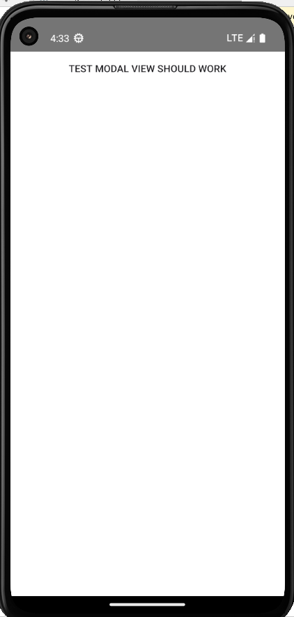

+ andoird样式-开
    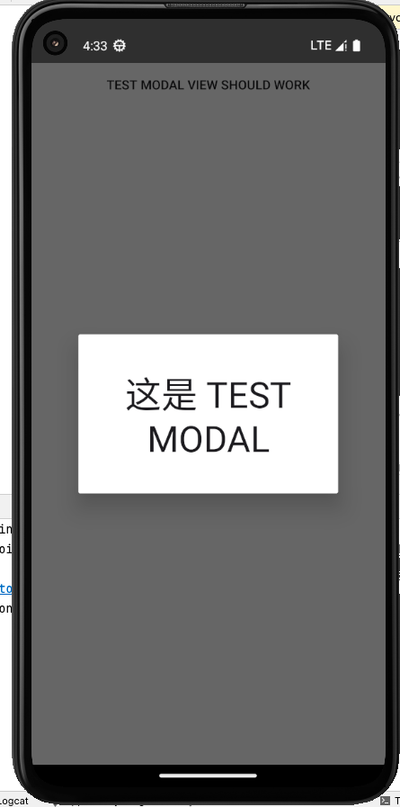

+ ios样式-关
    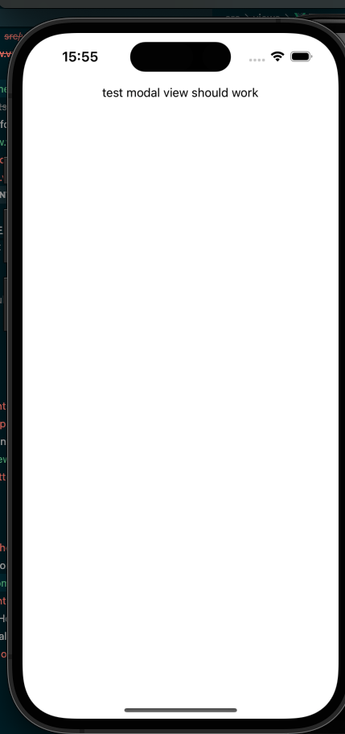

+ ios样式开关
    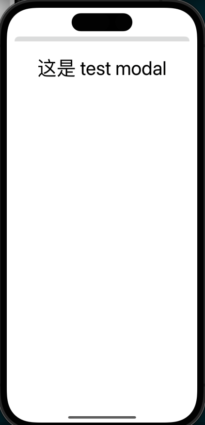

## 快速拨号菜单(Speed dial)

[快速拨号菜单](https://m2.material.io/components/buttons-floating-action-button#behavior)是一组按键的收纳,平时展示为一个按键,当点击时会弹出其中的所有按键并将按键之外的页面作为背景,如果你点击其中的某个按键就会执行相应的操作;如果点击按键之外的地方则退回到原本收纳的状态.

快速拨号菜单可以理解为[悬浮按钮FAB](https://blog.hszofficial.site/TutorialForFront-EndWeb/#/%E7%A7%BB%E5%8A%A8%E7%AB%AF%E5%8E%9F%E7%94%9F%E5%BA%94%E7%94%A8/UI%E7%BB%84%E4%BB%B6/%E5%9F%BA%E7%A1%80%E7%BB%84%E4%BB%B6/%E8%BE%93%E5%85%A5%E5%9E%8B%E7%BB%84%E4%BB%B6?id=%e6%82%ac%e6%b5%ae%e6%93%8d%e4%bd%9c%e6%8c%89%e9%92%aefab)的集成扩展,其形式就是展示一个图标按钮,点击后会呼出菜单让用户进行选择.

社区提供了插件[@nativescript-community/ui-material-speeddial](https://www.npmjs.com/package/@nativescript-community/ui-material-speeddial)实现了这一功能,旦他有几个特点:

1. 与底层导航冲突,底层导航会占掉约一半的快速拨号菜单启动按钮
2. 按钮无法设置为圆形,只能是固定的方形
3. 位置固定只有两个选择,要么左侧(默认)要么右侧,它通过属性`horizontalAlignment`选择`left`或者`right`确定,且永远在父容器的垂直居中位置
4. 点击后菜单永远是向上弹的,菜单中的按键顺序与展示顺序相反

要用它我们当然需要先设置Material.然后安装`@nativescript-community/ui-material-speeddial`,然后在入口文件中导入它

```ts
import speeddialPlugin from '@nativescript-community/ui-material-speeddial/vue';

createApp(Home).use(speeddialPlugin)
```

### 例子

快速拨号菜单虽然看着不错,其实它比较僵硬,位置放置并不方便,而且只能弹出按钮,方向还是固定的向上,因此使用场景比较局限,基本只能是列表页面中的额外操作悬浮按钮

```Vue
<template>
    <Frame>
        <Page actionBarHidden="true">
            <GridLayout>
                <ListView ref="collection" height="100%" width="100%" separatorColor="transparent" :items="itemList"
                    colWidth="50%" rowHeight="100">
                    <template #default="{ item }">
                        <StackLayout :backgroundColor="item.color" height="100">
                            <Label :text="item.name" />
                        </StackLayout>
                    </template>
                </ListView>
                <MDSpeedDial :text="iconUnicode('\uf19c')" buttonClass="mdi" horizontalAlignment="right">
                    <MDSpeedDialItem :text="iconUnicode('\uf250')" buttonClass="mdi" @tap="onActionTap" />
                    <MDSpeedDialItem :text="iconUnicode('\uf1b9')" buttonClass="mdi" @tap="onActionTap" />
                    <MDSpeedDialItem :text="iconUnicode('\uf278')" buttonClass="mdi" backgroundColor="orange"
                        @tap="onActionTap" />
                    <MDSpeedDialItem :text="iconUnicode('\uf252')" buttonClass="mdi" @tap="onActionTap" />
                </MDSpeedDial>
            </GridLayout>
        </Page>
    </Frame>
</template>

<script lang="ts" setup>
import { ref } from 'nativescript-vue'
import { EventData } from "@nativescript/core/data/observable";
interface Card {
    name: string
    color: string
}
const itemList = ref<Card[]>([
    { name: 'TURQUOISE', color: '#1abc9c' },
    { name: 'EMERALD', color: '#2ecc71' },
    { name: 'PETER RIVER', color: '#3498db' },
    { name: 'AMETHYST', color: '#9b59b6' },
    { name: 'WET ASPHALT', color: '#34495e' },
    { name: 'GREEN SEA', color: '#16a085' },
    { name: 'NEPHRITIS', color: '#27ae60' },
    { name: 'BELIZE HOLE', color: '#2980b9' },
    { name: 'WISTERIA', color: '#8e44ad' },
    { name: 'MIDNIGHT BLUE', color: '#2c3e50' },
    { name: 'SUN FLOWER', color: '#f1c40f' },
    { name: 'CARROT', color: '#e67e22' },
    { name: 'ALIZARIN', color: '#e74c3c' },
    { name: 'CLOUDS', color: '#ecf0f1' },
    { name: 'CONCRETE', color: '#95a5a6' },
    { name: 'ORANGE', color: '#f39c12' },
    { name: 'PUMPKIN', color: '#d35400' },
    { name: 'POMEGRANATE', color: '#c0392b' },
    { name: 'SILVER', color: '#bdc3c7' },
    { name: 'ASBESTOS', color: '#7f8c8d' }
]);


function iconUnicode(icon: string): string {
    return `${icon}`;
}
function onActionTap(evt: EventData) {
    console.log("tap ok");
}
</script>
```

### 样式

+ andoird样式-关
    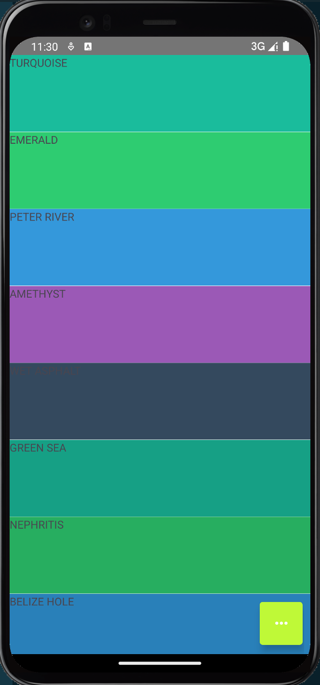

+ andoird样式-开
    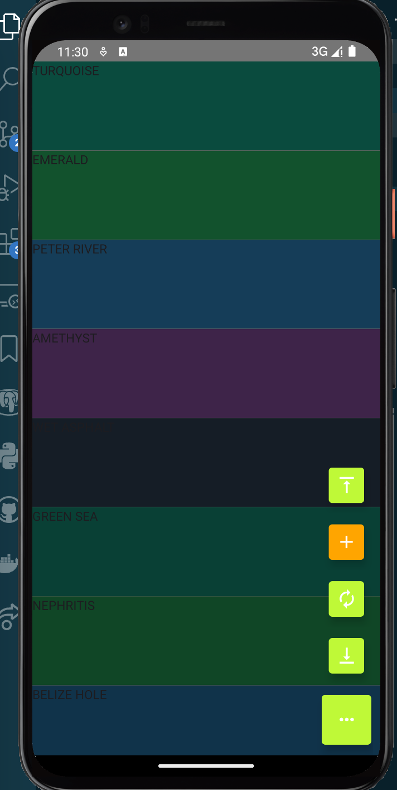

+ ios样式-关
    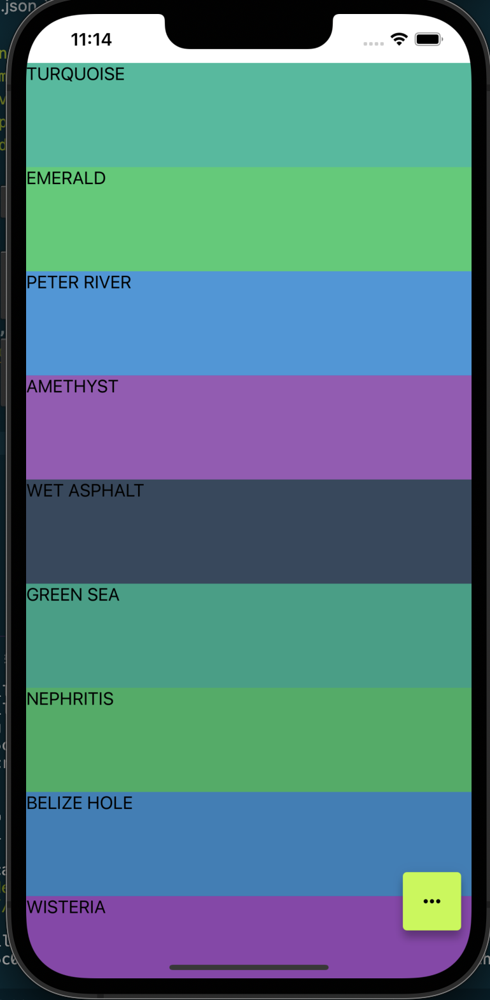

+ ios样式开关
    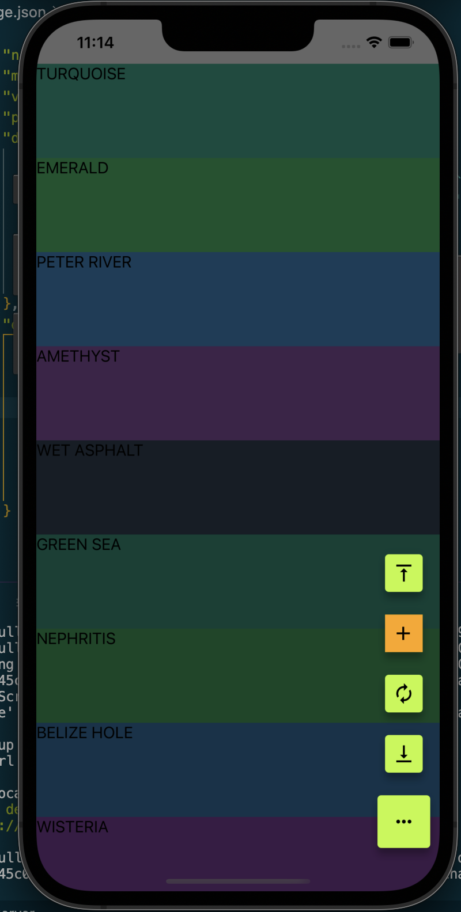

## 气泡式弹出框(Popover)

气泡式弹出框是一个瞬态视图,当您点击某个控件或区域时它会显示在屏幕上其他内容的上方.通常弹出窗口包括指向其出现位置的箭头.Popovers可以是非模式的或模式的.点击弹出框外区域或它上面的按钮，可以消除非模态弹出框;点击弹出框上的"取消"或其他按钮可以消除模态弹出框.

相比较起快速拨号菜单,气泡式弹出框适用范围会更大,它可以弹出帮助文档,弹出菜单,弹出提示相关控件等等.常用于引导指示,快速导航,提供功能操作选项等场景.

社区提供了插件[@nativescript-community/ui-popover](https://github.com/nativescript-community/ui-popover)用于实现该视图.不过截止至2024年3月14日官方并没有提供vue3的支持.我已经向该仓库提供了一个pullrequest用于提供vue3支持,即模块`@nativescript-community/ui-popover/vue3`,目前已经合并.该实现参考自下面会介绍的底部弹出框`@nativescript-community/ui-material-bottomsheet`的相关实现.

**注意**:该插件目前ios版有bug无法使用,谨慎选择

这个模块提供三个工具

+ `PopoverPlugin`用于注册方法`$showPopover`和`$closePopover`到vue3的`app.config.globalProperties`.可以用可不用,如果要用就在入口文件`app.ts`中使用`app.use()`方法注册

    ```ts
    import { PopoverPlugin } from '@nativescript-community/ui-popover/vue3'
    ...
    createApp(Home).use(PopoverPlugin).start()
    ```

    之后在vue组件中就可以使用上下文中的对应方法来呼出或者关闭弹出框了

    ```ts
    import { getCurrentInstance } from "nativescript-vue";
    const { appContext } = getCurrentInstance() as ComponentInternalInstance
    ...
    await appContext.config.globalProperties.$showPopover(Component, VuePopoverOptions) //呼出弹框
    await appContext.config.globalProperties.$closePopover() //关闭弹框
    ```

+ `VuePopoverOptions`是呼出弹框的参数,满足如下接口

    ```ts
    interface VuePopoverOptions {
        //锚点,即弹框指向的view,注意取值类型为nativescript的原生view对象,在nativescript中需要从nativescript-vue中解包得到
        anchor: View;
        //跳转到组件的构造props
        props?: any; 
        // Android可用,纵向位置,枚举,取值为
        //     CENTER = 0
        //     ABOVE = 1
        //     BELOW = 2
        //     ALIGN_TOP = 3
        //     ALIGN_BOTTOM = 4
        vertPos?: VerticalPosition; 
        // Android可用,横向位置,枚举,取值为
        //     CENTER = 0
        //     LEFT = 1
        //     RIGHT = 2
        //     ALIGN_LEFT = 3
        //     ALIGN_RIGHT = 4
        horizPos?: HorizontalPosition;
        // 左上端点的x坐标
        x?: number;
        // 左上端点的y坐标
        y?: number;
        // Android适用,自动适应屏幕大小
        fitInScreen?: boolean;
        // 设置弹框外部是否可以点击
        outsideTouchable?: boolean;
        // iOS适用,设置弹窗是否透明
        transparent?: boolean;
        // iOS适用,设置弹窗的背景颜色
        backgroundColor?: Color;
        // iOS适用,设置弹窗是否可以与其视图矩形重叠
        canOverlapSourceViewRect?: boolean;
        // 指定上下文
        context?: any;
        // iOS适用,是否隐藏指向锚点的小箭头
        hideArrow?: boolean;
        // 指定退出弹窗状态时的钩子函数
        onDismiss?: Function;
    }
    ```

+ `usePopover`,一个用于在组合式api中呼出`showPopover`和`closePopover`函数的函数,使用的时候在组件中像下面这样使用

    ```ts
    import { usePopover } from "@nativescript-community/ui-popover/vue3"
    const { showPopover,closePopover } = usePopover()
    ...
    await showPopover(Component, VuePopoverOptions) //呼出弹框
    await closePopover() //关闭弹框
    ...
    ```

虽然既可以注册使用`app.config.globalProperties`上的方法也可以使用组合式api,我个人还是更推荐使用组合式api方式.但无论是使用在`app.config.globalProperties`注册的方法还是使用组合式api,用法都是一样的,弹出和关闭都是异步函数,关闭函数可以带入一个参数,这个参数在有`onDismiss`设置时会被传给这个回调函数.

### 例子

这个例子我们通过长按色块弹出这个色块的颜色rgb提示.

+ `compomnents/ColorHelp.vue`

    ```vue
    <template>
        <StackLayout orientation="vertical">
            <label :text="colorcode" row={1} textAlignment="center" />
            <Button :text="fontclose" color="red" class="mdi" @tap="close" />
        </StackLayout>
    </template>

    <script lang="ts" setup>
    import { defineProps, ref, getCurrentInstance, ComponentInternalInstance } from "nativescript-vue";
    import { Color, StackLayout } from "@nativescript/core"
    import { usePopover } from "@nativescript-community/ui-popover/vue3"
    const { closePopover } = usePopover()

    const props = defineProps({
        color: {
            type: [String, Color],
            required: true,
        },
    })
    const fontclose = "\uf136"
    const colorcode = ref(`color code is ${props.color}`)
    async function close() {
        closePopover()
    }
    </script>
    ```

+ `views/PopoverHome.vue`

    ```ts
    <template>
        <Frame>
            <Page actionBarHidden="true">
                <ListView ref="collection" height="100%" width="100%" separatorColor="transparent" :items="itemList"
                    colWidth="50%" rowHeight="100">
                    <template #default="{ item }">
                        <StackLayout :backgroundColor="item.color" height="100" @longPress="onLongPress">
                            <Label :text="item.name" />
                        </StackLayout>
                    </template>
                </ListView>
            </Page>
        </Frame>
    </template>

    <script lang="ts" setup>

    import { ref } from 'nativescript-vue'
    import { EventData, StackLayout } from "@nativescript/core"
    import { usePopover } from "@nativescript-community/ui-popover/vue3"

    import ColorHelp from '../components/ColorHelp.vue'
    const { showPopover }=usePopover()

    interface Card {
        name: string
        color: string
    }
    const itemList = ref<Card[]>([
        { name: 'TURQUOISE', color: '#1abc9c' },
        { name: 'EMERALD', color: '#2ecc71' },
        { name: 'PETER RIVER', color: '#3498db' },
        { name: 'AMETHYST', color: '#9b59b6' },
        { name: 'WET ASPHALT', color: '#34495e' },
        { name: 'GREEN SEA', color: '#16a085' },
        { name: 'NEPHRITIS', color: '#27ae60' },
        { name: 'BELIZE HOLE', color: '#2980b9' },
        { name: 'WISTERIA', color: '#8e44ad' },
        { name: 'MIDNIGHT BLUE', color: '#2c3e50' },
        { name: 'SUN FLOWER', color: '#f1c40f' },
        { name: 'CARROT', color: '#e67e22' },
        { name: 'ALIZARIN', color: '#e74c3c' },
        { name: 'CLOUDS', color: '#ecf0f1' },
        { name: 'CONCRETE', color: '#95a5a6' },
        { name: 'ORANGE', color: '#f39c12' },
        { name: 'PUMPKIN', color: '#d35400' },
        { name: 'POMEGRANATE', color: '#c0392b' },
        { name: 'SILVER', color: '#bdc3c7' },
        { name: 'ASBESTOS', color: '#7f8c8d' }
    ]);


    async function onLongPress(evt: EventData) {
        let anchor = evt.object as StackLayout
        let color = anchor.backgroundColor
        await showPopover(ColorHelp, { anchor: anchor, props: { "color": color } })
    }
    </script>
    ```

### 样式

+ android
    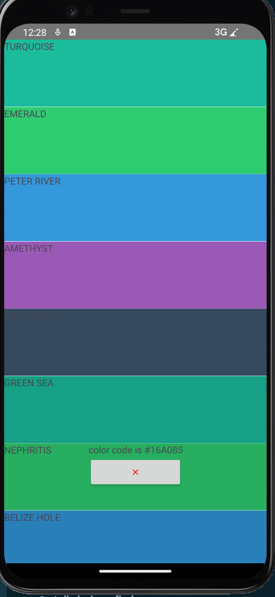

<!-- + ios

     -->

## 工具提示(ToolTip)

所谓工具提示可以看作是气泡式弹出框的提示特化版本.它就不需要额外自己写组件弹出了,取而代之的是类似提示框一样的配置文本即可.

和气泡式弹出框的不同之处还在于`ToolTip`允许同时存在多个.

第三方大神`triniwiz`提供了插件[@triniwiz/nativescript-tooltip](https://triniwiz.github.io/nativescript-plugins/api-reference/tooltip.html#installing)用于实现该功能

要用它我们在安装好后在需要的组件中导入并实例化即可

```ts
import { ToolTip, ToolTipConfig } from '@triniwiz/nativescript-tooltip';
...
const options: ToolTipConfig = {
    position: 'bottom',
    text: `${color}`,
    backgroundColor: 'orange',
    textColor: 'blue',
    duration: 1000
};
const tooltip = new ToolTip(anchor, options);
tooltip.show();
```

实例化的参数满足接口

```ts
interface ToolTipConfig {
    // 是否展示箭头
    showArrow?: boolean;
    // 展示ToolTip的相对位置
    // 包括 'left' | 'up' | 'right' | 'down' | 'top' | 'bottom'
    position?: ToolTipPosition;
    // 展示的文本
    text: string;
    // 展示文本的字体大小
    textSize?: number;
    // 自动关闭的间隔时间,单位s,不填则不会自己关闭
    duration?: number;
    // 弹框宽度
    width?: number;
    //弹框背景色
    backgroundColor?: string;
    // 字体颜色
    textColor?: string;
    // 是否点击框外就关闭弹框
    dismissOnTapOutside?: boolean;
     // 是否点击框内就关闭弹框
    dismissOnTap?: boolean;
    // 边框间距
    padding?: number;
    // 箭头大小
    arrowSize?: number;
    // 边框四角弧度
    radius?: number;
    // 弹框展示时的钩子
    onShow?: () => void;
    // 弹框被点击时的钩子
    onClick?: () => void;
    // 弹框被关闭时的钩子
    onDismiss?: () => void;
}
```

而它也只有两个接口

+ `tooltip.show()=>void`,弹出提示
+ `tooltip.hide()=>void`,关闭提示

**需要注意的是**,这个库在ios上箭头方向似乎有问题只能向下,建议`position`填`top`或`up`

### 例子

我们修改上面的例子用tooltip提示颜色的rgb

```vue
<template>
    <Frame>
        <Page actionBarHidden="true">
            <ListView ref="collection" height="100%" width="100%" separatorColor="transparent" :items="itemList"
                colWidth="50%" rowHeight="100">
                <template #default="{ item }">
                    <StackLayout :backgroundColor="item.color" height="100" @tap="show">
                        <Label :text="item.name" />
                    </StackLayout>
                </template>
            </ListView>
        </Page>
    </Frame>
</template>

<script lang="ts" setup>

import { ref } from 'nativescript-vue'
import { EventData, StackLayout } from "@nativescript/core"
import { ToolTip, ToolTipConfig } from '@triniwiz/nativescript-tooltip';

interface Card {
    name: string
    color: string
}
const itemList = ref<Card[]>([
    { name: 'TURQUOISE', color: '#1abc9c' },
    { name: 'EMERALD', color: '#2ecc71' },
    { name: 'PETER RIVER', color: '#3498db' },
    { name: 'AMETHYST', color: '#9b59b6' },
    { name: 'WET ASPHALT', color: '#34495e' },
    { name: 'GREEN SEA', color: '#16a085' },
    { name: 'NEPHRITIS', color: '#27ae60' },
    { name: 'BELIZE HOLE', color: '#2980b9' },
    { name: 'WISTERIA', color: '#8e44ad' },
    { name: 'MIDNIGHT BLUE', color: '#2c3e50' },
    { name: 'SUN FLOWER', color: '#f1c40f' },
    { name: 'CARROT', color: '#e67e22' },
    { name: 'ALIZARIN', color: '#e74c3c' },
    { name: 'CLOUDS', color: '#ecf0f1' },
    { name: 'CONCRETE', color: '#95a5a6' },
    { name: 'ORANGE', color: '#f39c12' },
    { name: 'PUMPKIN', color: '#d35400' },
    { name: 'POMEGRANATE', color: '#c0392b' },
    { name: 'SILVER', color: '#bdc3c7' },
    { name: 'ASBESTOS', color: '#7f8c8d' }
]);

function show(evt: EventData) {
    let anchor = evt.object as StackLayout
    let color = anchor.backgroundColor
    try {
        const options: ToolTipConfig = {
            position: 'top',
            text: `${color}`,
            backgroundColor: 'orange',
            textColor: 'blue',
            duration: 5000
        };
        const tooltip = new ToolTip(anchor, options);
        tooltip.show();
    } catch (error) {
        console.log(`get error ${error.message}`)
    }
}
</script>         
```

### 样式

+ android
    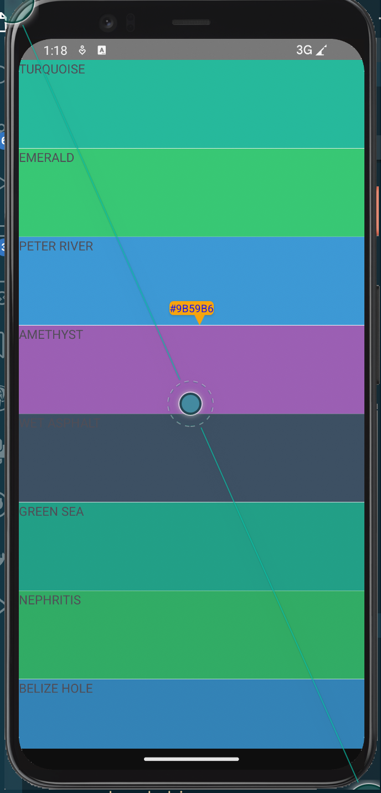
+ ios
    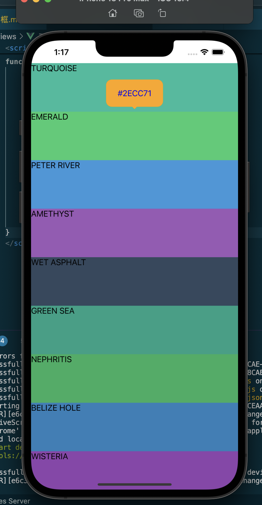

## 滑动弹出框

滑动弹出框是通过从顶部底部或左侧右侧向中心滑动呼出的一种弹出框.和气泡弹出框不同它没有指向性,而且藏的比较深,因此通常用于一些通用的快捷方式性质的隐藏页面.

现在手机上顶部底部侧边的滑动操作很多都有特殊用途,因此在使用滑动边栏导航时我们通常要小心谨慎,甚至只保留弹出功能取消滑动触发.

1. 在ios中顶部底部上划本身是一个全局操作,因此顶部底部通常都不会使用
2. 一些应用会使用侧滑导航的顶栏,两侧滑动也就很容易误触,因此也要谨慎使用

滑动边栏导航我们可以使用[@nativescript-community/ui-drawer](https://github.com/nativescript-community/ui-drawer).它支持四个位置的边栏弹出.要用它我们需要安装`@nativescript-community/ui-material-bottomsheet`,然后在入口文件中导入它

```ts
import DrawerPlugin from '@nativescript-community/ui-drawer/vue3'
import { install as installUIDrawer} from '@nativescript-community/ui-drawer'
...
installUIDrawer()
createApp(Home).use(DrawerPlugin)
```

### 使用方法

我们需要在滑动弹出框所在的页面定义好滑动弹出框的所有行为,包括

1. 设置好主体和弹出框内容.我们需要在页面最外层使用组件`<Drawer ref="drawer">`来定义滑动弹出框各个部分的内容,其中每个元素可以使用属性指定功能
    1. `~leftDrawer`,左侧边栏(可选)
    2. `~rightDrawer`,右侧边栏(可选)
    3. `~topDrawer`,顶部边栏(可选)
    4. `~bottomDrawer`,底部边栏(可选)
    5. `~mainContent`,主体部分(必须有)

    ```vue
    <template>
        ...
        <Drawer ref="drawer">
            <LeftDrawerComponent ~leftDrawer />
            ...
            <MainComponent ~mainContent />
        </Drawer>
    </template>
    ```

2. 设置好弹出框的行为,可以设置的弹出框行为包括

    | 属性                             | 默认值               | 类型                                     | 说明                             |
    | -------------------------------- | -------------------- | ---------------------------------------- | -------------------------------- |
    | `gestureEnabled`                 | `true`               | `boolean`                                | 设置是否可以用滑动手势激活       |
    | `leftOpenedDrawerAllowDraging`   | `true`               | `boolean`                                | 是否允许拖动打开的左侧弹框       |
    | `rightOpenedDrawerAllowDraging`  | `true`               | `boolean`                                | 是否允许拖动打开的右侧弹框       |
    | `topOpenedDrawerAllowDraging`    | `true`               | `boolean`                                | 是否允许拖动打开的顶部弹框       |
    | `bottomOpenedDrawerAllowDraging` | `true`               | `boolean`                                | 是否允许拖动打开的底部弹框       |
    | `backdropTapGestureEnabled`      | `true`               | `boolean`                                | 设置是否允许敲击背景板关闭弹出框 |
    | `backdropColor`                  | `rgba(0, 0, 0, 0.7)` | `Color`                                  | 设置背景板颜色                   |
    | `leftDrawerMode`                 | `slide`              | 枚举`under`(从下向上)或`slide`(滑动方向) | 设置左侧弹出框的进入动画行为     |
    | `rightDrawerMode`                | `slide`              | 枚举`under`(从下向上)或`slide`(滑动方向) | 设置右侧弹出框的进入动画行为     |
    | `gestureMinDist`                 | `10`                 | `number`                                 | 最小滑动触发弹出弹框的距离       |
    | `leftSwipeDistance`              | `40`                 | `number`                                 | 左侧手势识别区的大小             |
    | `rightSwipeDistance`             | `40`                 | `number`                                 | 右侧手势识别区的大小             |
    | `topSwipeDistance`               | `40`                 | `number`                                 | 顶部手势识别区的大小             |
    | `bottomSwipeDistance`            | `40`                 | `number`                                 | 底部手势识别区的大小             |

    除了通过滑动手势触发弹框,我们也可以使用`Drawer`组件的`open("left"|"right"|"top"|"bottom")`和`close("left"|"right"|"top"|"bottom")`接口来呼出或关闭指定的弹框

3. 设置好对打开和关闭事件的监听

    可以用`@open`和`@close`监听打开和关闭事件,设置的回调函数满足签名`(evt:DrawerEvent)=>void`,其中`DrawerEvent`满足接口

    ```ts
    interface DrawerEvent {
        side: string;
        duration: number;
    }
    ```

### 例子

这个例子我们设置四个方向的滑动弹出框,分别弹出左侧右侧顶部底部四个页面来做演示


+ `views/DrawerHome.vue`

    ```vue
    <template>
        <Frame>
            <Page>
                <Drawer ref="drawer" @open="showOpen" @close="showClose">
                    <MemberInfo ~leftDrawer member="左侧" />
                    <MemberInfo ~rightDrawer member="右侧" />
                    <MemberInfo ~topDrawer member="顶部" />
                    <MemberInfo ~bottomDrawer member="底部" />
                    <StackLayout ~mainContent backgroundColor="white">
                        <Button @tap="onOpenDrawer('left')" text="Open Left Drawer" width="250" marginTop="25" />
                        <Button @tap="onOpenDrawer('right')" text="Open Right Drawer" width="250" marginTop="25" />
                        <Button @tap="onOpenDrawer('top')" text="Open Top Drawer" width="250" marginTop="25" />
                        <Button @tap="onOpenDrawer('bottom')" text="Open Bottom Drawer" width="250" marginTop="25" />
                    </StackLayout>
                </Drawer>
            </Page>
        </Frame>
    </template>

    <script lang="ts" setup>
    import { ref } from "nativescript-vue";
    import MemberInfo from '../components/MemberInfo.vue'

    const drawer = ref()
    function onOpenDrawer(side: string) {
        drawer.value._nativeView.open(side)
    }
    interface DrawerEvent {
        side: string;
        duration: number;
    }

    function showOpen(evt: DrawerEvent) {
        console.log(`open ${evt.side} on ${evt.duration}`)
    }

    function showClose(evt: DrawerEvent) {
        console.log(`close ${evt.side} on ${evt.duration}`)
    }
    </script>
    ```

+ `components/MemberInfo.vue`

    ```vue
    <template>
        <Stacklayout backgroundColor="white" padding="25">
            <Label :text="info" fontSize="40" color="red"></Label>
        </Stacklayout>
    </template>

    <script lang="ts" setup>
    import { defineProps } from "nativescript-vue";
    const props = defineProps({
        member: {
            type: String,
            required: true
        },
    })

    const info = `这是 ${props.member}`
    </script>
    ```

### 样式

+ android-off
    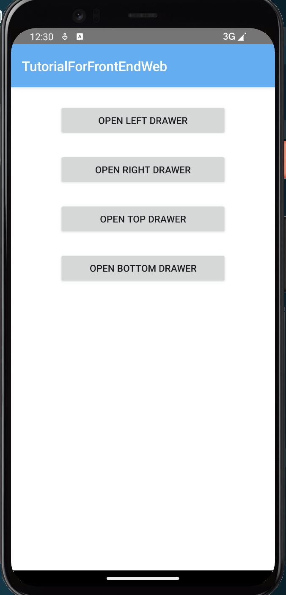

+ android-top
    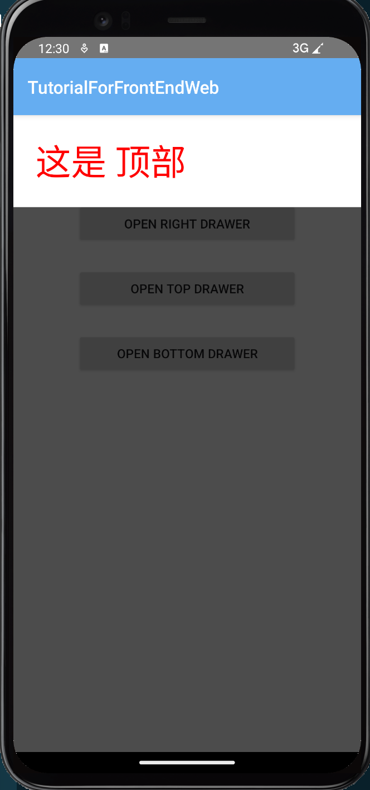

+ android-left
    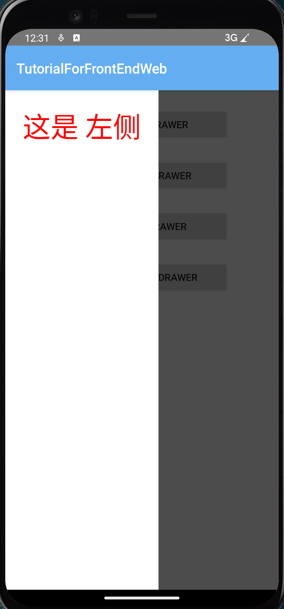

+ ios-off

    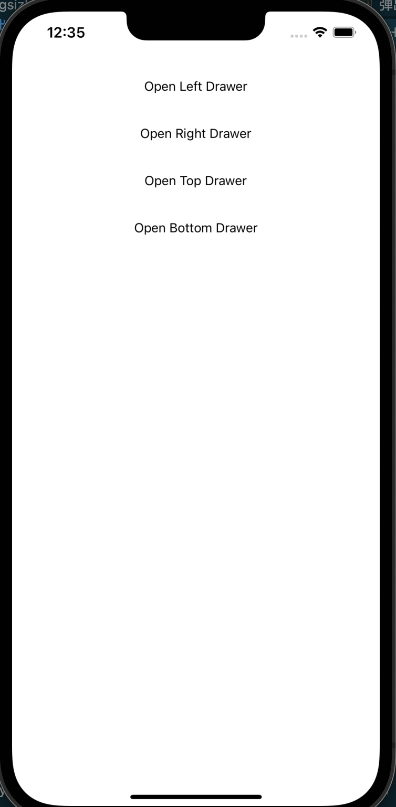

+ ios-top

    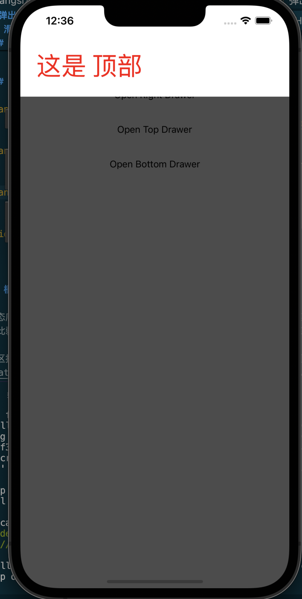

+ ios-left

    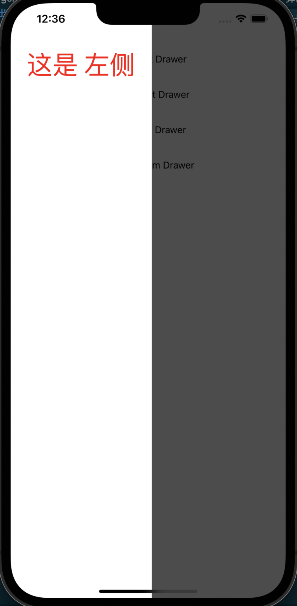

## 模态底部弹出框(Modal Bottom Sheet)

模态底部弹窗类似气泡弹出框,只是它的弹出位置固定在底部,通常用于弹出菜单,扫描页,外部链接等.相比于气泡式弹出框,它的出现位置固定,因此弱化了与锚点组件或触发组件的联系,但强化了功能性.由于它固定占用底部,通常它不会和底部导航在同一个页面.

社区提供了[@nativescript-community/ui-material-bottomsheet](https://www.npmjs.com/package/@nativescript-community/ui-material-bottomsheet)这一个选择.

要用它我们当然需要先设置Material.然后安装`@nativescript-community/ui-material-bottomsheet`,然后在入口文件中导入它

```ts
import { createApp, registerElement } from 'nativescript-vue';
import { BottomSheetPlugin } from '@nativescript-community/ui-material-bottomsheet/vue3';
import { install as installBottomsheet } from "@nativescript-community/ui-material-bottomsheet";
installBottomsheet();
createApp(Home).use(BottomSheetPlugin);
```

每个vue实例会获得

+ 方法`showBottomSheet(Component, options)`(来自`import { useBottomSheet } from "@nativescript-community/ui-material-bottomsheet/vue3";  const { showBottomSheet,closeBottomSheet } = useBottomSheet()`),执行后就会弹出底部弹出导航.options满足接口 [VueBottomSheetOption](https://github.com/nativescript-community/ui-material-components/blob/master/src/bottomsheet/vue/index.ts),除了文档中列出的属性可以设置外我们也可以用属性`prop`传递参数给`Component`.需要注意的是
  
    1. `options`中可以设置`closeCallback`属性,它的参数为`...args`,当它弹出的底部弹出导航被关闭后它会被调用.
    2. 亲测`BottomSheet`无法与`MDBottomNavigationBar`配合使用,

+ 方法`closeBottomSheet(...args)`(来自`import { useBottomSheet } from "@nativescript-community/ui-material-bottomsheet/vue3";const {  showBottomSheet,closeBottomSheet } = useBottomSheet()`),执行后如果有参数,则会被传递给`showBottomSheet`中设置的`closeCallback`中作为参数.

### 例子

我们继续沿用上面的例子,只是将长按操作变为呼出模态底部弹出框.这个弹出框我们用于提供分享功能(只是界面没有实际分享的逻辑),其中的选项就是要分享到的平台.

+ `views/BottomSheetHome.vue`,我们用色块的长按事件触发弹出底部弹出导航页面

    ```vue
    <template>
        <Frame>
            <Page actionBarHidden="true">
                <ListView ref="collection" height="100%" width="100%" separatorColor="transparent" :items="itemList"
                    colWidth="50%" rowHeight="100">
                    <template #default="{ item }">
                        <StackLayout :backgroundColor="item.color" height="100" @longPress="onLongPress">
                            <Label :text="item.name" />
                        </StackLayout>
                    </template>
                </ListView>
            </Page>
        </Frame>
    </template>

    <script lang="ts" setup>
    import { ref } from "nativescript-vue";
    import { EventData } from "@nativescript/core"
    import ShareBottomBar from "../components/ShareBottomBar.vue";
    import { useBottomSheet } from "@nativescript-community/ui-material-bottomsheet/vue3";

    const { showBottomSheet } = useBottomSheet()
    const defaultIndex = ref(0)

    interface Card {
        name: string
        color: string
    }

    const itemList = ref<Card[]>([
        { name: 'TURQUOISE', color: '#1abc9c' },
        { name: 'EMERALD', color: '#2ecc71' },
        { name: 'PETER RIVER', color: '#3498db' },
        { name: 'AMETHYST', color: '#9b59b6' },
        { name: 'WET ASPHALT', color: '#34495e' },
        { name: 'GREEN SEA', color: '#16a085' },
        { name: 'NEPHRITIS', color: '#27ae60' },
        { name: 'BELIZE HOLE', color: '#2980b9' },
        { name: 'WISTERIA', color: '#8e44ad' },
        { name: 'MIDNIGHT BLUE', color: '#2c3e50' },
        { name: 'SUN FLOWER', color: '#f1c40f' },
        { name: 'CARROT', color: '#e67e22' },
        { name: 'ALIZARIN', color: '#e74c3c' },
        { name: 'CLOUDS', color: '#ecf0f1' },
        { name: 'CONCRETE', color: '#95a5a6' },
        { name: 'ORANGE', color: '#f39c12' },
        { name: 'PUMPKIN', color: '#d35400' },
        { name: 'POMEGRANATE', color: '#c0392b' },
        { name: 'SILVER', color: '#bdc3c7' },
        { name: 'ASBESTOS', color: '#7f8c8d' }
    ]);

    async function onLongPress(evt: EventData) {
        showBottomSheet(ShareBottomBar, {
            dismissOnBackgroundTap: true,
            props: {
                canCloseBottomSheet: true,
                defaultIndex: defaultIndex.value,
            },
            closeCallback: (...args: any[]) => {
                try {
                    defaultIndex.value = args[0][0][1];
                } catch (e) {
                    defaultIndex.value = 0
                }
            },
        });
    }
    </script>
    ```

    需要注意`closeCallback`的参数实际是签名可以看做是`closeCallback([[[any,index]]],{context,vnode})=>void`.因此要获取到index我们就得用`args[0][0][1]`的形式

+ `components/ShareBottomBar`,这里使用`SegmentedBar`来实现按键组合

    ```Vue
    <template>
        <SegmentedBar selectedBackgroundColor="#e57373" :selectedIndex="defaultIndex" @selectedIndexChanged="onIndexSelected"
            id="share-segbar" height="50" class="mdi">
            <SegmentedBarItem :title="icon_google" class="mdi" height="50"/>
            <SegmentedBarItem :title="icon_github" class="mdi-ab" height="50" />
            <SegmentedBarItem :title="icon_twitter" class="mdi-ab" height="50"/>
        </SegmentedBar>
    </template>
        
    <script lang="ts" setup>
    import { defineProps, ref } from "nativescript-vue";
    import { View } from "@nativescript/core";
    import { SelectedIndexChangedEventData } from "@nativescript/core/ui/segmented-bar";
    import { useBottomSheet } from "@nativescript-community/ui-material-bottomsheet/vue3";

    const { closeBottomSheet } = useBottomSheet()
    const icon_google = ref("\uf34e")
    const icon_github = ref("\uf345")
    const icon_twitter = ref("\uf360")
    const props = defineProps({
        canCloseBottomSheet: {
            type: Boolean,
            default: false,
        },
        defaultIndex: {
            type: Number,
            default: 0,
        },
    })

    function onIndexSelected(evt: SelectedIndexChangedEventData) {
        switch (evt.newIndex) {
            case 0:
                {
                    console.log("google")
                }
                break;
            case 1:
                {
                    console.log("github")
                }
                break;
            case 2:
                {
                    console.log("twitter")
                }
                break;
            default:
                console.log(`unknown index ${evt.newIndex}`);
        }
        if (props.canCloseBottomSheet) {
            let obj = evt.object as View;
            try {
                closeBottomSheet(obj.id, evt.newIndex);
            } catch (e) {
                console.log(`try to closeBottomSheet get error: ${e}`)
            }
        }
    }
    </script>
    ```

    构造`SegmentedBar`实例时最开始就会根据`selectedIndex`设置index进行渲染,这会触发我们的`onIndexSelected`,但此时`closeBottomSheet`中实际上调用会报错,因为`showBottomSheet`实际上并没有处理完.因此我们需要用`try`语句处理下这个问题.

### 样式

+ android
    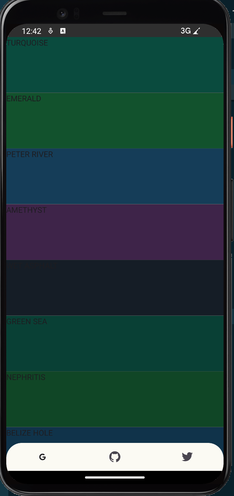

+ ios

    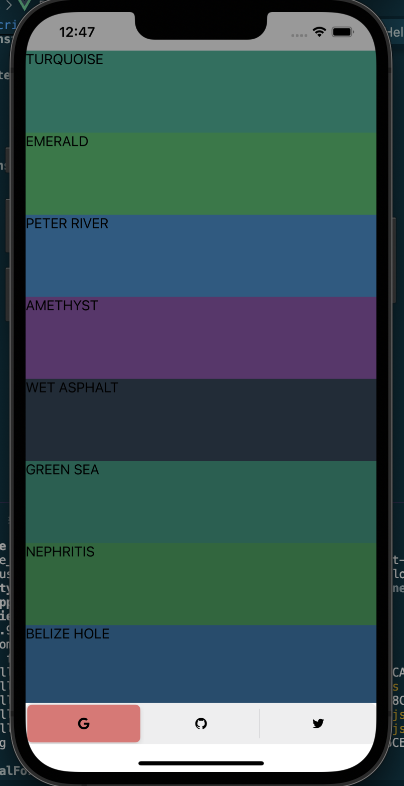

## 持久底部弹出框(Persistent Bottom Sheet)

持久底部弹出框在未激活时是屏幕底部的一块固定内容的工作表,当我们向上滑动底部工作表时它会向上延升展示其余的内容.

社区提供了[@nativescript-community/ui-persistent-bottomsheet](https://github.com/nativescript-community/ui-persistent-bottomsheet)用于构造持久底部弹窗,但目前并不支持vue3,等到支持的时候我们再来填坑.
