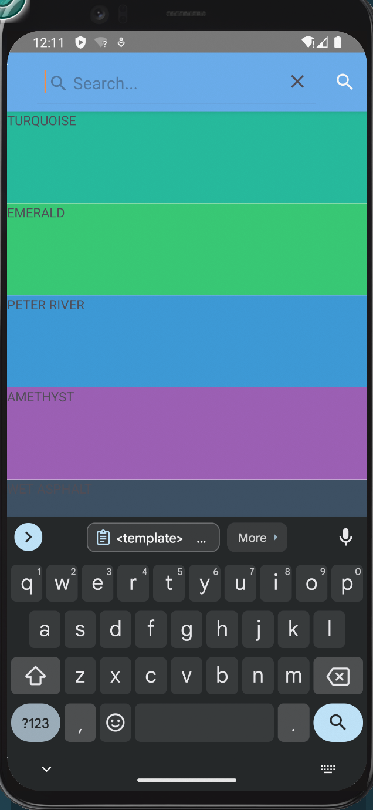
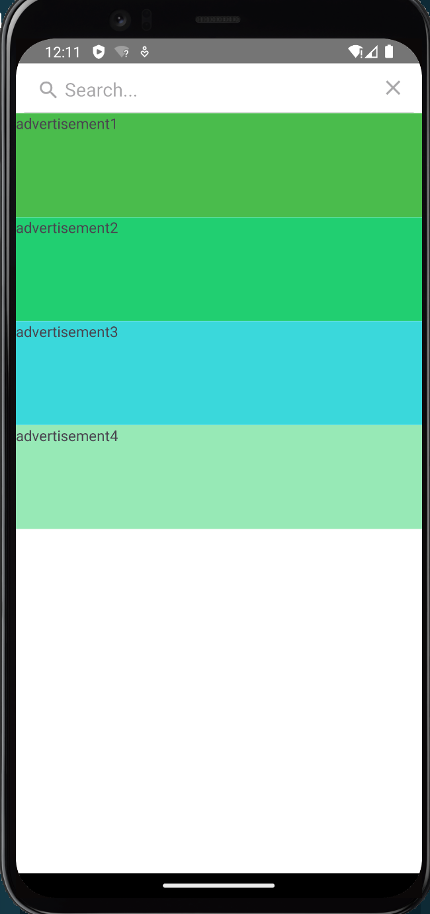
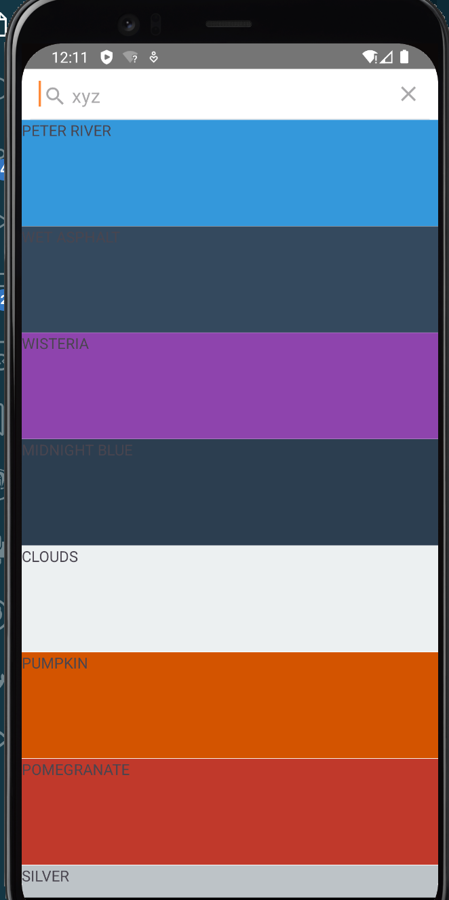

# 搜索

搜索可以分为两种:

+ 搜索获取远程数据
+ 在已有数据中搜索符合条件的

第一种本质上是数据请求,第二种本质上是数据筛选,但表现形式上非常接近.

## 搜索获取远程数据

搜索获取远程数据通常会用一个单独的页面来实现,它的形式一般是一个搜索栏+一个内容列表.我们在搜索栏中输入内容,然后结果放在内容列表中.百度,谷歌的入口就是一个典型的搜索页.

在ui形式上,由于没键入内容搜索时内容列表不会有东西,这样看起来就比较单薄,通常有两种方式处理:

1. 从入口出发,在别的页面上放搜索框,有值回车后进入搜索页,这样进入搜索页就带搜索结果了.
2. 从内容出发,内容部分在一些位置放广告,推广内容,推荐内容等,在没有值的时候也可以让页面显得不单调.

我们将两种方式结合构造一个例子

### 例子

这个例子我们模拟上面提到的方式,当通过搜索按钮进入页面时

+ 入口



```vue
<template>
    <frame id="main-frame">
        <Page>
            <ActionBar title="My App">
                <template v-if="isIOS">
                    <SearchBar hint="Search..." :text="searchPhrase" @submit="onSubmit" />
                    <ActionItem :icon="fontSearch" ios.position="left" class="mdi-ab" @tap="toSearch" />
                </template>
                <template v-else>
                    <SearchBar hint="Search..." :text="searchPhrase" @submit="onSubmit" />
                    <ActionItem :icon="fontSearch" android.position="actionBar" class="mdi-ab" @tap="toSearch" />
                </template>
            </ActionBar>
            <ListView ref="collection" height="100%" separatorColor="transparent" :items="itemList" colWidth="50%"
                rowHeight="100" @itemTap="tapItem" @loadMoreItems="moreItems">
                <template #default="{ item }">
                    <StackLayout :backgroundColor="item.color" height="100">
                        <Label :text="item.name" />
                    </StackLayout>
                </template>
            </ListView>
        </Page>
    </frame>
</template>
<script lang="ts" setup>
import { ref, $navigateTo } from "nativescript-vue";
import { EventData, ItemEventData, SearchBar } from '@nativescript/core';
import Searchpage from "./Searchpage.vue";

const collection = ref()
const isIOS = ref(global.isIOS)

const fontSearch = "font://\uf1c3"

const itemList = ref([
    // const itemList = ref([
    { name: 'TURQUOISE', color: '#1abc9c' },
    { name: 'EMERALD', color: '#2ecc71' },
    { name: 'PETER RIVER', color: '#3498db' },
    { name: 'AMETHYST', color: '#9b59b6' },
    { name: 'WET ASPHALT', color: '#34495e' },
    { name: 'GREEN SEA', color: '#16a085' },
    { name: 'NEPHRITIS', color: '#27ae60' },
    { name: 'BELIZE HOLE', color: '#2980b9' },
    { name: 'WISTERIA', color: '#8e44ad' },
    { name: 'MIDNIGHT BLUE', color: '#2c3e50' },
    { name: 'SUN FLOWER', color: '#f1c40f' },
    { name: 'CARROT', color: '#e67e22' },
    { name: 'ALIZARIN', color: '#e74c3c' },
    { name: 'CLOUDS', color: '#ecf0f1' },
    { name: 'CONCRETE', color: '#95a5a6' },
    { name: 'ORANGE', color: '#f39c12' },
    { name: 'PUMPKIN', color: '#d35400' },
    { name: 'POMEGRANATE', color: '#c0392b' },
    { name: 'SILVER', color: '#bdc3c7' },
    { name: 'ASBESTOS', color: '#7f8c8d' }
])

function toSearch(evt: EventData) {
    $navigateTo(
        Searchpage,
        {
            transition: {
                name: "fade"
            },
            frame: "main-frame"
        })
}

function tapItem(evt: ItemEventData) {
    console.log(`tap item with index ${evt.index}`)
}
function moreItems(evt: EventData) {
    console.log(`load more items ${evt.eventName}`)
}

// 搜索相关
const searchPhrase = ref("")
function onSubmit(evt: EventData) {
    const searchBar = evt.object as SearchBar
    console.log('Search for:', searchBar.text)
    if (searchBar.text != ""){
        $navigateTo(
        Searchpage,
        {
            transition: {
                name: "fade"
            },
            frame: "main-frame",
            props: {
                searchPhrase: searchBar.text
            }
        })
    }else{
        $navigateTo(
        Searchpage,
        {
            transition: {
                name: "fade"
            },
            frame: "main-frame"
        })
    }
}
</script>
```

+ 搜索页

点击搜索键或搜索框输入了空值



输入框有值时



```vue
<template>
    <Page actionBarHidden="true">
        <StackLayout>
            <SearchBar :hint="searchhint" :text="search" @submit="onSubmit" />
            <ListView height="100%" separatorColor="transparent" :items="itemList" colWidth="50%" rowHeight="100"
                @itemTap="tapItem">
                <template #default="{ item }">
                    <StackLayout :backgroundColor="item.color" height="100">
                        <Label :text="item.name" />
                    </StackLayout>
                </template>
            </ListView>
        </StackLayout>
    </Page>
</template>
<script lang="ts" setup>
import { ref, defineProps } from "nativescript-vue";
import { EventData, ItemEventData } from '@nativescript/core';


const candidates = [
    { name: 'PETER RIVER', color: '#3498db' },
    { name: 'AMETHYST', color: '#9b59b6' },
    { name: 'WET ASPHALT', color: '#34495e' },
    { name: 'BELIZE HOLE', color: '#2980b9' },
    { name: 'WISTERIA', color: '#8e44ad' },
    { name: 'MIDNIGHT BLUE', color: '#2c3e50' },
    { name: 'SUN FLOWER', color: '#f1c40f' },
    { name: 'CARROT', color: '#e67e22' },
    { name: 'ALIZARIN', color: '#e74c3c' },
    { name: 'CLOUDS', color: '#ecf0f1' },
    { name: 'CONCRETE', color: '#95a5a6' },
    { name: 'ORANGE', color: '#f39c12' },
    { name: 'PUMPKIN', color: '#d35400' },
    { name: 'POMEGRANATE', color: '#c0392b' },
    { name: 'SILVER', color: '#bdc3c7' },
    { name: 'ASBESTOS', color: '#7f8c8d' }
]

const advs = [
    { name: 'advertisement1', color: '#4abc4c' },
    { name: 'advertisement2', color: '#21cf71' },
    { name: 'advertisement3', color: '#3ad8db' },
    { name: 'advertisement4', color: '#97e9b6' },
]

const props = defineProps(["searchPhrase"])

const random_choise = (arr: any[]) => arr.filter((x) => Math.random() > 0.5)
let items = []
let _searchhint = "Search..."
let _search = ""
if (props.searchPhrase) {
    items = random_choise(candidates)
    _searchhint = props.searchPhrase
} else {
    items = advs
}
const itemList = ref(items);
const searchhint = ref(_searchhint);
const search = ref(_search);

function tapItem(evt: ItemEventData) {
    console.log(`tap item with index ${evt.index}`)
}
function onSubmit(evt: EventData) {
    console.log("submit")
}
</script>
```

## 在已有数据中搜索符合条件的

https://github.com/NativeScript/plugins/blob/main/packages/picker/README.md