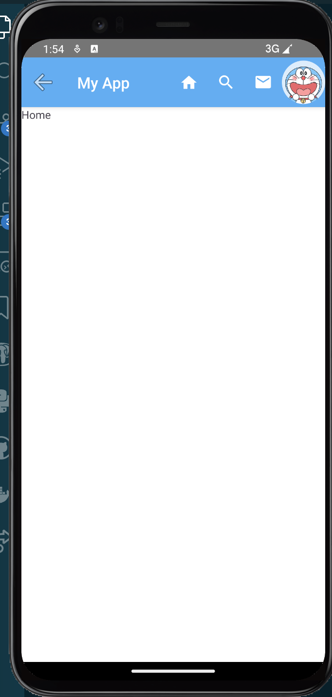
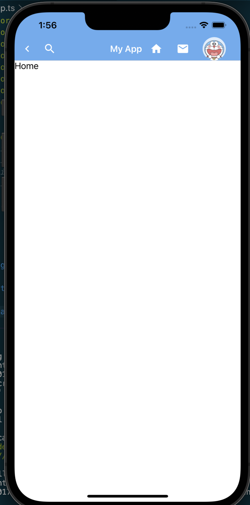

# 导航

如果说容器组件是一本书中的标点符号,那导航就是一本书的目录,没有导航当然也可以组织起一个应用,但用户体验一定是极差的.

导航本质上只要有按钮和页面跳转方法就能实现,但现在应用早已经总结了一套导航的最佳实践并将其固化到了专用的导航组件中.我们也就省去了从按钮开始排版构造导航的麻烦.

要充分理解Nativescript中的导航需要先理清以下这些关键概念和属性:

+ `Page Stack`(页面堆栈): 每个`<Frame>`包含一个页面堆栈用于跟踪用户导航.当用户导航到新页面时该页面被推送到堆栈顶部(push),当用户导航回上一个页面时页面从堆栈中弹出(pop).

+ `Navigating`(导航): `<Frame>`元素允许你使用内置的导航方法在页面之间进行切换.例如你可以使用`$navigateTo`方法导航到新页面,或者使用`$navigateBack`方法返回上一个页面.导航发生在 `<Frame>`元素的上下文中.

+ `Default Page`(默认页面): `<Frame>`可以有一个默认页面,这是应用程序启动时显示的第一个页面.

+ `Navigation Events`(导航事件): `<Frame>` 提供了一些事件,如`navigatingTo`,`navigatedTo`,`navigatingFrom` 和 `navigatedFrom`.这些事件允许你在页面导航的不同阶段执行自定义逻辑.

这套基于`$navigateTo`,`$navigateBack`等接口的路由方式被称为[Manual Routing](https://nativescript-vue.org/en/docs/routing/manual-routing/),它是官方给出的路由解决方案.本文的前半部分将以此为基础,介绍nativescript中的导航逻辑.

本文介绍组件的例子在[nsv-nav分支](https://github.com/hsz1273327/TutorialForFront-EndWeb/blob/nsv-nav)中

## 页面跳转

页面的跳转在nativescript-vue中最常见的是通过调用`$navigateTo(<页面B>, options)`实现的.其中页面B也是一个`Page`标签为最外层标签的vue对象.我们可以通过在`options`中设置导航的具体参数,主要包括:

+ `props`属性传递跳转去页面所需的`props`
+ `transition`或者`transitioniOS`和`transitionAndroid`来设置页面跳转的过渡动画,支持的过渡类型有:

| 选项                | ios可用 | android可用                      |
| ------------------- | ------- | -------------------------------- |
| `fade`              | T       | T                                |
| `flip`/`flipRight`  | T       | T                                |
| `flipLeft`          | T       | T                                |
| `slide`/`slideLeft` | T       | T                                |
| `slideRight`        | T       | T                                |
| `slideTop`          | T       | T                                |
| `slideBottom`       | T       | T                                |
| `curl`/`curlUp`     | T       | F                                |
| `curlDown`          | T       | F                                |
| `explode`           | F       | Android Lollipop(21) and up only |

+ `frame`属性,用于设置在哪个frame上切换Page,即导航的上下文信息

## 导航组件和常用模式

导航组件可以看做是针对导航功能的一组按钮.他们通常有集中,简洁的特点,一般用在页面跳转,相关功能集中展示等情况下.由于移动端屏幕小,通常位置也和固定,按出现位置和形式分可以分为3类:

1. ActionBar,即应用的顶栏
2. 标签导航,固定在屏幕顶部或底部的一种导航,一般来说手机纵向空间会大些,固定导航通常会放在这里.顶部/底部固定导航的优点是稳定直观,它总是可见,因此用的最多,多数内容类app都会用它,甚至同时有顶部和底部固定导航.缺点也是稳定,总是可见,它会一直占据屏幕.

3. 按键组合导航,通常就是一组按键提供导航,这组按键可以单独抽出来用容器组件放在页面的特定位置,也可以由点击行为事件触发,弹出一个导航列表,这种导航优点是灵活,可复用性强.

这3种导航组件并不是孤立的,他们也可以相互配合,但每个导航组件通常最佳使用方法是固定的因此下面我们来结合组件介绍他们的最佳使用方式

## 例子中的导航

本文将结合例子介绍各种导航的基础用法,导航的页面也就仅拿来演示,会存放在`pages/`目录.

+ `pages/HomePage.vue`即主页
+ `pages/MessagePage.vue`即消息页
+ `pages/SearchPage.vue`即搜索页

## ActionBar

[ActionBar](https://docs.nativescript.org/ui/action-bar)是脱胎于`Android`的`ActionBar`和`iOS`的`NavigationBar`的顶部导航,它的形式一般是最顶部一行,由于位置比较远通常用于作为应用级导航.功能上来说一般提供如下功能

+ 返回
+ 搜索快速入口
+ 分享入口
+ 消息入口
+ 个人账号编辑入口
+ 当前页提示

可以看到基本都是些使用频率较低但又不能没有的功能.这些功能往往不会用文本描述,而是使用图标.我们的例子中使用material-design的图标作为演示

`ActionBar`中有两种专有组件:

+ `NavigationButton`,专门负责返回功能,会固定在最左侧
+ `ActionItem`,导航按钮,

这两个组件在ios和android下配置不同,因此一般`ActionBar`中会使用`v-if`根据设备不同使用两份:

```vue
<template>
    ...
    <ActionBar title="My App">
        <template v-if="isIOS">
        ...
        </template>
        <template v-else>
            ...
        </template>
    </ActionBar>
    ...
</template>
 
<script lang="ts" setup>
import { ref } from "nativescript-vue";
...
const isIOS = ref(global.isIOS)
...
</script>
```

`NavigationButton`在`android`下只能设置`android.systemIcon`,因为只能用于返回所以一般设置为`ic_menu_back`;在`ios`下则只能设置`text`属性.

`ActionItem`在两种设备中通用的属性是`visibility`,`icon`和`text`,通常我们都是放图标的也就是说一般用`icon`就行,`visibility`则可以控制是否要展示.
剩下的我们需要设置元素的摆放位置,在`android`下设置`android.position`,它的取值可以为`actionBar`,`actionBarIfRoom`和`popup`;在ios下则需要设置`ios.position`,它的取值可以为`left`和`right`.

通常我们展示`icon`就和其他位置一样,设置`class`为符号所在的类名,然后使用unicode指定即可,但如果我们希望展示一个图片作为符号(比如已经登录的用户一般会有用户头像作为进入用户设置页的符号),那我们可以在其中包裹一个[image](https://blog.hszofficial.site/TutorialForFront-EndWeb/#/%E7%A7%BB%E5%8A%A8%E7%AB%AF%E5%8E%9F%E7%94%9F%E5%BA%94%E7%94%A8/UI%E7%BB%84%E4%BB%B6/%E5%9F%BA%E7%A1%80%E7%BB%84%E4%BB%B6/%E5%86%85%E5%AE%B9%E5%B1%95%E7%A4%BA%E7%BB%84%E4%BB%B6?id=image)或[NSImg](https://blog.hszofficial.site/TutorialForFront-EndWeb/#/%E7%A7%BB%E5%8A%A8%E7%AB%AF%E5%8E%9F%E7%94%9F%E5%BA%94%E7%94%A8/UI%E7%BB%84%E4%BB%B6/%E5%9F%BA%E7%A1%80%E7%BB%84%E4%BB%B6/%E5%86%85%E5%AE%B9%E5%B1%95%E7%A4%BA%E7%BB%84%E4%BB%B6?id=nsimg)来使用.

> 样式:

+ android
    

+ ios

    

### 返回功能

返回功能通常都是用`NavigationButton`实现的,通常都放在最左顶角,因为无论ios还是android都可以不按这个钮简单的实现返回.也正是因为这个,这个功能往往只在最末端的页面比如内容详情页才会放出来,放出来通常也没人点

### 搜索快速入口功能

一般视页面actionbar中内容多少有两种选择

+ 使用一个搜索图标的`ActionItem`,点击后进入专门的搜索页

+ 使用`SearchBar`,用户在其中输入要搜索的内容,按回车后带着这个搜索框中填入的内容跳转进入搜索页,进入就展示的是已经搜好的结果

从便利来说第二种方案当然更好,但往往我们会追求简洁,因此通常第一种方案用的反而多些

### 分享入口

分享通常会做成点击后触发底部弹出导航的形式.这也是为什么这个不部分的例子会和底部弹出导航的在一起.

### 消息入口

消息入口一般就是点击就跳转到专门的消息页面

### 个人账号编辑入口

这个位置通常需要做状态判定--如果是未登录的用户通常给个账号图标,点击后进入注册登录页面;而已登录的用户通产会展示用户头像作为图标

### 当前页提示

一般是两种形式:

+ 页面名,也就是给出当前的页面名
+ 页面路径,也就是模仿网页的形式给出一个路径信息

第一种相对更多些,毕竟路径比较长,容易影响后面的其他按钮

通常直接设置actionbar的titl就可以提示当前页了,但如果有排版要求可以插入`Label`类组件,

### 隐藏ActionBar

很多页面我们并不需要ActionBar,这时可以在`Page`标签中将`actionBarHidden`设置为`true`

### 例子

这个例子我们用`HomePage`,`Page1`和`Page2`代表主页,搜索页和消息页,通过actionbar上的按钮来切换.这也是非常常见的一种用法.

+ `views/ActionbarHome.vue`

    ```vue
    <template>
        <Frame>
            <Page>
                <ActionBar title="My App">
                    <template v-if="isIOS">
                        <!-- <NavigationButton :text="iconback" /> -->
                        <ActionItem :icon="fontback" ios.position="left" class="mdi-ab" @Tap="goBack" />
                        <!-- <SearchBar hint="Search..." /> -->
                        <ActionItem :icon="fonthome" ios.position="right" class="mdi-ab" @Tap="toHome" />
                        <ActionItem :icon="fontsearch" ios.position="left" class="mdi-ab" @Tap="toSearch" />
                        <ActionItem :icon="fontmessage" ios.position="right" class="mdi-ab" @Tap="toMessage" />
                        <ActionItem ios.position="right">
                            <NSImg :src="src_account_login" roundAsCircle="true" stretch=fitCenter class="avatar"></NSImg>
                        </ActionItem>
                        <!-- <ActionItem :icon="fontaccount" ios.position="right" class="mdi" /> -->
                    </template>
                    <template v-else>
                        <NavigationButton android.systemIcon="ic_menu_back" @Tap="goBack" />
                        <!-- <ActionItem :icon="fontback" android.position="actionBar" class="mdi" /> -->
                        <!-- <SearchBar hint="Search..." /> -->
                        <ActionItem :icon="fonthome" android.position="actionBar" class="mdi-ab" @Tap="toHome" />
                        <ActionItem :icon="fontsearch" android.position="actionBar" class="mdi-ab" @Tap="toSearch" />
                        <ActionItem :icon="fontmessage" android.position="actionBar" class="mdi-ab" @Tap="toMessage" />
                        <ActionItem android.position="actionBar">
                            <NSImg :src="src_account_login" roundAsCircle="true" stretch=fitCenter></NSImg>
                        </ActionItem>
                        <!-- <ActionItem :icon="fontaccount" android.position="actionBar" class="mdi" /> -->
                    </template>
                </ActionBar>
                <Frame id="main-frame" row="0">
                    <HomePage />
                </Frame>
            </Page>
        </Frame>
    </template>

    <script lang="ts" setup>
    import { ref, computed } from "nativescript-vue";
    import { TapGestureEventData } from "@nativescript/core/ui/gestures";
    import { $navigateTo, $navigateBack } from "nativescript-vue";
    import HomePage from "../pages/HomePage.vue";
    import SearchPage from "../pages/SearchPage.vue";
    import MessagePage from "../pages/MessagePage.vue";

    const isIOS = ref(global.isIOS)

    const fontback = "font://\uf2fa"
    const fontsearch = "font://\uf1c3"
    const fonthome = "font://\uf175"

    const fontmessage_nonew = "font://\uf15a"
    const fontmessage_withnew = "font://\uf159"
    const withnewmessage = ref(false)
    const fontmessage = computed(()=>{
        if (withnewmessage.value){
            return fontmessage_withnew
        }
        return fontmessage_nonew
    })
    const fontaccount = "font://\uf207"
    const src_account_login = "https://img.duoziwang.com/2021/04/08101559830055.jpg"

    function goBack(evt: TapGestureEventData) {
        console.log("tap goBack!")
        $navigateBack({
            frame: "main-frame",
        })
    }
    function toHome(evt: TapGestureEventData) {
        console.log("tap toHome!")
        $navigateTo(HomePage, {
            transition: { name: "fade" },
            frame: "main-frame",
        });
    }
    function toSearch(evt: TapGestureEventData) {
        console.log("tap toSearch!")
        $navigateTo(SearchPage, {
            transition: { name: "fade" },
            frame: "main-frame",
        });
    }
    function toMessage(evt: TapGestureEventData) {
        console.log("tap toMessage!")
        $navigateTo(MessagePage, {
            transition: { name: "fade" },
            frame: "main-frame",
        });
    }
    </script>
    ```

## 标签导航

标签导航是在顶部或底部的标签切换按钮,每次切换都会将对应的子组件切出来展示.标签导航切换的是组件不是页面,只是页面可以通过`Frame`嵌入作为组件使用.因此标签导航不使用`Manual Routing`

标签导航一般有两种用法:

1. 用于页面内的元素切换,这种用法多用在相关且处于同一层次结构的内容组之间进行导航,还是同一个Page内元素组合的切换.
2. 用于嵌入`Frame`的切换,一般用于模拟多屏操作.一般这些`Frame`是平行关系,且不会相互影响.比如我们希望一个tab下进行一些操作后点击另一tab再进行一些操作,回到原来tab下不会重新渲染.具体一点比如文本编辑器中多个文件间的切换就可以用这种逻辑.

### TabView(原生)

[TabView](https://nativescript-vue.org/cn/docs/elements/components/tab-view/)是nativescript原生提供的`Tab`类导航组件,他有如下特点:

1. 在ios下固定在底部,在android中则可以使用属性`androidTabsPosition`设置在顶部(`top`)还是底部(`bottom`),默认在顶部.
2. 可以通过设置`selectedIndex`来设置选中index的初始值,`selectedTabTextColor`来设置被选中index的高亮颜色.
3. 子组件`TabViewItem`按顺序从0开始计数.
4. **每个`TabViewItem`中只允许有一个直系子组件**.且**子组件只在构造页面时渲染,切换index不会重复渲染**
5. 点击切换index切换其对应的`TabViewItem`中的子组件展示.我们可以通过监听事件`selectedIndexChange`来监听index的变化,但无法借助这个回调控制修改选中的index.`selectedIndexChange`触发后会给绑定的回调函数传递一个对象,理论上它应该满足[SelectedIndexChangedEventData](https://v7.docs.nativescript.org/api-reference/interfaces/_ui_tab_view_.selectedindexchangedeventdata.html)接口,但实际上这个对象没有`newIndex`和`oldIndex`属性,但有`value`和`oldValue`属性做同样的事情,这应该是一个bug.因此在ts下我们需要对回调的参数声明做一些改动:

```ts
...
import { EventData } from "@nativescript/core/data/observable";

interface SelectedIndexChangedEventData extends EventData {
  oldValue: number;

  /**
   * The new selected index.
   */
  value: number;
}

...
methods: {
  ...
  tabChangeHandler(evt: SelectedIndexChangedEventData){},
}
```

由于有上面介绍的性质,tabview和我们期望的仅做为按键集合有着较大区别,它基本只能作为一个根Page的最外层的容器使用.

> 样式:

+ android
    

+ ios

    

### ui-material-tabs

[@nativescript-community/ui-material-tabs](https://www.npmjs.com/package/@nativescript-community/ui-material-tabs)是原生tabview组件的material风格扩展,也是`Tab`类导航,它在使用思路上和原生的完全一样只是主要多了如下细节:

1. 无论在ios还是android中都可以使用属性`tabsPosition`设置在顶部(`top`)还是底部(`bottom`).
2. 没有`selectedTabTextColor`属性了,高亮选中的index使用material风格
3. 增加`swipeEnabled`属性用于开启滑动
4. 增加`offscreenTabLimit`属性,当tab过多是可以用它设置屏幕上展示的个数,隐藏的可以滑动后找到

要用它我们当然需要先设置Material.然后安装`@nativescript-community/ui-material-tabs`,然后在入口文件中导入它

```ts
import { createApp, registerElement } from 'nativescript-vue';
import TabsPlugin from '@nativescript-community/ui-material-tabs/vue';

createApp(Home).use(TabsPlugin)
```

> 样式:

+ android
    

+ ios

    

#### 例子

> 用于切换组件.本例模拟户口本页面,可以将爸爸,妈妈,宝宝三个人的信息使用TabView进行导航.

+ `components/MemberInfo.vue`

    ```vue
    <template>
        <Label :text="info"></Label>
    </template>
        
    <script lang="ts" setup>
    import { defineProps,ref } from "nativescript-vue";
    const props = defineProps({
        member: {
            type: String,
            required: true
        },
    })
    const info = `这是 ${props.member}`
    </script>
    ```

    + `views/TabHome.Vue`

    ```vue
    <template>
        <Frame>
            <Page actionBarHidden="true">
            <TabView selectedIndex="1" selectedTabTextColor="#e57373" @selectedIndexChange="tabChangeHandler">
                <TabViewItem title="妈妈">
                <MemberInfo member="妈妈" />
                </TabViewItem>
                <TabViewItem title="爸爸">
                <MemberInfo member="爸爸" />
                </TabViewItem>
                <TabViewItem title="宝宝">
                <MemberInfo member="宝宝" />
                </TabViewItem>
            </TabView>
            </Page>
        </Frame>
    </template>

    <script lang="ts" setup>
    import { EventData } from "@nativescript/core/data/observable";
    import MemberInfo from "../components/MemberInfo.vue"

    interface SelectedIndexChangedEventData extends EventData {
    oldValue: number;
    /**
     * The new selected index.
     */
    value: number;
    }

    function tabChangeHandler(evt: SelectedIndexChangedEventData) {
    console.log("!!!!");
    console.log(evt.eventName);
    console.log(Object.keys(evt));
    console.log(evt.oldValue);
    console.log(evt.value);
    }
    </script>
    ```

> 导航`Frame`,这个例子我们依然使用上面定义的page,我们在不同的tab中装载不同的page实现切换,这个例子我们用`@nativescript-community/ui-material-tabs`来实现

+ `views/MaterialTabsHome.vue`

    ```Vue
    <template>
        <Frame>
            <Page actionBarHidden="true">
                <MDTabs selectedIndex="0" tabsPosition="bottom" swipeEnabled="true"
                    @selectedIndexChanged="tabChangeHandler">
                    <!-- The bottom tab UI is created via TabStrip (the containier) and TabStripItem (for each tab)-->
                    <MDTabStrip>
                        <MDTabStripItem>
                            <Label text="Home"></Label>
                        </MDTabStripItem>
                        <MDTabStripItem class="special">
                            <Label text="SearchPage"></Label>
                        </MDTabStripItem>
                        <MDTabStripItem class="special">
                            <Label text="MessagePage"></Label>
                        </MDTabStripItem>
                    </MDTabStrip>
                    <!-- The number of TabContentItem components should corespond to the number of TabStripItem components -->
                    <MDTabContentItem>
                        <Frame id="home-frame">
                            <HomePage />
                        </Frame>
                    </MDTabContentItem>
                    <MDTabContentItem>
                        <Frame id="page-frame-1">
                            <SearchPage />
                        </Frame>
                    </MDTabContentItem>
                    <MDTabContentItem>
                        <Frame id="page-frame-2">
                            <MessagePage />
                        </Frame>
                    </MDTabContentItem>
                </MDTabs>
            </Page>
        </Frame>
    </template>

    <script lang="ts" setup>
    import { SelectedIndexChangedEventData } from "@nativescript-community/ui-material-core-tabs/tab-navigation-base";
    import HomePage from "../pages/HomePage.vue";
    import SearchPage from "../pages/SearchPage.vue";
    import MessagePage from "../pages/MessagePage.vue";

    function tabChangeHandler(evt: SelectedIndexChangedEventData) {
        console.log("!!!!");
        console.log(evt.eventName);
        console.log(Object.keys(evt));
        console.log(evt.oldIndex);
        console.log(evt.newIndex);
    }
    </script>
    ```

## 按键组合导航

按键组合导航本质上就是利用一组按键的集合进行导航.一般有两种形式

1. 固定放在特定位置.一般是顶部或底部,通常我们会用[GridLayout](https://blog.hszofficial.site/TutorialForFront-EndWeb/#/%E7%A7%BB%E5%8A%A8%E7%AB%AF%E5%8E%9F%E7%94%9F%E5%BA%94%E7%94%A8/UI%E7%BB%84%E4%BB%B6/%E5%9F%BA%E7%A1%80%E7%BB%84%E4%BB%B6/%E5%AE%B9%E5%99%A8%E7%BB%84%E4%BB%B6?id=gridlayout)设置放置位置,这中方式我们通常会将固定位置外的空间作为一个`Frame`来处理,按键组合导航的也是这个`Frame`内的页面.

2. 通过[弹出框](https://blog.hszofficial.site/TutorialForFront-EndWeb/#/%E7%A7%BB%E5%8A%A8%E7%AB%AF%E5%8E%9F%E7%94%9F%E5%BA%94%E7%94%A8/UI%E7%BB%84%E4%BB%B6/%E7%BB%84%E5%90%88%E7%BB%84%E4%BB%B6/%E5%BC%B9%E5%87%BA%E6%A1%86)呼出,比较常用的是`模态底部弹出框`,`滑动弹出框`,`气泡式弹出框`和`快速拨号菜单`,这些除了`快速拨号菜单`自己有按键组合外都需要借助按键组合组件来实现.

在实际使用中,由于按键组合本身与位置无关,因此使用上非常灵活.通常会有如下几种常用布局:

+ 固定顶栏底栏双层按键组合导航.类似桌面端的侧栏和顶栏配合用法,只是侧栏被替换成了底栏.底栏更容易触达,用于应用整体导航,顶栏触达会稍微远一点,用于页面逻辑中的导航
+ 滑动边栏(边栏)和底栏双层组合导航.滑动边栏用于导航最外层的业务分类,底栏用于复杂业务页面的导航.
+ 固定顶栏和模态底部弹出框组合导航.通常在有滑动列表的页面中,顶栏管整体导航,模态底部弹出框则管内容中针对特定项目的功能性导航

当然了最简单的按键组合就是使用`StackLayout`直接包裹一组按键,这么用也很常见,尤其是在侧栏中.这个方式的缺点是对于选中的选项并没有提示,因此官方和社区都提供了专门的按键组合组件.

### SegmentedBar(原生)

[SegmentedBar](https://nativescript-vue.org/cn/docs/elements/components/segmented-bar/)是原生的按键组合.`SegmentedBar`通过监听`onIndexSelected`事件来导航,其中元素从0开始计数.
我们可以通过设置`selectedIndex`来设置选中index的初始值,使用`selectedBackgroundColor`设置选中项的背景色,然后通过监听`IndexSelected`事件来触发导航

> 样式:

+ android
    

+ ios

    

### ui-material-bottomnavigationbar

[@nativescript-community/ui-material-bottomnavigationbar](https://www.npmjs.com/package/@nativescript-community/ui-material-bottomnavigationbar)是material风格的离散选择`NavigationBar`类导航,要使用它需要设置Material.它和`SegmentedBar`一样并没有固定位置,而且更加接近按钮集合的概念,我们用它需要结合容器组件.

要用它我们当然需要先设置Material.然后安装`@nativescript-community/ui-material-bottomnavigationbar`,然后在入口文件中导入它

```ts
import { createApp, registerElement } from 'nativescript-vue';
import BottomNavigationBar from '@nativescript-community/ui-material-bottomnavigationbar/vue'
createApp(Home).use(BottomNavigationBar)
```

`MDBottomNavigationBar`通过监听`tabSelected`事件来导航,其中的元素按顺序从0开始计数.
我们可以通过设置`selectedTabIndex`来设置选中index的初始值,`activeColor`来设置被选中index的高亮颜色,`badgeColor`来设置未被选中的高亮颜色.
每次切换index后绑定的回调函数会收到一个`TabSelectedEventData`对象,它会包含`oldIndex`和`newIndex`两个属性分别表示上一index和当前的index.

和上面`SegmentedBar`一样它的最佳使用方法是结合Frame使用,思路是

> 样式:

+ android
    

+ ios
    

**不过需要注意**:

1. 目前的版本(`7.2.44`)`@tabSelected`事件会被触发两次,用于导航的话要注意,我们可以使用下面这样的结构规避这个bug

    ```ts
    let selected = false
    function onBottomNavigationTabSelected(args: TabSelectedEventData) {
        if (selected) {
            selected = false
        } else {
            selected = true
            ...
        }
    }
    ```

### 例子

> 我们用`SegmentedBar`构造固定位置(底部导航)的按键组合导航来为HomePage,SearchPage和MessagePage三个页面导航.我们只要修改`Main.vue`并增加一个`NavSegmentedBar.vue`组件用于抽出导航逻辑

+ `views/SegmentedBarHome.vue`

    ```Vue
    <template>
        <Frame>
            <Page actionBarHidden="true">
                <!--底部导航-->
                <GridLayout rows="*, auto">
                    <Frame id="main-frame" row="0">
                        <HomePage />
                    </Frame>
                    <NavSegmentedBar row="1" />
                </GridLayout>
            </Page>
        </Frame>
    </template>
    
    <script lang="ts" setup>
    import NavSegmentedBar from "../components/NavSegmentedBar.vue";
    import HomePage from "../pages/HomePage.vue";
    </script>
    ```

+ `components/NavSegmentedBar.vue`

    ```vue
    <template>
        <SegmentedBar selectedBackgroundColor="#e57373" :selectedIndex="defaultIndex"
            @selectedIndexChanged="onIndexSelected" id="nav-segbar">
            <SegmentedBarItem title="Home" />
            <SegmentedBarItem title="Search" />
            <SegmentedBarItem title="Message" />
        </SegmentedBar>
    </template>

    <script lang="ts" setup>
    import { defineProps, $navigateTo } from "nativescript-vue";
    import { SelectedIndexChangedEventData } from "@nativescript/core/ui/segmented-bar";

    import HomePage from "../pages/HomePage.vue";
    import SearchPage from "../pages/SearchPage.vue";
    import MessagePage from "../pages/MessagePage.vue";

    const props = defineProps({
        defaultIndex: {
            type: Number,
            default: 0,
        },
    })

    function onIndexSelected(evt: SelectedIndexChangedEventData) {
        switch (evt.newIndex) {
            case 0:
                {
                    $navigateTo(HomePage, {
                        transition: { name: "fade" },
                        frame: "main-frame",
                    });
                }
                break;
            case 1:
                {
                    $navigateTo(SearchPage, {
                        transition: { name: "fade" },
                        frame: "main-frame",
                    });
                }
                break;
            case 2:
                {
                    $navigateTo(MessagePage, {
                        transition: { name: "fade" },
                        frame: "main-frame",
                    });
                }
                break;
            default:
                console.log(`unknown index ${evt.newIndex}`);
        }
    }
    </script>
    ```

> 我们用`ui-material-bottomnavigationbar`结合底部滑动弹出框来为HomePage,SearchPage和MessagePage三个页面导航.我们只要修改`Main.vue`并增加一个`NavMDBottom.vue`组件用于抽出导航逻辑.由于滑动弹出框没有点击就关闭弹出状态的功能,我们需要额外定义一个事件`drawerClose`让主页来处理关闭操作

+ `views/MDBottomNavigationBarHome.vue`

    ```Vue
    <template>
        <Frame>
            <Page actionBarHidden="true">
                <Drawer ref="drawer">
                    <NavMDBottom ~bottomDrawer @drawerClose="closeDrawer('bottom')" />
                    <Frame ~mainContent id="main-frame">
                        <HomePage />
                    </Frame>
                </Drawer>
            </Page>
        </Frame>
    </template>

    <script lang="ts" setup>
    import { ref } from 'nativescript-vue'
    import NavMDBottom from "../components/NavMDBottom.vue";
    import HomePage from "../pages/HomePage.vue";

    const drawer = ref()

    function closeDrawer(side:string) {
        drawer.value._nativeView.close(side)
    }
    </script>
    ```

    作为入口`Page`,`Main.vue`负责为导航和主Frame搭好框架分配好屏幕的占用.

+ `components/NavMDBottom.vue`

    ```Vue
    <template>
        <MDBottomNavigationBar activeColor="#e57373" badgeColor="#1976d2" selectedTabIndex="0"
            @tabSelected="onBottomNavigationTabSelected">
            <MDBottomNavigationTab title="Home" />
            <MDBottomNavigationTab title="Search" />
            <MDBottomNavigationTab title="Message" />
        </MDBottomNavigationBar>
    </template>

    <script lang="ts" setup>
    import { $navigateTo, defineEmits } from "nativescript-vue";
    import { TabSelectedEventData } from "@nativescript-community/ui-material-bottomnavigationbar";
    import HomePage from "../pages/HomePage.vue";
    import SearchPage from "../pages/SearchPage.vue";
    import MessagePage from "../pages/MessagePage.vue";
    const emit = defineEmits(["drawerClose"]);
    let selected = false
    function onBottomNavigationTabSelected(args: TabSelectedEventData) {
        if (selected) {
            selected = false
        } else {
            selected = true
            console.log("!!!!!");
            console.log(args.oldIndex);
            console.log(args.newIndex);
            switch (args.newIndex) {
                case 0:
                    {
                        $navigateTo(HomePage, {
                            transition: { name: "fade" },
                            frame: "main-frame",
                        });
                    }
                    break;
                case 1:
                    {
                        $navigateTo(SearchPage, {
                            transition: { name: "fade" },
                            frame: "main-frame",
                        });
                    }
                    break;
                case 2:
                    {
                        $navigateTo(MessagePage, {
                            transition: { name: "fade" },
                            frame: "main-frame",
                        });
                    }
                    break;
                default:
                    console.log(`unknown index ${args.newIndex}`);
            }
            emit("drawerClose")
        }
    }
    </script>
    ```


