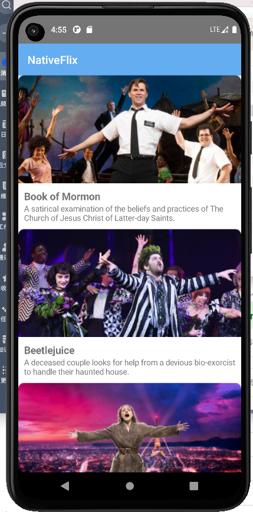
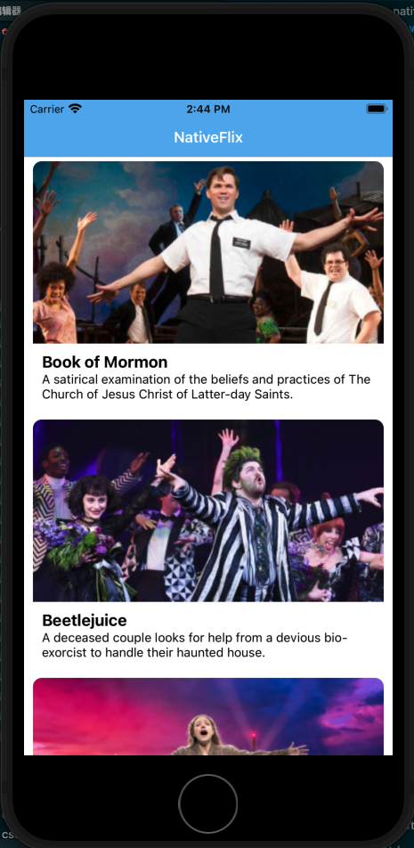
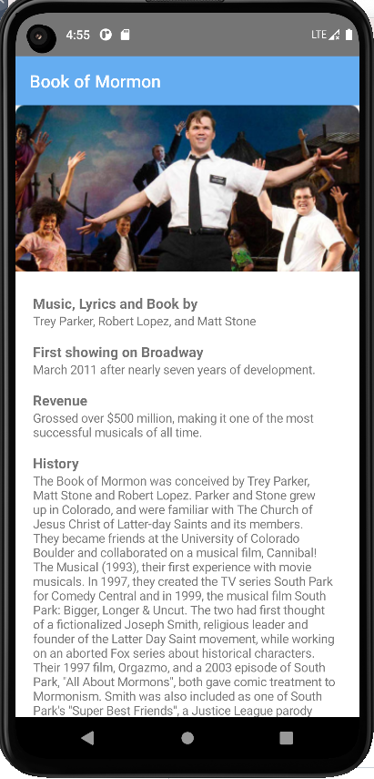
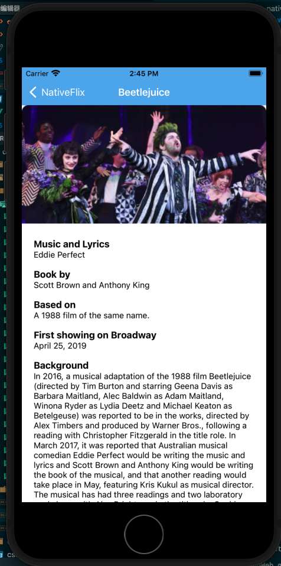

# nativescript和nativescript-vue

[nativescript](https://github.com/NativeScript/NativeScript)项目本质上是一个用于让js可以访问到移动端原生资源的框架,它实际是跑在[android](https://github.com/NativeScript/android-runtime)或者[ios](https://github.com/NativeScript/android-runtime)上分别构建的runtime上的(类似java-runtime).可以理解为只是一个中间层(类似jdk).而具体对接特定的开发框架又需要使用特定的项目(类似java,scala,jython这类).比如我们要使用vue则需要使用项目[nativescript-vue](https://github.com/nativescript-vue/nativescript-vue).这种模块化当然相当清晰,但也带来了使用上的复杂性,好在官方构造了一个命令行工具[ns](https://github.com/NativeScript/nativescript-cli)来解决这个问题.

## nativescript的安装

nativescript安装分为两步:

1. 安装原生开发环境.注意只有mac os才能同时安装ios和android的开发环境,window和linux都只能构造安卓开发环境.本文以mac为例子介绍.windows和linux安装android开发环境可以参考mac下的操作.

2. 安装nativescript命令行工具

### mac下安装原生开发环境

#### ios开发环境

首先确保你的mac os版本不要太低,我的目前是11.6.4,而且是intel处理器版本,可以完美使用

1. 安装xcode,注意只有命令行工具不够.
2. 确认`XCode > Preferences > Locations`位置`Command Line Tools`已经被设置
3. 安装node环境,`brew install node`
4. 安装cocoapods,`brew install cocoapods`
5. 安装watchman,`brew install watchman`
6. 安装xcodeproj,`sudo gem install xcodeproj`
7. 设置`XCode > Preferences > Components`位置选择一个版本的iphone的simulator下载

#### android开发环境

1. 安装jdk

    ```bash
    brew tap homebrew/cask-versions
    brew install --cask zulu11
    ```

2. 安装[Android Studio](https://developer.android.google.cn/studio),
3. 进入Android Studio,进入`more actions -> SDK manager`,在`sdk platform`中选择需要的sdk版本安装,并在`sdk tools`中必须至少安装`android sdk build-tools`和`android sdk commandline-tools`,同时记录下安装到的位置,即`Android SDK Location`(如果要兼容react native需要选择`sdk platform`为`android 11(R)`,`sdk tools`中需要安装版本为`30.0.2`的`android sdk build-tools`),同时创建一个simulator.

4. 设置环境变量

    ```bash
    #==============================android
    export ANDROID_SDK_ROOT=/Users/mac/libs/android
    export ANDROID_HOME=$ANDROID_SDK_ROOT
    export PATH=$PATH:$ANDROID_SDK_ROOT/emulator
    export PATH=$PATH:$ANDROID_SDK_ROOT/platform-tools
    export PATH=$PATH:$ANDROID_SDK_ROOT/tools
    export PATH=$PATH:$ANDROID_SDK_ROOT/tools/bin

    ```

### 安装nativescript命令行工具

`npm install -g nativescript`

可以用`ns doctor ios`检查ios环境是否可用,用`ns doctor android`测试android环境是否可用

### nativescript和node的关系

nativescript借助webpack打包,它会将js代码编译为对应平台上runtime支持的程序.因此可以理解为编译期在开编译机的node上执行,而运行时则在目标设备的runtime上,与node无关.因此我们需要注意很多依赖node标准库的库是无法直接在nativescript上使用的,反而因为浏览器上没有node环境中的标准库,所以不少可以使用.但如果你使用ts进行开发,很多老旧的浏览器库会找不到类型声明文件.总体来说nativescript和node上的库并不能完全通用.

下面列举常用功能可用的库(持续更新):

+ id生成: [pure-uuid](https://github.com/rse/pure-uuid)
+ 数字签名,hash,加密: [crypto-js](https://github.com/brix/crypto-js)
+ jwt:[jwt-decode](https://github.com/auth0/jwt-decode)

### nativescript的组件与插件

nativescript支持插件化开发,这也就为社区提供了土壤,官方自己有维护[标准UI组件库](https://docs.nativescript.org/ui/)和一些功能插件,他们试图实现让移动端开发也有类似web开发的相近工具这一理念分散在整个`nativescript-core`中.

而第三方也提供了大量优秀的插件,他们有的是UI组件,有的是功能性插件.比较推荐的第三方插件组织(个人)包括

+ [nativescript-community](https://github.com/nativescript-community/)目前依然比较活跃的组织,插件基本都能用.
+ [triniwiz](https://github.com/triniwiz/nativescript-plugins)nativescript的开发者之一,提供了不少好用的插件,但也有不少年久失修了
+ [nstudio](https://github.com/nstudio/nativescript-plugins),一个挺活跃的组织,提供的很多都是接外部服务的插件

### 插件的安装

官方插件可以在<https://docs.nativescript.org/plugins/>这里看到,社区维护的插件则需要自己去找,建议先在上面提供的三个地方找,如果没有满足需求的再去官方的插件市场<https://market.nativescript.org/>中查找,再找不到就去github上搜索碰下运气.注意第三方插件良莠不齐,最好先去看看他们的源码更新时间和下载量,长期没更新的通常都不太行,当然最终还是要跑下给的例子试试.找到需要的插件后,在项目下执行`ns plugin add <插件名>`就可以安装到项目了.

### nativescript-vue和nativescript的关系

`nativescript-vue`实际上可以看做是在`nativescript`之上的一个语法层,它让我们可以使用vue.js语法写`nativescript`程序,因此它可以使用大多数的`nativescript`插件.

也就是说`nativescript`提供runtime,组件,项目管理工具等各种让程序可以跑起来的元素,而`nativescript-vue`提供vue.js的语法让我们可以通过编程将这些元素组合起来成为应用.

需要注意在`nativescript-vue`中的组件是经过包装的`nativescript`组件.而很多接口需要直接访问`nativescript`组件,我们就需要从`nativescript-vue`中解包出`nativescript`组件再进行操作.

#### 使用ref获取`nativescript`组件的实例

最常见的获取`nativescript`组件实例的方法,原理是利用vue的`ref`获取`nativescript-vue`组件.

```vue
<template>
...
<XXX ref="ElementA" />  // 指定vue组件实例名为"ElementA"
...
</template>
<script lang="ts" setup>
import { ref } from 'nativescript-vue';
const ElementA = ref() //映射ref指定的vue实例
const ele = Elechart.value._nativeView as XXX; // 从vue实例的`._nativeView`属性中获取`nativescript`组件的实例
...
</script>
```

#### 从事件中获取`nativescript`组件的实例

`EventData`事件类以及其子类都有一个属性`object`用于记录发生事件的`nativescript`组件.因此一些由事件触发的针对触发事件`nativescript`组件的操作就可以用这种方式来进行

```vue
<template>
...
<TextField  hint="Enter text to send" @returnPress="sendMessage" />
...
</template>
<script lang="ts" setup>
import { EventData, TextField } from "@nativescript/core"
function sendMessage(evt: EventData) {
    const textField = evt.object as TextField
    ...
}
...
</script>
```

### nativescript-vue与vue的关系

`nativescript-vue`其实和`vue`本体没什么关系,它只是使用vue语法来写构造原生界面而已.具体来说,`nativescript-vue v2`使用`vue 2`语法;`nativescript-vue v3`使用`vue 3`语法.不过`nativescript-vue v3`目前还beta测试,并不完善.

在使用上还有如下不同

+ 使用的基础标签不同,`vue`是用的是html标准标签,`nativescript-vue`则是使用`nativescript-vue`封装的`nativescript`标签
+ `nativescript-vue`官方在实验性的适配`vue-router`,因此目前无法支持`vue-router`,只能使用内置的[manual-routing方式](https://nativescript-vue.org/en/docs/routing/manual-routing/)
+ `nativescript-vue v2`只能使用`vuex 3`(最高版本3.6.2)
+ `nativescript-vue`通过插件调用移动端上的设备,而vue走浏览器的html5接口

我们这篇文章为了一致性依然使用`nativescript-vue v3`,需要注意由于现在还不是稳定版本,本文的一些内容可能是有问题的,建议等等.

### 周边工具与设置

nativescript-vue v3可以使用vue 3的相关工具辅助开发,主要包括

+ [vuejs-devtools](https://chromewebstore.google.com/detail/vuejs-devtools/nhdogjmejiglipccpnnnanhbledajbpd),chrome插件,用于调试页面
+ [Vue Language Features (Volar)](https://github.com/vuejs/language-tools.git),vscode上vue 3的辅助开发工具
+ [TypeScript Vue Plugin (Volar)](https://github.com/vuejs/language-tools.git),vscode上vue 3的typescript辅助开发工具

如果你使用ts开发,可能会出现报错`无法使用 JSX,除非提供了 “--jsx“ 标志。ts(17004)`,这种需要修改`tsconfig.json`配置文件增加一项配置.

```json
{
  "compilerOptions": {
    "jsx": "preserve",
    ...
  },
  ...
}
```

### nativescript-vue加载插件

插件在入口`app.ts`中加载,一般两种使用加载方式:

+ `use(模块)`方法,一般完成度比较高的插件都是这种加载方式,通常是如下模式

    ```ts
    import { createApp } from 'nativescript-vue';
    import 插件模块名 from '插件模块地址'

    createApp(根组件).use(插件模块名).start()
    ```

    由于`.use(插件模块名)`返回的是应用对象本身,因此可以用pipeline的写法一个一个加载插件模块

+ `registerElement`方法,通常没法用`use`方法的就是用`registerElement`方法,`nativescript-vue`提供了`registerElement`接口,我们可以用它结合`required`加载插件模块,模式如下

    ```ts
    import { createApp, registerElement } from 'nativescript-vue';
    import 插件模块名 from '插件模块地址'
    ...
    registerElement('插件模块名', () => require('插件模块地址').插件模块组件对象);
    createApp(根组件).start()
    ```

## 项目源码结构

通常`src`目录就是我们的源码目录,开发行为基本都在这个目录下进行.其中会有如下文件/文件夹

+ `app.ts`|`app.js`,项目入口文件
+ `app.scss`|`app.css`,项目的全局样式定义
+ `fonts/`,项目使用的字体文件
+ `components/`,存放vue组件,
+ `views/`文件夹存放以`Frame`,`Page`,标签为最外层标签的页面视图定义文件,而`components/`中则是存放用于复用的组件组合
+ `assets/`,应用中使用到的静态资源,主要是图片这类
+ `models/`,应用的的数据模型,一般本地数据的管理会放这里
+ `store/`,定义状态,一般是vuex使用,用于管理界面内部状态
+ `apis/`,定义访问外部接口数据的行为,有时会和`models`合并

## nativescript的开发工作流

nativescript开发原生移动端应用有别于网页开发.网页本质上是一个指导渲染的脚本,真正的客户端是浏览器,网页开发好后只要放到服务端的http服务器上即可,而原生应用本质上是个完整的客户端,通常由各大厂商进行监管分发,因此我们的发布实际上是提交给厂商的应用市场.由于这个发布上的区别也就造成了开发工作流上的区别

nativescript开发原生移动端应用的工作流大致分为如下步骤:

1. 本地开发,在本文语境下就是使用`nativescript-vue`做开发
2. 本地调试,使用`ns debug ios|android`.它实际执行了如下步骤

   1. `build`,编译应用
   2. `deploy`,查找到对应平台有没有可用的连好的设备,如果没有则查看有没有启动的对应平台模拟器,如果还没有就启动对应平台的默认模拟器,然后将编译好的应用部署到其中
   3. `launch`,在部署的设备中启动应用
   4. 启动一个`vue devtools`的websocket服务用于debug
3. 1,2两步循环直至基本满意
4. 真实设备测试,需要弄几台不同型号的android和ios设备,启动usb调试模式后用usb连接开发应用的电脑,之后使用`ns device`查看是否可以识别
    + android启动usb调试模式: 这个看品牌,一些品牌可以直接进入调试模式设置,通常在`设置 > 系统 >USB调试`,如果找不到可以去`设置 > 系统 > 关于手机 > 版本号(连续点击7次)`,此时会出现提示`提示已进入开发者模式`,返回到系统页面一般就可以找到
    + ios启动usb调试模式:通常在`设置>开发者`
5. 4如果不满意再回归3重新开发调试,直至满意
6. 在不同的应用平台注册,申请发布权限
7. 打包发布
    + ios: 使用命令`ns appstore`查看iTunes中的该项目信息,使用`ns appstore upload`上传
    + android: 如果海外发布可以尝试发布到[google play](https://play.google.com/apps/publish/),国内的话各家有各家的平台,嫌麻烦也可以直接`ns build --release android`拿到应用apk后挂github让人下载.

本文将介绍整个流程,但在学习阶段主要就是执行1,2两步

## 正式开始的helloworld

惯例的我们来一个hello world项目开始我们的学习,我们依然使用vue语法.这个项目来自官网,主要是让我们大致对native-script-vue的用法有个直观认识.
本项目最终代码在[native-helloworld](https://github.com/hsz1273327/TutorialForFront-EndWeb/tree/native-helloworld)

首先我们先用命令行工具构造一个项目模板

```bash
ns create myAwesomeApp --template @nativescript-vue/template-blank@beta
```

上面的命令我们会创建一个名为`myAwesomeApp`的目录,其中就是我们项目的模板,这个项目将:

+ 使用typescript作为开发语言
+ 使用vue 3作为开发框架,
+ 使用css或者scss作为样式表语言控制样式.

其目录中会有一个名为`app`的目录,这就是我们源码存放的位置;另一个比较重要的文件夹是`App_Resources`,它用于控制打包后应用程序的配置,比如使用的图标等就是它控制的,另外如果有针对不同平台的原生代码也是放在这里,关于应用打包我们在本系列最后介绍.

我们可以先什么都不做,执行`ns debug android`来编译下现在的项目.正常的话就会跳出android的默认simulator,并开始编译项目,当编译完成后模拟器中就会跳出app的界面.

首先我们来看整体看下每一个文件

### 入口文件`app.ts`

```typescript
import { createApp } from 'nativescript-vue';
import Home from './views/Home.vue';


createApp(Home).start();
```

在nativescript-vue中我们并不需要`index.html`这样的界面入口,直接一个vue的根实例即可.

### 数据定义`models/Flick.ts`

这个例子我们并没有连接外部数据.数据就定义在这个位置.

这个例子中我们给出了3个电影的介绍信息.

```ts
interface FlickModel {
  id: number
  genre: string
  title: string
  image: string
  url: string
  description: string
  details: {
    title: string
    body: string
  }[]
}

class NotfoundError extends Error {
  constructor(message: string) {
    super(message); // (1)
    this.name = this.constructor.name;
  }
}

class FlickService {
  private flicks: FlickModel[] = [
    {
      id: 1,
      genre: 'Musical',
      title: 'Book of Mormon',
      image: '~/assets/bookofmormon.png',
      url: 'https://nativescript.org/images/ngconf/book-of-mormon.mov',
      description: `A satirical examination of the beliefs and practices of The Church of Jesus Christ of Latter-day Saints.`,
      details: [
        {
          title: 'Music, Lyrics and Book by',
          body: 'Trey Parker, Robert Lopez, and Matt Stone'
        },
        {
          title: 'First showing on Broadway',
          body: 'March 2011 after nearly seven years of development.'
        },
        {
          title: 'Revenue',
          body:
            'Grossed over $500 million, making it one of the most successful musicals of all time.'
        },
        {
          title: 'History',
          body:
            'The Book of Mormon was conceived by Trey Parker, Matt Stone and Robert Lopez. Parker and Stone grew up in Colorado, and were familiar with The Church of Jesus Christ of Latter-day Saints and its members. They became friends at the University of Colorado Boulder and collaborated on a musical film, Cannibal! The Musical (1993), their first experience with movie musicals. In 1997, they created the TV series South Park for Comedy Central and in 1999, the musical film South Park: Bigger, Longer & Uncut. The two had first thought of a fictionalized Joseph Smith, religious leader and founder of the Latter Day Saint movement, while working on an aborted Fox series about historical characters. Their 1997 film, Orgazmo, and a 2003 episode of South Park, "All About Mormons", both gave comic treatment to Mormonism. Smith was also included as one of South Park\'s "Super Best Friends", a Justice League parody team of religious figures like Jesus and Buddha.'
        },
        {
          title: 'Development',
          body: `During the summer of 2003, Parker and Stone flew to New York City to discuss the script of their new film, Team America: World Police, with friend and producer Scott Rudin (who also produced South Park: Bigger, Longer & Uncut). Rudin advised the duo to see the musical Avenue Q on Broadway, finding the cast of marionettes in Team America similar to the puppets of Avenue Q. Parker and Stone went to see the production during that summer and the writer-composers of Avenue Q, Lopez and Jeff Marx, noticed them in the audience and introduced themselves. Lopez revealed that South Park: Bigger, Longer & Uncut was highly influential in the creation of Avenue Q. The quartet went for drinks afterwards, and soon found that each camp wanted to write something involving Joseph Smith. The four began working out details nearly immediately, with the idea to create a modern story formulated early on. For research purposes, the quartet took a road trip to Salt Lake City where they "interviewed a bunch of missionaries—or ex-missionaries." They had to work around Parker and Stone\'s South Park schedule. In 2006, Parker and Stone flew to London where they spent three weeks with Lopez, who was working on the West End production of Avenue Q. There, the three wrote "four or five songs" and came up with the basic idea of the story. After an argument between Parker and Marx, who felt he was not getting enough creative control, Marx was separated from the project.[10] For the next few years, the remaining trio met frequently to develop what they initially called The Book of Mormon: The Musical of the Church of Jesus Christ of Latter-day Saints. "There was a lot of hopping back and forth between L.A. and New York," Parker recalled.`
        }
      ]
    },
    {
      id: 2,
      genre: 'Musical',
      title: 'Beetlejuice',
      image: '~/assets/beetlejuicemusical.png',
      url: 'https://nativescript.org/images/ngconf/beetlejuice.mov',
      description: `A deceased couple looks for help from a devious bio-exorcist to handle their haunted house.`,
      details: [
        {
          title: 'Music and Lyrics',
          body: 'Eddie Perfect'
        },
        {
          title: 'Book by',
          body: 'Scott Brown and Anthony King'
        },
        {
          title: 'Based on',
          body: 'A 1988 film of the same name.'
        },
        {
          title: 'First showing on Broadway',
          body: 'April 25, 2019'
        },
        {
          title: 'Background',
          body: `In 2016, a musical adaptation of the 1988 film Beetlejuice (directed by Tim Burton and starring Geena Davis as Barbara Maitland, Alec Baldwin as Adam Maitland, Winona Ryder as Lydia Deetz and Michael Keaton as Betelgeuse) was reported to be in the works, directed by Alex Timbers and produced by Warner Bros., following a reading with Christopher Fitzgerald in the title role. In March 2017, it was reported that Australian musical comedian Eddie Perfect would be writing the music and lyrics and Scott Brown and Anthony King would be writing the book of the musical, and that another reading would take place in May, featuring Kris Kukul as musical director. The musical has had three readings and two laboratory workshops with Alex Brightman in the title role, Sophia Anne Caruso as Lydia Deetz, Kerry Butler and Rob McClure as Barbara and Adam Maitland.`
        }
      ]
    },
    {
      id: 3,
      genre: 'Musical',
      title: 'Anastasia',
      image: '~/assets/anastasia.png',
      url: 'https://nativescript.org/images/ngconf/anastasia.mov',
      description: `The legend of Grand Duchess Anastasia Nikolaevna of Russia.`,
      details: [
        { title: 'Music and Lyrics', body: 'Lynn Ahrens and Stephen Flaherty' },
        {
          title: 'Book by',
          body: 'Terrence McNally'
        },
        {
          title: 'Based on',
          body: 'A 1997 film of the same name.'
        },
        {
          title: 'Background',
          body: `A reading was held in 2012, featuring Kelli Barret as Anya (Anastasia), Aaron Tveit as Dmitry, Patrick Page as Vladimir, and Angela Lansbury as the Empress Maria. A workshop was held on June 12, 2015, in New York City, and included Elena Shaddow as Anya, Ramin Karimloo as Gleb Vaganov, a new role, and Douglas Sills as Vlad.
            The original stage production of Anastasia premiered at the Hartford Stage in Hartford, Connecticut on May 13, 2016 (previews). The show was directed by Darko Tresnjak and choreography by Peggy Hickey, with Christy Altomare and Derek Klena starring as Anya and Dmitry, respectively.
            Director Tresnjak explained: "We've kept, I think, six songs from the movie, but there are 16 new numbers. We've kept the best parts of the animated movie, but it really is a new musical." The musical also adds characters not in the film. Additionally, Act 1 is set in Russia and Act 2 in Paris, "which was everything modern Soviet Russia was not: free, expressive, creative, no barriers," according to McNally.
            The musical also omits the supernatural elements from the original film, including the character of Rasputin and his musical number "In the Dark of the Night", (although that song’s melody is repurposed in the new number "Stay, I Pray You"), and introduces instead a new villain called Gleb, a general for the Bolsheviks who receives orders to kill Anya.`
        }
      ]
    }
  ]

  getFlicks(): FlickModel[] {
    return this.flicks
  }

  getFlickById(id: number): FlickModel {
    let result = this.flicks.find(flick => flick.id === id)
    if (result) {
      return result
    }
    throw new NotfoundError("id not found")
  }
}

export { FlickModel, FlickService, NotfoundError }
```

与之相关的是`assets`文件夹下的图片资源

### 视图`views`

+ `views/Home.vue`,入口视图,打开应用后第一个看到的页面,它必须以`Frame`标签作为最外层标签.我们的`Vue`相关的工具都需要从`nativescript-vue`这个库中导入.同时`nativescript-vue`也提供过了导航使用的`Manual Routing`接口,比如`$navigateTo`

    ```vue
    <script lang="ts" setup>
    import {
      ref,
      $navigateTo,
    } from 'nativescript-vue';
    import Details from './Details.vue';
    import { FlickService, FlickModel } from "../models/Flick";
    const flickService = new FlickService();
    const flicks = ref(flickService.getFlicks());

    function onFlickTap(item: FlickModel) {
      const id = item.id;
      $navigateTo(Details, {
        props: { id },
      });
    }
    </script>

    <template>
      <Frame>
        <Page>
          <ActionBar title="NativeFlix" />
          <ListView height="100%" separatorColor="transparent" :items="flicks">
            <template #default="{ item }">
              <GridLayout height="280" borderRadius="10" class="bg-secondary" rows="*, auto, auto" columns="*" margin="5 10"
                padding="0" @tap="onFlickTap(item)">
                <image row="0" margin="0" stretch="aspectFill" :src="item.image" />
                <label row="1" margin="10 10 0 10" fontWeight="700" class="text-primary" fontSize="18" :text="item.title" />
                <label row="2" margin="0 10 10 10" class="text-secondary" fontSize="14" textWrap="true"
                  :text="item.description" />
              </GridLayout>
            </template>
          </ListView>
        </Page>
      </Frame>
    </template>

    <style>
    /* .info {
        font-size: 20;
      } */
    </style>
    ```

    它在应用中会被渲染为下图这样的页面

    + android

    

    + ios

    

+ `views/Details.vue`,详情页

    ```vue
    <template>
      <Page>
        <ActionBar v-if="flick" :title="flick.title" />
        <ScrollView height="100%">
          <StackLayout>
            <Image margin="0" stretch="aspectFill" :src="flick.image" />
            <StackLayout padding="10 20">
              <StackLayout v-for="detail in flick.details" :key="detail.title">
                <Label marginTop="15" fontSize="16" fontWeight="700" class="text-primary" textWrap="true"
                  :text="detail.title" />
                <Label fontSize="14" class="text-secondary" textWrap="true" :text="detail.body" />
              </StackLayout>
            </StackLayout>
          </StackLayout>
        </ScrollView>
      </Page>
    </template>
    <script lang="ts" setup>
    import { ref, defineProps } from 'nativescript-vue';


    import { FlickService } from "../models/Flick";
    const flickService = new FlickService();
    const props = defineProps(['id'])

    const flick = ref(flickService.getFlickById(props.id));
    </script>
    ```

    它在应用中会被渲染为下图这样的页面

    + android

    

    + ios

    

可以看到一个nativescript-vue的组件依然是经典的vue3段式.

+ `template`段管组件结构

+ `script`段管组件逻辑

+ `style`段管样式

`script`和`style`基本和经典的vue3没有区别,主要区别在`template`段.

`template`段中最主要的是标签.注意,和浏览器环境并不一样,在浏览器中vue里用的标签都是平等的,但在nativescript-vue中有两个特殊的标签

+ `<Frame>`.它必须在入口页面的最外层,
+ `<Page>`.它必须在一个组件的最外层,表示这个Vue组件是一个页面.我们只可以用非`<Page>`标签封装自定义组件(虽然一般也不用).

除此之外我们还看到了使用标签`<ListView>`渲染一个列表中的元素,使用`:items="flicks"`指定要遍历的列表,然后用下面的`<template #default="{ item }">`标签将每个元素的值放到变量`item`中.

这里没有使用`v-for`并不是说nativescript-vue不支持`v-for`,而是标签`<ListView>`的针对循环的一个优化.`v-for`会在页面上有多少渲染多少,而标签`<ListView>`则类似懒加载,当前页面展示到哪里就会渲染到哪里.

而从`Home`页面跳转至`Details`页面我们使用的是`$navigateTo(Details, {props: { id }});`接口,这也是目前唯一支持的[manual-routing方法](https://nativescript-vue.org/cn/docs/routing/manual-routing/)的常用模式
