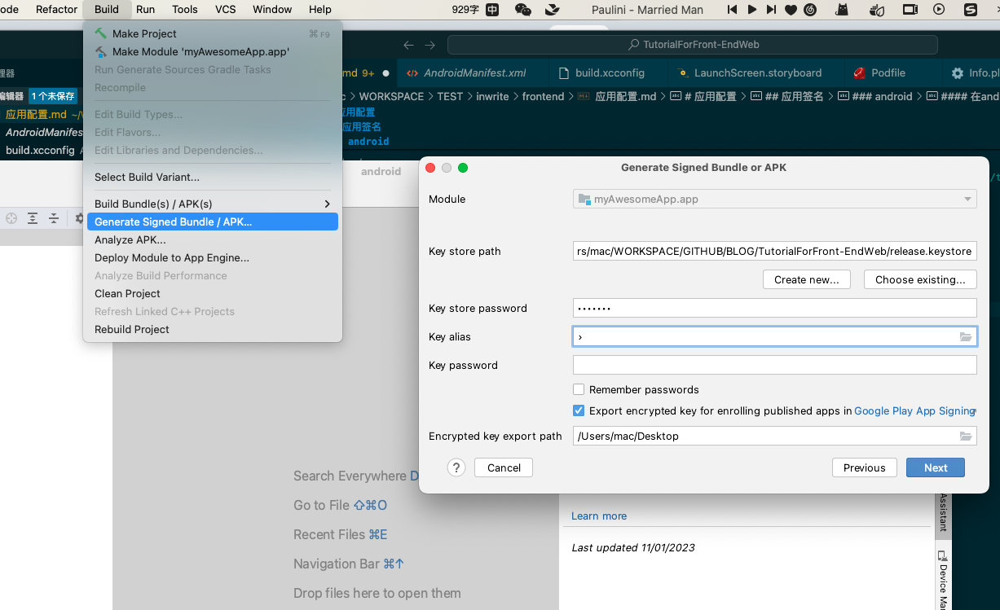

# 应用发布

应用开发的终点是发布.而发布步骤则是开发中事关盈利的最重要的环节,毕竟很多时候我们也不是为了开发而开发,更多的是要发布作为商品供交易使用的.

发布是整个开发流程中对平台依赖最大的部分,不同的平台环境不同政策不同发布的形式也不同.因此这里单独拉出来做详细介绍.

应用的发布同时意味着一个版本应用开发的完成,它分为两个步骤

1. 编译发行版
2. 投放发布平台

在不同平台我们要做的并不一样

## 编译发行版

和调试时编译一样,我们使用`ns build <platform>`命令编译发行版,但我们需要用`--release`来指明编译的是发行版.

发行版和调试版在编译时最大的不同是需要设置很多额外的东西

### android

编译android发行版最主要是要设置应用签名.应用签名本质上是利用密码学手段提供一个与你要发布的包本身相关的摘要凭据,这个摘要签名可以被平台用于确保应用没有被篡改.这一方面保护开发者的权益--你的用户用了魔改版出了问题赖不到你头上;一方面也保护平台权益--用户无法在平台上下到魔改版.

安卓应用必须验证签名才能编译执行.在mac/linux下会使用`~/.android/debug.keystore`,在windows下会使用`C:\Users\xxx\.android/debug.keystore`,这个`debug.keystore`是默认生成的,我们调试时就会拿它进行签名,其信息如下:

```txt
Keystore name: "debug.keystore"
Keystore password: "android"
Key alias: "androiddebugkey"
Key password: 'android'
CN: "CN=Android Debug,0=Android,C=US"
```

通常这在开发环境下就够用了,但发行版一般不会用这个`keystore`,而是自己创建一个专用的,毕竟用默认的太不正式了.如果你打算在googleplay上发布你的应用,googleplay会要求同一应用使用完全相同的`keystore`文件来签署所有更新.而且在大多数情况下,我们使用单个`keystore`文件来签署个人或公司的所有Android应用程序.而区分应用一般用别名,也就是`Key alias`和`Key password`.这意味着如果搞丢了`keystore`文件或其密码,我们将损失巨大,所以好好保管别搞丢了!

#### 命令行中设置keystore

我们可以用如下命令创建一个新的keystore

```bash
keytool -genkey -alias testalias -keyalg RSA -keysize 2048 -validity 36500 -keystore release.keystore
```

可以用如下命令来增加新的别名

```bash
keytool -keyclone -alias 'old-alias' -dest 'new-alias' -keypass 'old_keypass' -new 'new_keypass' -keystore '/path/to/keystore' -storepass 'storepass'
```

#### 在android studio中设置keystore

也可以随便用xcode打开一个android项目,进入`Build > Generate Signed Bundle / APK`

之后我们就可以用这个界面管理keystore了.

没有就`Create New`,有就选好后加载输入密码,等等都是图形界面还是比较容易操作的



这种方式相比命令行方式更直观也不容易出错.

#### 正式编译发行版

<!-- 然后修改`App_Resources/Android/app.gradle`,在其中添加`signingConfigs`用于声明不同环境下的`keystore`

```gradle
android {
  signingConfigs {
    debug {
      storeFile file('~/.android/debug.keystore')
      storePassword 'android'
      keyPassword 'android'
      keyAlias 'androiddebugkey'
    }
    release {
      storeFile file('/Users/mac/WORKSPACE/GITHUB/BLOG/TutorialForFront-EndWeb/release.keystore')
      storePassword '12345'
      keyPassword '123445'
      keyAlias 'key0'
    }
}
```-->

<!-- https://blog.csdn.net/qian1127/article/details/103531761 -->

正式编译发行版时我们需要考虑下打包格式.

android最早支持的打包格式是`apk(Android application package)`,它本质上是一个zip包,里面包含应用运行所需要全部资源.

而2018年google推出了一种新的打包格式`abb`,它本质上是一个通用APK+多个用于特定配置的APK.只是我们上传到google play后用户从google play下载时,google play会根据用户设备的特点选择合适的优化过的apk安装.

也就是说`abb`的优点是安装时包更小(比`apk`小15%左右),但缺点是依赖`google play`.具体怎么选我们还是按我们的真实需求来选.比如我们的应用针对国内就用`apk`

在编译应用时,我们key带上对应参数来指定keystore和对应秘钥和别名,然后指定编译打包的格式(`.abb`还是`.apk`)以及结果未知即可

+ 编译为abb

    ```bash
    ns build android --release \
    --key-store-path ~/path/to/my_keystore.keystore \
    --key-store-password my-very-secure-password \
    --key-store-alias alias \
    --key-store-alias-password my-alias-very-secure-password \
    --abb \ 
    --copy-to dist/build.aab
    ```

+ 编译为apk

    ```bash
    ns build android --release \
    --key-store-path ~/path/to/my_keystore.keystore \
    --key-store-password my-very-secure-password \
    --key-store-alias alias \
    --key-store-alias-password my-alias-very-secure-password \
    --apk \ 
    --copy-to dist/build.apk 
    ```

### ios

ios编译发行版是一个比较麻烦的过程,步骤如下:

1. 你得有apple的开发者账户(一年99美元),你可以在[这里进入账户栏创建](https://developer.apple.com/cn/)
2. 进入你的开发者账户页面,创建生产证书,应用程序ID和分发配置文件.这是整个过程中最乏味的部分,因为需要一些时间来了解每个文件的用途以及如何使用它们.
3. 修改`app/App_Resources/iOS/build.xcconfig`,填入下面的部分,

    ```txt
    CODE_SIGN_IDENTITY = 你应用的签名
    DEVELOPMENT_TEAM = 你的团队id
    ```

4. 执行命令

    ```bash
    ns build ios --release
    ```

<!-- https://v8.docs.nativescript.org/releasing.html#ios -->

## 投放发布平台

### android

android是一个相对去中心化开放的平台,android系统本身是开源的,但google提供的各种服务接口--谷歌框架不是开源的.发行版应用可以投放到任何平台甚至可以直接下载包到手机上安装,但google也提供了google play作为默认的官方应用市场.

#### 网站发布

这个最简单,我们用apk格式打包应用,然后挂在合适的网站即可.我们以github为例,可以在`release`中按版本上传打包好的应用即可.

网站发布是很难推广的,通常我们很难让普通用户知道自己的存在.毕竟手机上都有应用商店,正常人都会去应用商店找应用安装.因此如果你的应用打算网站发布,建议:

1. 项目解决的需求要足够硬核,大众应用基本不用考虑
2. 要做官网

网站发布最适合的是和硬件产品配合.比如很多智能家居产品,由于买到的是带说明书的硬件,上面可以打印二维码,这样就可以做个扫二维码下载的发布方式,从而跳过应用市场分发.

#### 国内应用市场发布

android应用市场相当碎片化.在国外自然是首推google play了,但在国内就尴尬了,几乎每个厂家都有自己的应用市场,那我们就需要每个主要市场都投放一遍,还是很蛋疼的.国内最主要的自然是

+ [华为应用市场](https://consumer.huawei.com/cn/mobileservices/appgallery/)
+ [小米应用市场](https://dev.mi.com/platform)
+ [oppo应用市场](https://open.oppomobile.com/new/loginForHeyTap)
+ [vivo应用市场](https://dev.vivo.com.cn/promote/appStore)
+ [应用宝(腾讯应用市场)](https://wikinew.open.qq.com/index.html#/iwiki/4007776088)

不过国内的应用都要有备案,而且需要填很多信息,每家的政策也不一样,因此国内市场发布是个非常麻烦的事情

#### google play发布

<!-- https://docs.nativescript.org/guide/publishing/android-google-play -->
#### 总结

下面是android应用三种发布模式的优缺点总结

| 项目         | 开源发布                       | 国内应用市场 | google play  |
| ------------ | ------------------------------ | ------------ | ------------ |
| 针对目标     | 基本仅限程序员或技术爱好者群体 | 国内大众用户 | 国外大众用户 |
| 外部要求     | 无要求                         | 需要备案     | 需要能翻墙   |
| 适用打包形式 | apk                            | apk          | abb          |
| 触达率       | 低                             | 中           | 高           |
| 发布方便程度 | 简单                           | 繁琐         | 一般         |

### ios

苹果一直是封闭平台,ios比macos更封闭.发行版的应用在ios上至少目前只能在app store中投放发布.而发行版应用打包也必须依赖苹果开发者平台上提供的签名等信息.

<!-- https://blog.nativescript.org/steps-to-publish-your-nativescript-app-to-the-app-stores/#step-3 -->