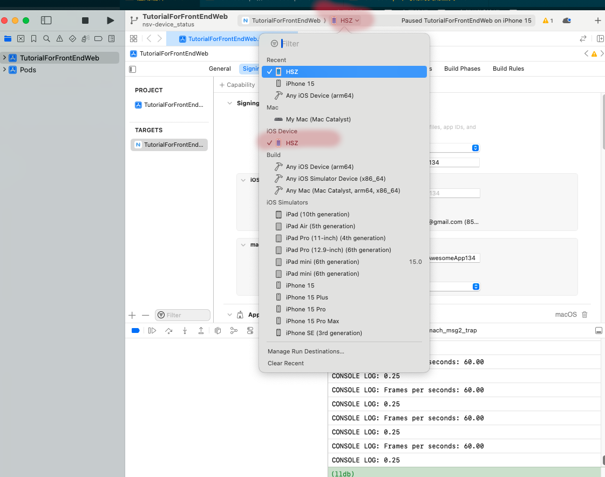
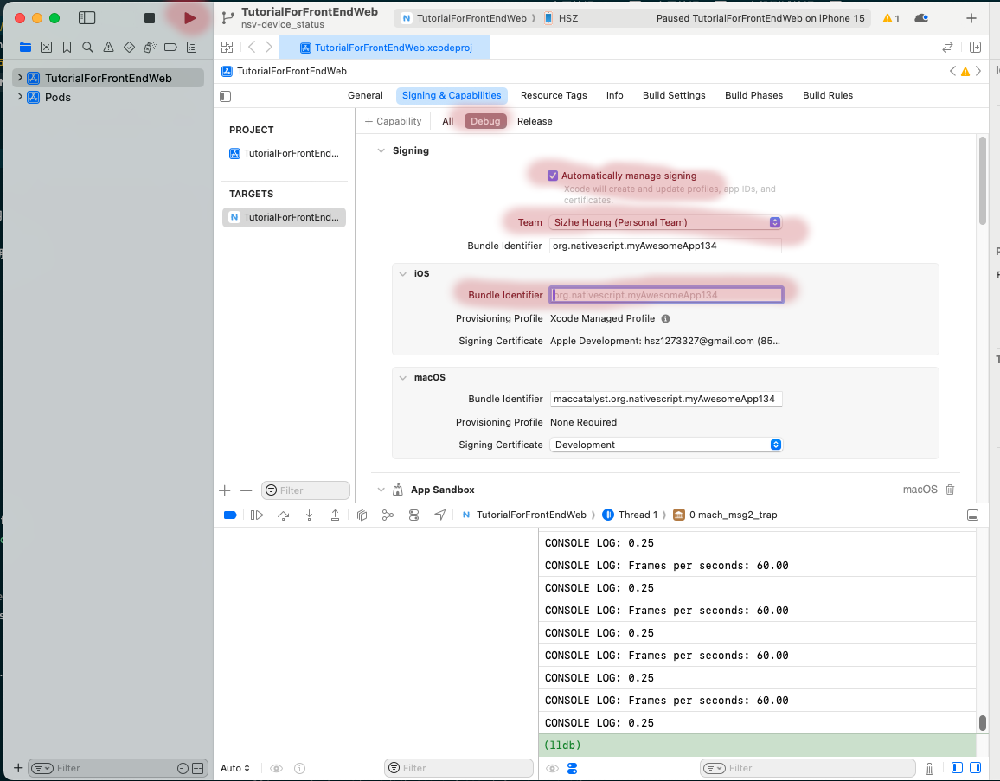

# 应用编译

移动端应用的编译在整个开发流程中是非常频繁的.应用在开发过程中每次调试过程中都需要编译后部署才能进行调试,实机测试也必须编译后才能进行,而最终我们更是要将应用编译为最终发布版本然后提交到各种应用商店.

## nativescript的编译过程

nativescript会将编译设置放在`App_Resources/<platform>`文件夹下的维护.每次执行编译时实际执行3个步骤

1. 下载安装js依赖
2. 将nativescript代码连同编译配置转译到`platforms/<platform>`中等待编译工具(也就是`xcode`和`android studio`)工具
3. 利用编译工具(也就是`xcode`和`android studio`)将nativescript代码编译为应用

因此每次执行编译操作后会生成`platforms/<platform>`这样的文件夹.这个文件夹相当于是一个编译的中间项目,可以用对应的编译工具(也就是`xcode`和`android studio`)打开,如果有代码更新,资源更新,ns编译工具都会更新`platforms/<platform>`这个中间项目,但注意**编译配置的变更不会引起`platforms/<platform>`这个中间项目的更新**,因此如果编译设置有了变化都是建议执行`ns clean`清空所有编译中间过程然后再重新执行nativescript编译工作的.

## 编译环境准备

编译是整个开发流程中对工具依赖最大的部分.编译依赖于开发环境,android就是`android studio`,iOS就是`xcode`.

编译实际也是最容易出各种奇怪问题的步骤,如果仅一个人在固定环境开发可能相对还好点,但一旦涉及到协作,涉及到多个开发环境,那就很容易报各种奇怪的bug编译不起来.这些编译问题多数时候是sdk或开发环境版本不兼容造成的.

要注意

1. nativescript毕竟相对于android和ios来说是第三方实现,因此通常都有滞后性,推荐在新sdk出来后至少等1个月再更新.
2. 每次更新了`android studio`或`xcode`后需要执行`ns clean`,然后重新执行有`build`操作的指令(比如`ns debug`)因为很多第三方依赖需要使用当前的sdk重新编译.
3. 如果发现编译无法通过,可以尝试更新对应平台的运行时包([@nativescript/android](https://github.com/NativeScript/android)和[@nativescript/ios](https://github.com/NativeScript/ios))到最新
4. ios端还会受编译使用的macos版本影响,建议不要落后超过1个大版本.

需要注意

### android

android的编译设置在`App_Resources/Android`文件夹下,其中`app.gradle`文件中的内容会被写入到项目的`build.gradle`中.而`src/main/res`文件夹则是android应用的资源,样式设置的存放位置.

截止目前2024.1.2,android的sdk版本为34.个人比较推荐的组合是

| compileSdkVersion | buildToolsVersion | minSdkVersion | targetSdkVersion | com.google.android.material:material | 模拟器使用的sdk版本 | 优点                              |
| ----------------- | ----------------- | ------------- | ---------------- | ------------------------------------ | ------------------- | --------------------------------- |
| 33                | 33                | 23            | 33               | 1.8.0                                | 30,33               | 基本没有兼容性问题,授权设置也清晰 |

上面这么多设置是什么意思呢?

假设android手机系统升级到某个新版本newVersion，可能发生的变化:

1. API形式变化,即有新的API,老的API有可能deprecated.
2. API行为变化,即API外观形式没有变化,但是内部行为特性发生变化,比如原本精确到小数点后1位,新接口变成了2位

那我们就需要设置我们的应用接受哪些API变化,这就需要通过这些设置限制版本行为.

+ `compileSdkVersion`,即编译时使用哪个版本的sdk编译
+ `buildToolsVersion`,即编译时使用工具的版本,通常和`compileSdkVersion`是对应的
+ `minSdkVersion`,应用运行需要的最小sdk版本
+ `targetSdkVersion`,指定使用哪个版本的api形式和行为

`compileSdkVersion`和`buildToolsVersion`是编译期设置,通常设置为最高版本或次高版本就好;而`minSdkVersion`,`targetSdkVersion`是运行时设置,通常需要更多的考虑低版本兼容性.

如何设置呢

+ 在`App_Resources/Android/app.gradle`中设置`compileSdkVersion`,`buildToolsVersion`,`minSdkVersion`,`targetSdkVersion`

```gradle
dependencies {
    ...
}

android {
  compileSdkVersion 33
  buildToolsVersion "33"
  // ndkVersion ""

  defaultConfig {
    minSdkVersion 23
    targetSdkVersion 33

    ...
  }

 ...
}
```

`com.google.android.material:material`的版本则是用于设置页面主题样式的,一般也是跟着sdk版本走,同样在`App_Resources/Android/app.gradle`中设置

```gradle
dependencies {
    implementation 'com.google.android.material:material:1.8.0'
    ...
}
...
```

而`模拟器使用的sdk版本`则取决于你希望debug时模拟器使用的sdk版本,用哪些版本取决于市场上哪个版本的机器多,通常`30`(即android 11)是用户最多的,`33`(即android 13)用户量其次,这两个是怎么都该有的.

这个设置则是在android studio中,进入`android studio->more actions->virtual device mananger`打开模拟器管理页面,点击`+`号按提示添加即可,建议模拟对象设置为`pixel 4a`,这个机器屏幕比较小.

#### 库版本冲突

一些时候我们编译使用的语言版本和一些用到原生代码的库不一致,会出现库冲突,比如典型的如下报错:

```txt
Execution failed for task ':app:checkDebugDuplicateClasses'.
Duplicate class kotlin.collections.jdk8.CollectionsJDK8Kt found in modules jetified-kotlin-stdlib-1.9.0 (org.jetbrains.kotlin:kotlin-stdlib:1.9.0) and jetified-kotlin-stdlib-jdk8-1.6.0 (org.jetbrains.kotlin:kotlin-stdlib-jdk8:1.6.0)
Duplicate class kotlin.internal.jdk7.JDK7PlatformImplementations found in modules jetified-kotlin-stdlib-1.9.0 (org.jetbrains.kotlin:kotlin-stdlib:1.9.0) and jetified-kotlin-stdlib-jdk7-1.6.0 (org.jetbrains.kotlin:kotlin-stdlib-jdk7:1.6.0)
Duplicate class kotlin.internal.jdk8.JDK8PlatformImplementations found in modules jetified-kotlin-stdlib-1.9.0 (org.jetbrains.kotlin:kotlin-stdlib:1.9.0) and jetified-kotlin-stdlib-jdk8-1.6.0 (org.jetbrains.kotlin:kotlin-stdlib-jdk8:1.6.0)
Duplicate class kotlin.io.path.ExperimentalPathApi found in modules jetified-kotlin-stdlib-1.9.0 (org.jetbrains.kotlin:kotlin-stdlib:1.9.0) and jetified-kotlin-stdlib-jdk7-1.6.0 (org.jetbrains.kotlin:kotlin-stdlib-jdk7:1.6.0)
Duplicate class kotlin.io.path.PathRelativizer found in modules jetified-kotlin-stdlib-1.9.0 (org.jetbrains.kotlin:kotlin-stdlib:1.9.0) and jetified-kotlin-stdlib-jdk7-1.6.0 (org.jetbrains.kotlin:kotlin-stdlib-jdk7:1.6.0)
Duplicate class kotlin.io.path.PathsKt found in modules jetified-kotlin-stdlib-1.9.0 (org.jetbrains.kotlin:kotlin-stdlib:1.9.0) and jetified-kotlin-stdlib-jdk7-1.6.0 (org.jetbrains.kotlin:kotlin-stdlib-jdk7:1.6.0)
Duplicate class kotlin.io.path.PathsKt__PathReadWriteKt found in modules jetified-kotlin-stdlib-1.9.0 (org.jetbrains.kotlin:kotlin-stdlib:1.9.0) and jetified-kotlin-stdlib-jdk7-1.6.0 (org.jetbrains.kotlin:kotlin-stdlib-jdk7:1.6.0)
Duplicate class kotlin.io.path.PathsKt__PathUtilsKt found in modules jetified-kotlin-stdlib-1.9.0 (org.jetbrains.kotlin:kotlin-stdlib:1.9.0) and jetified-kotlin-stdlib-jdk7-1.6.0 (org.jetbrains.kotlin:kotlin-stdlib-jdk7:1.6.0)
Duplicate class kotlin.jdk7.AutoCloseableKt found in modules jetified-kotlin-stdlib-1.9.0 (org.jetbrains.kotlin:kotlin-stdlib:1.9.0) and jetified-kotlin-stdlib-jdk7-1.6.0 (org.jetbrains.kotlin:kotlin-stdlib-jdk7:1.6.0)
Duplicate class kotlin.jvm.jdk8.JvmRepeatableKt found in modules jetified-kotlin-stdlib-1.9.0 (org.jetbrains.kotlin:kotlin-stdlib:1.9.0) and jetified-kotlin-stdlib-jdk8-1.6.0 (org.jetbrains.kotlin:kotlin-stdlib-jdk8:1.6.0)
Duplicate class kotlin.random.jdk8.PlatformThreadLocalRandom found in modules jetified-kotlin-stdlib-1.9.0 (org.jetbrains.kotlin:kotlin-stdlib:1.9.0) and jetified-kotlin-stdlib-jdk8-1.6.0 (org.jetbrains.kotlin:kotlin-stdlib-jdk8:1.6.0)
Duplicate class kotlin.streams.jdk8.StreamsKt found in modules jetified-kotlin-stdlib-1.9.0 (org.jetbrains.kotlin:kotlin-stdlib:1.9.0) and jetified-kotlin-stdlib-jdk8-1.6.0 (org.jetbrains.kotlin:kotlin-stdlib-jdk8:1.6.0)
Duplicate class kotlin.streams.jdk8.StreamsKt$asSequence$$inlined$Sequence$1 found in modules jetified-kotlin-stdlib-1.9.0 (org.jetbrains.kotlin:kotlin-stdlib:1.9.0) and jetified-kotlin-stdlib-jdk8-1.6.0 (org.jetbrains.kotlin:kotlin-stdlib-jdk8:1.6.0)
Duplicate class kotlin.streams.jdk8.StreamsKt$asSequence$$inlined$Sequence$2 found in modules jetified-kotlin-stdlib-1.9.0 (org.jetbrains.kotlin:kotlin-stdlib:1.9.0) and jetified-kotlin-stdlib-jdk8-1.6.0 (org.jetbrains.kotlin:kotlin-stdlib-jdk8:1.6.0)
Duplicate class kotlin.streams.jdk8.StreamsKt$asSequence$$inlined$Sequence$3 found in modules jetified-kotlin-stdlib-1.9.0 (org.jetbrains.kotlin:kotlin-stdlib:1.9.0) and jetified-kotlin-stdlib-jdk8-1.6.0 (org.jetbrains.kotlin:kotlin-stdlib-jdk8:1.6.0)
Duplicate class kotlin.streams.jdk8.StreamsKt$asSequence$$inlined$Sequence$4 found in modules jetified-kotlin-stdlib-1.9.0 (org.jetbrains.kotlin:kotlin-stdlib:1.9.0) and jetified-kotlin-stdlib-jdk8-1.6.0 (org.jetbrains.kotlin:kotlin-stdlib-jdk8:1.6.0)
Duplicate class kotlin.text.jdk8.RegexExtensionsJDK8Kt found in modules jetified-kotlin-stdlib-1.9.0 (org.jetbrains.kotlin:kotlin-stdlib:1.9.0) and jetified-kotlin-stdlib-jdk8-1.6.0 (org.jetbrains.kotlin:kotlin-stdlib-jdk8:1.6.0)
Duplicate class kotlin.time.jdk8.DurationConversionsJDK8Kt found in modules jetified-kotlin-stdlib-1.9.0 (org.jetbrains.kotlin:kotlin-stdlib:1.9.0) and jetified-kotlin-stdlib-jdk8-1.6.0 (org.jetbrains.kotlin:kotlin-stdlib-jdk8:1.6.0)

Go to the documentation to learn how to <a href="d.android.com/r/tools/classpath-sync-errors">Fix dependency resolution errors</a>.
```

上面的报错是由于编译时使用的kotlin版本为`jdk8-1.6.0`而用到的库使用的是`stdlib-1.9.0`版本造成的版本冲突.如果碰到这种报错怎样解决的能?就是提升版本到能兼容的程度.具体上面这个问题要做如下操作:

+ `App_Resources/Android/gradle.properties`文件(如果不存在就创建),添加`useKotlin=true`

+ 修改`App_Resources/Android/before-plugins.gradle`文件(如果不存在就创建)

    ```gradle
    project.ext {
        // androidXAppCompat = "1.4.1"
        // androidXExifInterface = "1.3.3"
        // androidXFragment = "1.4.1"
        // androidXMaterial = "1.5.0"
        // androidXMultidex = "2.0.1"
        // androidXTransition = "1.4.1"
        // androidXViewPager = "1.0.0"

        // useKotlin = true
        kotlinVersion = "1.9.10" //这里指定版本
    }
    ```

#### 依赖库下载不下来

依赖的库下载不下来是一件很尴尬的事,这有两种情况,但表现很相似,都表现为卡在下载特定库的位置,然后报类似如下的错误.

```txt
A problem occurred configuring project ':app'
```

这里我们需要分清情况再处理.

1. 依赖库在默认的maven仓库中找不到.nativescript默认将`google()`和`mavenCentral()`作为查找库的仓库,这通常够用了,但保不齐有些就没有收录在其中.通常我们可以先去`https://mvnrepository.com/`找下确认下包的存在,然后可以在`App_Resources/Android/app.gradle`中添加项目所在的repositories的地址,如下

    ```gradle
    repositories {
        maven { url 'https://repo1.maven.org/maven2' }
        maven { url 'https://jitpack.io' }
        // maven { url 'https://maven.aliyun.com/nexus/content/repositories/google' } //其他的库
    }
    ```

2. 如果仓库没什么问题,那很可能是代理设置问题,我们在编译时应该确保
   1. 代理可用,很简单,测下能不能访问谷歌即可
   2. 代理**没有**设置为全局代理,全局代理会设置到jvm的对应配置上,会造成下载行为的混乱
   3. 设置代理到`https_proxy`,`http_proxy`(http)或`all_proxy`(sock5).

个人不建议使用什么国内镜像,混乱,不如直接挂代理靠谱

#### arm mac上动态链接库混乱

arm mac由于不是x86架构,这和在x86上行为会有不一致,尤其是涉及到动态链接库的东西,会编译出现`Execution failed for task ':app:mergeDebugNativeLibs`
我们可以在`App_Resources/Android/app.gradle`中添加如下内容

```gradle
...
android {
// yout existing code
...
packagingOptions {
        pickFirst '**/libc++_shared.so'
        pickFirst '**/libfbjni.so'
    }
}
...
```

### ios

ios的编译设置在`App_Resources/iOS`文件夹下,其中可以创建`Podfile`,其中的内容会被放入ios的项目构建`Podfile`中.比如xcode15会需要`IPHONEOS_DEPLOYMENT_TARGET`>=12,我们就可以在`App_Resources/iOS`创建一个`Podfile`文件写下如下内容:

```podfile
post_install do |pi|
    pi.pods_project.targets.each do |t|
        t.build_configurations.each do |config|
            config.build_settings['IPHONEOS_DEPLOYMENT_TARGET'] = '12.0'
        end
    end
end
```

## 模拟器调试编译

模拟器调试的先决条件是要有模拟器.之后只要执行`ns debug <ios|android>`命令即可.有多个可用模拟器或设备时这个命令会让用选择用哪个,我们也可以使用`ns device <platform> --available-devices`查看不同平台下可用的模拟器和设备,获取对应id之后再用`ns debug <ios|android> --device <deviceID>`直接指定要用于调试模拟器.

需要注意,凡事涉及传感器等设备调用的,模拟器都无法模拟.

### android

android下的模拟器在`Android Studio->more actions->Virtual Device Manager`位置管理和设置.通常我个人比较喜欢用`Pixels 4a`作为模拟的设备,安装`API30`的android.

### ios

ios下则在`Xcode->Settings->platforms`中设置,点`+`号就可以添加模拟器,个人习惯模拟`iphone 8plus`安装`ios 15`

## 实机测试编译

实机测试是非常有必要的步骤,一方面模拟器很多东西无法模拟必须用实机调试,另一方面有些兼容性问题只有实机才能发现.

实机测试相对于模拟器调试来说更麻烦些.首先你需要有实机,然后你需要授权让机器可以被用于开发,最后才是编译调试

### android

android的实机测试相对是比较简单的,大致遵循如下步骤

1. 进入测试机设置开启开发者模式,一些品牌可以直接进入调试模式设置,通常在设置 > 系统 >USB调试,如果找不到可以去设置 > 系统 > 关于手机 > 版本号(连续点击7次),此时会出现提示提示已进入开发者模式,返回到系统页面一般就可以找到

2. 使用`ns debug android`先编译到模拟器,确保构造出`platforms/android`

3. 使用usb线连接测试机和开发机,打开开发者模式后调试设备会弹出授权弹窗让你选择,给授权就行.

4. 使用`ns device android --available-devices`找到测试机的ID

5. 使用`ns debug android --device <deviceID>`,这样就会编译好后再测试机执行了

### ios

ios作为一个封闭体系,设置更加麻烦些.实机测试编译首先是除了要设备开启开发者模式,然后开发机器的xcode必须登录appleID,再然后还要在测试机器上为应用提供信任授权,而且最尴尬的是nativescript目前没法一步编译,编译过程中必须经过xcode.好在本地实机调试是免费的不需要激活开发者账号.

1. 调试设备开启开发者模式,在`设置->隐私与安全性->开发者模式`,进去打开就好

2. xcode设置`appleID`登录,开发机打开xcode,在`Xcode->Settings->Accounts`中点击`+`号选择`Apple ID`,把自己的账号添加进去,没有就创建

3. 调试设备与开发机用usb连接,打开开发者模式后调试设备会弹出授权弹窗让你选择,给授权就行

4. 使用`ns debug ios`先编译到模拟器,构造出`platforms/ios`

5. 用xcode打开,在窗口顶部选择你的设备

    

6. 修改设置,在`Sign&Capabilities`的`Debug`中勾选`Automatically manage signing`,设置`team`选为你的`appleID`,设置`Bundle Identifier`为一个唯一值,注意通常ns默认的不能用,我们可以一直修改尝试知道找到一个能用的为止,注意这个id的形式为`xxx.yyy.zzz`

    

7. 点击左上的执行按钮即可
