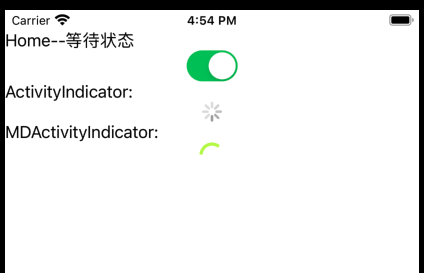
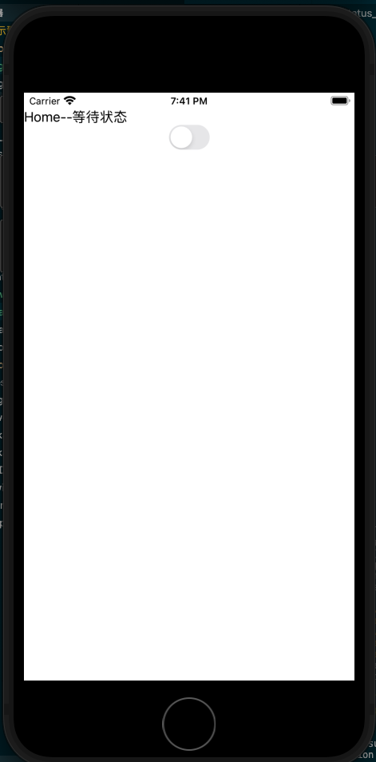
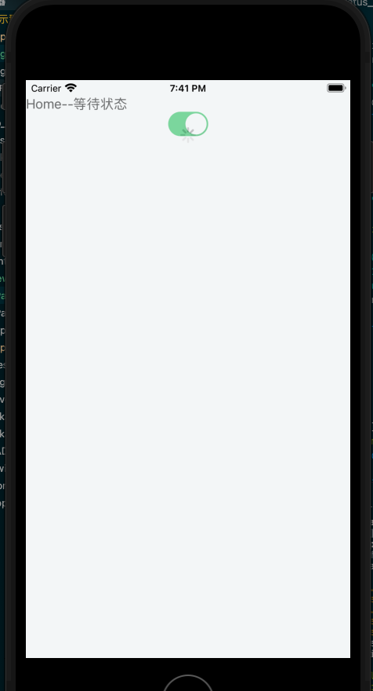

# 提示型组件

本文的演示示例在[native-helloworld-notify)分支](https://github.com/hsz1273327/TutorialForFront-EndWeb/blob/native-helloworld-notify).

提示型组件是用于提示某种状态或者提供一些主动交互的组件,可以分为

1. 状态提示组件
2. 交互提示

## 状态提示组件

状态提示组件一般使用直观的图片或者动画提示一种状态.一般用于提示加载,下载等需要等待的功能的状态.又可以细分为

1. 圆形加载动画提示
2. 进度条

### 圆形加载动画提示

圆形加载动画提示一般都只用于展示等待状态.一般都是以一个boolean型的值来设置,为true则展示否则不展示.

+ [ActivityIndicator](https://nativescript-vue.org/cn/docs/elements/components/activity-indicator/)

    原生组件,在android下和ios下动画不同,但都是圆形,通过设置属性`busy`来控制是否展示,还可以监听事件`busyChange`来监控`busy`的取值变化.

+ [@nativescript-community/ui-material-activityindicator](https://www.npmjs.com/package/@nativescript-community/ui-material-activityindicator)

    material风格的圆型加载动画,其接口和`ActivityIndicator`完全一致,要用它我们需要安装`@nativescript-community/ui-material-activityindicator`,然后在入口文件中导入它

    ```ts
    import ActivityIndicatorPlugin from '@nativescript-community/ui-material-activityindicator/vue';

    Vue.use(ActivityIndicatorPlugin);
    ```

> 例子: 下面的例子将使用一个switch组件控制两个圆形加载动画提示组件的展示

```Vue
<template>
    <Frame>
        <Page actionBarHidden="true">
            <StackLayout>
                <Label text="Home--等待状态"></Label>
                <Switch v-model="isBusy" />
                <Label :visibility="isBusy ? 'visible' : 'collapsed'" text="ActivityIndicator:"></Label>
                <ActivityIndicator :busy="isBusy" @busyChange="onBusyChanged" />
                <Label :visibility="isBusy ? 'visible' : 'collapsed'" text="MDActivityIndicator:"></Label>
                <MDActivityIndicator :busy="isBusy" @busyChange="onBusyChanged" />
            </StackLayout>
        </Page>
    </Frame>
</template>
  
<script lang="ts" setup>
import { onMounted, ref } from "nativescript-vue";
import { EventData } from "@nativescript/core/data/observable";
import { ActivityIndicator } from "@nativescript/core/ui/activity-indicator";

onMounted(() => console.log("&&&&mounted home frame"))
const isBusy = ref(true)
function onBusyChanged(evt: EventData) {
    let obj = evt.object as ActivityIndicator;
    console.log(`is busy ${obj.busy}`);
}
</script>
```

我们可以在android和ios上分别对比他们

+ android


+ ios



一般圆形加载动画的展示方法有两种:

1. 全页展示一个圆形加载动画,当等待时导航到这个加载页,加载完成退出导航回去
2. 页面最外层使用`<GridLayout rows="auto, *">`,主要内容和加载页都设置`row="0"`,圆形加载动画提示组件放在`<StackLayout row="0" rowSpan="2" :visibility="isBusy ? 'visible' : 'collapsed'" backgroundColor="#ECEFF1" opacity="0.5">`中.`opacity`用于设置透明度.一般带点透明效果体验会更好.

>例子

```Vue
<GridLayout rows="auto, *">
    <StackLayout row="0">
    <Label text="Home--等待状态"></Label>
    <Switch v-model="isBusy" />
    </StackLayout>
    <StackLayout
    row="0"
    rowSpan="2"
    :visibility="isBusy ? 'visible' : 'collapsed'"
    backgroundColor="#ECEFF1"
    opacity="0.5"
    >
    <ActivityIndicator
        row="1"
        width="100"
        height="100"
        busy="true"
        @busyChange="onBusyChanged"
    />
    </StackLayout>
</GridLayout>
```

+ 效果演示





#### 下拉刷新

圆形加载动画最常见的应用场景就是下拉刷新了.一般内容平台的推荐页都会使用下拉刷新这种方式来刷新内容.社区提供了现成的组件[@nativescript-community/ui-pulltorefresh](https://github.com/nativescript-community/ui-pulltorefresh)实现了这一功能.要使用它需要先安装`@nativescript-community/ui-pulltorefresh`,然后在入口文件中进行注册

```TypeScript
import { createApp, registerElement } from 'nativescript-vue';
...
registerElement('PullToRefresh', () => require('@nativescript-community/ui-pulltorefresh').PullToRefresh);
...
createApp(Home).start();
```

使用的时候主要是必须监听`refresh`事件,并在其中控制组件实例的`refreshing`属性,在数据加载完后置为`false`

>例子:

```Vue
<template>
    <Frame>
        <Page>
            <PullToRefresh @refresh="refreshList">
                <ListView :items="listOfItems">
                    <template #default="{ item }">
                        <StackLayout padding="10 20">
                            <label :text="item.text" />
                        </StackLayout>
                    </template>
                </ListView>
            </PullToRefresh>
        </Page>
    </Frame>
</template>
  
<script lang="ts" setup>
import { ref } from 'nativescript-vue';
const listOfItems = ref([{
    text: "item0",
}, {
    text: "item1",
}, {
    text: "item2",
}, {
    text: "item3",
}])
function refreshList(args) {
    var pullRefresh = args.object;
    setTimeout(function () {
        pullRefresh.refreshing = false;
    }, 1000);
}
</script>
```

### 进度条

进度条一般用在一些异步计算或者io任务中,比如上传下载,有时候也用于指示大型表单的填写进度.

+ [Progress](https://nativescript-vue.org/cn/docs/elements/components/progress/)

    原生组件,会从左到右显示进度,通过设置属性`value`和`maxValue`(默认100)控制进度.也可以监听`valueChange`事件监听每次value的变化.

+ [@nativescript-community/ui-material-progress](https://www.npmjs.com/package/@nativescript-community/ui-material-progress)

    material风格的圆型加载动画,其接口继承自`Progress`,同时增加了两个属性用于在无法知道maxValue时使用:

    + `indeterminate`,默认false,当设置为true时组件变为等待模式,动画为进度条会一直循环,受属性`busy`控制,此时其功能和`圆形加载动画提示`一样.
    + `busy`,默认false,当`indeterminate`为true时如果设置为true则显示,否则不显示

    要用它我们需要安装`@nativescript-community/ui-material-progress`,然后在入口文件中导入它

    ```ts
    import ProgressPlugin from '@nativescript-community/ui-material-progress/vue';

    Vue.use(ProgressPlugin);
    ```

>例子:

```Vue

<template>
  ...
    <Progress :value="currentProgress" />
    <MDProgress :value="currentProgress" maxValue="100"/>
    <MDProgress busy="true" indeterminate="true"/>
  ...
</template>
  
<script lang="ts">
import Vue from "nativescript-vue";
import { EventData } from "@nativescript/core/data/observable";
import { ActivityIndicator } from "@nativescript/core/ui/activity-indicator";
import { setInterval, clearInterval } from "@nativescript/core/timer";
interface Data {
  isBusy: boolean;
  currentProgress: number;
  interval: number | null;
}
export default Vue.extend({
  data: function (): Data {
    return {
      currentProgress: 50,
      interval: null,
    };
  },
  created() {
    this.interval = setInterval(() => {
      const newValue = (this.currentProgress + 1) % 100;
      this.currentProgress = newValue;
    }, 100);
  },
  beforeDestroy() {
    if (this.interval !== null) {
      clearInterval(this.interval);
    }
  },
});
</script>
```

## 交互提示

交互提示指的当然是那种可以进行交互的提示,比较传统的是对话框,更加现代一点的则是顶部Banner/底部Snackbar.

通常来说我们可以将交互提示的特点总结如下表:

| 类型         | 提示重要性 |
| ------------ | ---------- |
| 底部Snackbar | 低         |
| 顶部Banner   | 中         |
| 对话框       | 高         |

底部Snackbar位置不会很醒目,一般用于不太重要的提示,这些提示一般你可以手动关掉或者设置成一定时间内没有操作就自动关掉;
顶部Banner位置相对更显眼些因为一旦出现就会挡住用户视线的最起始位置,一般不会自动关闭;
对话框会强制跳出当前页,用户的注意力会被强制转移到对话框,这是一种打断行为所以一般用于最重要的提示

但因为通常系统级的消息提示都在顶部,因此一般app中交互提示只会用底部Snackbar和对话框

### 底部Snackbar

组件[@nativescript-community/ui-material-snackbar](https://www.npmjs.com/package/@nativescript-community/ui-material-snackbar)提供了对底部Snackbar的支持.要用它我们需要安装`@nativescript-community/ui-material-snackbar`,然后在需要用到的文件中导入其中的对应方法即可.

```ts
import { SnackBar, showSnack } from '@nativescript-community/ui-material-snackbar';
```

我们可以调用`showSnack(SnackBarOptions):Promise<showSnackResult>`方法来呼出SnackBar,其中`showSnackResult`包里并没有给需要我们自己定义:

```ts
interface showSnackResult {
  command: SnackBarAction;
  reason: DismissReasons;
  event: number;
}
```

`SnackBarOptions`包里有定义:

```ts
interface SnackBarOptions {
    /**
     * The action button text of the snackbar.
     */
    actionText?: string;

    /**
     * The text of the snackbar.
     */
    message: string;

    /**
     * Delay in ms to hide the snackbar.
     * Note: iOS only allows a maximum of 10s. If the value is more than that for iOS, the hideDelay will be set to 10s
     */
    hideDelay?: number;

    /**
     * Action Text Color of the snackbar.
     */
    actionTextColor?: string;

    /**
     * Text Color of the snackbar.
     */
    textColor?: string;

    /**
     * Background Color of the snackbar.
     */
    backgroundColor?: string;
    /**
     * *Android Only*
     * Set the maxLines if you are displaying a long string of text and it will wrap.
     */
    maxLines?: number;

    /**
     * *Android Only*
     * Use RTL for textview of snackbar.
     */
    isRTL?: boolean;
    /**
     * optional View to attach the snack to
     */
    view?: View;
    /**
     * The view you want to "anchor the snack above".
     * The snackbar will appear above that view
     */
    anchorView?: View;
}
```

>例子:我们使用一个按钮来呼出Snackbar

```Vue
<template>
  <Page actionBarHidden="true">
    <StackLayout>
      <Label text="Home" id="banner" ref="banner"></Label>
      <Button text="snackbar" @tap="onActionTapSnackbar" />
    </StackLayout>
  </Page>
</template>
  
<script lang="ts">
import Vue from "nativescript-vue";
import { EventData } from "@nativescript/core/data/observable";
import {
  DismissReasons,
  SnackBarAction,
  showSnack,
} from "@nativescript-community/ui-material-snackbar";
interface showSnackResult {
  command: SnackBarAction;
  reason: DismissReasons;
  event: number;
}
export default Vue.extend({
  methods: {
    onActionTapSnackbar(evt: EventData) {
      showSnack({
        message: "this is test snack with action!",
        actionText: "done",
      }).then((r: showSnackResult) => {
        console.log("showSnack result", r);
      });
    },
  },
});
</script>
```

### 对话框提示

对话框提示一般是由一些状态触发的,它会弹出一个对话框,我们可以在其中进行一些操作,操作完成后对话框关闭.nativescript中已经预设了几种对话框类型,他们都维护在`@nativescript/core/ui/dialogs`中,使用时像下面这样导入就可以使用:

```ts
import { login, alert, prompt } from "@nativescript/core/ui/dialogs";
```

同时社区也提供了他们的material版本[@nativescript-community/ui-material-dialogs](https://www.npmjs.com/package/@nativescript-community/ui-material-dialogs),要用它我们需要安装`@nativescript-community/ui-material-dialogs`,然后在需要用到的文件中导入其中的对应方法替代原生版本.

```ts
import { login, alert, prompt } from "@nativescript-community/ui-material-dialogs";
```

+ AlertDialog

    通过调用方法`alert(string| AlertOptions):Promise<void>`弹出一个带取消按钮`ok`的对话框从而起到提示作用.这种方式只是纯为了提示,个人认为会比较突兀.

    其中

    ```ts
    interface AlertOptions{
        cancelable?:boolean;
        message?:string;
        okButtonText?:string;
        title?:string;
    }
    ```

+ ConfirmDialog

    通过调用方法`confirm(string | ConfirmOptions):Promise<boolean>`弹出一个带确认和取消两个按钮的对话框,一般用于进行确认.其中

    ```ts
    interface ConfirmOptions{
        cancelable?:boolean;
        message?:string;
        title?:string;
        cancelButtonText?:string;
        okButtonText?:string;
        neutralButtonText?:string;
    }
    ```

+ ActionDialog

    通过调用方法`action(主题文本:string,取消按钮文本:string,选项:array<string>):Promise<string>`或者`action(ActionOptions):Promise<string>`弹出包含可选的选项列表和取消按钮的对话框.一般用于选项过多的单选.

    其中

    ```ts
    interface ActionOptions{
        actions?: Array<string>;
        cancelButtonText?:string;
        cancelable?:boolean;
        destructiveActionsIndexes?:Array<number>;
        message?:string;
        title?:string;
    }
    ```

+ LoginDialog

    通过调用方法`login(LoginOptions):Promise<LoginResult>`弹出包含用户名密码输入框以及取消和确认按钮的对话框.一般用于用户登录,实话说现在已经不流行这种用法了.

    其中

    ```ts
    interface LoginOptions{
        cancelButtonText?:string;
        cancelable?:boolean;
        message?:string;
        neutralButtonText?:string;
        okButtonText?:string;
        title?:string;
        password?:string;
        passwordHint?:string;
        userName?:string;
        userNameHint?:string;
    }

    interface LoginResult{
        password: string;
        result: boolean;
        userName: string;
    }
    ```

+ PromptDialog

    通过调用方法`prompt(PromptOptions):Promise<PromptResult>`弹出包含一个文本输入框以及取消和确认按钮的对话框.一般用于问答之类的提示

    其中

    ```ts
    interface PromptOptions{
        cancelButtonText?:string;
        cancelable?:boolean;
        capitalizationType?:string;
        defaultText?:string;
        inputType?:string;
        message?:string;
        neutralButtonText?:string;
        okButtonText?:string;
        title?:string;
    }

    interface LoginResult{
        result: boolean;
        text: string;
    }
    ```