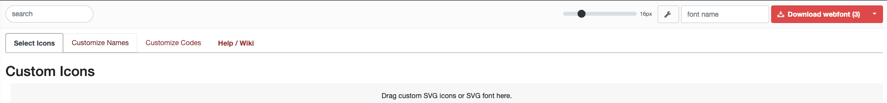
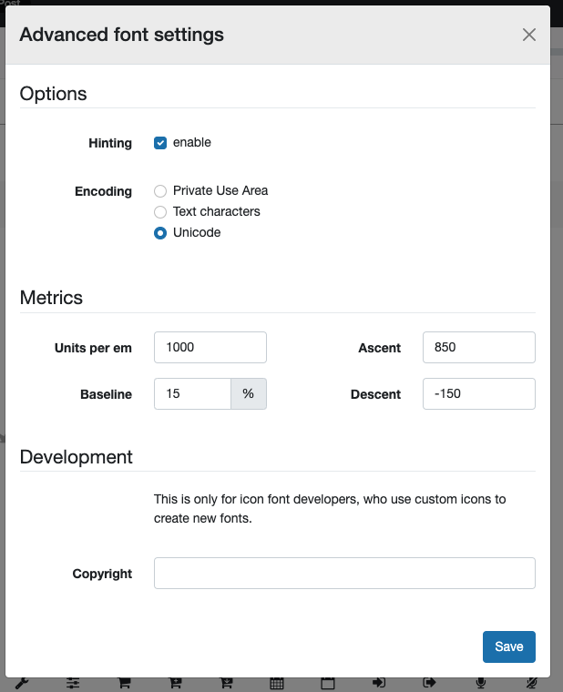
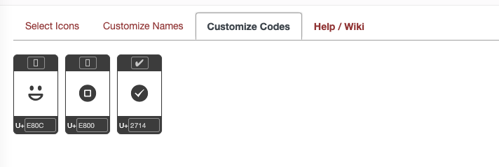
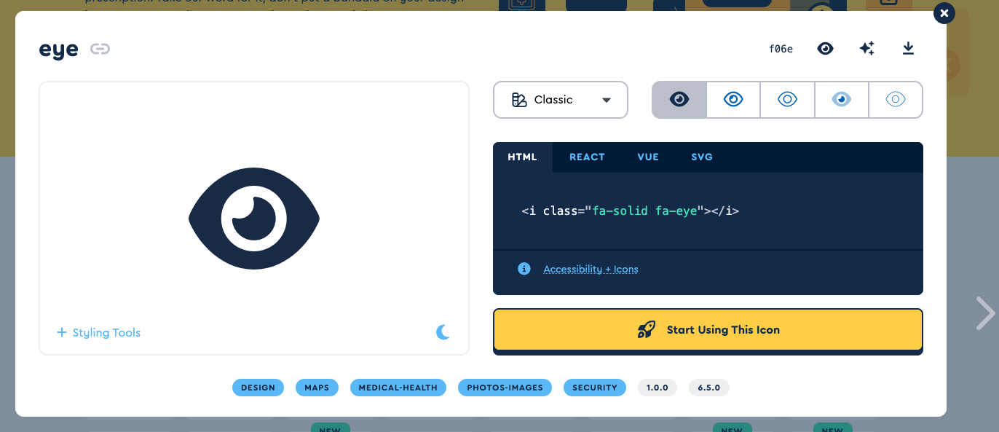

# 资源设置

原生应用和web应用在形式上最大的不同在于原生应用调用的是自己打包好的在本地的资源;而web应用则更多的是借助网络现拉取资源到本地或者直接使用网络上的资源.

在nativescript项目中我们通常都是把用到的资源都放在源码中然后再打包的,这些资源包括:

+ 图片
+ 字体(Font)
+ 图标(Icon)

## 图片设置

很多时候我们的应用都是由图片堆叠而成的,比如logo是图片,开屏页是图片,各种ui元素也都可以是图片.nativescript中本地图片可以来自于:

+ 已注册的图片资源
+ 未注册的本地图片

### 已注册的图片资源

已注册的图片资源是最通用的图片资源,我们几乎可以在程序的任何位置使用它们.所谓注册图片资源简单理解就是将同一图片的不同分辨率副本放置到不同平台的指定文件夹下.
注意nativescript只支持`png`和`jpg`两种格式的图片作为注册资源.

注册的步骤如下:

1. 找到一张要作为图标的图片,假设文件名为`ic_myicon.png`.
2. 打开ps或者gimp,修改他们满足不同平台对图片的要求,并将其按格式命名后放入对应位置,我们以标准图标尺寸为例:
   1. android平台下
        | 分辨率    | 基准  | 适用设备范围          | 文件命名        | 存放文件夹                                            |
        | --------- | ----- | --------------------- | --------------- | ----------------------------------------------------- |
        | `36x36`   | 0.75x | 低密度屏ldpi          | `ic_myicon.png` | `App_Resources/Android/src/main/res/drawable-ldpi`    |
        | `48×48`   | 1.0x  | 中密度屏mdpi          | `ic_myicon.png` | `App_Resources/Android/src/main/res/drawable-mdpi`    |
        | `72x72`   | 1.5x  | 高密度屏hdpi          | `ic_myicon.png` | `App_Resources/Android/src/main/res/drawable-hdpi`    |
        | `96x96`   | 2.0x  | 超高密度屏xhdpi       | `ic_myicon.png` | `App_Resources/Android/src/main/res/drawable-xhdpi`   |
        | `144x144` | 3.0x  | 超超高密度屏xxhdpi    | `ic_myicon.png` | `App_Resources/Android/src/main/res/drawable-xxhdpi`  |
        | `192x192` | 4.0x  | 超超超高密度屏xxxhdpi | `ic_myicon.png` | `App_Resources/Android/src/main/res/drawable-xxxhdpi` |

   1. ios平台下
        | 分辨率    | 基准 | 适用设备范围                          | 文件命名        | 存放文件夹                                           |
        | --------- | ---- | ------------------------------------- | --------------- | ---------------------------------------------------- |
        | `40x40`   | 1.0x | iPhone 3GS(含)之前,iPad2(含)之前      | `ic_myicon.png` | `App_Resources/iOS`   |
        | `80x80`   | 2.0x | iPhone 6s(含)之前,iPad mini 4(含)之前 | `ic_myicon@2x.png` | `App_Resources/iOS`  |
        | `120x120` | 3.0x | 超超高密度屏xxhdpi                    | `ic_myicon@3x.png` | `App_Resources/iOS` |

之后要在应用中使用则只需要使用路径`res://ic_myicon`即可

### 未注册的本地图片

通常我们只需要将其放在`src`文件夹下即可被找到,注意nativescript只支持`png`和`jpg`两种格式的图片.我个人习惯上会创建文件夹`assets`存放图片文件.

使用的时候直接以`src`文件夹作为根目录使用绝对路径即可.

## 字体设置

通常来说默认字体已经够用.nativescript默认提供了3种通用字体:

+ `serif` (ex. Times New Roman)
+ `sans-serif` (ex. Helvetica)
+ `monospace` (ex. Courier New)

在ios下我们还可以使用ios默认提供的字体,我们可以在[这个网址](http://iosfonts.com/)中查到不同的sdk中的范围.

如果要自定义字体,则需要将对应的`.ttf`或者`.otf`文件放在`src/fonts/`路径下(在iOS上字体文件应与字体名称完全相同)

我们可以在项目根目录下使用`ns fonts`查看当前使用的自定义字体

### 使用字体

`css`的`font-family`属性可以用设置使用的字体

```css
font-families: serif;
```

## 图标设置

在nativescript中我们使用的图标可以是3种来源:

1. 系统图标
2. 注册图片资源作为图标
3. 字体图标

### 系统图标

我们可以在特定位置使用系统自带图标.这些位置都包含属性`ios.systemIcon`和`android.systemIcon`

+ [android的图标在这里查看](https://developer.android.com/reference/android/R.drawable.html),其中`ic_`开头的就是可以用的
+ ios的图标目前还未找到查看位置

nativescript中自定义图标实际就是字体,默认提供了[fontawesome 5中brands,solid,regular三种图标](https://fontawesome.com/v5/search?s=brands)
这三种图标都放在`app/fonts/`中,对应`fa-brands-400.ttf`,`fa-solid-900.ttf`和`fa-regular-400.ttf`.官方还推荐了[icomoon](https://icomoon.io/)

### 注册图片资源作为图标

一些位置提供`src`属性的就可以使用注册图片资源作为图标,一般形式为`src="res://ic_myicon"`.如果指定的图片并未注册则会展示位空白

### 字体图标

字体图标并不是所有组件都可以使用,一般组件中有`text`,`icon`属性的组件以及部分支持`src.decode`属性的组件才可以使用.其使用步骤可以归结为

1. 下载想要的图标,找出其中的`.ttf`文件,放到`src/fonts/`目录下,比如使用[material-design-iconic-font](https://zavoloklom.github.io/material-design-iconic-font/icons.html).我们进入官网下载页面后下载解压,在`fonts`目录下就可以找到它对应的`.ttf`文件`Material-Design-Iconic-Font.ttf`.

2. 在`src/app.css`或者`src/app.scss`中添加对图标的类声明

    ```css
    .mdi {
    font-family: 'Material Design Icons', 'Material-Design-Iconic-Font';
    font-weight: 400;
    }
    ```

3. 按照图标字体网页上的说明确定每个字体字形的十六进制代码.这个通常叫unicode.一般是一个长度为4的字符串,用的时候前面加上`\u`,比如unicode为`e903`,则用的时候为`\ue903`,以上面的`material-design-iconic-font`为例,还是他们官网,找到想要的图标,比如`zmdi-outlook`后点击就可以看到`Unicode: f3fa`,那用的时候就是`\uf3fa`
    将上面的16进制代码在组件中用法有如下几种:

    1. 组件如果有`text`字段且支持使用图标位则可以将上面的16进制代码直接写在`text`的值位置,并使用class指定定义的类
    2. 组件如果有`icon`字段则可以使用`font://<上面的16进制代码>`作为`icon`的值,并使用class指定定义的类
    3. 在`Image`组件中可以使用`src.decode="<上面的16进制代码>"`作为图片的路径,并使用class指定定义的类

    **注意:**使用的时候对应字段的值只能由变量或函数提供,**字面量不会生效**

下面是我整理的可用的图标字体信息

+ [material-design-iconic-font](https://zavoloklom.github.io/material-design-iconic-font/icons.html),上面已经用例子介绍过了不再赘述
+ [fontello.com](https://fontello.com/),一个用于定制化图标的工具站,你可以在其中挑选需要的图标,然后再在`Customize Codes`选项卡中查看对应的unicode.注意需要在设置中选择`uicode`.这个工具的好处是我们可以只挑有用的图标,从而控制图标文件大小
    
    
    
+ [fontawesome.com](https://fontawesome.com/),这个站有免费有收费,我们通常用免费的即可,下载页在<https://fontawesome.com/download>,选`For The Web`->`Free For Web`下载即可.解压后里面会有如下几个字体文件.不过并不推荐使用这个,亲测在ios上无法使用
    + `fa-brands-400.ttf`对应`fa-brands`
    + `fa-regular-400.ttf`对应`fa-regular`
    + `fa-solid-900.ttf`对应`fa-solid`
    命名后面的400,900是应该设置的`font-weight`的值.
    使用的时候在[挑选页面中](https://fontawesome.com/icons/categories/medical-health?f=classic&s=solid)找到需要的图标
    

    然后点进去根据里面右边中间的`class`中的值选择使用的`class`,在右上角找到`unicode`使用
    

<!-- 
#### 在nativescript-vue中使用npm中打包好的图标(推荐)

上面的方法缺点很明显,就是可读性差,社区提供了[一个webpack插件](https://github.com/nativescript-community/fonts)用于解决这个问题.使用这个插件我们在原本写16进制代码的地方可以使用更加可读的图标名来替代.

目前官方提供了对[FontAwesome](https://fontawesome.com/docs/web/setup/packages),[Material Design Fonts](https://materialdesignicons.com/)以及自定义字体文件的支持

##### FontAwesome图标配置

1. 安装`@nativescript-community/fonts`

    ```bash
    npm install @nativescript-community/fonts --save-dev
    ```

2. 安装`@fortawesome/fontawesome-free`

    ```bash
    npm i @fortawesome/fontawesome-free --save-dev
    ```

3. 修改`app.scss`

    ```scss
    ...
    .fas {
    font-family: 'Font Awesome 6 Free', 'fa-solid-900';
    font-weight: 900;
    }

    .far {
    font-family: 'Font Awesome 6 Free', 'fa-regular-400';
    font-weight: 400;
    }

    .fab {
    font-family: 'Font Awesome 6 Brands', 'fa-brands-400';
    font-weight: 400;
    }
    ...
    ```

4. 修改`webpack.config.js`

    ```js
    const { addFontsConfigFontAwesome, FontAwesomeFontType } = require('@nativescript-community/fonts');
    ...
    module.exports = (env) => {
        webpack.init(env);
        ...
        addFontsConfigFontAwesome({ 
            fontTypes: [FontAwesomeFontType.solid, FontAwesomeFontType.brands, FontAwesomeFontType.regular], 
            stripCharactersFromFont: true 
        });
        ...
        return webpack.resolveConfig();
    };

    ```

5. 使用时如下例

    ```vue
    <Label class="fas" text="fa-trash-can"></Label> 
    ```

##### Material Design Fonts图标配置

1. 安装`@nativescript-community/fonts`

    ```bash
    npm install @nativescript-community/fonts --save-dev
    ```

2. 安装`@fortawesome/fontawesome-free`

    ```bash
    npm i @mdi/font --save-dev
    ```

3. 修改`app.scss`

    ```scss
    ...
    .mdi {
        font-family: 'Material Design Icons', 'materialdesignicons-webfont';
        font-weight: 400;
    }
    ...
    ```

4. 修改`webpack.config.js`

    ```js
    const { addFontsConfigMDIFont } = require('@nativescript-community/fonts');
    ...
     module.exports = (env) => {
        webpack.init(env);
        ...
        addFontsConfigMDIFont({
            stripCharactersFromFont: true,
        });  
        ...
        return webpack.resolveConfig();
    }
    ```

5. 使用时如下例

    ```vue
    <Label class="mdi" text="trash-can"></Label> 
    ```

##### 自定义图标配置


1. 安装`@nativescript-community/fonts`

    ```bash
    npm install @nativescript-community/fonts --save-dev
    ```

2. 下载你的`.ttf`文件到`fonts`文件夹下,比如`fonts\icofont.ttf`

3. 修改`app.scss`

    ```scss
    ...
    .icoFont {
        font-family: 'IcoFont', 'icofont';
        font-weight: 400;
    }
    ...
    ```

4. 修改`webpack.config.js`有两种方式:

    1. 直接在`webpack.config.js`中声明待用的图标

        ```js
        const { addFontsConfigCustom } = require('@nativescript-community/fonts');
        ...
        module.exports = (env) => {
            webpack.init(env);
            ....
            addFontsConfigCustom({
                pathToFont: 'fonts/icofont.ttf',
                tokenPrefix: 'icofont-',   // 图标前缀
                tokenValues: {
                    trash: 'ee09', //待使用图标的16进制码
                },
                stripCharactersFromFont: true,
            })
            ...
            return webpack.resolveConfig();
        }
        ```

    2. 先创建一个css文件声明要使用的图标,比如`fonts\icofont.scss`

        ```scss
        $trash: \e053;
        ```

        然后再设置`webpack.config.js`

        ```js
        ...
        const { addFontsConfigCustom } = require('@nativescript-community/fonts');
        module.exports = (env) => {
            webpack.init(env);
            ....
            addFontsConfigCustom({ 
                pathToFont: 'fonts/icofont.ttf', 
                tokenPrefix: 'icofont-', 
                tokenScss: 'fonts/icofont.scss', 
                stripCharactersFromFont: true }
            );
        ....
        return webpack.resolveConfig();
        }
        ```

5. 使用时如下例

    ```vue
    <Label text="icofont-trash" class="icoFont"/> 
    ```

-->