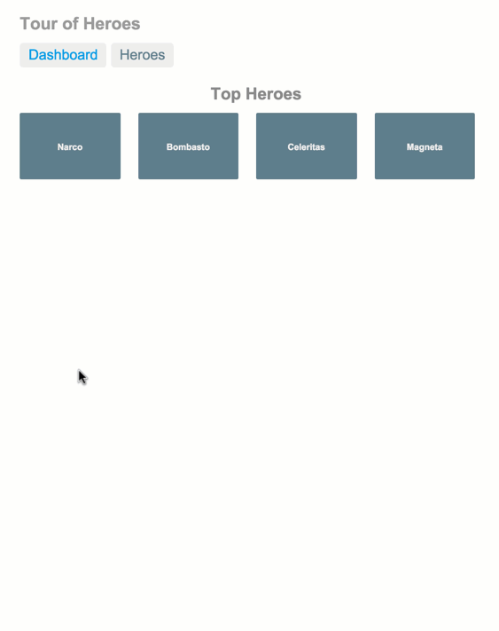

# 使用第三方组件库

使用组件库主要是为了快速开发,通常都不会要求有太多设计什么的,使用组件库最大的好处就是可以省去自己写css,组件逻辑这些事情的麻烦,我们要做的基本只是写个view层就可以了.

vue生态下最知名的组件库应该是饿了么的[element](https://element.eleme.cn/),本文也会使用这个组件库作为例子,其他比较流行的组件库还有[iview](https://github.com/iview/iview)
等.基本上使用也是一个套路.

我们可以使用vue-cli的插件[vue-cli-plugin-element](https://github.com/ElementUI/vue-cli-plugin-element)快速初始化一个项目.
如果是命令行操作就是创建好项目后执行`vue add vue-cli-plugin-element`,按提示选择一路回车就好.注意最好我们选择按需要部分导入而非全部导入.

## 一个完整的例子

接下来我们来做一个简单的[英雄指南](https://github.com/TutorialForJavascript/hero-tutorial)项目,这个项目非常经典,是[angular教程](https://angular.cn/tutorial)使用的例子.这个例子我们会贯穿整个这一章节,这边只是先给出第一版--视图部分,因此本文对应这个项目的分支[view-only](https://github.com/TutorialForJavascript/hero-tutorial/tree/view-only).

后续的路由部分和数据状态部分我们会在接下来介绍
我们先来规划下这个例子,这个例子会有3个view:

+ 首页仪表盘


+ 英雄列表


+ 英雄详情


他们之间的关系入下图


最终我们要做到的效果功能上如下:



当然因为是套组件,我们的样式不可能和上面的完全一致,本文重点也不是样式,而是如何构建一个vue的前端工程.

## vue-cli-plugin-element项目的结构

使用`vue-cli-plugin-element`插件构造的项目会比之前的helloworld项目多出一个文件夹`src/plugins`其中的`element.js`文件专门用于导入element组件,这也就意味着只要在这个文件中导入组件,那么这些组件就在项目的全局都可以被使用了.其基本使用方式是:

```js
import Vue from 'vue'
import {
    Container, Main, Header,
} from 'element-ui'


Vue.use(Container)
Vue.use(Main)
Vue.use(Header)
```

我们只需要导入要用的组件,然后使用`Vue.use`加载它即可.

## 视图构建

上面说过我们有3个视图

+ 首页仪表盘

+ 英雄列表

+ 英雄详情

我们分别来构造这三个视图的页面,但在这之前我们先来给整个页面排个版.在考虑路由和数据之前我们先使视图组件内各自有自己的数据,同时在根节点上直接展示这3个view组件以方便调试.

可以看到这个最终版本app头部实际上是一直不变的,永远是app名字和两个主要视图的路由;而下面会变的部分才是这些路由渲染的页面.我们可以在App.vue组件上声明好这个根视图.

+ App.vue

```vue
<template>
  <div id="app">
    <el-container>
      <el-header height="120">
        <header>
          <el-row :gutter="10" type="flex" justify="center">
            <h1>英雄指南</h1>
          </el-row>
          <el-row :gutter="10" type="flex" justify="center">
            <el-menu :default-active="activeIndex" class="el-menu-demo" mode="horizontal">
              <el-menu-item index="1">仪表盘</el-menu-item>
              <el-menu-item index="2">英雄列表</el-menu-item>
            </el-menu>
          </el-row>
          <el-divider></el-divider>
        </header>
      </el-header>
      <el-main>
        <Dashboard></Dashboard>
        <el-divider></el-divider>
        <Herolist></Herolist>
        <el-divider></el-divider>
        <Herodetail></Herodetail>
      </el-main>
    </el-container>
  </div>
</template>

<script>
import Dashboard from "./views/Dashboard.vue";
import Herodetail from "./views/Herodetail.vue";
import Herolist from "./views/Herolist.vue";

export default {
  name: "app",
  data() {
    return {
      activeIndex: "1"
    };
  },
  components: { Dashboard, Herodetail, Herolist }
};
</script>

<style>
#app {
  font-family: "Avenir", Helvetica, Arial, sans-serif;
  -webkit-font-smoothing: antialiased;
  -moz-osx-font-smoothing: grayscale;
  text-align: center;
  color: #2c3e50;
  margin-top: 60px;
}
</style>
```
这个根视图除了我们的view组件外使用了如下组件:

+ [容器相关](https://element.eleme.cn/#/zh-CN/component/container)

  这部分是容器相关的组件,用于对app整体布局.

  | 组件模块对象 | 组件名       | 功能           |
  | ------------ | ------------ | -------------- |
  | Container    | el-container | 声明容器       |
  | Main         | el-main      | 声明是主体部分 |
  | Header       | el-header    | 声明是头部     |

  容器相关的组件会根据配置自动按规则排版,具体的可以去看官方文档

+ [布局相关](https://element.eleme.cn/#/zh-CN/component/layout)

  这部分布局相关的组件通常需要配合容器相关组件,通常容器相关的是整体布局,而布局相关的则是局部布局,element类似以前的bootstrap使用行作为单位,每一行被分成24份,通过设置一些参数进行排列其中的单元,

  | 组件模块对象 | 组件名 | 功能             |
  | ------------ | ------ | ---------------- |
  | Row          | el-row | 声明这是一行组件 |

+ [导航菜单](https://element.eleme.cn/#/zh-CN/component/menu)

  导航菜单组件作用就是构造导航栏,除了可以构造这种传统的顶部导航栏,也可以构造侧边导航.具体的可以看文档中的样例.

  | 组件模块对象 | 组件名       | 功能               |
  | ------------ | ------------ | ------------------ |
  | Menu         | el-menu      | 声明导航栏         |
  | MenuItem     | el-menu-item | 声明导航栏中的项目 |

+ [分割线](https://element.eleme.cn/#/zh-CN/component/divider)

  分割线组件模块可以以特定格式画出一条分割线

  | 组件模块对象 | 组件名     | 功能           |
  | ------------ | ---------- | -------------- |
  | Divider      | el-divider | 声明一条分割线 |


### 首页仪表盘

仪表盘我们可以看到其实就两行
+ 标题行
+ 一个卡片的横向排列行,卡片上是我们的英雄名字

我们的组件可以这样定义:

+ Dashboard.vue

```vue
<template>
  <div class="dashboard">
    <el-row type="flex" justify="center">
      <h2>Top Heros</h2>
    </el-row>
    <el-row :gutter="1" type="flex" justify="space-around">
      <el-col :span="4">
        <el-card shadow="hover">白金之星</el-card>
      </el-col>
      <el-col :span="4">
        <el-card shadow="hover">红色魔术师</el-card>
      </el-col>
      <el-col :span="4">
        <el-card shadow="hover">隐者之紫</el-card>
      </el-col>
      <el-col :span="4">
        <el-card shadow="hover">法皇</el-card>
      </el-col>
      <el-col :span="4">
        <el-card shadow="hover">银色战车</el-card>
      </el-col>
    </el-row>
  </div>
</template>

<script>
export default {
  name: "dashboard"
};
</script>

```
我们现在只是展示用,数据都是写死的.这不重要,后续我们再来整理这些数据.

这个组件使用到的element组件有:

+ [布局相关](https://element.eleme.cn/#/zh-CN/component/layout)

  此处出现布局中的列,列是布局中的最小单元,行上,可以决定列的间隔,对其方式等属性,列自己则可以决定自己占据行中的长度.

  | 组件模块对象 | 组件名 | 功能                 |
  | ------------ | ------ | -------------------- |
  | Col          | el-col | 声明这是一行中的一列 |

+ [卡片组件](https://element.eleme.cn/#/zh-CN/component/card)

  卡片组件一般用于展示图片或者介绍信息,其主要的配置项是

  + `header`这是一个slot,可以插入内容,通常用于些标题或者操作按钮什么的
  + `body-style`这个属性可以传入css描述,借此可以插入图片,填充背景色等等
  + `shadow`卡片阴影,通常用于交互,提示用户的鼠标覆盖情况


### 英雄列表

英雄列表也是很简单的结构

+ 一个标题
+ 一个英雄的表格

我们的组件可以这样定义:

+ Herolist.vue

```vue
<template>
  <div class="herolist">
    <el-row type="flex" justify="center">
      <h2>Hero List</h2>
    </el-row>
    <el-row type="flex" justify="center">
      <el-table :data="heros" style="width: 100%">
        <el-table-column label="id" width="180" align="center">
          <template v-slot:default="scope">
            <span style="margin-left: 10px">{{ scope.row.id }}</span>
          </template>
        </el-table-column>
        <el-table-column label="name" width="180" align="center">
          <template v-slot:default="scope">
            <div slot="reference" class="name-wrapper">
              <el-tag size="medium">{{ scope.row.name }}</el-tag>
            </div>
          </template>
        </el-table-column>
        <el-table-column label="操作" align="center">
          <template v-slot:default="scope">
            <el-button size="mini" @click="handleEdit(scope.$index, scope.row)">编辑</el-button>
            <el-button size="mini" type="danger" @click="handleDelete(scope.$index, scope.row)">删除</el-button>
          </template>
        </el-table-column>
      </el-table>
    </el-row>
  </div>
</template>
<script>
export default {
  name: "herolist",
  data: function() {
    return {
      heros: [
        {
          id: 1,
          name: "隐者之紫"
        },
        {
          id: 2,
          name: "红色魔术师"
        },
        {
          id: 3,
          name: "白金之星"
        },
        {
          id: 4,
          name: "法皇"
        },
        {
          id: 5,
          name: "银色战车"
        }
      ]
    };
  },
  methods: {
    handleEdit(index, row) {
      console.log(index, row);
    },
    handleDelete(index, row) {
      console.log(index, row);
    }
  }
};
</script>
```

这个组件使用到的element组件有:

+ [表格组件](https://element.eleme.cn/#/zh-CN/component/table)

  表格是展示结构化数据的最佳方式,element提供了足够优秀的表格组件,可以满足大部分需求,具体的样式可以看文档.
  element的表格导入数据使用`data`字段,只要绑定这个字段到我们的父组件上想展示的列表数据上就可以了,因此表格的配置主要是配置列.列除了可以使用`data`字段中的值外,也可以插入其他元素或者自定义样式,只要使用作用域slot即可.

  | 组件模块对象 | 组件名          | 功能                             |
  | ------------ | --------------- | -------------------------------- |
  | Table        | el-table        | 声明这是一个表格,必须绑定data    |
  | TableColumn  | el-table-column | 声明这是一列,可以设置标题,宽度等 |

+ [标签组件](https://element.eleme.cn/#/zh-CN/component/tag)

  标签组件一般用于标记和选择,预定义了几种type类型`success/info/warning/danger`用颜色区分等级,如果不填则使用默认配色.

  | 组件模块对象 | 组件名 | 功能             |
  | ------------ | ------ | ---------------- |
  | Tag          | el-tag | 声明这是一个标签 |

+ [按钮组件](https://element.eleme.cn/#/zh-CN/component/button)

  按钮组件就是定义一个按钮,可以通过`size`字段设置`medium / small / mini`定义按钮大小,通过`plain/round/circle`这些属性的布尔值来设定形状,也可以使用`icon`添加图标.

  | 组件模块对象 | 组件名    | 功能             |
  | ------------ | --------- | ---------------- |
  | Button       | el-button | 申明这是一个按钮 |


### 英雄详情

详情页我们就做一个例子介绍隐者之紫好了.

+ Herodetail.vue

```vue
<template>
  <div class="about">
    <el-row type="flex" justify="center">
      <h1>英雄详情</h1>
    </el-row>
    <el-row type="flex" justify="center">
      <el-card shadow="hover">
        <template v-slot:header>
          <div class="clearfix" v-if="hero">
            <span>{{ hero.id }}</span>
          </div>
        </template>
        <div>
          名字：
          <el-input v-model="hero_name" :placeholder="hero.name"></el-input>
          <el-button type="primary" round @click=submitHero>提交</el-button>
        </div>
      </el-card>
    </el-row>
  </div>
</template>
<script>
export default {
  name: "herolist",
  data: function() {
    return {
      hero_name: "",
      hero: {
        id: 1,
        name: "隐者之紫"
      }
    };
  },
  methods: {
    submitHero: function (){
      if (this.hero){
        this.hero=Object.assign(this.hero,{name:this.hero_name})
        this.hero_name=""
      }
    }
  }
};
</script>
```
项目中详情页即作为我们的展示页,也作为修改页,也作为新增页.
详情页我们用的组件有:

+ [输入框](https://element.eleme.cn/#/zh-CN/component/input)

  这个组件可以使用v-mode做数据的双向绑定.input的类型可以时html中规定的类型

  | 组件模块对象 | 组件名   | 功能               |
  | ------------ | -------- | ------------------ |
  | Input        | el-input | 申明这是一个输入框 |


至此,我们的三个页面就都写好了,虽然只是初版,还很不成熟,但基本的样式已经有了,后续的就是数据通信和路由设置了.
在后续的介绍中我们还会修改现有的方案使用的组件以满足更多的需求.